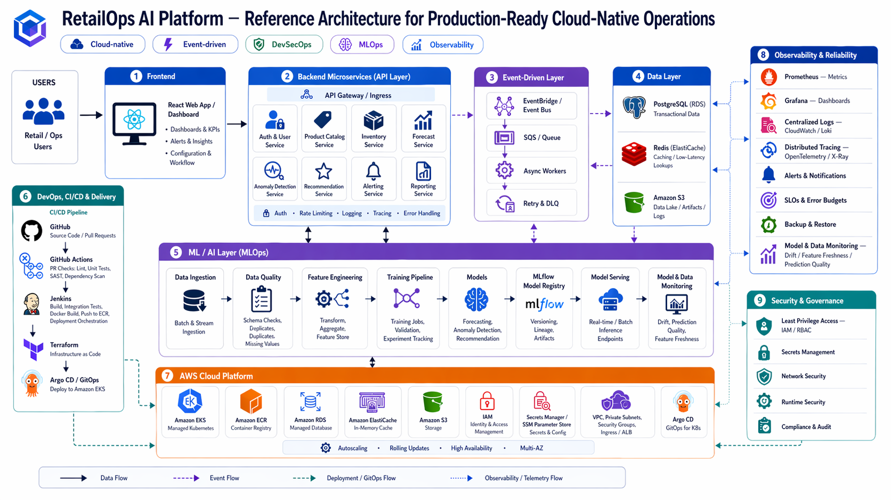
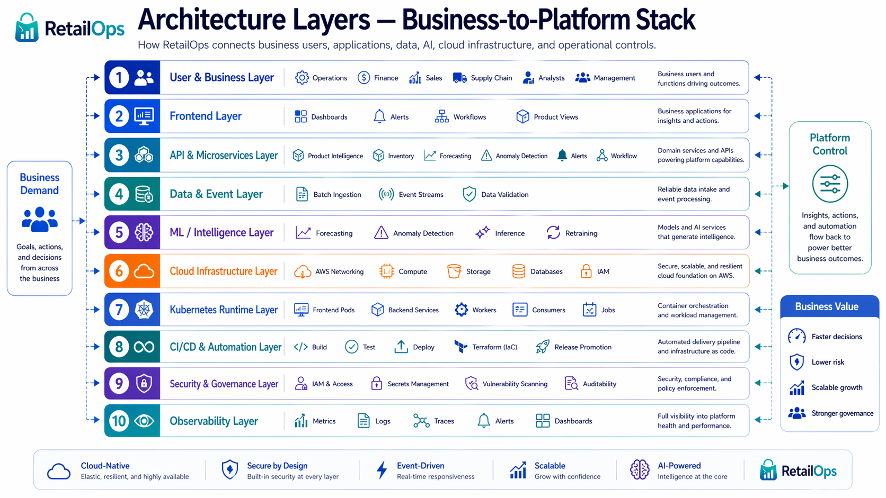
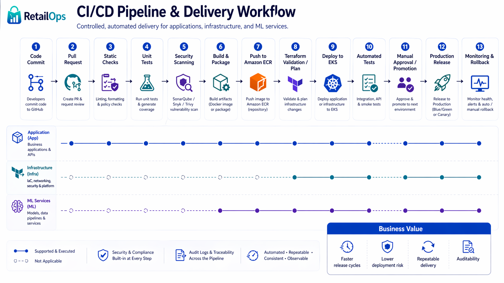

# Cloud-Native RetailOps Platform

## Overview

Cloud-Native RetailOps Platform is a DevOps / MLOps case study project focused on building a production-oriented retail operations platform.

The platform is designed to improve operational visibility, support sales and inventory decisions, detect business anomalies, and provide a scalable foundation for future AI-driven retail optimization.

The project demonstrates how modern DevOps, cloud-native architecture, Infrastructure as Code, CI/CD, observability, security, and MLOps practices can be combined into one end-to-end platform.

<p align="center">
  
</p>

---

## Business Context

Retail and e-commerce organizations often face problems such as:

- Inaccurate demand forecasting
- Stockouts and overstocks
- Delayed reaction to business events
- Fragmented operational visibility
- Manual deployment and infrastructure processes
- Weak production-readiness for ML use cases

This project shows how a cloud-native platform can address these problems by connecting business data, applications, automation, analytics, and operational controls.

---

## Project Goals

The main goals of the project are to:

- Build a realistic DevOps portfolio project based on a business case
- Design a production-oriented AWS cloud architecture
- Containerize application services
- Automate build, test, scan, and deployment workflows
- Provision infrastructure using Terraform
- Deploy workloads on Kubernetes
- Implement observability and security controls
- Prepare the platform for future MLOps capabilities

---

## Key Capabilities

The platform is designed around the following capabilities:

- Retail operations dashboard
- Product, sales, inventory, and order intelligence
- Demand forecasting foundation
- Anomaly detection concept
- Event-driven processing design
- CI/CD automation
- Infrastructure as Code
- Kubernetes-based deployment model
- Observability with metrics, logs, dashboards, and alerts
- DevSecOps controls for code, containers, dependencies, and runtime
- MLOps-oriented model lifecycle design

---

## Technology Stack

### Application

- Python
- FastAPI
- REST API
- PostgreSQL
- Docker
- Docker Compose

### DevOps & Cloud

- AWS
- Kubernetes / EKS
- Terraform
- Jenkins
- GitHub
- GitHub Actions
- Amazon ECR

### Observability

- Prometheus
- Grafana
- ELK / OpenSearch
- AWS CloudWatch

### Security / DevSecOps

- Trivy
- Snyk
- SonarQube
- Falco
- AWS IAM
- AWS Secrets Manager

### MLOps / Data

- ML lifecycle design
- Model versioning concept
- Drift monitoring concept
- Retraining workflow concept
- Forecasting and anomaly detection foundation

---

## Architecture

The platform follows a layered cloud-native architecture:

1. Business & User Layer
2. Application & API Layer
3. Data & Event Processing Layer
4. ML / Intelligence Layer
5. Platform & Infrastructure Layer
6. Security, Observability & Governance Layer

<p align="center">
  
</p>

More details are available in:

- [Case Study](docs/case-study.md)
- [Architecture Documentation](docs/architecture.md)
- [AWS Architecture](docs/aws-architecture.md)
- [CI/CD Pipeline](docs/cicd.md)
- [Security & Governance](docs/security.md)
- [Observability](docs/observability.md)

---

## Repository Structure

This repository is organized as a production-style cloud-native platform monorepo.

## Top-Level Folders

### `docs/`
Contains architecture, business case, technical documentation and diagrams.

### `services/`
Contains backend microservices responsible for platform business capabilities.

### `frontend/`
Contains the user-facing web application.

### `ml/`
Contains machine learning training, inference, experiments and model lifecycle components.

### `data/`
Contains data schemas and samples.

### `infra/`
Contains Infrastructure as Code definitions, mainly Terraform modules and environment configurations.

### `k8s/`
Contains Kubernetes manifests, overlays and Helm charts.

### `observability/`
Contains monitoring, logging, dashboard and alerting configuration.

### `security/`
Contains DevSecOps tools, scanning configuration and policy definitions.

### `ci-cd/`
Contains CI/CD pipeline definitions for application, infrastructure and security workflows.

### `tests/`
Contains automated tests.

### `scripts/`
Contains helper scripts for local development, testing and deployment.

---

## 🚀 Local Development

Run the full RetailOps MVP platform locally using Docker Compose.

### 🧱 Architecture

The local environment runs a minimal full-stack setup:

```text
Frontend → API → PostgreSQL
```

* Frontend: Nginx (static MVP UI)
* API: FastAPI service
* Database: PostgreSQL

---

### 📦 Prerequisites

Install the following tools:

* Docker
* Docker Compose
* Git

> Python and Make are **not required** for running the app via Docker Compose.

---

### 📥 Clone the repository

```bash
git clone https://github.com/your-username/cloud-native-retailops-platform.git
cd cloud-native-retailops-platform
```

---

### ⚙️ Configure environment variables

```bash
cp .env.example .env
```

You can optionally adjust ports and database credentials in `.env`.

---

### ▶️ Run the full stack

```bash
docker compose up --build
```

---

### 🌐 Access the services

* Frontend: http://localhost:3000
* API: http://localhost:8000
* Health check: http://localhost:8000/health

---

### 🩺 Health check (CLI)

```bash
curl http://localhost:8000/health
```

Expected response:

```json
{
  "status": "ok",
  "service": "retailops-api",
  "environment": "local"
}
```

---

### 🛑 Stop the stack

```bash
docker compose down
```

---

### 🧪 Useful commands

Check running containers:

```bash
docker compose ps
```

View logs:

```bash
docker compose logs -f
```

---

### 📌 Notes

* This is a **local-first MVP environment** designed to validate platform behavior without cloud infrastructure.
* AWS, Kubernetes, and CI/CD integrations are introduced in later stages.
* The frontend is a **lightweight placeholder UI**, not a full production dashboard.


## CI/CD Pipeline

The delivery workflow is designed to automate the full software delivery process:

1. Code commit
2. Pull request review
3. Formatting and linting
4. Unit tests
5. Static code analysis
6. Dependency scanning
7. Container image build
8. Container image scanning
9. Push to container registry
10. Kubernetes deployment
11. Post-deployment validation

<p align="center">
  
</p>

---

## Infrastructure as Code

Terraform is used to define and provision cloud infrastructure in a repeatable way.

The infrastructure layer is planned to include:

- Networking
- IAM
- Container registry
- Compute resources
- Kubernetes / EKS foundation
- Databases
- Object storage
- Monitoring integrations
- Security configuration

Terraform code is organized by environment and reusable modules.

---

## Kubernetes Deployment

Kubernetes is used as the target runtime for application workloads.

The platform is designed to support:

- Backend APIs
- Frontend services
- Workers
- Scheduled jobs
- ML inference services
- Event consumers
- Autoscaling
- Rolling deployments
- Health checks
- Workload isolation

---

## Observability

The observability layer is designed to provide visibility into application, infrastructure, data, and ML workloads.

Planned observability capabilities include:

- Application metrics
- Infrastructure metrics
- Centralized logs
- Dashboards
- Alerting
- Service health checks
- Deployment monitoring
- Data pipeline monitoring
- Model performance monitoring

---

## Security

Security is integrated into the platform and delivery workflow.

The project includes or plans to include:

- Least-privilege IAM design
- Secrets management
- Dependency scanning
- Container image scanning
- Static code analysis
- Runtime threat detection
- Network segmentation
- Auditability of infrastructure and deployment changes

---

## Project Roadmap

### Phase 1 — Foundation / MVP

- Basic backend API
- Health endpoint
- Dockerized local environment
- Initial database model
- Basic CI pipeline
- Initial documentation

### Phase 2 — Production-Ready Platform

- Terraform infrastructure
- Kubernetes deployment manifests
- CI/CD pipeline
- Container registry workflow
- Observability foundation
- Security scanning

### Phase 3 — Real-Time Operations

- Event-driven processing
- Async workers
- Business event ingestion
- Operational alerts
- Improved monitoring

### Phase 4 — MLOps Foundation

- Forecasting model lifecycle
- Model versioning
- Model monitoring
- Retraining workflow
- Drift detection concept

### Phase 5 — Enterprise Optimization

- Advanced recommendations
- Scenario simulation
- Multi-environment platform
- FinOps controls
- Advanced governance

---

## Documentation

The project documentation is split into several files:

- `docs/case-study.md` — business and executive-level case study
- `docs/architecture.md` — architecture overview
- `docs/aws-architecture.md` — AWS design and service rationale
- `docs/cicd.md` — CI/CD pipeline and delivery workflow
- `docs/security.md` — DevSecOps and governance controls
- `docs/observability.md` — monitoring, logging, dashboards, and alerting
- `docs/project-evolution.md` — platform maturity model

---

## Project Status

Current status: **Work in progress**

This repository is being developed as a portfolio-grade DevOps / MLOps project.  
The project intentionally combines implemented components with target architecture documentation to show both hands-on delivery and system design maturity.

---

## Why This Project Matters

This project demonstrates practical skills across the full DevOps lifecycle:

- Application development
- Containerization
- CI/CD
- Cloud architecture
- Infrastructure as Code
- Kubernetes
- Observability
- Security automation
- MLOps readiness
- Production-readiness thinking

It is designed to show not only technical knowledge, but also the ability to connect engineering decisions with business outcomes such as faster delivery, lower operational risk, better scalability, and improved decision-making.

---

## Author

**Oskar Stachowski**

DevOps Engineer focused on AWS, Kubernetes & Terraform | Building production-ready cloud-native systems | CI/CD, observability & MLOps

---

## Notes

Parts of the documentation and visual materials were supported with AI tools, including ChatGPT.

Architecture decisions, implementation choices, technical validation, and final project structure were reviewed and adapted independently by the author.

---

## License

This project is licensed under the MIT License.
