# Case Study: Cloud-Native RetailOps Platform

## 1. Executive Summary
RetailOps Platform is a strategic retail operations platform designed to improve demand visibility, reduce stock risk, accelerate operational response, and embed advanced analytics directly into day-to-day decision making. The project starts as a business-focused MVP, but its target state is a cloud-native, event-driven, production-grade operating platform for retail and e-commerce organizations.

The updated business case explicitly justifies advanced Kubernetes, advanced AWS, advanced Terraform, advanced Jenkins, advanced MLOps, and real-time/event-driven architecture because the platform is no longer positioned as a simple dashboard or isolated ML proof of concept. It is positioned as an enterprise delivery program spanning application delivery, platform engineering, release automation, model lifecycle management, reliability engineering, observability, security, and business scaling.

  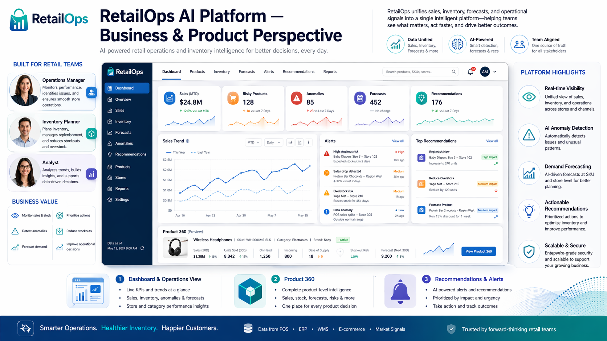

<em>Figure 1: AI-Driven Retail Intelligence Platform – Business & Technical Case Study</em>

## 2. Business Problem

Retail and e-commerce organizations typically face a combination of operational, forecasting, technology, and scaling problems:
* Inaccurate demand forecasting leading to stockouts, overstocks, working capital lock-in, and lost sales.
* Operational anomalies such as sudden sales drops/spikes, incorrect prices, broken product feeds, delayed data, and inventory inconsistencies.
* Fragmented visibility across teams, where operations, supply chain, analysts, and management work from different tools and disconnected reports.
* ML initiatives that remain ad hoc and do not reach production because there is no standard pipeline, no model governance, no retraining process, and no deployment maturity.
* Slow reaction to business events because most processes are batch-oriented and there is limited near-real-time or event-driven decision support.
* Delivery risk caused by weak DevOps foundations, inconsistent environments, limited observability, and insufficient production-readiness controls.

### 2.1. User Groups

* Operations Manager: Monitors daily operational risk, prioritizes issues, tracks alerts, and follows up on action execution.
* Inventory Planner / Supply Chain: Uses forecasts, stock health, and replenishment recommendations to balance inventory and reduce stockouts/overstocks.
* Analyst: Investigates trends, variance, anomalies, and business drivers; creates insight and decision support.
* Category / Commercial Stakeholder: Reviews product and pricing behavior, campaign impact, and category-level performance.
* Finance / Controlling: Assesses stock exposure, forecast-driven planning assumptions, and business impact.
* Data / ML Team: Owns model development, experiment tracking, evaluation, deployment, monitoring, and retraining.
* Platform / DevOps Team: Owns runtime reliability, release automation, environments, infrastructure, observability, and security operations.

### 2.2. Data Sources

The platform is justified only if it integrates multiple operational and analytical data sources and treats selected business signals as events, not only as periodic reports.
* Sales transactions and returns
* Inventory / stock levels and stock movements
* Order events and fulfillment status
* Product catalog and product feed changes
* Pricing history and pricing events
* Promotion / campaign calendar
* Supplier and replenishment data
* Marketplace and channel data
* User actions inside the platform, such as approvals, escalations, dismissals, and action feedback

## 3. Business Objectives (Executive / Board-Level)

### 🚀 1. Faster Time-to-Market & Operational Agility

**Objective:**  
Enable the organization to deliver changes faster and respond more effectively to business needs.

**Business Impact:**
- Deploy changes in **minutes instead of hours/days**
- Enable frequent releases (even multiple times per day)
- Accelerate testing and rollout of new initiatives

**Why it matters:**  
Faster response to market and competition → **stronger competitive advantage**

---

### ☁️ 2. Scalability Without Operational Overhead

**Objective:**  
Ensure the platform can scale with business growth without proportional increases in operational cost.

**Business Impact:**
- Automatic scaling based on demand  
- No need for manual system or team scaling  
- Stable performance during traffic spikes  

**Why it matters:**  
Growth without cost explosion → **better cost efficiency**

---

### 🔁 3. Standardization & Cost Control

**Objective:**  
Standardize environments and deployment processes across the organization.

**Business Impact:**
- Eliminate errors caused by environment inconsistencies  
- Enable fast system recovery (e.g., after failure)  
- Improve control over infrastructure and costs  

**Why it matters:**  
Fewer errors and outages → **lower operational costs and risk**

---

### 📊 4. Full Operational Visibility

**Objective:**  
Provide full visibility into system performance and operational processes.

**Business Impact:**
- Faster detection of issues before they impact customers  
- Real-time access to operational data  
- Better decision-making based on reliable insights  

**Why it matters:**  
Faster response → fewer losses → **higher service quality**

---

### 🔒 5. Risk Reduction & Safer Operations

**Objective:**  
Minimize operational and security risks through automated controls.

**Business Impact:**
- Automated validation of changes before deployment  
- Reduced human error  
- Increased system stability  

**Why it matters:**  
Fewer incidents → reduced financial and reputational risk

---

### ⚡ 6. Efficient Processing of Business Events

**Objective:**  
Enable fast reaction to critical business events (e.g., sales changes, anomalies, system issues).

**Business Impact:**
- Near real-time processing of key events  
- Faster operational decision-making  
- Improved control over business processes  

**Why it matters:**  
Faster reactions → reduced losses → **higher operational efficiency**

  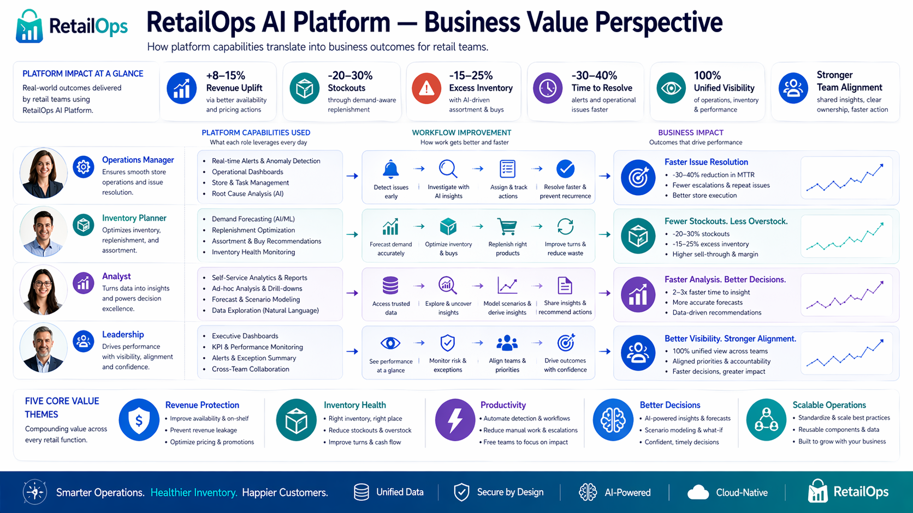

<em>Figure 2: From Data to Profit: Business Impact of the RetailOps AI Platform</em>

## 4. Solution Overview
RetailOps Platform is a cloud-native, event-driven retail intelligence system that integrates operational data, advanced analytics, and machine learning into a single, scalable decision-making platform. It enables real-time visibility, automated anomaly detection, and data-driven actions across inventory, pricing, and supply chain processes, while ensuring production-grade reliability, security, and continuous delivery.

### 4.1. Implementation Scope

This case study presents both the implemented platform foundation and the target enterprise architecture.

The current implementation focuses on the MVP and production-readiness foundation, including application services, containerization, CI/CD, infrastructure-as-code assumptions, cloud architecture, observability, and security design.

Advanced real-time processing, full MLOps automation, autonomous optimization, multi-region deployment, and advanced policy-as-code are presented as future maturity stages rather than the initial implementation scope.

### 4.2. Project Deliverables & Evidence

The project deliverables include:

* Backend API services for retail operations and analytics use cases
* Containerized application components
* CI/CD pipeline for build, test, scan and deployment workflow
* Infrastructure-as-Code design for AWS-based environments
* Kubernetes deployment model for scalable workloads
* Observability design covering metrics, logs, dashboards and alerts
* Security controls covering IAM, secrets, image scanning and dependency checks
* MLOps-oriented model lifecycle design for forecasting and anomaly detection
* Architecture documentation and executive-level diagrams

## 5. Project Evolution & Platform Maturity Model

### From MVP to Cloud-Native Intelligent Operations Platform

The RetailOps Platform is designed as a maturity-based roadmap rather than a simple sequence of application versions.

This model shows how the platform can grow from a focused MVP into a scalable, intelligent, and production-ready operating platform for retail and e-commerce organizations. A maturity model is used because a modern cloud-native platform does not evolve only through linear “generations”. It matures across several capability areas in parallel: business value, data intelligence, architecture, cloud platform, delivery automation, security, observability, reliability, and governance.

The maturity model helps separate:

* what belongs to the initial MVP,
* what is required for production readiness,
* what enables real-time operations,
* what supports intelligent optimization,
* what remains part of the long-term platform vision.

The section uses two complementary perspectives:

1. **Maturity Phases** — how the platform evolves over time.
2. **Maturity Dimensions** — which capability areas mature in parallel.

---

### 5.1. Maturity Phases

The platform evolves through five maturity phases.  
Each phase increases business value, technical maturity, operational reliability, and long-term strategic potential.

| Phase | Name | Main Purpose | Business Meaning |
|---|---|---|---|
| **Phase 1** | **Foundation / MVP** | Prove business value | Show that the platform can improve visibility and support better decisions |
| **Phase 2** | **Standardized Platform** | Make it repeatable and production-ready | Turn the MVP into a reliable, secure, and maintainable platform |
| **Phase 3** | **Real-Time Operations** | React faster to business events | Reduce operational delay and improve responsiveness |
| **Phase 4** | **Intelligent Optimization** | Use ML and automation to optimize decisions | Improve profitability, planning, and operational efficiency |
| **Phase 5** | **Predictive & Autonomous Platform** | Move toward self-improving operations | Create a long-term vision for scalable, intelligent, and semi-autonomous operations |

---

### 5.2. Maturity Dimensions

The platform matures across four dimensions in parallel.

| Dimension | What It Represents | Why It Matters |
|---|---|---|
| **Business & Product** | User workflows, business features, decision support, operational value, and measurable outcomes | Ensures that the platform remains connected to real business needs and stakeholder value |
| **Data & Intelligence** | Data integration, analytics, forecasting, anomaly detection, recommendations, and MLOps | Turns raw operational data into insights, predictions, and decision support |
| **Architecture & Platform** | Application architecture, APIs, services, cloud foundation, Kubernetes, Terraform, infrastructure, and scalability patterns | Defines how the solution is structured, deployed, scaled, and extended |
| **Production Readiness & Platform Governance** | DevSecOps, CI/CD, security, observability, reliability, release controls, access governance, and operational standards | Ensures that the platform can be delivered, secured, monitored, operated, and governed in a production context |

---

### 5.3. Visual Platform Evolution Overview

  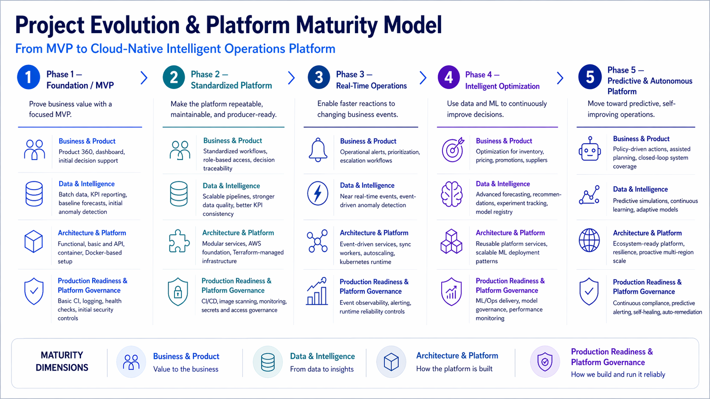

<em>Figure 3: Scaling Retail Intelligence — Evolution from MVP to Enterprise Optimization</em>

---

### 5.4. Phase 1 — Foundation / MVP

The first phase focuses on proving that the platform solves a real business problem.  
At this stage, the goal is not to build a complex enterprise platform immediately. The goal is to deliver a focused MVP that gives users better visibility into sales, inventory, demand, and operational risk.

This phase validates the business idea and creates the technical foundation for later cloud-native and MLOps capabilities.

**Business & Product**

* Product 360 view for sales, stock, pricing, and product performance.
* Basic dashboard for operations and inventory users.
* Initial visibility into stock risk, demand patterns, and business exceptions.
* Simple decision-support workflows for reviewing insights and recommendations.

**Data & Intelligence**

* Batch ingestion of selected sales, inventory, pricing, and product data.
* Basic reporting and KPI visibility.
* Baseline demand forecasting.
* Initial anomaly detection for unusual sales, stock, or pricing behavior.
* Early replenishment recommendations.

**Architecture & Platform**

* Simple frontend, backend API, database, and first ML component.
* Containerized local development environment.
* Basic service structure prepared for future modularization.
* Cloud-ready application layout that can later be deployed to AWS and Kubernetes.

**Production Readiness & Platform Governance**

* Basic CI pipeline with build and test automation.
* Application logging and `/health` endpoint.
* Initial configuration and secrets handling.
* Basic code quality checks.
* Secure-by-default development assumptions.

---

### 5.5. Phase 2 — Standardized Platform

The second phase transforms the MVP into a repeatable, maintainable, and production-oriented platform.  
The focus shifts from proving the idea to standardizing how the platform is built, deployed, secured, monitored, and operated.

This phase justifies stronger DevOps foundations, infrastructure automation, cloud services, release controls, and platform governance.

**Business & Product**

* Standardized workflows for using dashboards, recommendations, and alerts.
* Better role alignment for operations, inventory, analytics, finance, and management users.
* Improved traceability of decisions, recommendations, and operational actions.
* More consistent user experience across the platform.

**Data & Intelligence**

* More reliable data pipelines and stronger data quality validation.
* Expanded KPI analysis and variance analysis.
* Better consistency of forecasting outputs and business metrics.
* Improved readiness for model lifecycle management.
* Clearer separation between raw data, processed data, analytical outputs, and model outputs.

**Architecture & Platform**

* Clearer service boundaries and more modular application structure.
* Separated development and production-like environments.
* AWS foundation for compute, storage, networking, IAM, database, and container registry.
* Infrastructure provisioning using Terraform.
* Container image lifecycle prepared for repeatable deployment.

**Production Readiness & Platform Governance**

* CI/CD pipelines for application and infrastructure changes.
* Container image build, scan, and deployment process.
* Monitoring, logging, and basic alerting.
* Improved secrets management and IAM-oriented access control.
* Security scans integrated into the delivery process.
* Basic release governance, rollback assumptions, and environment standards.

---

### 5.6. Phase 3 — Real-Time Operations

The third phase introduces near-real-time operational intelligence.  
At this point, the platform moves beyond batch-oriented visibility and begins supporting faster reactions to dynamic retail events.

This phase is important because delayed detection of stockouts, pricing errors, product feed issues, or sudden demand changes can directly affect revenue, customer experience, and operational efficiency.

**Business & Product**

* Near-real-time operational alerts for stock, sales, pricing, order, and product-feed issues.
* Prioritization and escalation of detected incidents.
* Faster operational workflows for reacting to high-impact business events.
* Better support for operations managers and inventory planners during daily decision-making.

**Data & Intelligence**

* Near-real-time ingestion and processing of selected business events.
* Event-driven anomaly detection and alerting.
* Faster signal-to-decision flow for operational issues.
* Better connection between business events, analytical outputs, and recommended actions.
* Initial monitoring of prediction quality in changing business conditions.

**Architecture & Platform**

* Event-driven architecture for selected use cases.
* Asynchronous workers and event consumers.
* Decoupled services supporting faster and more scalable processing.
* Kubernetes runtime patterns for autoscaling and workload isolation.
* Runtime support for both long-running services and event-driven workloads.

**Production Readiness & Platform Governance**

* Enhanced observability for event flow, latency, failures, and retries.
* Business and technical alerting.
* More mature runtime controls for reliability under variable workloads.
* Stronger governance over operational response and incident handling.
* Better separation of responsibilities between application, platform, and data workflows.

---

### 5.7. Phase 4 — Intelligent Optimization

The fourth phase expands the platform from operational visibility and fast reaction into optimization.  
At this stage, the platform not only detects what is happening, but increasingly supports decisions about what should happen next.

This phase introduces stronger MLOps, model governance, recommendation quality monitoring, and feedback loops between business actions and model performance.

**Business & Product**

* Optimization-oriented decision support for inventory, pricing, promotions, and supplier-related actions.
* Stronger prioritization of business actions based on expected impact.
* Broader support for operational, financial, and management decision-making.
* More advanced recommendations embedded into daily business workflows.

**Data & Intelligence**

* More advanced demand forecasting and recommendation models.
* Improved anomaly detection using historical patterns and business context.
* Experiment tracking, model versioning, and model registry.
* Drift monitoring and retraining workflows.
* KPI-based evaluation of model and recommendation quality.
* Feedback loops based on user actions, decisions, and business outcomes.

**Architecture & Platform**

* More reusable platform services and clearer domain separation.
* Better support for ML deployment and scalable inference patterns.
* Architecture prepared for growth across multiple analytical and operational capabilities.
* Standardized integration patterns between application services, data pipelines, and ML components.

**Production Readiness & Platform Governance**

* More advanced CI/CD and MLOps delivery processes.
* Governance over datasets, models, experiments, and deployment status.
* Stronger security, auditability, and operational controls around production ML usage.
* Improved monitoring of both system performance and model performance.
* Release controls for model deployment, rollback, and promotion.

---

### 5.8. Phase 5 — Predictive & Autonomous Platform

The fifth phase represents the long-term target state of the platform.  
It should be treated as a strategic direction rather than the initial implementation scope.

The purpose of this phase is to show how the platform could evolve once its cloud, DevOps, data, observability, reliability, governance, and MLOps foundations are mature.

**Business & Product**

* Policy-driven and semi-autonomous operational decision support.
* Assisted planning and more proactive management workflows.
* Wider business coverage across additional operational domains.
* Higher-level strategic decision support for management and finance stakeholders.

**Data & Intelligence**

* Predictive simulations for demand, stock, pricing, and operational scenarios.
* Continuous learning based on business outcomes and user feedback.
* Adaptive models and stronger feedback loops.
* More autonomous optimization logic for selected decisions.
* Advanced scenario analysis and business impact simulation.

**Architecture & Platform**

* Ecosystem-ready platform prepared for additional domains, teams, and integrations.
* Potential multi-account or multi-region scalability.
* More advanced extensibility, resilience, and disaster recovery patterns.
* Platform architecture prepared for future AI-driven services and external integrations.

**Production Readiness & Platform Governance**

* Automated policy enforcement and continuous compliance checks.
* Advanced cost, performance, and reliability optimization.
* Predictive alerting and automated remediation for selected issues.
* Strong governance for semi-autonomous recommendations and actions.
* Mature incident response, auditability, and operational risk controls.

---

### 5.9. Current Scope, Target Vision & Strategic Outcome

This maturity model separates the **current implementation scope** from the **long-term platform vision**: Phase 1 and Phase 2 represent the core build, Phase 3 is an advanced partial target, while Phase 4 and Phase 5 describe the future MLOps and optimization roadmap.

This approach keeps the case study realistic while showing how the platform can grow from a focused MVP into a cloud-native intelligent operations platform that improves decision-making speed, operational efficiency, scalability, security, reliability, and long-term business optimization.

## 6. Methodology / Approach

### AWS Well-Architected Framework as the Design Methodology

The platform was designed using the AWS Well-Architected Framework as the main architectural methodology. The goal was not only to build a working application, but to design a cloud-native system that is secure, reliable, scalable, cost-aware, and ready for continuous improvement.

This approach helps translate technical decisions into business outcomes. Each major architectural choice is evaluated through six perspectives: operational excellence, security, reliability, performance efficiency, cost optimization, and sustainability.

Operational excellence is reflected in automation, repeatable delivery, infrastructure as code, CI/CD pipelines, monitoring, and continuous improvement of operational processes. This reduces manual work and makes the platform easier to maintain as it grows.

Security is treated as a default design requirement. The platform follows secure-by-design principles across identity, infrastructure, application delivery, secrets management, network access, and software supply chain controls.

Reliability is addressed by designing the system to recover predictably from failures. Health checks, workload recovery, observability, controlled releases, and backup considerations help reduce downtime and operational risk.

Performance efficiency is achieved by matching the right architecture patterns to the right workload types. APIs, batch jobs, event consumers, ML inference services, and scheduled retraining workflows can scale independently based on business and technical demand.

Cost optimization is considered from the beginning. The platform is designed to avoid unnecessary overprovisioning, separate MVP and production needs, monitor cloud usage, and introduce advanced services only when they are justified by business maturity.

Sustainability is supported by efficient resource usage, automation, right-sizing, and avoiding unnecessary infrastructure complexity. The platform can grow progressively without creating excessive operational or cloud resource waste.

Overall, the AWS Well-Architected Framework provides a structured approach for evolving the RetailOps Platform from an MVP into a production-ready, cloud-native, and eventually enterprise-grade decision platform.

  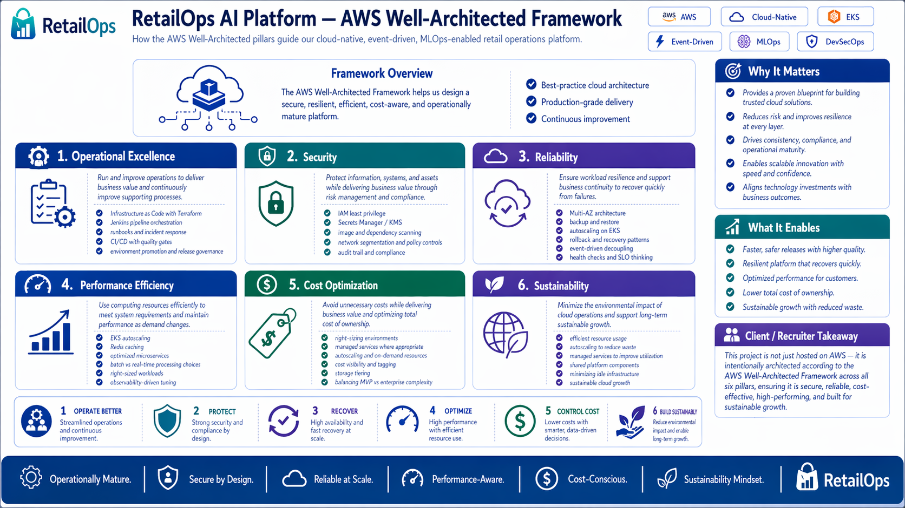

<em>Figure 4: AWS Well-Architected Framework — Our Approach to Designing Cloud-Native Systems</em>

## 7. Technology Stack & Architecture Rationale

This section explains the main technology choices behind the RetailOps Platform and why they are justified from both architectural and business perspectives. The goal is not to list every tool used in the project, but to show how selected technologies support scalability, automation, reliability, security, observability, and future platform maturity.

### 7.1. Kubernetes

Kubernetes is used as the core container orchestration platform because the RetailOps Platform is expected to run multiple types of workloads, including backend APIs, frontend services, asynchronous workers, scheduled jobs, event consumers, ML inference services, and retraining workflows.

It provides a consistent runtime model for deploying, scaling, updating, and recovering application components. This is especially important as the platform evolves from a simple MVP into a production-grade system with multiple services and environments.

Kubernetes is justified in this project because it supports workload isolation, rolling deployments, autoscaling, health checks, environment separation, and resilient service management. These capabilities reduce operational risk and create a strong foundation for future platform growth.

### 7.2. AWS

AWS is used as the main cloud platform because the target architecture requires more than simple application hosting. The platform needs scalable compute, secure networking, managed storage, identity management, monitoring, security controls, managed data services, and event-driven integration capabilities.

In this case study, AWS is treated as the cloud foundation for running containerized workloads, separating environments, securing access, storing operational and analytical data, supporting event-driven processing, and integrating platform observability and governance.

The complete AWS service inventory, environment layout, infrastructure components, networking assumptions, IAM model, and service-by-service rationale are documented separately in the technical documentation.

AWS is justified because it enables scalable infrastructure, secure access management, environment separation, managed operational components, and integration with cloud-native security and monitoring capabilities. From a business perspective, it allows the platform to grow gradually while keeping infrastructure aligned with actual business maturity and operational needs.

### 7.3. Terraform

Terraform is used to manage infrastructure as code. This is important because the platform should not rely on manually created cloud resources, inconsistent environments, or undocumented infrastructure changes.

Terraform enables repeatable provisioning of AWS resources, Kubernetes-related infrastructure, networking, IAM, databases, storage, and supporting services. It also makes infrastructure easier to review, version, promote between environments, and reproduce when needed.

Terraform is justified because it improves consistency, reduces manual errors, supports multi-environment delivery, and creates better control over infrastructure changes. In a production-oriented DevOps project, infrastructure should be treated with the same discipline as application code.

### 7.4. MLOps

MLOps is included because the platform is not only a reporting or dashboard solution. Its target state includes forecasting, anomaly detection, recommendation logic, model deployment, model monitoring, retraining, and business feedback loops.

The MLOps layer supports the full lifecycle of machine learning models: experimentation, dataset management, model versioning, evaluation, deployment, monitoring, drift detection, and retraining. This is necessary when predictions influence operational decisions such as replenishment, stock risk, pricing anomalies, or demand planning.

MLOps is justified because machine learning models become business-critical only when they are reliable, traceable, monitored, and operationalized. Without MLOps, the platform would remain a proof of concept rather than a trustworthy production decision system.

### 7.5. Application, Data & Event-Driven Architecture

This layer describes how the business application, data flows, and event-driven processing work together. The platform is designed to combine frontend interfaces, backend APIs, operational databases, analytical storage, ML services, and asynchronous processing components.

The application layer supports business users through dashboards, workflows, alerts, recommendations, and decision-support features. The data layer collects and processes information from sales, inventory, orders, pricing, products, suppliers, campaigns, and user actions. The event-driven layer allows the system to react faster to important business events such as stock changes, pricing updates, order anomalies, product feed issues, or sudden demand shifts.

This architecture is justified because modern retail operations cannot rely only on static reports and delayed batch processing. By combining application logic, data processing, and event-driven patterns, the platform can support both regular analytical workflows and faster operational response.

### 7.6. CI/CD, Version Control & Delivery Workflow

The delivery workflow combines version control, code review, automated testing, security checks, CI/CD pipelines, release promotion, and deployment automation. This ensures that changes can move from development to production in a controlled and repeatable way.

GitHub is used as the main version control and collaboration platform. Pull requests, code reviews, branching standards, commit conventions, and release tags create a structured engineering workflow. Jenkins is used as the CI/CD automation engine for building, testing, scanning, packaging, deploying, and promoting application, infrastructure, and ML-related changes.

This approach is justified because a production-grade platform requires more than writing code. It requires a reliable delivery process that reduces deployment risk, improves traceability, supports rollback, and allows teams to release smaller changes more frequently.

### 7.7. Observability Stack

Observability is required to understand how the platform behaves in real operating conditions. The observability stack covers metrics, logs, traces, dashboards, alerts, and incident investigation.

Prometheus and Grafana can be used for metrics, dashboards, and alerting. ELK or OpenSearch can support centralized logging and troubleshooting. CloudWatch can provide AWS-native monitoring for cloud services and infrastructure components.

Observability is justified because the platform supports business-critical workflows. When something fails, slows down, or behaves unexpectedly, the team needs fast visibility into application health, infrastructure performance, data processing status, and ML service behavior. Strong observability reduces downtime, improves incident response, and supports continuous improvement.

### 7.8. DevSecOps & Security Tooling

DevSecOps ensures that security is integrated into the delivery process instead of being treated as a final manual review. Security controls should be applied across code, containers, dependencies, infrastructure, secrets, runtime, and cloud access.

Tools such as Trivy, Snyk, SonarQube, Falco, AWS IAM, AWS Secrets Manager, and policy checks can support different parts of the security lifecycle. This includes static code analysis, dependency scanning, container image scanning, infrastructure checks, secret management, runtime detection, and least-privilege access control.

DevSecOps is justified because the platform processes operational and business-critical data. Security automation reduces the risk of vulnerable deployments, misconfigured infrastructure, exposed secrets, and weak access controls. It also makes the platform more credible from a production-readiness, auditability, and governance perspective.

## 8. Architecture

### 🏗️ Architecture Overview — From Business Events to Operational Decisions

RetailOps Platform is designed as a cloud-native operating platform that connects business data, applications, AI/ML services, automation, security, and observability into one controlled architecture.

The main goal is simple: convert retail events into faster and better business decisions. Sales, inventory, pricing, orders, product feeds, and user actions are collected, validated, processed, and transformed into forecasts, alerts, recommendations, dashboards, and workflows.

This architecture is not only a technical design. It is a business control system that helps reduce operational risk, improve inventory decisions, accelerate response time, and create a scalable foundation for future AI-driven optimization.

  

<em>Figure 5: Cloud-Native RetailOps Platform — End-to-End Architecture & Operational Framework</em>

---

### 8.1. Architecture Layers

The platform is built in layers so each part of the system has a clear role. Business users interact with dashboards, alerts, workflows, and recommendations. Application and API services expose business capabilities such as inventory monitoring, forecasting, anomaly detection, product intelligence, and operational workflows.

The data and event layer collects batch data and real-time business events. The ML layer turns this data into forecasts, anomaly scores, and recommendations. Underneath, AWS, Kubernetes, CI/CD, security, and observability provide the production foundation needed to run the platform reliably.

For management, this layered model shows how technology supports business value: better visibility, faster decisions, lower risk, stronger governance, and scalable growth.

  

<em>Figure 6: Architecture Layers</em>

---

### 8.2. Microservices Architecture

The platform is divided into independent microservices instead of one large application. Each service owns a specific business capability, such as user access, product intelligence, inventory, sales and orders, forecasting, anomaly detection, recommendations, alerts, workflows, or ML inference.

This makes the system easier to scale and evolve. For example, forecasting can be improved without changing the inventory service, and alerting can scale independently during periods of higher operational activity.

From a business perspective, microservices create clearer ownership, faster delivery, better fault isolation, and lower long-term complexity. New capabilities can be added gradually as the platform matures.

  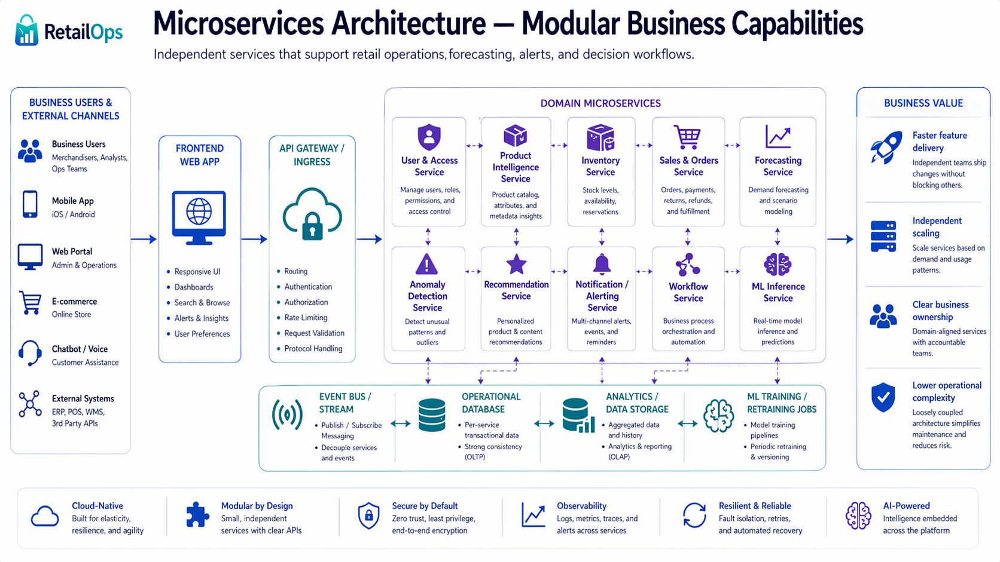

<em>Figure 7: Microservices Architecture</em>

---

### 8.3. AWS Cloud Architecture

AWS provides the secure and scalable cloud foundation for the platform. The architecture separates networking, compute, data storage, application runtime, security controls, observability, and event-driven processing into clearly defined cloud capabilities.

The AWS layer supports containerized workloads, controlled ingress, private networking, managed data persistence, object storage, event processing, secrets management, encryption, access control, monitoring, and repeatable infrastructure provisioning.

The detailed AWS service mapping is intentionally kept in the technical documentation. This keeps the case study focused on business and architecture rationale, while the technical documentation provides the complete implementation-level view of selected services, environments, Terraform modules, and operational assumptions.

The business benefit is a platform that can scale with demand, separate environments safely, reduce manual infrastructure risk, and support controlled production operations.

  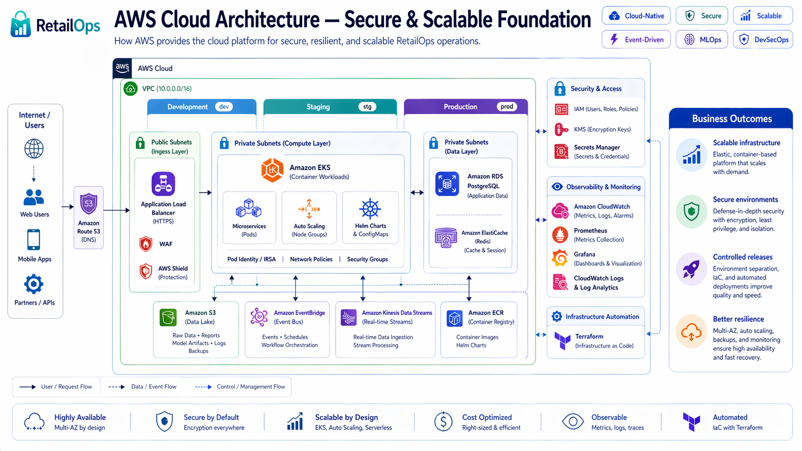

<em>Figure 8: AWS Cloud Architecture</em>

---

### 8.4. Data Flow & Intelligence Lifecycle

The platform turns raw business signals into operational insight. Data comes from sales, inventory, orders, pricing, promotions, suppliers, product catalogues, marketplaces, and user actions.

After ingestion, data is validated to detect missing records, duplicates, schema issues, delays, and unusual values. This is critical because poor data quality can lead to wrong forecasts, misleading dashboards, and bad inventory decisions.

Validated data is stored for operational and analytical use. ML and analytics services then generate forecasts, anomaly alerts, recommendations, and decision support.

The final step is feedback. Business users approve, reject, escalate, or modify recommendations. These actions improve future rules, models, alerts, and workflows, creating a continuous improvement loop.

  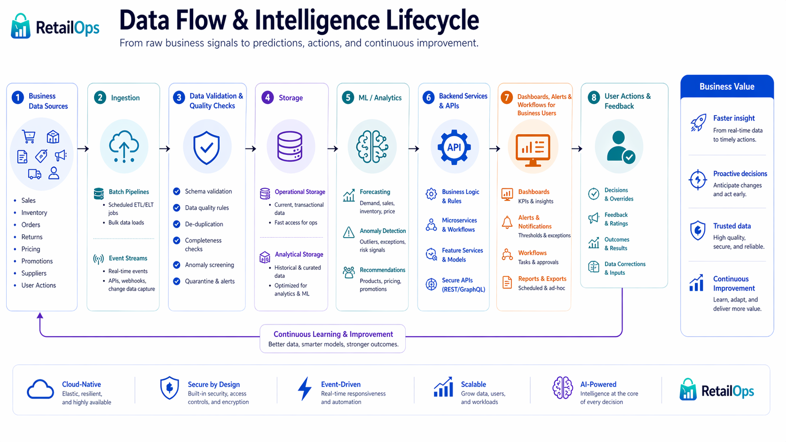

<em>Figure 9: Data Flow & Intelligence Lifecycle</em>

---

### 8.5. CI/CD Pipeline & Delivery Workflow

CI/CD automates how application, infrastructure, and ML changes are tested, secured, packaged, and released. It reduces manual deployment risk and makes delivery repeatable.

The pipeline starts with code commit and pull request review. It then runs formatting checks, tests, static analysis, security scans, dependency scans, and container image scans using tools such as SonarQube, Snyk, and Trivy.

Approved builds are packaged as Docker images and pushed to Amazon ECR. Terraform validates infrastructure changes before deployment. Kubernetes deployments are released to EKS through controlled rollout strategies.

For business stakeholders, CI/CD means faster releases, fewer production errors, better auditability, and safer delivery of new platform capabilities.

  

<em>Figure 10: CI/CD Pipeline & Delivery Workflow</em>

---

### 8.6. Security & Governance Architecture

Security is embedded across the platform, not added at the end. The platform uses identity and access management, least-privilege permissions, secrets management, encryption, network segmentation, container scanning, dependency scanning, and runtime monitoring.

Governance is supported through audit logs, deployment history, infrastructure state, approval records, and user action tracking. This gives management visibility into who changed what, when, and why.

For the organization, security and governance reduce cyber risk, improve compliance readiness, protect business-critical data, and strengthen trust in the platform.

  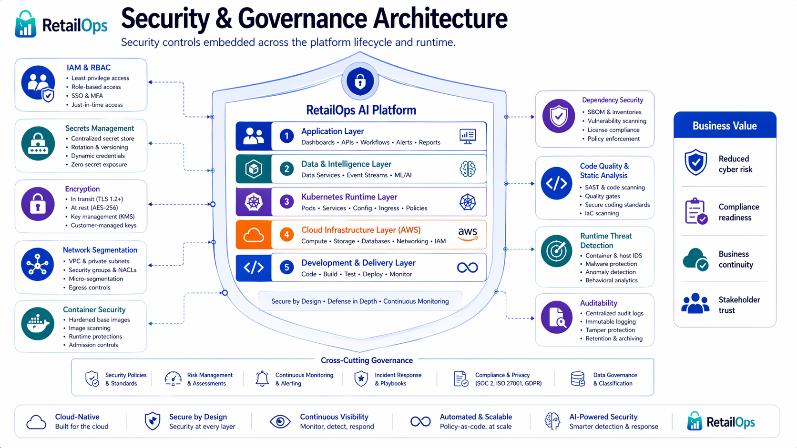

<em>Figure 11: Security & Governance Architecture</em>

---

### 8.7. Observability, Reliability & Operational Control

Observability and reliability are combined because both protect business continuity. Observability shows what is happening across applications, APIs, data pipelines, Kubernetes workloads, infrastructure, and ML services. Reliability ensures the platform can handle failures, traffic growth, and production changes without major disruption.

The platform collects metrics, logs, traces, alerts, and dashboards. These signals help detect failed pipelines, slow APIs, unstable services, model issues, data delays, deployment failures, and security events.

Reliability is supported by health checks, autoscaling, rolling updates, retries, workload separation, event-driven processing, rollback mechanisms, and staged deployments. Cost control is supported by right-sized workloads, autoscaling, storage lifecycle policies, and monitoring of cloud usage.

For executives, this means lower downtime risk, faster incident response, better operational predictability, and more efficient scaling.

  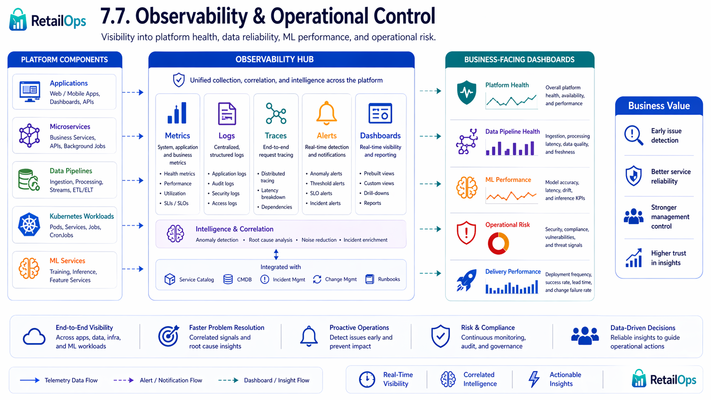

<em>Figure 12: Observability & Operational Control</em>

  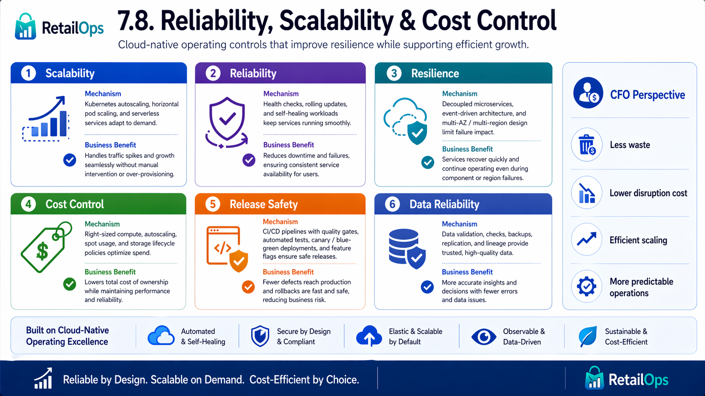

<em>Figure 13: Reliability, Scalability & Cost Control</em>

---

### 8.8. Executive Architecture Summary

RetailOps Platform combines microservices, AWS, Kubernetes, data processing, event-driven architecture, MLOps, CI/CD, security, and observability into one production-oriented operating model.

Each architecture component has a business role. Microservices make capabilities modular. AWS provides secure and scalable infrastructure. Kubernetes runs workloads reliably. Data and event processing enable faster reactions. MLOps operationalizes forecasts and recommendations. CI/CD improves release safety. Security protects the platform. Observability keeps operations under control.

The final business outcome is a platform that supports faster decisions, lower operational risk, better inventory control, scalable growth, more reliable delivery, and a strong foundation for future AI-driven optimization.

  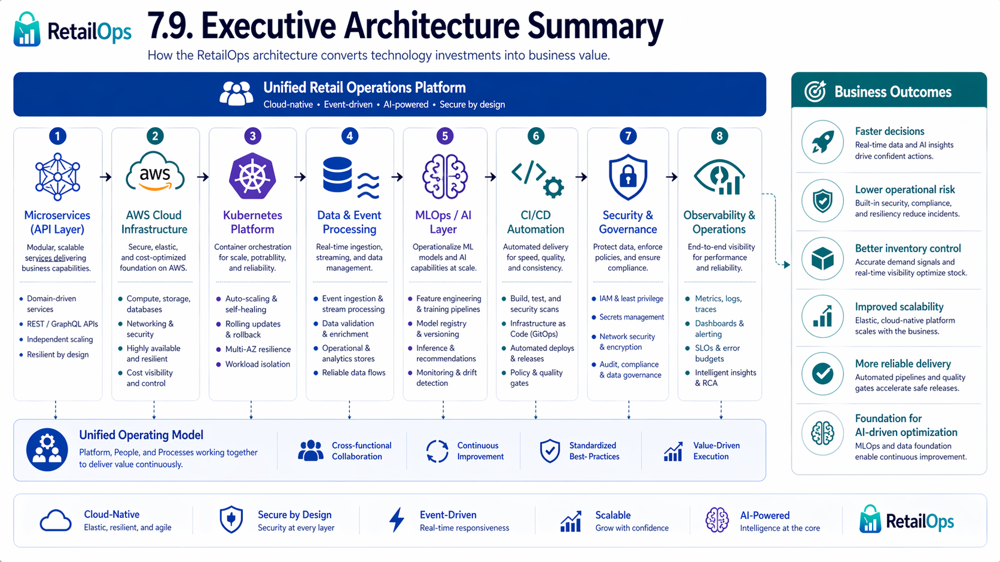

<em>Figure 14: Executive Architecture Summary</em>

## 9. KPIs, Challenges & Trade-offs

### 9.1. Key Performance Indicators

The success of the RetailOps Platform should be measured not only by technical delivery, but by its measurable impact on business operations, decision speed, and platform reliability.

### Business KPIs
* Forecast accuracy improvement
* Stockout / overstock reduction
* Operational response time
* Inventory risk visibility
* Decision cycle time

### Platform KPIs
* Deployment frequency
* Change failure rate
* Mean time to recovery
* Platform availability
* Infrastructure reproducibility
* Vulnerability detection coverage
* Model monitoring coverage

### 9.2. Challenges & Trade-offs

Building a cloud-native, AI-driven RetailOps Platform creates significant business value, but also introduces important trade-offs.

The main challenge is balancing platform maturity with delivery speed. A simple MVP can be delivered faster, but it will not provide the same level of scalability, reliability, automation, and governance as a production-ready platform.

Another trade-off is cost versus operational maturity. Kubernetes, observability, CI/CD automation, MLOps, and security tooling increase initial complexity and cloud cost, but they reduce long-term operational risk, manual work, failed deployments, and production instability.

The platform also requires careful data governance. Forecasts and recommendations are only valuable if the underlying sales, inventory, pricing, and product data are accurate, timely, and trusted by business users.

From an ML perspective, the main risk is treating models as one-time experiments instead of production assets. Without monitoring, retraining, versioning, and rollback mechanisms, model quality may degrade over time and negatively affect business decisions.

Finally, the architecture must avoid overengineering. Advanced AWS, Kubernetes, Terraform, CI/CD, and MLOps are justified only when they directly support business outcomes such as faster decisions, lower inventory risk, higher reliability, and scalable operations.

## 10. Future Improvements

Future improvements should focus on extending the platform from a production-ready DevOps/MLOps case study into a more advanced enterprise decision platform.

The next development steps may include:

* **Advanced real-time analytics** — expanding event-driven processing for faster detection of stock, pricing, order, and sales anomalies.
* **Stronger MLOps automation** — adding automated model retraining, drift detection, model approval workflows, and rollback mechanisms.
* **Business optimization modules** — extending the platform with inventory optimization, promotion effectiveness analysis, pricing recommendations, and supplier performance insights.
* **A/B testing and experimentation** — enabling controlled testing of forecasting models, replenishment rules, pricing strategies, and operational workflows.
* **FinOps and cost optimization** — introducing cloud cost monitoring, workload rightsizing, autoscaling policies, and cost-per-service visibility.
* **Multi-environment and multi-region readiness** — improving scalability, disaster recovery, and enterprise deployment maturity.
* **Advanced security and governance** — adding stronger policy-as-code, audit trails, secrets rotation, compliance controls, and role-based access management.

These improvements would increase business value by making the platform more scalable, more automated, more secure, and more directly connected to measurable operational and financial outcomes.

## Why This Project Matters for DevOps

This case study demonstrates DevOps and platform engineering skills across the full software delivery lifecycle: application containerization, CI/CD automation, Infrastructure as Code, Kubernetes-based deployment, AWS cloud architecture, observability, security automation, and production-readiness design.

The project shows how DevOps practices directly support business outcomes such as faster releases, safer deployments, better reliability, lower operational risk, and scalable platform growth.

## Notes

Parts of the documentation and visual materials were supported with AI tools, including ChatGPT.

Architecture decisions, implementation choices, technical validation, and final project structure were reviewed and adapted independently by the author.