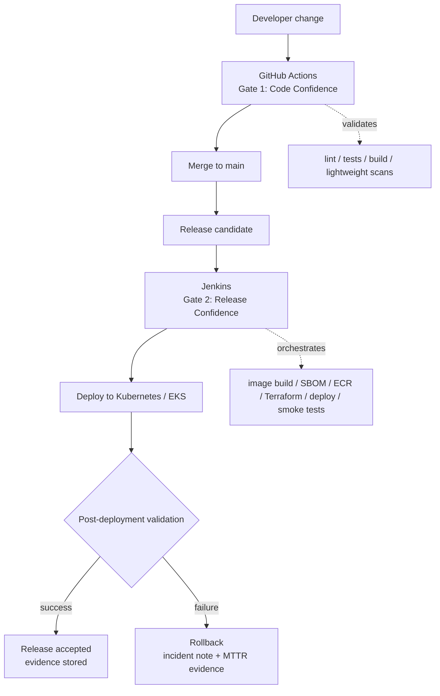

# CI/CD Tooling Split — GitHub Actions and Jenkins

> Status: Draft / Target maturity ADR  
> This document describes the intended CI/CD tooling split. Jenkins, ECR, Terraform, EKS and MLOps stages are target-maturity capabilities until implemented and validated.

## 1. Executive summary

RetailOps uses a **two-gate delivery model** that separates fast developer feedback from controlled release orchestration:

- **GitHub Actions** is used for **fast PR and main-branch quality gates close to the codebase**.
- **Jenkins** is used as the **production-style release orchestration layer** for deployment, environment promotion, release evidence, rollback, and advanced platform governance.

This decision avoids the shallow pattern of saying “GitHub Actions does CI and Jenkins does CD.” The actual architectural split is more precise:

> **GitHub Actions protects the codebase before a change becomes trusted. Jenkins controls the release after a change becomes a candidate for promotion.**

In RetailOps, this matters because the platform is not only an application. It is a cloud-native operating platform that combines API services, frontend, data pipelines, synthetic retail data, Docker, PostgreSQL, Terraform, Kubernetes/EKS, security gates, observability, and future MLOps capabilities.

The chosen split supports:

- faster feedback for developers,
- safer merges to `main`,
- release traceability,
- reproducible deployment evidence,
- separation of PR validation from release promotion,
- stronger security and governance controls,
- future AWS/EKS/Terraform deployment maturity,
- DORA-style delivery measurement,
- clear interview storytelling for a portfolio-grade DevOps case study.

---

## 2. Context

RetailOps starts as a local-first MVP and evolves toward a production-oriented AWS/Kubernetes/MLOps platform.

The current implementation focuses on:

- FastAPI backend services,
- React/Vite frontend,
- PostgreSQL database,
- Docker and Docker Compose local runtime,
- synthetic and seeded retail datasets,
- repository/service layers,
- API endpoints and frontend integration,
- local and CI test execution,
- GitHub Actions validation,
- early production-readiness foundations.

The target architecture introduces or strengthens:

- Terraform-managed AWS infrastructure,
- Amazon ECR image registry,
- Kubernetes/EKS runtime,
- environment promotion,
- security scans and policy gates,
- observability with Prometheus/Grafana, ELK/OpenSearch, and/or CloudWatch,
- MLOps lifecycle controls,
- deployment evidence,
- rollback and incident-response procedures,
- FinOps-aware release governance.

Because the project intentionally combines implemented components with target architecture, the CI/CD design must distinguish between:

| Scope | Meaning | Example |
|---|---|---|
| **Implemented now** | Working local or CI behavior already available in the project | API tests, frontend tests, Docker build checks, Docker Compose runtime |
| **Designed next** | Near-term production-readiness work that should be implemented after the local MVP is stable | security scans, release reports, local smoke-test automation |
| **Target maturity** | Enterprise-style delivery capability documented now and implemented when AWS/Kubernetes maturity is introduced | Jenkins release pipeline, ECR push, Terraform apply, EKS deployment, rollback automation |

This ADR intentionally covers all three levels so that the project can be explained as a coherent delivery system rather than as disconnected tools.

---

## 3. Problem statement

RetailOps needs a CI/CD model that answers the following questions:

1. **How do we know a pull request is safe to merge?**
2. **How do we know `main` is still releasable?**
3. **How do we build, scan, version, and publish release artifacts?**
4. **How do we promote a release to a target environment?**
5. **How do we prove that a deployment succeeded?**
6. **How do we stop a release when tests, scans, Terraform validation, or smoke checks fail?**
7. **How do we roll back safely?**
8. **How do we collect evidence for portfolio, audit, security, DORA, and operational maturity?**

A single tool could technically do many of these tasks. However, using a single tool for everything either makes PR validation too heavy or makes release governance too weak.

RetailOps therefore needs a split that is technically credible, explainable, cost-aware, and aligned with the project maturity model.

---

## 4. Decision

RetailOps will use the following CI/CD ownership model:

| Layer | Tool | Primary responsibility |
|---|---|---|
| **Local preflight** | Makefile / local commands / Docker Compose | Developer self-check before push |
| **Code confidence gate** | GitHub Actions | PR and main-branch validation close to repository events |
| **Release confidence gate** | Jenkins | Release candidate orchestration, artifact publishing, deployment, promotion, rollback evidence |
| **Runtime confidence gate** | Kubernetes, observability, smoke tests | Post-deployment validation and operational health evidence |

The core decision is:

```text
GitHub Actions = fast validation before merge
Jenkins        = controlled release orchestration after merge or release tag
```

This decision applies to application code, frontend code, backend code, data validation, Docker builds, security scanning, infrastructure validation, future Kubernetes deployment, and future MLOps delivery workflows.

---

## 5. Decision drivers

The decision is driven by several engineering and business concerns.

### 5.1. Fast developer feedback

PR feedback should be fast, visible, and close to the code review process. GitHub Actions is a strong fit because it runs directly on pull requests, branch pushes, and repository events.

### 5.2. Controlled release governance

Release promotion, deployment, rollback, and environment approval require stronger orchestration than simple PR checks. Jenkins is a strong fit for explicit multi-stage pipelines, release dashboards, manual approvals, credential boundaries, and enterprise-style delivery flows.

### 5.3. Separation of concerns

PR validation and release orchestration are related but not identical. Combining everything into one massive pipeline makes delivery slow and harder to reason about.

### 5.4. Evidence-driven delivery

RetailOps is a portfolio-grade project. It must produce evidence, not only code. The CI/CD system should generate:

- test logs,
- lint logs,
- build logs,
- Docker image metadata,
- security scan reports,
- Terraform validation or plan artifacts,
- deployment status,
- smoke-test results,
- rollback notes,
- DORA-oriented timestamps,
- release summaries.

### 5.5. Local-first and FinOps awareness

The project should prove the MVP locally before introducing always-on AWS infrastructure. GitHub Actions can validate local behavior without provisioning cloud resources. Jenkins becomes more valuable when release orchestration, ECR, Terraform, EKS, and environment promotion are introduced.

---

## 6. Options considered

### Option A — Use only GitHub Actions

GitHub Actions would run all CI and CD activities, including tests, Docker builds, scans, Terraform, deployment, and release promotion.

**Advantages**

- Simple repository-native setup.
- Easy PR integration.
- Lower operational overhead.
- Good fit for small and medium projects.
- No Jenkins server or agent maintenance.

**Disadvantages**

- Less impressive for enterprise release orchestration storytelling.
- Release promotion may become a large YAML workflow rather than a dedicated delivery control plane.
- Environment promotion, manual approvals, rollback evidence, and pipeline dashboards can become harder to explain cleanly.
- Does not showcase Jenkins experience, which is still common in enterprise DevOps environments.

**Assessment**

Good for MVP simplicity, but weaker for the long-term RetailOps case study because the project explicitly targets production-readiness, platform governance, and enterprise-style delivery.

---

### Option B — Use only Jenkins

Jenkins would run PR checks, branch checks, builds, tests, scans, deployments, infrastructure validation, and release promotion.

**Advantages**

- Strong enterprise CI/CD narrative.
- Flexible pipeline logic through Jenkinsfile and shared libraries.
- Good control over agents, credentials, approvals, environments, and release evidence.
- Strong fit for multi-stage deployment pipelines.

**Disadvantages**

- Too heavy for simple PR validation.
- Requires Jenkins availability and maintenance.
- Slower feedback loop for code review unless deeply integrated with GitHub.
- More operational overhead for a local-first portfolio MVP.
- Less natural than GitHub Actions for GitHub-native pull request checks.

**Assessment**

Good for release orchestration, but inefficient as the only tool for the early MVP and pull-request feedback loop.

---

### Option C — Split GitHub Actions and Jenkins

GitHub Actions performs fast PR/main validation. Jenkins performs release orchestration, artifact publishing, environment promotion, deployment, smoke tests, evidence collection, and rollback.

**Advantages**

- Clear separation between developer confidence and release confidence.
- Fast feedback in pull requests.
- Strong enterprise release orchestration story.
- Supports future AWS/ECR/EKS/Terraform maturity.
- Produces stronger portfolio evidence.
- Allows local-first validation before expensive cloud deployment.
- Demonstrates both modern GitHub-native CI and classic enterprise Jenkins delivery.

**Disadvantages**

- More tools to explain and maintain.
- Risk of duplicated stages.
- Requires clear ownership boundaries.
- Jenkins should not be introduced too early as always-on infrastructure if not justified.

**Assessment**

Best fit for RetailOps because it supports both the current MVP and the target production-grade platform narrative.

---

### Option D — GitOps-first model with Argo CD or Flux

GitHub Actions or Jenkins would build artifacts, while Argo CD or Flux would reconcile Kubernetes manifests into the target cluster.

**Advantages**

- Strong Kubernetes-native delivery model.
- Excellent deployment audit trail through Git.
- Pull-based deployment reduces direct cluster credential exposure in CI/CD.
- Strong fit for future multi-environment Kubernetes delivery.

**Disadvantages**

- Adds another tool before the platform has enough maturity.
- Requires Kubernetes environment and manifest maturity.
- May distract from the current CS-109 goal.

**Assessment**

Good future evolution, but not selected as the primary CS-109 decision. It may be introduced later as a maturity improvement after Jenkins release orchestration and Kubernetes manifests are stable.

---

## 7. Delivery model diagram



---

## 8. Tool responsibility matrix

| Capability | GitHub Actions | Jenkins | Rationale |
|---|---:|---:|---|
| Pull request trigger | Primary | Not primary | PR checks should run where code review happens. |
| Branch protection checks | Primary | Optional status integration | GitHub owns merge safety. |
| Backend unit/API tests | Primary | Re-run for release candidate when needed | Fast feedback first, release confidence later. |
| Frontend lint/test/build | Primary | Re-run for release candidate when needed | Prevent UI regressions before merge. |
| Data-quality tests | Primary for local/CI datasets | Primary for release datasets when promoted | Data is part of platform reliability. |
| Docker build validation | Primary | Primary for release image | GitHub checks buildability; Jenkins builds versioned artifact. |
| Docker Compose smoke test | Primary for local-first validation | Optional pre-release integration check | Proves local reproducibility before cloud deployment. |
| Dependency scan | Primary lightweight gate | Primary release-grade gate | Early vulnerability detection plus release blocking. |
| Container image scan | Primary on PR image where practical | Primary on release image | Release images must be scanned before publish/deploy. |
| Static analysis | Primary or scheduled | Primary for release quality gate | Can be lightweight in PR and stricter in release. |
| Secret scanning | Primary | Secondary verification | Secrets should be blocked as early as possible. |
| SBOM generation | Optional | Primary | SBOM belongs to release artifact evidence. |
| Image tagging | Limited / CI tag only | Primary | Release tags should be controlled centrally. |
| Push to ECR | Not primary | Primary | Registry publishing is a release action. |
| Terraform fmt/validate | Primary for PR infra changes | Primary for release promotion | PR validates syntax; Jenkins controls promotion. |
| Terraform plan | Optional artifact on PR | Primary release artifact | Infrastructure changes need reviewable evidence. |
| Terraform apply | Not allowed | Primary with approval | Apply is environment-changing and should be controlled. |
| Kubernetes manifest validation | Primary for PR changes | Primary before deployment | Both prevent invalid manifests at different stages. |
| Kubernetes deployment | Not primary | Primary | Deployment belongs to release orchestration. |
| MLOps model evaluation | Primary for tests/reports | Primary for model promotion | Model release needs governance. |
| Post-deployment smoke tests | Optional | Primary | Runtime confidence must be checked after deploy. |
| Rollback | Not primary | Primary | Rollback is part of release operations. |
| DORA evidence | Input source | Primary aggregator | Jenkins can summarize release metrics; GitHub provides commit/PR timestamps. |
| Security evidence | Input source | Primary aggregator | Release should collect final scan evidence. |
| Portfolio evidence | Input source | Primary aggregator | Jenkins release reports create strong demo artifacts. |

---

## 9. Pipeline ownership by repository area

| Repository area | Main change type | GitHub Actions responsibility | Jenkins responsibility |
|---|---|---|---|
| `services/api/` | Backend API changes | pytest, API tests, lint, Docker build check | release image build, scan, deploy backend, smoke test API |
| `frontend/` | React/Vite UI changes | npm lint/test/build, Docker build check | release image build, scan, deploy frontend, smoke test UI |
| `data/` | Synthetic/demo data changes | data validation, seed tests, regression checks | release dataset validation, data-quality report artifact |
| `ml/` | Forecasting/anomaly/model changes | model unit tests, baseline evaluation checks | model candidate evaluation, promotion gate, rollback assumptions |
| `infra/terraform/` | AWS infrastructure changes | terraform fmt/validate, optional plan on PR | plan, approval, apply, cost evidence, state-safe promotion |
| `k8s/` | Kubernetes manifests/charts | manifest lint/render/validation | deployment, rollout status, rollback |
| `security/` | Policies/scanning config | policy syntax validation | release security gate execution |
| `observability/` | Dashboards, alerts, metrics config | config validation | post-deploy monitoring verification |
| `docs/` | Documentation and ADRs | markdown lint/link checks where useful | release notes and evidence packaging where useful |
| `.github/workflows/` | GitHub Actions pipelines | self-validation through workflow runs | not primary |
| `ci-cd/jenkins/` | Jenkins pipelines/shared libraries | static/lint validation | primary runtime and release execution |

---

## 10. GitHub Actions scope

GitHub Actions owns fast repository-native validation before merge.

It validates:
- backend and frontend tests,
- linting and build checks,
- Docker buildability,
- lightweight security checks,
- data validation where relevant.

GitHub Actions should not own production-like deployment, Terraform apply, EKS deployment, rollback execution, or final release evidence aggregation.

---

## 11. Jenkins scope

Jenkins owns release confidence after a change becomes a release candidate.

It orchestrates:
- release image build and tagging,
- release-grade security scanning,
- SBOM and release metadata generation,
- ECR publishing,
- Terraform validation and controlled apply,
- Kubernetes/EKS deployment,
- MLOps release promotion,
- smoke tests,
- rollback and release evidence.

Jenkins should be treated as target maturity until the AWS, ECR, Terraform and Kubernetes foundation exists.

---

## 12. Security and governance model

Security is integrated across both tools, but the timing differs.

### 12.1. Security in GitHub Actions

GitHub Actions should catch security issues as early as possible:

- secret scanning,
- dependency scanning,
- static code analysis,
- basic container scan where practical,
- linting for insecure patterns,
- branch protection enforcement,
- required checks before merge.

### 12.2. Security in Jenkins

Jenkins should enforce release-grade security gates:

- scan final release image,
- block critical vulnerabilities,
- verify SBOM/provenance where configured,
- validate Terraform and Kubernetes manifests,
- ensure approved credentials are used,
- publish final security summary,
- enforce deployment approvals for protected environments.

### 12.3. Credentials and access boundaries

Credential principles:

- no secrets committed to Git,
- `.env.example` documents required local variables but does not contain real secrets,
- GitHub Actions should use minimal permissions,
- AWS access from CI should prefer OIDC or short-lived credentials when implemented,
- Jenkins credentials should be stored in Jenkins credentials store,
- release/deployment credentials should be separated from PR validation credentials,
- Terraform apply permissions should be more restricted than Terraform validate permissions,
- production-like deployment credentials should not be available to arbitrary PR workflows.

### 12.4. Security gate policy

Recommended default release gate:

| Finding | PR behavior | Release behavior |
|---|---|---|
| Critical vulnerability | Fail | Block release |
| High vulnerability | Fail or warn depending on maturity | Block or require documented exception |
| Medium vulnerability | Warn or fail depending on policy | Track and require review |
| Secret detected | Fail | Block release |
| Terraform destructive change | Require review | Require manual approval |
| Missing smoke test | Warn in MVP | Block protected environment release |
| Missing rollback plan | Warn in MVP | Block protected environment release |

---

## 13. Observability and runtime validation

CI/CD does not end when the deployment command succeeds. RetailOps requires runtime confidence.

### 13.1. Required post-deployment checks

Jenkins should run or verify:

- Kubernetes rollout status,
- container readiness,
- `/health` endpoint,
- `/ready` endpoint,
- selected business API endpoint smoke tests,
- frontend availability check,
- database connectivity check where appropriate,
- log availability,
- basic metrics availability,
- alerting route or dashboard availability in target maturity.

### 13.2. Runtime evidence

Jenkins should publish a deployment evidence summary containing:

```text
Release version:
Git commit:
Image tag:
Environment:
Deployment start time:
Deployment end time:
Rollout status:
Health check result:
Readiness check result:
Smoke-test result:
Security gate result:
Terraform plan/apply result:
Rollback status if used:
Operator notes:
```

### 13.3. Observability feedback loop

Runtime validation should feed the Enterprise Scorecard through:

- API availability,
- API latency,
- API error rate,
- monitoring coverage,
- alert detection validation,
- deployment frequency,
- lead time for changes,
- change failure rate,
- MTTR.

---

## 14. DORA and scorecard mapping

The CI/CD split supports delivery measurement.

| Metric | GitHub Actions contribution | Jenkins contribution |
|---|---|---|
| Deployment Frequency | Provides PR/main validation history | Counts successful release/deployment runs |
| Lead Time for Changes | Provides commit, PR, and merge timestamps | Provides release start/end and deployment timestamps |
| Change Failure Rate | Captures failed CI checks and broken builds | Captures failed deployments and failed smoke tests |
| MTTR | Provides fix commit and CI recovery evidence | Captures rollback/recovery start and end times |
| Vulnerability Scan Coverage | Runs early scans | Runs release-grade scans on final artifacts |
| Security Gate Pass Rate | Tracks PR security gates | Tracks release security gates |
| Monitoring Coverage | Can validate config | Verifies runtime observability after deployment |
| FinOps Evidence | Can validate cost-related IaC files | Can publish cost estimates and environment usage notes |

This mapping allows the project to explain delivery maturity using measurable evidence rather than vague claims.

---

## 15. Data and MLOps delivery considerations

RetailOps includes synthetic data, forecasting, anomaly detection, and future ML lifecycle controls. CI/CD must therefore cover not only application code but also data and model artifacts.

### 15.1. Data pipeline checks

GitHub Actions should validate:

- generated CSV/JSON shape,
- seed script correctness,
- data completeness,
- data quality rules,
- controlled scenario presence,
- API compatibility with seeded data.

Jenkins should validate release datasets or data migrations when they are part of a release candidate.

### 15.2. ML pipeline checks

GitHub Actions should validate:

- model utility tests,
- evaluation scripts,
- baseline metrics generation,
- reproducibility of local reports.

Jenkins should own future model promotion gates:

- model candidate packaging,
- evaluation threshold verification,
- model version tagging,
- inference deployment,
- rollback to previous model version,
- model evidence report publication.

### 15.3. Model release principle

A model should not be promoted only because the code builds. It should be promoted because:

- data quality is acceptable,
- evaluation metrics are acceptable,
- model limitations are documented,
- runtime path is observable,
- rollback is possible,
- business impact is understood.

---

## 16. Rollback strategy

Rollback belongs primarily to Jenkins because rollback is a runtime and release operation.

### 16.1. Application rollback

Application rollback should support:

- redeploy previous image tag,
- Kubernetes rollout undo,
- restore previous Helm release where Helm is used,
- validate `/health` and `/ready` after rollback,
- publish rollback evidence.

### 16.2. Database rollback

Database rollback requires special caution.

Default policy:

- prefer backward-compatible migrations,
- avoid destructive schema changes without explicit review,
- test migrations in CI where possible,
- document rollback or forward-fix strategy,
- do not blindly auto-rollback data migrations without a tested recovery path.

### 16.3. Infrastructure rollback

Infrastructure rollback should be handled through:

- Terraform plan review,
- version-controlled IaC changes,
- state-aware remediation,
- manual approval for destructive changes,
- documented recovery notes.

### 16.4. ML rollback

Future model rollback should support:

- previous model version selection,
- inference configuration rollback,
- model monitoring after rollback,
- business note explaining why rollback occurred.

---

## 17. Risks and mitigations

| Risk | Impact | Mitigation |
|---|---|---|
| Pipeline duplication between GitHub Actions and Jenkins | Slower delivery, confusion | Define ownership clearly; duplicate only release-critical checks intentionally |
| Jenkins introduced too early | Maintenance cost, local complexity | Treat Jenkins as target maturity until release orchestration is needed |
| GitHub Actions becomes too heavy | Slow PR feedback | Keep PR checks fast; move long release work to Jenkins |
| Release pipeline depends on unavailable AWS infrastructure | Broken demo experience | Keep local-first fallback and mark AWS stages as target maturity |
| Security scans block too aggressively early | Slower MVP progress | Start with visibility, then enforce blocking gates for release candidates |
| Terraform apply from wrong context | Infrastructure risk | Only Jenkins with approval should apply protected environment changes |
| Rollback strategy not tested | False confidence | Add rollback runbook and controlled failure scenario |
| Secrets exposed in CI logs | Security incident | Mask variables, use OIDC/credentials store, never echo secrets |
| MLOps treated as simple code deployment | Poor model governance | Add model evaluation and promotion gates before model deployment maturity |
| Documentation overclaims implementation | Portfolio credibility risk | Mark current, simulated, and target maturity evidence explicitly |

---

## 18. Consequences

### 18.1. Positive consequences

- Fast PR feedback remains simple and repository-native.
- Release pipeline can evolve into a production-style control plane.
- The project can explain both modern GitHub-native CI and enterprise Jenkins delivery.
- Security gates can exist both early and at release time.
- Terraform and Kubernetes deployment can be introduced safely later.
- DORA and scorecard evidence can be collected more clearly.
- The delivery model supports portfolio storytelling and senior-level trade-off reasoning.

### 18.2. Negative consequences

- More CI/CD concepts must be maintained and explained.
- Some checks may appear duplicated unless documented well.
- Jenkins requires operational thinking: agents, credentials, plugins, maintenance, logs, and backup.
- The project must avoid pretending Jenkins/EKS/AWS stages are already production-proven before they are implemented.

### 18.3. Neutral consequences

- The repository may contain target-maturity pipeline skeletons before all infrastructure exists.
- Some stages may be documented as “designed but not implemented yet.”
- This is acceptable as long as the distinction is explicit.

---

## 19. Future evolution

Potential future improvements:

- GitHub Actions required status checks with branch protection.
- Jenkins shared library for standardized stages.
- SBOM generation and artifact signing.
- SLSA-style provenance.
- OIDC-based AWS access.
- Infracost for Terraform plans.
- OPA/Conftest or Checkov for policy-as-code.
- Kyverno or Gatekeeper for Kubernetes admission policies.
- Argo CD for GitOps-based Kubernetes reconciliation.
- DORA dashboard built from GitHub and Jenkins metadata.
- Release evidence dashboard connected to observability and scorecard indicators.
