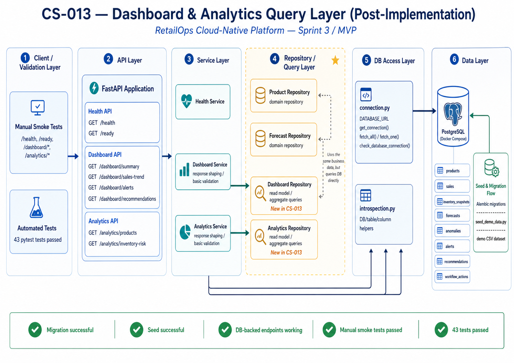

# CS-013 Future Improvements — Repository / Query Layer for Dashboard and Analytics

## Purpose

This document records what was intentionally kept small in CS-013 and what should be improved later.

CS-013 closes the MVP gap between seeded PostgreSQL data and backend endpoints used by dashboard and analytics views. The current implementation introduces a read-only repository/query layer so API handlers no longer need hardcoded dashboard mocks.

## Current Scope Boundary

The current CS-013 scope is intentionally minimal:

- read-only PostgreSQL queries,
- dashboard summary counters,
- sales trend endpoint,
- open alerts endpoint,
- recommendations endpoint,
- product performance endpoint,
- inventory risk endpoint,
- simple service layer above repositories,
- API route registration,
- API shape tests and repository smoke tests.

The current scope does **not** implement:

- full Product 360,
- final business KPI calculations,
- advanced filtering and pagination,
- final API contracts for all resources,
- write actions or workflow status transitions,
- RBAC and authentication,
- materialized views,
- event-driven alert creation,
- production-grade data warehouse modeling,
- advanced forecasting or anomaly models.

  

<em>Figure: CS-013 — Dashboard & Analytics Query Layer implementation</em>

## Recommended Future Implementation Order

### 1. Stabilize database schema and column names

Before adding more query complexity, stabilize naming for core tables:

- `products`,
- `sales`,
- `inventory_snapshots`,
- `forecasts`,
- `anomalies`,
- `recommendations`,
- later: `workflow_actions`, `alerts`, `users`, `data_quality_checks`.

Recommended action:

- document final MVP columns in `docs/data-model.md`,
- align seed data, migration, repositories and tests,
- avoid dynamic column fallbacks once schema stabilizes.

### 2. Add explicit response schemas

Current endpoints can return dictionaries for speed. Later, add Pydantic response models:

- `DashboardSummaryResponse`,
- `SalesTrendResponse`,
- `InventoryRiskResponse`,
- `ProductPerformanceResponse`,
- `AlertListResponse`,
- `RecommendationListResponse`.

This improves OpenAPI quality and protects frontend contracts.

### 3. Add filtering, sorting and pagination

For Sprint 4 / Core App Data Flows, add query parameters such as:

- `limit`,
- `offset`,
- `sort_by`,
- `sort_order`,
- `status`,
- `severity`,
- `category`,
- `sku`,
- `date_from`,
- `date_to`.

Do not add complex filtering until the frontend has real needs.

### 4. Replace generic dashboard queries with stable read models

When dashboard requirements become clearer, introduce stable read-model queries:

- operations summary,
- inventory risk summary,
- anomaly summary,
- recommendation summary,
- data freshness summary,
- forecast coverage summary.

At that point, repositories should no longer guess columns dynamically.

### 5. Add workflow-aware analytics

After basic dashboard views work, connect analytics to workflow status:

- open vs resolved anomalies,
- accepted vs rejected recommendations,
- stale inventory alerts,
- dismissed false positives,
- action owner and status distribution.

This supports the business workflow design in `docs/workflows.md`.

### 6. Add data quality signals

Dashboard and analytics endpoints should expose whether data is trustworthy:

- last successful seed or ingestion time,
- missing forecast count,
- stale inventory count,
- products without stock records,
- products without recent sales,
- invalid or incomplete records.

This will make the dashboard more production-oriented.

### 7. Add performance and observability controls

When data volume grows, add:

- query timing logs,
- indexes aligned with query filters,
- pagination limits,
- query timeout policy,
- metrics for endpoint latency and error rate,
- database connection pooling if needed.

### 8. Introduce materialized views only when justified

Do not create materialized views too early. They are useful later if dashboard queries become expensive or reused heavily.

Potential future materialized views:

- `dashboard_summary_mv`,
- `product_performance_mv`,
- `inventory_risk_mv`,
- `daily_sales_trend_mv`.

## Testing Improvements

Future tests should include:

- repository tests with known seeded data and exact expected values,
- API contract tests for response schemas,
- data-quality tests for missing forecast and stale inventory scenarios,
- edge-case tests for zero sales, negative values, missing product references,
- performance smoke tests for dashboard endpoints,
- frontend integration tests once dashboard consumes these endpoints.

## Security and Governance Improvements

Future implementation should add:

- role-aware endpoints,
- RBAC boundaries for Finance, DevOps, Inventory and Commercial users,
- safe error handling for DB failures,
- audit trail for future write actions,
- no exposure of internal table or column errors to API clients.

## Observability Improvements

Future implementation should expose:

- request logs for dashboard/analytics endpoints,
- endpoint latency metrics,
- DB query duration metrics,
- data freshness metrics,
- API error-rate metrics,
- dashboard availability checks.

## Conscious Trade-off

The CS-013 implementation optimizes for speed, demonstrability and safe MVP progress. It favors a simple repository/query layer over a full enterprise data access architecture.

This is acceptable because the task is Sprint 3 foundation work. The goal is to prove that dashboard and analytics endpoints can read PostgreSQL-backed data and can be tested in CI/local development.
