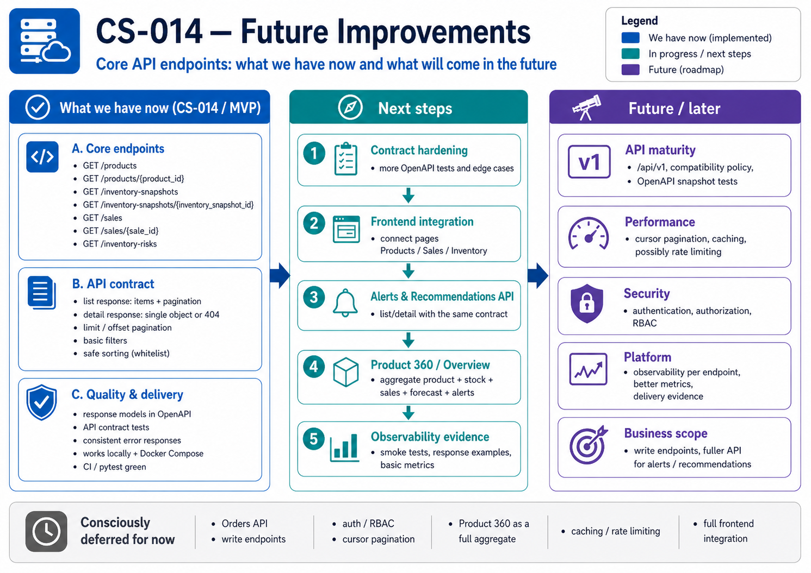

# CS-014 Future Improvements — Core API Endpoints and Minimal Contract

## Purpose

This document captures intentionally deferred improvements after Sprint 4 task **CS-014: Expose core API endpoints for products, inventory, sales and stock risk**.

The implemented MVP scope gives RetailOps stable read APIs for the first operational data flow:

```text
Product + Sales + Inventory + Forecast
        -> Stock Risk
        -> Dashboard / Frontend / Demo Evidence
```

The main contract rule remains:

```json
{
  "items": [],
  "pagination": {
    "limit": 50,
    "offset": 0,
    "total": 0
  }
}
```

This is enough for frontend integration, API tests, OpenAPI visibility, and CI/CD confidence without overengineering the API too early.

<p align="center">
  
</p>
<p align="center"><em>Figure: CS-014 Future Improvements — current API scope and roadmap</em></p>

---

## Current Scope Boundary

### Included now

- `GET /products`
- `GET /products/{product_id}`
- `GET /forecasts`
- `GET /forecasts/{forecast_id}`
- `GET /inventory-snapshots`
- `GET /inventory-snapshots/{inventory_snapshot_id}`
- `GET /sales`
- `GET /sales/{sale_id}`
- `GET /inventory-risks`
- stable list response shape: `items` + `pagination`
- basic filters for product, forecast, inventory, sales and stock risk reads
- offset/limit pagination
- simple whitelisted sorting
- response models visible in OpenAPI
- minimal API contract tests using FastAPI `TestClient`
- reuse of existing repository/service/domain structure from Sprint 3

### Not included now

- write endpoints
- order APIs
- authentication / authorization / RBAC
- cursor-based pagination
- API versioning such as `/api/v1`
- generated API clients / SDKs
- strict OpenAPI snapshot testing
- advanced query language
- full product 360 aggregate endpoint
- workflow actions for alerts/recommendations
- frontend consumption of all new endpoints
- observability metrics per endpoint
- rate limiting
- caching

---

## Recommended Future Implementation Order

### 1. Runtime smoke evidence

After tests pass, capture runtime checks for:

```text
GET /health
GET /ready
GET /products?limit=5&offset=0
GET /inventory-snapshots?limit=5&offset=0
GET /sales?limit=5&offset=0
GET /inventory-risks?limit=5&offset=0
```

Recommended evidence:

- terminal output,
- screenshot,
- short note in PR/commit summary,
- GitHub Actions green run.

### 2. Contract hardening

Add tests that validate OpenAPI schemas for the key endpoints.

Recommended next checks:

- `/openapi.json` contains `ProductListResponse`, `InventorySnapshotListResponse`, `SaleListResponse` and `StockRiskListResponse`,
- every core list endpoint exposes `items` and `pagination`,
- validation errors return safe responses,
- unknown route still returns the existing standard error contract.

### 3. Product 360 endpoint

Add a product detail view with related operational context.

Potential endpoint:

```text
GET /products/{product_id}/overview
```

Potential response sections:

- product master data,
- latest inventory snapshot,
- latest forecast,
- recent sales summary,
- stock risk status,
- active alerts,
- active recommendations.

Implement this only after the base resource endpoints are stable.

### 4. Alerts and recommendations endpoints

Add endpoints for operational work items.

Suggested order:

```text
GET /alerts
GET /alerts/{alert_id}
GET /recommendations
GET /recommendations/{recommendation_id}
```

Keep the same `items` + `pagination` list response contract.

### 5. Orders decision

Orders are currently treated as a future/context entity, not a Sprint 4 MVP requirement.

Recommended future decision:

- **Option A:** keep order data out of MVP and document it as future scope,
- **Option B:** add a lightweight `orders` table and API only when fulfillment/order lifecycle scenarios become part of the demo.

For now, do not introduce `orders` only to satisfy naming completeness. That would create model, migration, seed and test work without enough business value in the current Sprint 4 flow.

### 6. Frontend integration

Connect React pages to the new API endpoints.

Suggested flow:

1. Products page consumes `GET /products`.
2. Sales page or dashboard widget consumes `GET /sales`.
3. Inventory page or dashboard widget consumes `GET /inventory-snapshots`.
4. Stock-risk component consumes `GET /inventory-risks`.
5. Add loading/error/empty states.

### 7. API versioning and compatibility policy

Introduce `/api/v1` only when there are enough endpoints or external consumers to justify it.

Before that, document a simple rule:

> Existing response keys should not be renamed or removed without updating tests and documentation.

### 8. Cursor pagination

Offset pagination is acceptable for MVP/demo data. Cursor pagination can be added later if lists become large or performance-sensitive.

Potential future contract:

```json
{
  "items": [],
  "pagination": {
    "limit": 50,
    "next_cursor": "opaque-token",
    "previous_cursor": null
  }
}
```

Do not add this before it is needed.

---

## ADR-Style Notes

### Decision 1: Resource endpoints now, aggregate Product 360 later

**Chosen for now:** expose simple resource-level read APIs first.

Rationale:

- easier to test,
- stable for frontend,
- lower coupling,
- supports later Product 360 composition.

### Decision 2: `/inventory-risks` as the stock risk endpoint

**Chosen for now:** expose stock risk as `GET /inventory-risks`.

Rationale:

- keeps resource naming plural and noun-based,
- aligns with API conventions,
- avoids exposing implementation details such as analytics query names,
- can later be backed by a materialized view, model output, or cache without changing the public contract.

### Decision 3: Offset pagination now, cursor pagination later

**Chosen for now:** offset pagination.

Rationale:

- simple to implement,
- easy to test,
- enough for local MVP and seed data,
- avoids premature complexity.

---

## Common Future Risks

- adding new list endpoints that return a raw array instead of `items` + `pagination`,
- mixing API response formatting into repositories,
- building complex joins directly inside route handlers,
- adding authentication before response contracts are stable,
- changing response key names without updating tests,
- exposing internal database errors to clients,
- allowing arbitrary `sort_by` values and creating SQL injection risk,
- expanding endpoint scope faster than tests and documentation,
- treating dashboard/analytics endpoints as replacements for stable core resource APIs.

---

## Future Definition of Done for API Contract Maturity

A more mature API contract will be ready when:

- all resource list endpoints use `items` + `pagination`,
- all detail endpoints return a single object or standard `404`,
- OpenAPI docs show concrete response schemas,
- contract tests cover positive, empty, invalid-query and not-found cases,
- frontend uses the stable API contract,
- CI blocks changes that break response shape,
- API documentation includes examples for all primary endpoints,
- security and observability additions do not break the public contract.
