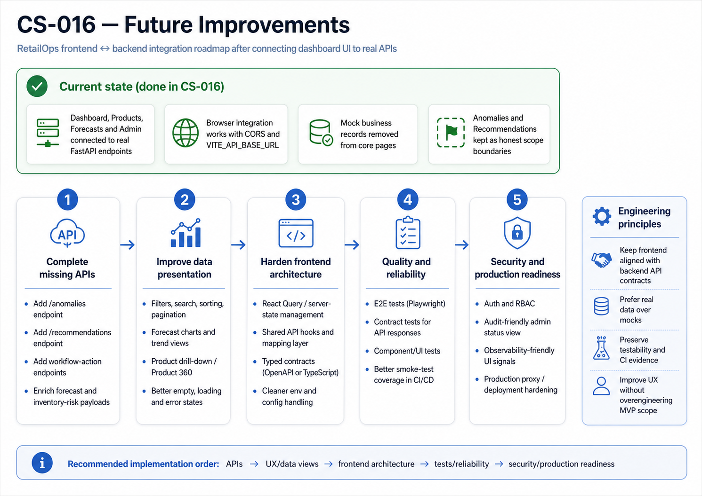

# CS-016 — Dashboard UI API Integration — Future Improvements

## Purpose

This document captures what was intentionally kept out of CS-016 after connecting the RetailOps frontend dashboard to backend APIs.

CS-016 focuses on removing frontend mock data and proving that the user-facing dashboard can consume real FastAPI responses from the local backend. The goal is fast MVP evidence, not a full enterprise frontend architecture.

  

  <em>Figure: CS-016 Future Improvements — Frontend Integration Roadmap</em>

## Current Scope Boundary

CS-016 includes:

- frontend API client for FastAPI endpoints,
- dashboard page connected to backend data,
- product page connected to `/products`,
- forecast page connected to `/forecasts`,
- admin/platform status page connected to `/health` and `/ready`,
- loading, empty and error states,
- removal of hardcoded dashboard, product and forecast mock rows,
- minimal frontend tests for API URL handling, error parsing and response normalization,
- `.env.example` note for `VITE_API_BASE_URL`.

CS-016 does not include:

- authentication,
- RBAC by user group,
- React Query or advanced caching,
- full dashboard filtering,
- charts,
- anomaly API implementation,
- recommendation API implementation,
- workflow action mutations,
- optimistic UI updates,
- pagination,
- visual regression testing,
- production Nginx API reverse proxy,
- Kubernetes ingress integration.

## Recommended Future Implementation Order

### 1. Stabilize API contracts

Add explicit backend response schemas and document the stable frontend contracts for:

- `/dashboard/summary`,
- `/products`,
- `/forecasts`,
- `/stock-risks` or `/inventory-risks`,
- `/analytics/summary`,
- `/alerts`.

Reason: frontend quality depends on stable API response shapes. Without contracts, the UI becomes defensive and harder to maintain.

### 2. Add frontend integration tests

Introduce Vitest and React Testing Library after the first API-connected UI is stable.

Recommended tests:

- dashboard renders metrics after successful API responses,
- dashboard shows error state when backend is down,
- products page renders product rows,
- forecasts page renders forecast rows,
- empty backend response shows empty state rather than fake data.

Reason: this protects business-critical screens and prevents accidental return to mock data.

### 3. Add charts and trend views

After API contracts are stable, add simple charts for:

- sales trend,
- stock risk distribution,
- forecast quantity by date,
- alert status distribution.

Reason: charts are valuable for business users, but only after the data contract is reliable.

### 4. Add filters and pagination

Add query parameters and UI controls for:

- category,
- SKU,
- risk status,
- date range,
- alert severity,
- page size and offset.

Reason: local MVP data can be small, but production-style datasets require controlled retrieval and filtering.

### 5. Implement anomaly and recommendation screens

Connect the placeholder pages to real backend APIs:

- `/anomalies`,
- `/recommendations`,
- `/workflow-actions`.

Reason: these pages should not display fake records. They should wait for real backend capability.

### 6. Add workflow actions

Add mutation support for business actions:

- acknowledge alert,
- assign owner,
- escalate,
- resolve,
- dismiss,
- approve/reject recommendation.

Reason: RetailOps is not only a dashboard. The target platform should support operational decisions and feedback loops.

### 7. Add security and role-based visibility

Introduce authentication and RBAC after workflow endpoints exist.

Potential roles:

- Operations Manager,
- Inventory Planner,
- Analyst,
- Commercial Stakeholder,
- Finance,
- Data / ML Team,
- Platform / DevOps Team.

Reason: access design should follow user decisions, not only page URLs.

### 8. Add production runtime integration

When the project moves toward Kubernetes or AWS runtime, revisit:

- frontend runtime config injection,
- Nginx reverse proxy to API,
- Kubernetes service discovery,
- ingress routing,
- TLS,
- CORS policy,
- environment-specific URLs.

Reason: Vite environment variables are build-time variables. Production deployments need a stronger configuration strategy.

## ADR-style Options for Later

### Option A — Keep lightweight custom fetch client

Best for MVP and portfolio speed.

Pros:

- no new dependency,
- easy to understand,
- good enough for simple GET views,
- fast to test.

Cons:

- no caching,
- more manual loading/error handling,
- less ergonomic for complex data flows.

### Option B — Adopt React Query / TanStack Query

Best after API contracts stabilize.

Pros:

- built-in caching,
- retries,
- request status handling,
- refetching,
- better developer experience for many endpoints.

Cons:

- adds dependency,
- requires conventions,
- can hide basic HTTP concepts from a junior engineer too early.

### Option C — Generate frontend client from OpenAPI

Best for later production maturity.

Pros:

- strong type safety,
- less manual endpoint drift,
- contracts visible in CI,
- better long-term maintainability.

Cons:

- setup overhead,
- requires stable OpenAPI schemas,
- not necessary for speed-run MVP.

## Testing Improvements

Future frontend test layers should include:

- unit tests for formatters and API normalization,
- component tests with mocked backend responses,
- API contract smoke checks,
- Playwright end-to-end tests against Docker Compose,
- visual regression tests for key dashboard states,
- accessibility checks.

## Observability Improvements

Later frontend observability can include:

- frontend error boundary,
- request timing logs,
- correlation IDs,
- user action telemetry,
- dashboard data freshness indicator,
- frontend availability smoke check in CI/CD.

## Security Improvements

Later security controls should include:

- no secrets in Vite variables,
- environment-specific API URL validation,
- CORS hardening,
- authentication,
- RBAC,
- audit trail for workflow actions,
- dependency scanning for frontend packages.

## Known Risk Accepted in CS-016

The frontend contains defensive payload normalization because the exact backend response shapes may still evolve. This is acceptable for speed-run MVP, but it should be replaced with stable API contracts once backend schemas mature.

## Completion Evidence

CS-016 can be considered closed when:

- dashboard loads data from backend API,
- products page loads data from `/products`,
- forecasts page loads data from `/forecasts`,
- no business records are hardcoded in React page files,
- empty/error states are visible when backend data is unavailable,
- frontend tests pass,
- backend tests still pass,
- Docker Compose can run frontend + API + database locally,
- README or frontend README explains `VITE_API_BASE_URL`.
