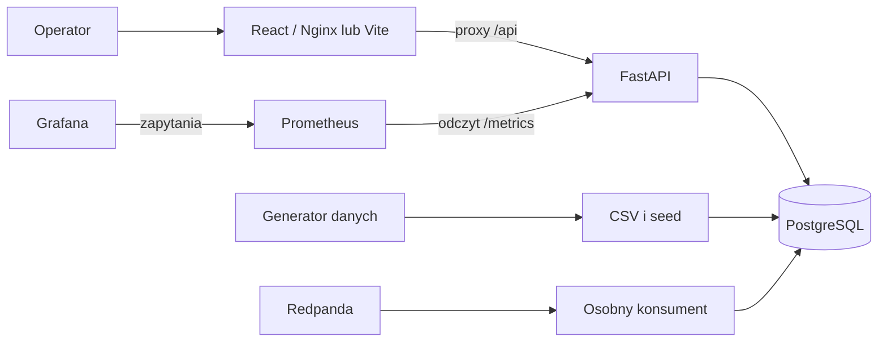

# Architektura RetailOps

[Dokumentacja](../README.md) · [Uruchomienie lokalne](../guides/local-development.md)

RetailOps jest platformą demonstracyjną do pracy z danymi sprzedaży, zapasami,
prognozami, alertami i rekomendacjami. Działa lokalnie przez Docker Compose
i ma osobną ścieżkę weryfikacji na Kubernetes kind. Kod infrastruktury AWS
przygotowuje fundament pod uruchomienie chmurowe; repozytorium nie opisuje
aktywnego produkcyjnego środowiska EKS.

## Działający przepływ lokalny

Start Compose wykonuje migracje i ładowanie danych przed uruchomieniem API.
Konsument działa osobno na hoście przez `make realtime-consumer`; lokalny overlay
Kubernetes uruchamia go jako workload. Generator plików replay i procesor zdarzeń
istnieją, ale pełne dostarczanie wygenerowanego replay przez broker wymaga
oddzielnej integracji i walidacji.

## Odpowiedzialność komponentów

| Obszar | Aktualna implementacja |
|---|---|
| UI | Katalog i Product 360, dashboardy, prognozy, sygnały zapasu, kolejka działań, akcje workflow i użytkownicy demo |
| API | FastAPI, Pydantic, repozytoria i usługi, Psycopg, kontrolowane błędy, stronicowanie, identyfikatory korelacji |
| Dane | PostgreSQL, migracje Alembic z SQLAlchemy Core, deterministyczny generator i kontrakty CSV/zdarzeń |
| Workflow | Trwałe zmiany alertów/rekomendacji oraz historia akcji; kontrola uprawnień dla wybranych operacji demo |
| Zdarzenia | Tematy Redpanda, konsument, deduplikacja i zapis obserwacji do odczytu Live Operations |
| Monitoring | Prometheus, dashboardy Grafany, reguły alertowe oraz test awarii i odzyskania API |
| ML | Lokalne cechy, baseline i Random Forest, ewaluacja, metadane, batch inference oraz raporty dryfu |
| Dostarczanie | GitHub Required CI, publikowanie i weryfikacja artefaktów GHCR, lokalne testy Jenkinsa |
| Kubernetes | Kustomize, kind, Traefik, polityki sieci, PVC i testy aktualizacji/rollbacku |
| AWS | Moduły Terraform, kontrolowany plan/drift i przygotowany osobny backend stanu S3/KMS |

Wywołania API korzystają z warstwy repozytoriów i usług, a operacje bazodanowe
wykorzystują Psycopg. SQLAlchemy służy do deklarowania struktur migracji; aplikacja
nie wymaga modeli ORM. Widok `/anomalies` korzysta z dostępnych sygnałów
operacyjnych; nie oznacza osobnej produkcyjnej usługi detekcji anomalii.

## Granice obecnego środowiska

Tożsamości demo nie są uwierzytelnieniem produkcyjnym. Single-replica PostgreSQL
i Redpanda w lokalnym Kubernetes zachowują dane przy odtworzeniu Podów, ale
wolumeny kind nie przetrwają usunięcia klastra. Monitoring lokalny nie potwierdza
ciągłej dostępności usługi produkcyjnej ani dostarczania powiadomień poza system.

Modele ML używają danych syntetycznych. Nie działają tu jeszcze zarządzany
feature store, produkcyjne serwowanie modeli, automatyczna promocja i retraining.
Także EKS, Helm i chmurowa promocja workloadów pozostają poza aktualnym
uruchomionym zakresem.

## Mapa repozytorium

| Katalog | Zawartość |
|---|---|
| `docs/` | Dokumentacja, instrukcje, aktualny status i otwarte wnioski |
| `services/api/`, `frontend/` | Aplikacja |
| `data/`, `events/`, `ml/` | Generatory, kontrakty i lokalne zadania ML |
| `infra/`, `k8s/` | Terraform i manifesty Kubernetes |
| `observability/`, `security/`, `policy/` | Konfiguracja monitoringu i kontroli bezpieczeństwa |
| `.github/`, `Jenkinsfile`, `scripts/` | Automatyzacja walidacji i operacji |
| `tests/`, `services/api/tests/`, `frontend/tests/`, `frontend/e2e/` | Testy |
| `ci-cd/reports/` | Wyniki generowane przez narzędzia walidacyjne |

Dalej: [API](../reference/api.md), [model danych](../reference/data-model.md),
[workflow](../reference/business-workflows.md), [przetwarzanie zdarzeń](../guides/streaming.md),
[ML](../guides/ml.md) i [lokalny Kubernetes](../runbooks/local-kubernetes-runbook.md).
