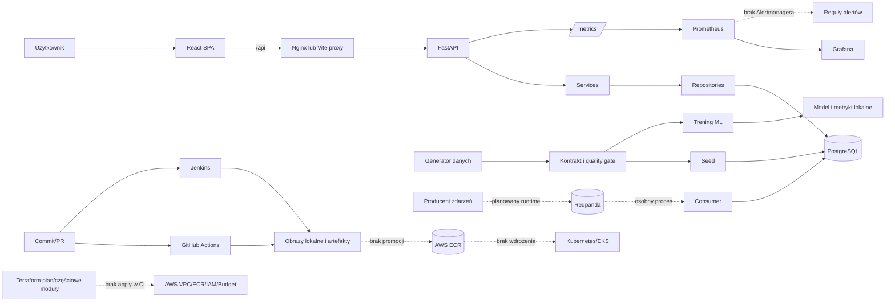

# Audyt RetailOps AI Platform jako portfolio DevOps

> Raport historyczny: opisuje stan z 2026-07-14 na commicie `bd85ce4`,
> a nie bieżącą gałąź `main`. Późniejsze poprawki i granice aktualnej
> weryfikacji opisano w [indeksie audytów](README.md).

Data audytu: 2026-07-14

Audytowany commit: `bd85ce4` na gałęzi `devops-platform-readiness`

Zakres: całe repozytorium, bieżący kod, konfiguracja, testy, historia Git i lokalne uruchomienie

Tryb: analiza bez wdrożeń i bez naprawiania znalezionych problemów

**WNIOSEK:** kolumny „Stan” i „Priorytet” w tabeli są oceną audytową. Kolumna „Najważniejszy dowód” odnosi się do faktów rozwiniętych w dalszych sekcjach.

| Obszar | Stan | Najważniejszy dowód | Największy problem | Priorytet |
| ------ | ---- | ------------------- | ------------------ | --------- |
| Aplikacja lokalna | działa częściowo | Compose uruchomił zdrowe API, frontend, PostgreSQL i Redpandę; smoke test przeszedł | uruchomiono istniejące obrazy z maja, ponieważ świeży build nie zakończył się w czasie audytu | P0 |
| Backend/API | działa | 40 ścieżek i 41 operacji OpenAPI; pełny zestaw `302 passed`; testy z pokryciem 83,79% | brak rzeczywistego uwierzytelniania i nierówne pokrycie warstwy repozytoriów | P0 |
| Frontend | działa częściowo | `36 passed`, lint, produkcyjny build i HTTP 200 zakończone powodzeniem | brak testów renderowania komponentów i aktualnie nieweryfikowalne Playwright E2E | P1 |
| Dane i ML | działa częściowo | kontrakt danych oraz 15/15 reguł jakości przeszły; trening utworzył artefakty i poprawnie odrzucił gorszy model | model nie jest podłączony do wykonywania prognoz w aplikacji | P2 |
| Docker/Compose | działa częściowo | wszystkie istotne profile przechodzą `docker compose config`; runtime smoke przeszedł | `make compose-down` usuwa wolumeny, obrazy bazowe nie są przypięte digestem | P0 |
| Testowanie | działa częściowo | pełny backend `302 passed`, frontend `36 passed`, k6 0% błędów | test integracyjny zależy od konkretnego seeda, a test generatora modyfikuje śledzone pliki | P0 |
| CI | działa częściowo | rozbudowane workflow dla API, frontendu, obrazów, security, IaC i provenance | workflow deklarowany jako required wykonuje głównie płytkie kontrole i pomija Kubernetes/policy | P0 |
| CD | szkielet | plan Terraform i etapy Jenkins istnieją | brak publikacji/promocji jednego artefaktu, wdrożenia, approval i rollbacku | P1 |
| Terraform/AWS | działa częściowo | `fmt`, `validate` i TFLint przeszły; 78 kontroli Checkov przeszło | środowisko `dev` nie składa EKS/node groups, brak aktywnego remote state i bieżącego wdrożenia | P1 |
| Kubernetes | działa częściowo | Kustomize renderuje bazę i dev; Conftest 231/231 dla dev | baza i broker używają `emptyDir`; brak NetworkPolicy, PDB, HPA i kompletnego delivery | P1 |
| Obserwowalność | działa częściowo | smoke potwierdził Prometheus, Grafanę, 4 dashboardy, reguły i metryki API | brak Alertmanagera, centralnych logów, działającego trace collectora i SLO | P1 |
| Bezpieczeństwo | działa częściowo | Gitleaks nie wykrył sekretów w 230 commitach; kontenery aplikacji są non-root | mock auth, miękkie bramki skanerów, śledzony plik runtime secrets i znane podatności | P0 |
| Backup/DR | szkielet | lokalny dump, suma kontrolna i lista 124 wpisów archiwum zostały zweryfikowane | brak testu restore, szyfrowania, retencji, offsite, RPO/RTO i rollbacku wdrożenia | P1 |
| Dokumentacja | działa częściowo | 136 plików Markdown, brak uszkodzonych linków inline i domknięte bloki kodu | case study, diagramy, API i instrukcje zawierają istotny drift oraz nadmierne deklaracje | P0 |
| Wartość portfolio | 6,2/10 | szeroki, rzeczywiście uruchamialny lokalny case study z testami, IaC i observability | repozytorium sugeruje dojrzalszą chmurę i CD niż faktycznie istnieją | P0 |

## Oznaczenia i metoda

- **FAKT** - bezpośredni wynik polecenia albo zawartość repozytorium.
- **WNIOSEK** - interpretacja oparta na wskazanych faktach.
- **NIEZWERYFIKOWANE** - stan, którego nie dało się potwierdzić bez sieci, chmury, destrukcyjnej operacji albo brakującego narzędzia.
- **REKOMENDACJA** - proponowane dalsze działanie, nie stan bieżący.

**FAKT:** przed audytem `git status --short` wykazał wyłącznie dwa zastane, nieśledzone pliki: `infracost-usage.yml` i `infracost.yml`. Nie zostały one zmodyfikowane ani użyte jako dowód wdrożenia.

Stan początkowy:

```text
?? infracost-usage.yml
?? infracost.yml
```

**FAKT:** po zakończeniu analizy i zapisaniu raportu `git status --short` wykazał:

```text
?? docs/audits/
?? infracost-usage.yml
?? infracost.yml
```

**WNIOSEK:** jedyną nową pozycją stanu repozytorium powstałą w ramach audytu jest żądany katalog z raportem `docs/audits/`. Dwa pliki Infracost były obecne przed audytem i pozostały nietknięte. Efekty uboczne testu w `data/demo/` zostały wycofane do dokładnego stanu wejściowego.

**FAKT:** przeanalizowano 634 śledzone pliki. Największe obszary to `services/`, `docs/`, `data/`, `frontend/`, `infra/`, `k8s/` i `ci-cd/`. Historia obejmuje 240 commitów od 2026-04-24 do 2026-05-18. Gałąź audytowana jest 9 commitów przed `main`, nie ma tagów, a najnowsze zapisane dowody mają około dwóch miesięcy.

**FAKT:** historia ma 7 merge commitów, 0 podpisanych commitów i jednego dominującego autora (236 wpisów autora przy 4 commitach Dependabot). Około 70,4% tematów commitów przypomina Conventional Commits. Audytowana gałąź jest także 2 commity przed odpowiadającą jej gałęzią zdalną. **WNIOSEK:** historia dobrze pokazuje regularną, samodzielną pracę i automatyczne aktualizacje, ale nie potwierdza pracy zespołowej, review ani procesu release.

**FAKT:** podczas pełnego testu backendu `services/api/tests/test_seed_data.py:30-63` uruchomił generator zapisujący do śledzonego `data/demo/` i zmienił 17 plików. Był to efekt uboczny diagnostyki, nie naprawa. Zmiany ograniczone do tych plików zostały przywrócone do stanu początkowego; zachowano wyłącznie tworzony niniejszym audytem raport.

**NIEZWERYFIKOWANE:** bieżący stan AWS, ustawienia branch protection w GitHub, działający kontroler Jenkins, świeży build wszystkich obrazów, pełny restore bazy i walidacja online schematami Kubeconform. Ich weryfikacja wymagałaby dostępu zewnętrznego, kosztownego działania, operacji zmieniającej stan lub pobrania brakujących artefaktów.

## 1. Executive summary

**FAKT:** RetailOps AI Platform jest demonstracyjną aplikacją operacyjną dla handlu detalicznego. Łączy React, FastAPI, PostgreSQL, strumień zdarzeń Redpanda, lokalny pipeline danych i model prognozujący. UI prezentuje dashboard, sprzedaż, zapasy, ryzyka, prognozy, analitykę Product 360 i kolejkę rekomendowanych działań. Infrastrukturę reprezentują Docker Compose, manifesty Kustomize oraz częściowy Terraform dla AWS.

**WNIOSEK:** projekt rozwiązuje wiarygodny problem demonstracyjny: konsolidację danych sprzedażowych i magazynowych, wykrywanie ryzyka braku zapasu oraz obsługę rekomendowanych działań. Największą wartością nie jest unikalność domeny biznesowej, lecz możliwość pokazania pełnego lokalnego łańcucha od danych, przez API i UI, po testy, monitoring oraz IaC.

**WNIOSEK:** rzeczywisty poziom ukończenia to zaawansowany lokalny proof of concept, nie działająca platforma cloud-native. Aplikacja lokalna i większość kontroli jakości są realne. Cloud delivery, produkcyjne bezpieczeństwo, odporność danych i bieżące wdrożenie AWS pozostają częściowe albo planowane.

**FAKT:** projekt można uruchomić lokalnie. Izolowany stack `retailops-audit` wystartował z istniejących obrazów, migracja i seed zakończyły się kodem 0, a API, frontend, baza i broker osiągnęły zdrowy stan. Compose smoke, observability smoke i test k6 przeszły. **FAKT:** świeży `docker compose build` nie zakończył się z powodu bardzo wolnego pobierania warstw i został bezpiecznie przerwany. **NIEZWERYFIKOWANE:** zgodność istniejących obrazów z bieżącym źródłem end-to-end.

**WNIOSEK:** repozytorium nie powinno jeszcze być przedstawiane rekruterowi jako ukończona „platforma AI na AWS/EKS”. Może być pokazane jako trwający, rozbudowany case study DevOps, jeżeli autor jasno nazwie ograniczenia. Przed publiczną prezentacją należy naprawić workflow projektowany jako required gate, zweryfikować faktyczne branch protection, usunąć drift dokumentacji, ustabilizować czyste uruchomienie/testy i uporządkować sekrety.

### Trzy największe mocne strony

1. **FAKT:** rzeczywisty, wielokomponentowy lokalny runtime z migracją, seedem, API, UI, brokerem, monitoringiem i testami smoke.
2. **FAKT:** szeroki zestaw automatyzacji: pytest, npm, Ruff, mypy, k6, Gitleaks, Trivy, Checkov, TFLint, Syft, Conftest, GitHub Actions i Jenkinsfile.
3. **FAKT:** świadome elementy operacyjne: osobne health/readiness, non-root w obrazach i bazowych manifestach aplikacji, metryki i alerty, backup z checksumą oraz budżet AWS.

### Trzy największe słabości

1. **FAKT:** brak działającego CD, registry promotion, niezmiennego artefaktu, approval i rollbacku; etapy wdrożeniowe Jenkins jedynie wykonują `echo` (`Jenkinsfile:158-185`).
2. **FAKT:** workflow `Required CI / required-result`, deklarowany przez dokument governance jako wymagany, nie agreguje pełnych testów i buildów, a zmiany `k8s/` i `policy/` nie uruchamiają adekwatnej walidacji (`docs/governance/branch-protection.md:25-46`, `.github/workflows/required-ci.yml:74-159,199-311`). Faktyczne ustawienie GitHub jest **NIEZWERYFIKOWANE**.
3. **FAKT:** projekt ma mock auth (`services/api/app/auth/roles.py:1-6,30,155-164`), nietrwałe dane Kubernetes i niekompletny model sekretów, sieci oraz DR. **WNIOSEK:** te braki blokują odpowiedzialne wdrożenie poza lokalnym demo.

## 2. Mapa architektury

### Komponenty i granice odpowiedzialności

| Komponent | Odpowiedzialność | Dowód |
| --- | --- | --- |
| React/Vite | routing, widoki dashboard/sales/inventory/risk/forecast/analytics/actions, klient HTTP | `frontend/src/App.jsx`, `frontend/src/pages/`, `frontend/src/services/apiClient.js:1-21` |
| Nginx lub Vite proxy | serwowanie SPA i proxy `/api` do backendu | `frontend/nginx.conf:26-43`, `frontend/vite.config.js` |
| FastAPI | kontrakt HTTP, walidacja, CORS, correlation ID, health/readiness | `services/api/app/main.py:30-65`, `services/api/app/api/` |
| Services/repositories | logika odczytu i workflow, zapytania SQL, audyt działań | `services/api/app/services/`, `services/api/app/repositories/` |
| PostgreSQL + Alembic | trwałe dane domenowe, schemat i seedy | `services/api/alembic/`, `services/api/app/db/`, `scripts/db/` |
| Redpanda | lokalny broker zdarzeń sprzedażowych | `docker-compose.yml`, `services/api/app/services/realtime_consumer_runner.py` |
| Consumer | deserializacja i zapis zdarzeń do bazy | `services/api/app/services/realtime_consumer.py`, `services/api/app/services/realtime_consumer_runner.py` |
| Data/ML | generowanie datasetów, walidacja kontraktu, trening i gate jakości | `data/`, `ml/`, `scripts/` |
| Prometheus/Grafana | scrape metryk, reguły alertów i dashboardy | `observability/prometheus/`, `observability/grafana/` |
| Docker Compose | lokalna orkiestracja profili dev, observability i security | `docker-compose.yml`, `Makefile:639-660` |
| GitHub Actions/Jenkins | CI i szkielety delivery | `.github/workflows/`, `.github/actions/`, `Jenkinsfile` |
| Terraform | VPC, ECR, IAM plan, budżet i CloudWatch; odłączone moduły EKS | `infra/environments/dev/main.tf:218-291`, `infra/modules/` |
| Kustomize/Kubernetes | deklaracje aplikacji, bazy, brokera, observability i external-secrets | `k8s/base/`, `k8s/overlays/dev/` |

### Przepływ żądania użytkownika

1. Przeglądarka ładuje SPA z Nginx albo dev servera Vite.
2. Klient używa domyślnie relatywnego `/api` (`frontend/src/services/apiClient.js:1-21`).
3. Vite lub Nginx przekazuje żądanie do FastAPI (`frontend/nginx.conf:26-43`).
4. Router FastAPI wywołuje service i repository.
5. Repository otwiera synchroniczne połączenie psycopg dla operacji (`services/api/app/db/connection.py:29-90`), wykonuje SQL i zwraca dane.
6. Odpowiedź jest normalizowana przez frontend i renderowana w bieżącym widoku.

### Przepływ danych

- Batch: generator danych tworzy artefakty CSV/JSON, walidacja sprawdza kontrakt i reguły jakości, seed ładuje PostgreSQL.
- Online read/write: API odczytuje dane i zapisuje workflow/audit bezpośrednio w PostgreSQL.
- Streaming: producent ma publikować zdarzenie do Redpandy, osobny consumer ma je przetworzyć i zapisać do bazy. **FAKT:** Compose nie uruchamia consumera; `make realtime-consumer` jest osobnym procesem (`Makefile:653-654`).
- ML: trening czyta lokalne dane, zapisuje model/metryki i stosuje quality gate. **FAKT:** wynik nie jest podłączony do produkcyjnego endpointu ani registry modeli.

### Uruchomienie lokalne i przewidywane wdrożenie

**FAKT:** lokalnie Compose buduje/uruchamia `db -> migrate -> seed -> api`, niezależnie inicjalizuje Redpandę, a frontend proxy'uje API. Profil observability dodaje Prometheus i Grafanę.

**FAKT:** przewidywany przepływ wdrożenia widoczny w dokumentacji to commit -> testy -> obraz -> skan -> ECR -> Terraform/EKS -> smoke/rollback. Rzeczywisty automatyczny przepływ kończy się na lokalnie zbudowanych obrazach, artefaktach skanów, ręcznym planie Terraform i provenance dla efemerycznych obrazów. Nie ma push do registry ani apply/deploy.



## 3. Inwentaryzacja komponentów

| Komponent | Status | Dowód i ocena użycia |
| --- | --- | --- |
| API FastAPI | działa | aplikacja odpowiadała; 40 ścieżek, 41 operacji; testy pełne 302/302 |
| Frontend React | działa częściowo | produkcyjny build, 36 testów, lint i HTTP 200; kod używa API, lecz bieżące renderowanie w przeglądarce jest niezweryfikowane |
| PostgreSQL/migracje/seedy | działa | migracja i seed Compose zakończone 0; pełne testy DB przeszły po seedzie `demo` |
| Workflow rekomendacji | działa częściowo | endpointy, walidacja, idempotency i audit istnieją; testy DB używają fake'ów, a przypisanie nie zmienia właściciela bieżącego rekordu |
| Uwierzytelnianie/autoryzacja | szkielet | nieuwierzytelniony klient wybiera `user_id` z katalogu demo, który mapuje się na rolę; bez parametru wybierany jest admin; moduł sam określa mechanizm jako local mock |
| Notifications | działa częściowo | statyczny/in-memory stan w `services/api/app/api/notifications.py:29-62,138-180`; znika po restarcie |
| Redpanda topics | działa | init i streaming smoke potwierdziły broker, tematy, reguły i nazwy metryk |
| Streaming E2E | szkielet | kod consumer/runner istnieje, ale Compose go nie uruchamia; smoke nie wysyła zdarzenia i nie potwierdza zapisu do DB |
| Data pipeline | działa | mały dataset w `/tmp`, 20 artefaktów, kontrakt PASS i 15/15 reguł jakości |
| Model prognozujący | działa częściowo | RandomForest tworzy 6 artefaktów i quality gate; audytowany model został uczciwie odrzucony jako gorszy od baseline |
| Lokalny model metadata/registry | działa | `ml/metadata/model_registry.py:22-50,153-206` zapisuje JSON/JSONL, a `services/api/tests/test_model_metadata_registry.py:21-142` potwierdza lineage, status i upsert |
| Online model serving/promotion | brak | brak połączenia zaakceptowanego artefaktu ML z runtime API, zewnętrznym registry i automatyczną promocją |
| Dockerfiles | działa częściowo | obrazy API i frontend uruchamiają się non-root i mają healthcheck; brak digest pinning, a istniejący cache'owany obraz API z maja ma podatności |
| Docker Compose | działa częściowo | profile renderują się i istniejący runtime przeszedł smoke; świeży build nie został potwierdzony, a część targetów Make usuwa dane |
| Testy jednostkowe/integracyjne | działa częściowo | backend 302 i frontend 36; stan seeda oraz modyfikacja śledzonych fixture'ów obniżają hermetyczność |
| Pre-commit hooks | nie można zweryfikować | `.pre-commit-config.yaml` i targety `Makefile:274-278` istnieją, ale CLI pre-commit nie było dostępne i hooków nie uruchomiono |
| Playwright E2E | nie można zweryfikować | test istnieje, lecz w środowisku audytu brakowało binarki Chromium |
| k6 | działa | 240/240 checks, 0% błędów, p95 60,24 ms przy 3 VU przez 10 s |
| GitHub Actions CI | działa częściowo | pełne osobne workflow istnieją; workflow opisany w governance jako required nie wymusza ich wyniku, a rzeczywisty branch protection jest niezweryfikowany |
| Jenkins | szkielet | lokalne test/build/smoke są realne; ECR/Terraform/EKS to `echo`, brak triggera i delivery |
| CD | brak | brak automatycznego publish, environment, approval, deploy, promotion i rollback |
| Terraform AWS baseline | działa częściowo | aktywne VPC/ECR/IAM/budget/CloudWatch przechodzą walidację; moduły EKS nie są wpięte |
| AWS ECR | działa częściowo | moduł i aktywne wywołanie Terraform istnieją, lecz żaden bieżący pipeline nie publikuje ani nie pobiera obrazu przez digest |
| AWS ECS | zadeklarowane wyłącznie w dokumentacji | występuje jako alternatywa w `docs/finops.md:181` i `docs/ADR/AWS Cost Control.md:95`; brak definicji ECS w IaC/runtime |
| Bieżące AWS/EKS | nie można zweryfikować | są historyczne dowody apply/destroy; nie wykonano połączenia z kontem, a repo nie dowodzi obecnego runtime |
| Kubernetes/Kustomize | działa częściowo | render i polityki przechodzą; dane są efemeryczne, delivery i sieć są niekompletne |
| Helm | brak | brak chartów i brak zainstalowanego narzędzia; nie jest potrzebny do obecnego Kustomize |
| Prometheus/Grafana | działa | smoke potwierdził targets, rules, datasource i 4 dashboardy |
| Log aggregation | brak | są logi JSON i correlation ID, ale brak Loki/ELK/CloudWatch shipping w runtime |
| Tracing | szkielet | opcjonalny kod OTLP istnieje, ale brak uruchomionego collectora i potwierdzonej trasy trace |
| Alert delivery/SLO | brak | reguły Prometheus istnieją, brak Alertmanagera, odbiorcy i formalnych SLO |
| Backup | działa częściowo | dump i checksum zweryfikowane; restore/retencja/szyfrowanie/offsite nie |
| DR/rollback | brak | brak odtworzonego środowiska, RPO/RTO, PITR i rollbacku wdrożenia |
| Skanowanie security | działa częściowo | Gitleaks/Trivy/Checkov/TFLint/Syft są używane; część bramek jest miękka, baza CVE była nieaktualna |
| Runbooki/ADR/diagramy | działa częściowo | zakres jest szeroki, ale znaleziono nieaktualne komendy i nadmierne deklaracje |
| Infracost | nie można zweryfikować | jedyne pliki są nieśledzone; repozytorium nie potwierdza wdrożonego procesu FinOps z Infracost |

## 4. Rzeczywiście zaimplementowane funkcje

### Funkcje istniejące i potwierdzone

- **FAKT:** odczyty produktów, sprzedaży, zapasów, ryzyk, prognoz, dashboardu, analityki i Product 360 mają routery, warstwę usług/repozytoriów oraz przechodzące testy.
- **FAKT:** health i readiness odpowiadały w uruchomionym stacku, a healthchecki Compose uznały aplikację za zdrową.
- **FAKT:** migracja, seed `demo` i `small`, walidacja kontraktu danych i 15 reguł jakości są wykonywalne.
- **FAKT:** tworzenie forecast run i operacje workflow mają kontrakty API, walidację, idempotency i audit w kodzie.
- **FAKT:** kod frontendu pobiera dane z API, normalizuje odpowiedzi i implementuje widoki, produkcyjny bundle powstaje, a Nginx zwrócił HTTP 200. **NIEZWERYFIKOWANE:** poprawne bieżące renderowanie i interakcje w przeglądarce, ponieważ Playwright nie wystartował.
- **FAKT:** Prometheus zbiera metryki API, ładuje reguły, a Grafana provisionuje datasource i cztery dashboardy.
- **FAKT:** lokalny backup PostgreSQL tworzy archiwum custom-format i checksumę; `pg_restore --list` odczytał 124 pozycje.
- **FAKT:** consumer obsługuje SIGTERM/SIGINT w runnerze (`services/api/app/services/realtime_consumer_runner.py:218-228`).

### Funkcje rozpoczęte lub częściowe

- **FAKT:** streaming ma broker, tematy, consumer i telemetry, ale smoke nie obejmuje producent -> broker -> consumer -> DB, a consumer nie jest usługą Compose.
- **FAKT:** model ML jest trenowany i oceniany, lecz nie ma serving, registry ani przepływu do rekordu forecast run.
- **FAKT:** mutacje workflow są dostępne, ale przypisanie zapisuje assignee wyłącznie w audycie (`services/api/app/repositories/workflow_repository.py:295-338`), a UI kolejki nie udostępnia pełnej akcji assign (`frontend/src/pages/ActionQueue.jsx:36-42,474-493`).
- **FAKT:** tracing OTLP i External Secrets mają konfigurację, lecz brak uruchomionych zależności i potwierdzonego użycia.

### Atrapy, mocki i kod demonstracyjny

- **FAKT:** `services/api/app/auth/roles.py:1-6,30,155-164` implementuje lokalny mock: query `user_id` wybiera predefiniowaną demonstracyjną tożsamość, a więc pośrednio jej rolę; brak parametru wybiera admina.
- **FAKT:** `services/api/app/api/notifications.py:29-62,138-180` przechowuje stan w pamięci procesu i tworzy demonstracyjne powiadomienia.
- **FAKT:** domyślne handlery consumera są no-op (`services/api/app/services/realtime_consumer.py:144-150`).
- **FAKT:** etapy Jenkins dotyczące ECR, Terraform i EKS jedynie wypisują planowane działania (`Jenkinsfile:158-185`).
- **FAKT:** obrazy provenance są budowane ponownie lokalnie i attestowane, ale nie trafiają do registry ani do wdrożenia.

### Elementy tylko opisane albo nieużywane

- **FAKT:** SonarQube, Snyk, automatyczny Terraform apply, promocja release tagów, wdrożenie EKS i rollback widnieją w case study/diagramach, ale nie mają działającej implementacji.
- **FAKT:** Semgrep ma konfigurację i opis, lecz nie jest wywoływany przez Make, GitHub Actions ani Jenkins.
- **FAKT:** `frontend/src/components/legacy/`, `frontend/src/data/modules.json`, `frontend/src/data/stack.json` i część starterowych assetów nie są podłączone do aktywnego routera.
- **FAKT:** moduły Terraform EKS, node group i IAM OIDC walidują się oddzielnie, ale aktywne środowisko `dev` ich nie wywołuje.
- **FAKT:** jawne wyszukanie `TODO|FIXME|XXX|HACK|TBD` nie znalazło wpisów w kodzie/repozytorium po wyłączeniu zależności i raportu audytu. Szersze wyszukanie określeń `future|planned|mock|placeholder` wykazało 258 wystąpień, głównie w dokumentacji i świadomie demonstracyjnym kodzie. Brak klasycznych TODO nie oznacza braku niedokończonych elementów.

## 5. Uruchamialność projektu

### Dziennik poleceń

Wartości uwierzytelniające zostały zastąpione istniejącą zmienną `$DATABASE_URL`, a izolowane katalogi tymczasowe przez `$AUDIT_TMP`. Złożone polecenia są zapisane jako ich rzeczywiste entrypointy i istotne flagi; nie zawierają wartości sekretów. Wynik powtarzalności jest **WNIOSKIEM** z bieżącego przebiegu.

| Polecenie | Wynik | Najważniejsze ostrzeżenie | Powtarzalność |
| --- | --- | --- | --- |
| `docker compose config --quiet`; `COMPOSE_PROFILES=dev docker compose config --quiet`; analogicznie osobno z `test`, `observability` i `security` | PASS | sprawdza składnię i interpolację, nie runtime | wysoka przy tym samym `.env` |
| `docker compose -p retailops-audit --profile dev build` | PRZERWANE, exit 130 po ok. 219 s | bardzo wolne pobieranie bazowych warstw; brak potwierdzenia świeżego obrazu | **NIEZWERYFIKOWANE** w czystym środowisku/sieci |
| `docker compose --env-file .env.example -p retailops-audit --profile dev --profile observability up -d --no-build` | PASS | użyto lokalnych obrazów API z 2026-05-17 i frontendu z 2026-05-15 | średnia; zależy od dostępności tych obrazów |
| `API_BASE_URL=http://localhost:8000 FRONTEND_BASE_URL=http://localhost:3000 ./scripts/ci/compose_smoke.sh` | pierwsza próba FAIL przez sandbox, powtórzenie PASS | pierwsza próba nie miała dostępu do socketu/localhost; nie był to błąd aplikacji | wysoka po uruchomieniu stacku w środowisku z dostępem do Docker/localhost |
| `OBSERVABILITY_REPORTS_DIR="$AUDIT_TMP/observability" API_BASE_URL=http://localhost:8000 PROMETHEUS_BASE_URL=http://localhost:9090 GRAFANA_BASE_URL=http://localhost:3001 ./scripts/ci/observability_smoke.sh` | PASS | potwierdza provisioning i dostępność, nie dostarczenie alertu | wysoka dla profilu observability |
| `COMPOSE="docker compose -p retailops-audit" API_BASE_URL=http://localhost:8000 PROMETHEUS_BASE_URL=http://localhost:9090 ./scripts/ci/streaming_smoke.sh` | PASS | metryki pokazały 0 ostatnich zdarzeń i 0 stanów consumera; to test okablowania, nie E2E | wysoka, ale zakres jest zbyt płytki |
| `K6_DURATION=10s K6_VUS=3 API_BASE_URL=http://localhost:8000 k6 run tests/performance/k6/api-smoke.js` | PASS: 240/240 checks, 0% failures, p95 60,24 ms | zmienne środowiskowe nadpisały scenario; test mały, lokalny | wysoka na uruchomionym stacku, wynik wydajności zależny od hosta |
| `cd services/api && env -u REQUIRE_DB_TESTS PYTHONPATH=.:../.. .venv/bin/python -m pytest --cov=app --cov-report=term-missing` | PASS: 262, SKIP: 40, 11,44 s | pokrycie 70,91%, tylko minimalnie ponad 70%; wiele repozytoriów 6-25% | wysoka dla suite bez wymaganej DB |
| `make api-seed-small`; następnie `cd services/api && REQUIRE_DB_TESTS=1 DATABASE_URL="$DATABASE_URL" PYTHONPATH=.:../.. .venv/bin/python -m pytest -m integration_db` | FAIL: 35 pass, 5 fail | testy oczekują demo ID i dokładnie 8 produktów, seed miał 100 | powtarzalnie błędna dla tego stanu |
| `make api-seed-demo`; następnie `cd services/api && REQUIRE_DB_TESTS=1 DATABASE_URL="$DATABASE_URL" PYTHONPATH=.:../.. .venv/bin/python -m pytest -m integration_db` | PASS: 40/40 | testy są sprzężone ze stanem bazy | wysoka po odtworzeniu dokładnego seeda |
| `make api-migrate api-seed-demo`; następnie `cd services/api && REQUIRE_DB_TESTS=1 DATABASE_URL="$DATABASE_URL" PYTHONPATH=.:../.. .venv/bin/python -m pytest --cov=app --cov-report=term-missing` | PASS: 302/302; łączne coverage 83,794% przy włączonym branch measurement; line-only 86,87%, branch-only 64,94%; 16,01 s | 2673 linii pokrytych/404 brakujących i 326 branchy pokrytych/176 brakujących; test generatora zmienił 17 śledzonych plików `data/demo`, które przywrócono | wynik testów wysoki, czystość worktree nie |
| `make api-lint api-format-check` | PASS; 102 pliki były już poprawnie sformatowane, bez zmian | migracje i część zakresu testów są wyłączone konfiguracją `pyproject.toml:7-17` | wysoka |
| `make api-type-check` | PASS | mypy sprawdza tylko 5 wskazanych plików (`pyproject.toml:117-125`) | wysoka, ale pokrycie typami niskie |
| `cd frontend && npm test` | PASS: 36/36 | głównie klienci, normalizery i klucze tabel; brak render tests | wysoka |
| `cd frontend && npm run lint` | PASS | brak typecheck, frontend jest JavaScript | wysoka |
| `cd frontend && npm run build -- --outDir "$AUDIT_TMP/frontend-dist"` | PASS: 56 modułów, JS 397,98 kB, CSS 46,74 kB | bundle JS 119,50 kB gzip; brak browser smoke | wysoka z istniejącym `node_modules`/lockiem |
| `make browser-smoke` | FAIL | Playwright oczekiwał binarki dla skonfigurowanego kanału, której nie było w cache; nie instalowano zależności | **NIEZWERYFIKOWANE** na czystej maszynie |
| `services/api/.venv/bin/python -m data.generator.main --profile small --output-dir "$AUDIT_TMP/data"`; `jq -e '.status == "passed" and .summary.checks == 15 and .summary.passed == 15 and .summary.failed == 0' "$AUDIT_TMP/data/quality_report.json"`; następnie `services/api/.venv/bin/python scripts/data/validate_data_contracts.py --contract data/contracts/retailops_seed_dataset.contract.json --data-dir "$AUDIT_TMP/data" --event-contract events/contracts/retailops-realtime-events.v1.contract.json --report "$AUDIT_TMP/data-contract-report.json"` | generator PASS: 20 artefaktów; quality report 15/15 PASS; contract validator PASS | raporty utworzono poza repo | wysoka przy tych samych parametrach/seedu |
| `services/api/.venv/bin/python -m ml.models.random_forest_forecast --profile small --window-days 28 --horizon-days 7 --holdout-days 7 --n-estimators 80 --output-dir "$AUDIT_TMP/ml"` | wykonany: 6 artefaktów, status `rejected` | WAPE 21,0161 vs baseline 20,1694, poprawa -4,1979% | wysoka przy tym samym zbiorze/seedu |
| `terraform fmt -check -recursive infra`; `terraform -chdir=infra/environments/dev init -backend=false`; `terraform -chdir=infra/environments/dev validate`; pętla `init -backend=false && validate` dla `infra/modules/eks`, `infra/modules/node_group`, `infra/modules/iam_oidc`; `tflint --recursive --config security/iac/tflint.hcl` | PASS | pełne środowisko nie wywołuje modułów EKS | wysoka offline po init/cache |
| `checkov -d infra --config-file security/iac/checkov.yml` | 78 PASS, 2 FAIL | niepełne logi control plane EKS i retencja 7 dni | wysoka dla bieżących plików |
| `kubectl kustomize k8s/base > "$AUDIT_TMP/k8s-base.yaml"`; `kubectl kustomize k8s/overlays/dev > "$AUDIT_TMP/k8s-dev.yaml"`; `conftest test "$AUDIT_TMP/k8s-base.yaml" --policy policy/conftest`; `conftest test "$AUDIT_TMP/k8s-dev.yaml" --policy policy/conftest`; `conftest test k8s/base k8s/overlays/dev --policy policy/conftest` | base 110/110, dev 231/231; raw 253/253 | polityki nie obejmują wszystkich braków operacyjnych | wysoka |
| `kubeconform -strict -summary < "$AUDIT_TMP/k8s-base.yaml"`; `kubeconform -strict -summary < "$AUDIT_TMP/k8s-dev.yaml"` | 10/10 i 21/21 błędów pobrania schematów | blokada DNS, nie błędy manifestów | **NIEZWERYFIKOWANE** |
| `gitleaks git . --redact --log-opts='--all' --verbose` | PASS, narzędzie zaraportowało 230 commitów i 0 wycieków | Git ma 240 rewizji w `rev-list --all`; mimo jawnego `--all` przyczyny różnicy 10 nie potwierdzono, więc nie jest to dowód pełnego pokrycia historii | wysoka dla przeskanowanego zakresu, pełność **NIEZWERYFIKOWANA** |
| `trivy fs --skip-db-update --severity HIGH,CRITICAL .` | 0 HIGH/CRITICAL w lockfile'ach | baza podatności z 2026-05-17, więc wynik nie jest aktualny | niska jako bieżący dowód bezpieczeństwa |
| `trivy image --skip-db-update --severity HIGH,CRITICAL retailops-api:0.1.0`; `trivy image --skip-db-update --severity HIGH,CRITICAL retailops-frontend:0.1.0` | API: 7 HIGH; frontend: 0 HIGH/CRITICAL | skan istniejących, nie świeżo zbudowanych obrazów; stara baza | średnia dla konkretnych obrazów, niska dla current source |
| `trivy config --severity HIGH,CRITICAL k8s` | 11 HIGH | wszystkie dotyczą braku `readOnlyRootFilesystem` w dev workloads | wysoka dla bieżących manifestów |
| pierwszy wrapper z przypisaniem `status=0` pod zsh | FAIL przed uruchomieniem Bandit: `status` jest zmienną read-only | błąd wrappera audytowego, nie repozytorium; próby nie ukryto | nie dotyczy aplikacji |
| `services/api/.venv/bin/python -m bandit --exit-zero -q -r services/api/app services/api/scripts -f txt -o "$AUDIT_TMP/bandit.txt"` | 16 MEDIUM/LOW confidence B608 | SQL składany ze stałych/allowlist wygląda głównie na false positive; `--exit-zero` oznacza raport, nie gate | wysoka jako raport, brak gate |
| `cd frontend && npm audit`; następnie `npm audit --omit=dev` | FAIL: 5 luk, w tym 1 high; production-only: 2 low | high w Vite dotyczy toolchainu developerskiego | wysoka przy bieżącym lockfile i bazie npm |
| `BACKUP_DIR="$AUDIT_TMP/backups" DB_SERVICE=db COMPOSE="docker compose -p retailops-audit" scripts/db/backup.sh`; następnie `pg_restore --list <utworzony-dump>` | PASS: ok. 956 kB, 124 wpisy | nie wykonano destrukcyjnego restore | tworzenie backupu powtarzalne; odtworzenie **NIEZWERYFIKOWANE** |
| `actionlint .github/workflows/*.yml` | FAIL | dwa ostrzeżenia SC2221/SC2222 dla nakładających się wzorców case (`.github/workflows/required-ci.yml:132-139`) | wysoka |

### Health, probes i graceful shutdown

- **FAKT:** `/health` i `/ready` odpowiadały, Docker healthcheck API używa `/ready` (`services/api/Dockerfile:37-40`), frontend sprawdza root (`frontend/Dockerfile:31-34`), a Kubernetes bazowych aplikacji ma startup/liveness/readiness probes.
- **FAKT:** runner consumera reaguje na SIGINT/SIGTERM, ustawia stop event i zamyka klienta po pętli (`services/api/app/services/realtime_consumer_runner.py:118-128,218-228`). Nie jest jednak usługą Compose, a jego probe Kubernetes sprawdza tylko command line procesu.
- **FAKT:** FastAPI nie definiuje własnego `lifespan`/shutdown hook (`services/api/app/main.py:28-65`); obraz uruchamia standardowy Uvicorn. Nginx również używa standardowego foreground process. W manifestach nie znaleziono `preStop` ani jawnego `terminationGracePeriodSeconds`.
- **WNIOSEK:** dla bezstanowego lokalnego demo standardowa obsługa sygnałów Uvicorn/Nginx jest prawdopodobnie wystarczająca, a połączenia DB są context-managed per operacja. **NIEZWERYFIKOWANE:** zachowanie przy terminacji pod aktywnym ruchem, długiej transakcji lub przetwarzaniu wiadomości oraz poprawne drain w Kubernetes.

### Ocena uruchamialności

**WNIOSEK:** aplikacja ma wiarygodny lokalny happy path i szeroką automatyzację. Nie ma jednak jeszcze dowodu „clone -> build current source -> test -> deploy” na czystej maszynie. Największym problemem powtarzalności nie jest sam kod aplikacji, tylko stan seeda, istniejące obrazy/cache, brak przeglądarki E2E i test zapisujący do śledzonych fixture'ów.

## 6. Problemy blokujące i istotne błędy

**FAKT:** w tej sekcji pola „Dowód” oraz kolumny „Problem i dowód” zawierają bezpośrednie obserwacje repozytorium lub wyników poleceń. **WNIOSEK:** pola „Wpływ”, „Prawdopodobna przyczyna” i „Blokada” są interpretacją tych faktów. **REKOMENDACJA:** pole „Sugerowany kierunek naprawy” nie opisuje stanu bieżącego.

### Krytyczne

#### C1. Brak rzeczywistego uwierzytelniania i granicy zaufania

- **Dowód:** `services/api/app/auth/roles.py:1-6,30,155-164` opisuje local mock, pozwala nieuwierzytelnionemu klientowi wybrać `user_id` z predefiniowanego katalogu, a pośrednio rolę; brak parametru wybiera admina.
- **Wpływ:** dowolny klient może wybrać demonstracyjne `user_id` mapowane do uprzywilejowanej roli i wykonywać mutacje. Audyt i RBAC nie identyfikują rzeczywistego użytkownika.
- **Prawdopodobna przyczyna:** celowo uproszczony zakres lokalnego demo.
- **REKOMENDACJA:** przed jakimkolwiek publicznym wdrożeniem dodać sprawdzanie podpisanego tokena/OIDC, jawne claims-to-role, deny-by-default i testy autoryzacji end-to-end.
- **Blokada:** nie blokuje uczciwie opisanego demo na localhost; bezwzględnie blokuje publiczne wdrożenie i deklarację produkcyjnego RBAC.

### Wysokie

#### H1. Wymagany gate CI może być zielony bez pełnych testów

- **Dowód:** dokument governance deklaruje jako wymagany wyłącznie `Required CI / required-result` (`docs/governance/branch-protection.md:25-46`). Ten workflow wykonuje dla frontendu tylko lint, dla API Ruff, dla Dockera render Compose, a dla IaC głównie format/grep (`.github/workflows/required-ci.yml:199-311`). Klasyfikacja `k8s/` i `policy/` nie uruchamia właściwej walidacji (`:74-159`). Faktyczna konfiguracja branch protection pozostaje **NIEZWERYFIKOWANA**.
- **Wpływ:** jeśli GitHub jest skonfigurowany zgodnie z dokumentem, zepsuty test backendu, frontend build, migracja, manifest lub polityka może zostać scalona przy zielonym statusie.
- **Prawdopodobna przyczyna:** osobne workflow zostały dodane po kontrakcie required gate i nie są agregowane.
- **REKOMENDACJA:** przebudować required workflow jako deterministyczny agregator rzeczywistych, reużywalnych test/build/security jobs i dodać testy path detection.
- **Blokada:** blokuje wiarygodną prezentację CI oraz bezpieczne wdrażanie.

#### H2. Nie istnieje ciągły delivery ani jeden promowany artefakt

- **Dowód:** workflow budują osobno tagi `:ci`, `:security` i `:provenance`; Jenkins używa `BUILD_NUMBER`. Brak push do registry, environment approval, deploy i rollback. `Jenkinsfile:158-185` tylko wypisuje etapy ECR/Terraform/EKS.
- **Wpływ:** testowany, skanowany i potencjalnie wdrażany kod nie byłby tym samym digestem; nie ma ścieżki od commita do środowiska.
- **Prawdopodobna przyczyna:** repozytorium zatrzymało się na lokalnej automatyzacji i proof of concept.
- **REKOMENDACJA:** po naprawie CI budować obraz raz, identyfikować digestem, skanować/attestować/podpisywać i promować ten sam digest przez środowiska.
- **Blokada:** nie blokuje lokalnego demo, blokuje deklarację CD i wdrożenia cloud-native.

#### H3. Dokumentowana komenda zatrzymania usuwa dane

- **Dowód:** README zaleca `make compose-down` jako „Stop stack” (`README.md:337-341`), a target wykonuje `docker compose down -v` (`Makefile:659-660`). Analogiczny wzorzec występuje w części targetów DB/cleanup i post Jenkins.
- **Wpływ:** użytkownik może nieświadomie usunąć bazę, broker i dane observability.
- **Prawdopodobna przyczyna:** target cleanup został użyty jako zwykłe stop.
- **REKOMENDACJA:** rozdzielić `stop/down` zachowujące wolumeny od jawnego `reset/purge`, dodać ostrzeżenie i test kontraktu komend.
- **Blokada:** blokuje bezpieczną instrukcję demo i podważa developer experience.

#### H4. Streaming smoke daje silniejszy sygnał niż faktycznie sprawdza

- **Dowód:** smoke przeszedł, lecz metryki miały `latest_event_present=0`, brak recent events i consumer states. Compose nie uruchamia consumera. Runner commitował offset w `finally` również po błędzie (`services/api/app/services/realtime_consumer_runner.py:132-152`), a kod nie publikuje rzeczywistego DLQ.
- **Wpływ:** utrata lub pominięcie zdarzenia może pozostać niewykryte; „real-time pipeline” nie ma dowodu E2E.
- **Prawdopodobna przyczyna:** test skupia się na tematach, metrykach i konfiguracji, nie na semantyce dostarczenia.
- **REKOMENDACJA:** stworzyć izolowany test producer -> broker -> consumer -> DB z powtórzeniem, błędem handlera, DLQ i kontrolą commitu offsetu.
- **Blokada:** blokuje demonstrację streamingu jako działającej funkcji oraz wdrożenie consumera.

#### H5. Kubernetes nie zapewnia trwałego ani kompletnego runtime

- **Dowód:** PostgreSQL i Redpanda są Deploymentami z `emptyDir` (`k8s/overlays/dev/database/deployment.yaml:83-88`, `k8s/overlays/dev/broker/redpanda-deployment.yaml:103-113`). Brak NetworkPolicy, PDB, HPA, PVC/StatefulSet i topology spread. Dev workloady mają 11 HIGH z Trivy za brak read-only root filesystem.
- **Wpływ:** restart/reschedule usuwa dane; brak kontroli ruchu i odporności na zakłócenia; manifesty nie są gotowe dla klastra współdzielonego.
- **Prawdopodobna przyczyna:** manifesty są demonstracyjnym kolejnym krokiem po Compose.
- **REKOMENDACJA:** jasno nazwać dev overlay efemerycznym albo dodać zarządzane usługi/PVC, polityki sieciowe i operacyjne guardrails; obowiązkowo walidować w CI.
- **Blokada:** blokuje twierdzenie, że aplikacja jest gotowa na EKS.

#### H6. Bezpieczeństwo zależności i obrazów nie jest aktualną, twardą bramką

- **Dowód:** `npm audit` znalazł 5 luk, w tym high; istniejący obraz API ma 7 HIGH według nieaktualnej bazy Trivy. `security` profile używa `--exit-code 0`, Bandit `--exit-zero`, dependency audit ma `continue-on-error`, a obrazowy gate blokuje tylko CRITICAL (`.github/workflows/security-ci.yml:119-253`).
- **Wpływ:** znane podatności mogą pozostać w artefakcie mimo zielonego pipeline'u.
- **Prawdopodobna przyczyna:** skanowanie zostało ustawione raportowo, aby nie destabilizować ćwiczeniowego CI.
- **REKOMENDACJA:** odświeżać bazy, rozdzielić awarię skanera od findings, określić politykę severity/fix availability i blokować zaakceptowane progi.
- **Blokada:** blokuje production security claim; przed pokazem wymaga przynajmniej aktualnego, wyjaśnionego raportu.

#### H7. Dokumentacja przypisuje projektowi nieistniejące delivery i narzędzia

- **Dowód:** `case-study.md:523-527` opisuje Jenkins jako mechanizm package/deploy/promote i release tags, choć tagów Git jest 0. Diagram `docs/diagrams/06-cicd-devsecops-release-flow.md:37-55,75-97` pokazuje SonarQube, Snyk, apply, ECR, deploy i rollback bez rozróżnienia statusu.
- **Wpływ:** rekruter może uznać opis za sztuczne „keyword stuffing” albo nieprawdziwą deklarację doświadczenia.
- **Prawdopodobna przyczyna:** dokumentacja przedstawia stan docelowy jak stan bieżący.
- **REKOMENDACJA:** wprowadzić widoczne statusy current/validated/planned i generować evidence z aktualnego commita.
- **Blokada:** blokuje wiarygodną prezentację portfolio.

#### H8. Terraform nie tworzy deklarowanej platformy EKS, a networking jest niespójny z prywatnym klastrem

- **Dowód:** aktywne `infra/environments/dev/main.tf:218-291` łączy tagi, VPC, IAM plan, ECR, budget i CloudWatch, ale nie EKS/node group/OIDC. Subnety nie nadają public IP (`infra/modules/vpc/main.tf:19-38`), output jawnie wskazuje brak NAT (`infra/modules/vpc/outputs.tf:41-44`), a moduł EKS domyślnie przewiduje prywatny endpoint (`infra/modules/eks/variables.tf:118-133`, `infra/modules/eks/main.tf:87-92`). Brak też VPC endpoints. Remote state jest tylko przykładem (`infra/backend.tf.example:1-12`).
- **Wpływ:** nawet po ręcznym wpięciu modułów node'y i runner mogą nie mieć wymaganej łączności; stan lokalny nie nadaje się do współpracy/CI.
- **Prawdopodobna przyczyna:** moduły powstawały jako rozłączne ćwiczenia, bez integracyjnego planu całej topologii.
- **REKOMENDACJA:** najpierw zaprojektować ścieżki sieciowe i stan z lockingiem, potem składać jedno środowisko i walidować plan bez automatycznego apply.
- **Blokada:** blokuje wdrożenie AWS/EKS, nie lokalne demo.

### Średnie

| ID | FAKT - problem i dowód | WNIOSEK - wpływ | WNIOSEK - prawdopodobna przyczyna | REKOMENDACJA - kierunek naprawy | WNIOSEK - blokada demo/wdrożenia |
| --- | --- | --- | --- | --- | --- |
| M1 | Śledzony `k8s/overlays/dev/secrets/runtime-secrets.env:1-4` mówi „do not commit”, ale `k8s/overlays/dev/secrets/.gitignore:1-5` go jawnie dopuszcza | utrwala zły wzorzec i ryzyko przyszłego commitu realnego sekretu | wygodny, deterministyczny placeholder dev został świadomie dopuszczony do Git | untrack, generowanie z example/secret store, secret scanning regression | publiczna higiena repo: tak; lokalny runtime: nie |
| M2 | pełny test modyfikuje `data/demo`, integracja zależy od dokładnego seeda | flakiness i brudny worktree | generator używa produkcyjnej ścieżki danych zamiast tmp fixture, a asercje zawierają magiczny stan | tmp directory/fixtures, reset izolowanej DB, asercje niezależne od magicznych ID | stabilne CI: tak |
| M3 | mypy obejmuje 5 plików; testy repozytoriów 6-25%; dwa pliki testów dashboard są identyczne | regresje logiki danych mogą przejść mimo wysokiego globalnego coverage | globalny próg zastępuje analizę ryzyka per warstwa, a testy rozrosły się przez kopiowanie | rozszerzać typowanie i testy według ryzyka, usunąć duplikaty | demo: nie; utrzymywalne wdrożenie: częściowo |
| M4 | wszystkie zewnętrzne GitHub Actions są przypięte mutable tagiem, nie SHA | ryzyko supply chain i niepowtarzalność | wygoda aktualizacji wersji bez formalnej polityki pinningu | pin SHA + komentarz wersji + Dependabot dla Actions | produkcyjne CI: tak |
| M5 | brak Alertmanagera, log backendu, collector trace i SLO; metryki modelu nie mają scrape targetu | alerty i trace nie docierają, część dashboardów może być pozorna | komponenty observability dodawano osobno bez zamknięcia pełnej ścieżki sygnału | spójny telemetry pipeline i jeden udowodniony alert | demo podstawowe: nie; operacje: tak |
| M6 | backup ma tryb 0644, brak szyfrowania/retencji/offsite/RPO/RTO; restore nieprzetestowany | backup może być niedostępny podczas incydentu albo ujawnić dane | skrypt zaprojektowano jako lokalne ćwiczenie dump/checksum | izolowany restore drill, bezpieczne uprawnienia, storage/retention design | demo: nie; produkcja: tak |
| M7 | notifications są process-local, brak poola DB, assign nie aktualizuje właściciela | niespójność multiworker i słaba skalowalność | uproszczenia MVP i connection-per-operation | trwały model, pooling, transakcje i kontrakty integracyjne | demo: nie; skala/produkcja: tak |
| M8 | `docs/evidence/api/openapi-snapshot.json` nie ma `/forecast-runs`; API i frontend README są nieaktualne | konsumenci i rekruter widzą inny kontrakt niż runtime | ręcznie utrzymywane snapshoty i dokumentacja nie są gate'em CI | generować snapshot i sprawdzać drift w CI | prezentacja: tak; runtime: nie |
| M9 | consumer probe sprawdza `/proc/1/cmdline`, nie bazę/broker/postęp (`k8s/overlays/dev/consumer/deployment.yaml:134-162`) | Kubernetes może uznać martwy logicznie proces za gotowy | najprostszy test żywego PID zastąpił semantyczną kontrolę zależności | semantyczna readiness i lag/freshness | streaming deploy: tak |
| M10 | readiness API nie dowodzi kompletności migracji/schematu | proces może być gotowy przed zgodnym schematem | readiness sprawdza osiągalność DB, nie oczekiwaną rewizję | kontrola oczekiwanej rewizji Alembic | produkcja: tak |
| M11 | bazowe obrazy są tagami, nie digestami; świeży build niepotwierdzony | build może zmieniać się bez zmiany kodu | lokalną czytelność tagów potraktowano jako wystarczającą reprodukowalność | pin digest i automatyczne, kontrolowane aktualizacje | powtarzalność/deployment: tak |
| M12 | `services/api/tests/conftest.py:17-24` może wypisać cały URL DB przy błędzie | potencjalny sekret w logu CI | wygodna diagnostyka zachowuje zbyt dużo kontekstu | redakcja URL i bezpieczny komunikat | security CI: tak |
| M13 | Semgrep opisany jako wdrożony tylko w `security/sast/README.md:3-16` | mylący zakres SAST | roadmapa dokumentacyjna wyprzedziła wiring narzędzia | faktycznie uruchomić albo opisać jako plan | prezentacja: tak; runtime: nie |
| M14 | Playwright nie uruchomił się bez Chromium; brak testów komponentowych | brak bieżącego dowodu krytycznego flow w przeglądarce | browser binary nie jest hermetycznie provisionowany, a testy skupiono na utilach | hermetyczna instalacja/cache browsera i smoke w CI | prezentacja UI: częściowo |

### Niskie

| ID | FAKT - problem i dowód | WNIOSEK - wpływ | WNIOSEK - prawdopodobna przyczyna | REKOMENDACJA - kierunek naprawy | WNIOSEK - blokada demo/wdrożenia |
| --- | --- | --- | --- | --- | --- |
| L1 | `actionlint` zgłasza SC2221/SC2222 dla nakładających się wzorców (`.github/workflows/required-ci.yml:132-139`) | quality check kończy się non-zero, choć nie wykazano błędu runtime | wzorce case powstały przy rozbudowie path detection | uczynić wzorce rozłączne i dodać test macierzy ścieżek | nie, ale blokuje czysty lint |
| L2 | legacy components, starter assets i nieużywane dane frontendu nie są podłączone do routera | większy szum, czas review i ryzyko pomylenia aktywnego kodu | pozostałości kolejnych iteracji UI | usunąć dopiero po teście referencji/builda albo oznaczyć historię | nie |
| L3 | śledzone artefakty binarne/evidence zajmują około 42 MiB | wolniejszy clone i niejasne, które dowody są bieżące | screenshoty i raporty traktowano jako część portfolio | zostawić mały indeks, resztę publikować jako versioned CI/release artifacts | nie |
| L4 | 0 tagów i 0 podpisanych commitów w dostępnej historii | brak demonstracji kontrolowanego release lifecycle/provenance Git | projekt nie doszedł do etapu wydania | po domknięciu CI wprowadzić prosty SemVer/tag/release policy; podpisy tylko jeśli autor potrafi nimi zarządzać | demo: nie; release maturity: częściowo |
| L5 | repo nie definiuje minimalnych lokalnych wersji Docker/Compose/Make ani version managera | większy drift czystych maszyn | toolchain narastał organicznie, wersje zapisano głównie w CI | dodać jeden toolchain contract i preflight, bez globalnego instalatora | prezentacja z czystej maszyny: częściowo |

## 7. Dokumentacja kontra rzeczywistość

### Opisane i istniejące

- **FAKT:** repo zawiera 136 plików Markdown i około 22 931 linii dokumentacji. Kontrola znalazła 0 uszkodzonych inline Markdown links i 0 niezbilansowanych code fences. Jednocześnie 51 śledzonych plików binarnych zajmuje około 42 MiB.
- **FAKT:** Compose, FastAPI, React, PostgreSQL, Redpanda, Prometheus, Grafana, pytest, npm tests, Terraform baseline i Kustomize mają odpowiadający im kod.
- **FAKT:** ADR-y dla sieci, IAM i kosztów mają odzwierciedlenie w modułach VPC/IAM/budget, choć nie w kompletnym wdrożeniu.
- **FAKT:** runbook backupu odpowiada istniejącym skryptom, a procedura tworzenia dumpa i checksumy działa.
- **FAKT:** dokumentowane profile Compose renderują się poprawnie.

### Opisane, ale niezaimplementowane lub pozorne

- **FAKT:** Jenkins deployment/promotion, ECR push, Terraform apply, EKS deploy i rollback są placeholderami.
- **FAKT:** SonarQube i Snyk występują w diagramie, ale repo nie zawiera działającej integracji.
- **FAKT:** Semgrep jest opisany jako element SAST, ale nie jest wykonywany.
- **FAKT:** produkcyjny model auth/RBAC, External Secrets runtime i OTLP tracing nie są podłączone end-to-end.
- **FAKT:** MLOps model serving/registry oraz rzeczywista promocja modelu nie istnieją.

### Zaimplementowane, ale niedostatecznie udokumentowane

- **FAKT:** `/forecast-runs` i `/forecast-runs/{forecast_run_id}` istnieją w OpenAPI wygenerowanym z bieżącego źródła, ale nie w `docs/evidence/api/openapi-snapshot.json` i głównej dokumentacji API.
- **FAKT:** UI Action Queue wykonuje mutacje, mimo że `frontend/README.md:21-24,45-57,83-87,250-258` nadal określa część UI jako read-only/future.
- **FAKT:** quality gate modelu rzeczywiście odrzuca gorszy model; ten ważny dowód inżynierski powinien być wyraźniej odróżniony od production MLOps.

### Nieaktualne lub błędne instrukcje

- `README.md:236-241` zawiera placeholder URL `your-username`, więc nie jest gotową komendą clone.
- `README.md:337-341` nazywa destrukcyjne `make compose-down` zwykłym zatrzymaniem.
- `services/api/README.md:102-119` uruchamia standalone container bez `DATABASE_URL`, choć health obrazu korzysta z `/ready`; kontener będzie niezdrowy bez DB.
- `docs/runbooks/db-restore.md:83` wywołuje nieistniejący target `make api-test-db`.
- `data/README.md:65-67` twierdzi, że `small` jest ignorowany, a `.gitignore:255-259` utrzymuje go w repo.
- `policy/README.md:21-25` twierdzi, że runtime secrets env jest ignorowany/niecommitowany, co przeczy `k8s/overlays/dev/secrets/.gitignore:1-5` i historii.
- `ci-cd/README.md:27-35,501-516` oraz `docs/roadmap/future-improvements/README.md:24-38` nazywają część już wykonanych prac przyszłymi.

### Niespójności mogące wprowadzić rekrutera w błąd

1. **FAKT:** diagram pipeline'u nie rozróżnia komponentów realnych od planowanych.
2. **FAKT:** określenia „promotion”, „deployment” i „rollback” nie mają wykonywalnego pokrycia.
3. **FAKT:** historyczne screenshoty i raporty nie dowodzą bieżącego stanu na commicie `bd85ce4`.
4. **FAKT:** `main` nie zawiera dziewięciu najnowszych commitów audytowanej gałęzi, więc osoba otwierająca domyślną gałąź może zobaczyć starszy projekt.
5. **WNIOSEK:** dokumentacja jest imponująca ilościowo, ale obecny drift obniża wiarygodność bardziej, niż brak tych ambitnych elementów obniżyłby wartość projektu.

## 8. Ocena DevOps i dojrzałości operacyjnej

Skala: 0 brak, 1 atrapa, 2 częściowy proof of concept, 3 działający poziom developerski, 4 spójny poziom przedprodukcyjny, 5 potwierdzony poziom produkcyjny.

**WNIOSEK:** poniższe oceny wynikają z dowodów w sekcjach 3-7 i nie przyznają punktów za samą obecność pliku.

| Obszar | Ocena | Uzasadnienie i dowód |
| --- | ---: | --- |
| Git i organizacja repo | 3,0/5 | 240 commitów, sensowny monorepo layout, Dependabot i governance; brak tagów/podpisów, branch protection tylko udokumentowane, bieżąca praca poza `main` |
| Konteneryzacja | 3,5/5 | multi-component Compose, healthchecki, non-root, profile i smoke; floating base tags, brak read-only/cap-drop w Compose, destrukcyjny down |
| CI | 3,0/5 | rozbudowane osobne workflow i composite actions; gate deklarowany jako required jest płytki, część security miękka, K8s pominięty; ustawienie GitHub niezweryfikowane |
| CD | 0,5/5 | istnieje architektura docelowa i placeholder Jenkins; brak faktycznego publish/deploy/promotion/rollback |
| Infrastructure as Code | 3,0/5 | działające fmt/validate/TFLint, moduły i Checkov; środowisko nie składa całości, brak aktywnego remote state i planu integracyjnego |
| Kubernetes | 2,0/5 | Kustomize, securityContext, probes/resources i polityki działają; dane efemeryczne, brak sieci/HA/delivery i online schema validation |
| Cloud architecture | 2,0/5 | VPC/ECR/IAM/budget i historyczne apply/destroy; nie ma bieżącego runtime ani spójnej ścieżki private EKS |
| Bezpieczeństwo | 2,0/5 | wiele skanerów i dobre bazowe securityContext; mock auth, miękkie gates, mutable Actions, znane luki |
| Zarządzanie sekretami | 1,5/5 | example/local warning i External Secrets skeleton; śledzony runtime env i brak działającego external secret store |
| Obserwowalność | 3,0/5 | realne metryki, Prometheus, reguły, Grafana, logi JSON/correlation; brak alert delivery, log backendu, trace path i SLO |
| Niezawodność | 2,0/5 | readiness, retry/order i backup script; brak trwałości K8s, DR/restore, semantyki stream E2E i rollbacku |
| Testowanie | 3,5/5 | 302 backend, 36 frontend, data/ML quality, smoke i k6; stanowe/niehermetyczne testy, brak current E2E browser i słabe repo coverage |
| Automatyzacja | 3,0/5 | Make, skrypty CI, seedy, smoke, raporty; część komend ma skutki uboczne, a delivery kończy się przed wdrożeniem |
| Dokumentacja | 2,5/5 | bardzo szeroka i szczegółowa; istotny drift, błędne komendy i stan docelowy przedstawiony jako wykonany |
| Developer experience | 2,5/5 | `.env.example`, Compose profiles i Makefile; destrukcyjny stop, brak tool version contract, state-coupled tests |
| Utrzymywalność | 2,5/5 | sensowne warstwy i lint; wąski mypy, nierówne testy, SQL connection-per-operation, duplikaty i dead code |
| Optymalizacja kosztów | 3,5/5 | budget, małe domyślne parametry, jawne ADR-y i dowód destroy; brak realnego pomiaru Infracost, NAT/endpoints wymagają decyzji |

**WNIOSEK:** średnia arytmetyczna nie powinna zastępować oceny ryzyka. Projekt ma poziom 3+ w lokalnej automatyzacji, ale 0,5-2 w obszarach, które odróżniają CI demo od platformy operacyjnej: CD, auth, sekrety, trwałość i recovery.

## 9. Ocena projektu jako portfolio do pierwszej pracy w DevOps

### Perspektywy odbiorców

**WNIOSEK:** tabela opisuje prawdopodobny odbiór repozytorium, nie wynik rzeczywistego procesu rekrutacyjnego.

| Odbiorca | Co zobaczy pozytywnie | Co podważy wiarygodność |
| --- | --- | --- |
| HR | szeroki stos, realna domena, diagramy i demonstracyjny produkt | zbyt wiele technologii bez jasnego current/planned; nazwa „AI Platform” może sugerować więcej niż działa |
| Junior DevOps Engineer | Compose, Make, CI, testy, monitoring, skany i debugowanie | destrukcyjne targety, stateful tests, brak prostego golden path |
| Senior DevOps Engineer | dobre intencje: non-root, probes, policy, budgets, evidence i uczciwy model gate | płytki required gate, artifact rebuilds, brak threat/recovery modelu, K8s `emptyDir` i mock auth |
| Cloud/Solutions Architect | modularny AWS baseline, ADR-y sieci/IAM/kosztów | moduły nie tworzą spójnej topologii, brak dostępu node/runner, remote state i realnego workloadu |
| Rozmowa techniczna | dużo konkretnych decyzji i porażek do omówienia | kandydat musi umieć powiedzieć, czego projekt nie robi, zamiast bronić diagramu jako faktu |

### Kompetencje faktycznie potwierdzone

- Budowanie i diagnostyka lokalnego systemu wielousługowego w Docker Compose.
- Tworzenie quality gates dla API, frontendu, danych, modelu, IaC i bezpieczeństwa.
- Podstawy GitHub Actions, deklaratywnego Jenkinsfile, Terraform, Kustomize i polityk OPA.
- Instrumentacja Prometheus, provisioning Grafany, health/readiness i strukturalne logowanie.
- Praca z migracjami PostgreSQL, seedami, backupem i integracyjną bazą testową.
- Świadomość kosztów oraz ograniczania uprawnień w podstawowym AWS IAM plan.

### Technologie użyte świadomie

**FAKT:** Docker Compose, FastAPI/PostgreSQL/Alembic, pytest, React build, Prometheus/Grafana, Gitleaks, Terraform validation, Kustomize i Conftest mają realne ścieżki uruchomieniowe. Quality gate modelu, rozdzielenie `/health` i `/ready`, budżet AWS oraz non-root pokazują decyzje, nie tylko nazwy.

### Technologie wyglądające na dodane do listy

**WNIOSEK:** EKS, External Secrets, tracing OTLP, Semgrep, provenance, Jenkins delivery oraz elementy diagramu SonarQube/Snyk wyglądają jak rozpoczęte ćwiczenia lub roadmapa, ponieważ nie zamykają pętli end-to-end. Helm, GitOps i production MLOps nie są zaimplementowane i nie powinny pojawiać się jako zdobyte kompetencje.

### Co wzbudzi zainteresowanie

- Audytowalne polecenia, realne testy oraz pokazanie, że model został odrzucony zamiast sztucznie ogłoszony sukcesem.
- Połączenie aplikacji, danych, kontenerów, IaC, security i observability w jednym case study.
- Historyczne dowody kontrolowanego utworzenia i zniszczenia kosztujących zasobów, o ile autor wyjaśni ich datę i ograniczenia.
- Dobre pytania projektowe: lokalne credentials vs sekrety, readiness vs liveness, immutable artifact, stateful workloads.

### Co może podważyć wiarygodność

- Diagram i case study mówiące o wdrożeniu, którego pipeline nie wykonuje.
- Zielony „required CI”, który nie reprezentuje pełnych testów.
- Użycie słów production-ready, secure, HA, RBAC, MLOps lub EKS platform bez odpowiednich dowodów.
- Brak umiejętności wyjaśnienia `emptyDir`, commitu offsetu, remote state, NAT/VPC endpoints i recovery.

### Prawdopodobne pytania i obszary obrony

Rekruter najpewniej zapyta o rozdział GitHub Actions/Jenkins, dokładny stan AWS, sposób publikowania obrazu, sekrety, auth, wybór EKS, koszty NAT, backup/restore, probes, znaczenie alertów oraz gwarancje streamingu. Autor musi umieć na tablicy narysować rzeczywisty przepływ, wskazać granice lokalnego demo i uzasadnić, dlaczego nie istnieje jeszcze produkcyjny CD.

### Overengineering na obecnym etapie

- Dwa równoległe systemy CI bez jasnego podziału odpowiedzialności.
- EKS, OIDC, provenance, External Secrets i MLOps dodawane zanim istnieje jeden niezmienny artefakt i stabilny required gate.
- Duża liczba screenshotów/raportów w Git zamiast małego, odtwarzalnego evidence bundle z CI.
- Rozbudowa funkcji biznesowych i kolejnych dashboardów miałaby teraz niższą wartość niż stabilizacja delivery.

### Czego brakuje do profilu Junior DevOps

Najbardziej brakuje prostego, prawdziwego łańcucha: czysty checkout -> wymagane testy -> build raz -> scan -> publish digest -> deklaratywne wdrożenie do jednego środowiska -> smoke -> rollback, wraz z czytelnym sekretem, stanem i runbookiem. To jest ważniejsze niż dodanie kolejnej technologii.

**WNIOSEK - ocena obecnej wartości portfolio: 6,2/10.** Repo pokazuje więcej praktyki niż typowy szkielet tutoriala, ale wymaga precyzyjnego opisu zakresu i kilku P0 przed publiczną prezentacją.

**WNIOSEK - ocena potencjalnej wartości po planie: 8,8/10.** Potencjał wynika z istniejącej szerokości i realnego runtime; wzrost wymaga domknięcia jakości/delivery, nie zwiększania liczby narzędzi.

## 10. Bezpieczeństwo

| Kontrola | FAKT | Ocena ryzyka |
| --- | --- | --- |
| `.env` | root `.env` jest ignorowany; `.env.example` ostrzega o local-only defaults | poprawny wzorzec lokalny, brak dowodu secret store |
| Runtime secrets K8s | plik `k8s/overlays/dev/secrets/runtime-secrets.env` jest śledzony i zawiera wyłącznie credential-shaped wartości demonstracyjne; wartości nie są tu ujawniane | średnie ryzyko procesu, niskie bezpośrednie ryzyko dla bieżących placeholderów |
| Historia sekretów | Gitleaks zaraportował 230 commitów i 0 findings; Git ma 240 rewizji `--all`; `.gitleaks.toml:4-8` ma allowlistę historycznego lokalnego wzorca Grafany | brak wykrytego realnego wycieku w przeskanowanym zakresie; pełne pokrycie 240 rewizji, allowlista i regresja wymagają wyjaśnienia |
| IAM | aktywny plan jest read-only i unika access keys/Admin; część discovery używa wildcard resource | dobry kierunek, ale brak runtime roles/IRSA i bieżącej weryfikacji AWS |
| Obrazy bazowe | tagi zamiast digestów; istniejący API image ma 7 HIGH przy starej bazie Trivy | wysoki brak aktualności/powtarzalności, dokładny bieżący stan niezweryfikowany |
| Użytkownik kontenera | API działa jako uid 1000, frontend jako uid 101. Inspekcja kontenera DB wykazała pusty `Config.User`, więc entrypoint startuje w domyślnym kontekście obrazu; nie sprawdzono osobno uid procesu PostgreSQL po jego wewnętrznym dropie uprawnień | pozytywne dla aplikacji; DB startup i Compose wymagają jawniejszego modelu, a Compose nie ustawia read-only root, drop capabilities ani no-new-privileges |
| Porty | lokalne porty DB, broker, API, UI i monitoring są publikowane przez Compose | akceptowalne tylko dla zaufanego hosta developerskiego, nie jako cloud baseline |
| CORS | dozwolony lokalny origin dostał nagłówek, niedozwolony nie | konfiguracja podstawowa działa; nie zastępuje auth/CSRF modelu |
| Nagłówki frontendu | odpowiedź Nginx zawierała CSP, `X-Content-Type-Options` i `Referrer-Policy` | pozytywny baseline dla statycznego SPA; nie rozwiązuje auth ani bezpieczeństwa API |
| Auth/RBAC | nieuwierzytelniony klient wybiera query `user_id`, mapowany do demonstracyjnej tożsamości i jej roli; domyślnie admin | krytyczne dla deploymentu poza localhost |
| Pipeline | permissions są w większości ograniczone, checkout wyłącza persist credentials; Actions używają mutable tagów | mieszany poziom; ryzyko supply chain i brak environment approvals |
| SAST/dependencies | Bandit raportowy, Semgrep nieuruchamiany, npm ma 5 findings, pip-audit niedostępny | brak kompletnej, twardej i aktualnej bramki |
| Images/SBOM | Trivy i Syft istnieją; osobne rebuildy nie mapują raportu na wdrażany digest | kontrola demonstracyjna, nie supply-chain assurance |
| IaC scanning | Checkov 78/2, Trivy config 11 HIGH, TFLint PASS | findings są widoczne, ale niekonsekwentnie blokujące |
| Kubernetes | aplikacje bazowe mają runAsNonRoot, seccomp, drop ALL, no privilege escalation, read-only root, probes/resources | dobry baseline; dev workloads, network, persistence i tożsamość External Secrets/IRSA są niekompletne |
| Service accounts/RBAC K8s | API i frontend mają osobne ServiceAccount, a token automount jest wyłączony (`k8s/base/serviceaccounts/api.yaml:1-10`, `k8s/base/serviceaccounts/frontend.yaml:1-10`); brak Role/RoleBinding dla workloadów | dobry least-privilege default dla aplikacji, która nie wywołuje API klastra; External Secrets/IRSA nie są wpięte |
| Least privilege | dobre intencje w IAM i securityContext | nie można przyznać production-grade bez runtime auth, IRSA, NetworkPolicy i testu dostępu |

**FAKT:** nie znaleziono potwierdzonego sekretu o wysokiej entropii w śledzonych plikach ani historii. **WNIOSEK:** największym ryzykiem nie jest obecny wyciek, lecz mechanizm zachęcający do śledzenia przyszłych wartości runtime oraz możliwość wypisania pełnego URL bazy w błędzie testów (`services/api/tests/conftest.py:17-24`).

**REKOMENDACJA:** nie publikować projektu jako „secure by design”, dopóki mock auth, secret workflow, aktualne CVE i twarde gates nie zostaną zamknięte. Historyczne snapshoty skanów należy wiązać z commit SHA i image digest albo usuwać jako dowód bieżącego stanu.

## 11. CI/CD

### Rzeczywisty przepływ od commita

1. **FAKT:** PR/push może uruchomić `.github/workflows/required-ci.yml`, który klasyfikuje ścieżki i wykonuje szybkie kontrole.
2. **FAKT:** zależnie od własnych triggerów osobne workflow uruchamiają pełne API CI, frontend CI, Docker smoke, security, IaC security, observability i provenance.
3. **FAKT:** API CI uruchamia PostgreSQL, migrację, demo seed, pełne 302 testy z coverage i buduje obraz (`.github/workflows/api-ci.yml:45-192`).
4. **FAKT:** frontend CI wykonuje test, lint, build i build obrazu.
5. **FAKT:** security CI skanuje repo/dependencies/obrazy z różnymi progami, a provenance tworzy attestation lokalnego obrazu.
6. **FAKT:** kod ręcznego `.github/workflows/terraform-plan.yml:68-110` używa OIDC i kończy się na planie. Jego bieżące wykonanie przeciw AWS jest **NIEZWERYFIKOWANE**.
7. **FAKT:** żaden workflow nie publikuje wspólnego obrazu do registry ani nie wdraża aplikacji.

### Ocena mechanizmów

| Element | Stan | Dowód/konsekwencja |
| --- | --- | --- |
| Triggery | częściowe | path-based oszczędza czas, ale testy klasyfikacji są niepełne; Jenkinsfile nie deklaruje triggera |
| Kolejność | częściowa | osobne workflow mają logiczną kolejność, lecz nie tworzą jednego DAG od testu do wdrożenia |
| Quality gates | niespójne | required result jest płytki; security ma `continue-on-error`/report-only |
| Testy | realne | pełny API, frontend, Compose, data i observability istnieją; nie wszystkie są required |
| Build obrazów | realny, powielony | obrazy budowane wielokrotnie z różnymi tagami i bez cache/digest promotion |
| Tagowanie | niewystarczające | `ci`, `security`, `provenance`, `BUILD_NUMBER`; brak commit SHA + digest jako kontraktu |
| Cache | częściowy | setup language caches istnieją; brak wykazanego Docker layer cache między buildami |
| Skanowanie | częściowe | Gitleaks/Trivy/dependency/IaC/SBOM; progi i aktualność nie gwarantują blokady |
| Artefakty | częściowe | raporty i attestation są uploadowane; brak OCI publish i powiązania z deployem |
| Środowiska | brak | brak GitHub Environments, promotion dev/stage/prod i konfiguracji per środowisko |
| Approvals | brak | brak jawnego manual approval dla zmiany infrastruktury/wdrożenia |
| Rollback | brak | tylko opis/diagram; brak poprzedniego digestu i wykonywalnej procedury |
| Obsługa błędów | mieszana | testy przerywają job, ale miękkie security gates maskują findings; skan failure nie zawsze odróżniony od vulnerability |
| Idempotencja | częściowa | migracje/seedy działają w kontrolowanym stanie; testy zależą od seeda i generator zmienia repo |
| Bezpieczeństwo | częściowe | OIDC dla ręcznego planu i ograniczone permissions; mutable Actions, brak approval i immutable artifact |
| Odtwarzalność | niska/średnia | wersje CI są częściowo przypięte (Python 3.11, Node 22, Terraform 1.9.8), ale obrazy/actions/bazy CVE są zmienne |

### Jenkins

**FAKT:** Jenkinsfile ma realne etapy instalacji, jakości danych, lokalnego CI, budowy Docker i Compose smoke. Security jest opcjonalne i domyślnie wyłączone. Etapy ECR/Terraform/EKS są placeholderami, a cleanup używa `down -v`. Kontroler Jenkins i parser pipeline nie były dostępne, więc wykonanie Jenkinsfile jest **NIEZWERYFIKOWANE**.

### Pipeline działający a planowany

- **Potwierdzone lokalnie na bieżącym kodzie:** lint, unit/integration tests, migracja/seed, produkcyjny build frontendu, Compose smoke z istniejących obrazów, część security/IaC scans i observability smoke.
- **Zaimplementowane lub potwierdzone historycznie, ale nie bieżącym runem usługi:** checkout/setup w Actions, upload artifacts, ręczny Terraform plan przez OIDC i provenance workflow.
- **Działa częściowo:** provenance bez publikowanego subjectu, SBOM bez promocji, image scanning innego rebuildu i observability smoke bez alert delivery.
- **Planowane:** ECR push, deployment EKS, środowiska, approvals, promotion, canary/blue-green, automatyczny rollback, GitOps.

**WNIOSEK:** repozytorium ma wiele workflow CI, ale nie ma CI/CD w ścisłym znaczeniu. Najważniejszy błąd architektoniczny to brak jednego artefaktu, którego tożsamość przechodzi przez test, scan, publish i deploy.

## 12. Instrukcja uruchomienia od zera

Poniższa procedura jest najbliższym zweryfikowanym golden path. Kroki oznaczone jako **NIEZWERYFIKOWANE** wymagają powtórzenia na rzeczywiście czystej maszynie.

### Wymagania

| Narzędzie | Kontrakt repo/CI | Wersja w audycie | Uwagi |
| --- | --- | --- | --- |
| Git | brak jawnego minimum | 2.46.0 | wymagany do checkoutu |
| Docker Engine/Desktop | brak jawnego minimum | 29.3.1 | daemon musi mieć zasoby na DB, broker, API, UI i monitoring |
| Docker Compose plugin | brak jawnego minimum | 5.1.1 | używana składnia `docker compose` |
| GNU Make | brak jawnego minimum | 4.4.1 | wygodne targety, nie jest konieczny do samego Compose |
| Bash, curl i jq | skrypty używają `#!/usr/bin/env bash` i curl; jq przydaje się do inspekcji JSON | wersje systemowe macOS; jq 1.7.1 | Bash/curl wymagane przez smoke scripts; nie wszystkie skrypty są przenośne do czystego POSIX sh; Make quality gate nie wymaga jq |
| Python | 3.11 w GitHub Actions | venv 3.11.15; system 3.13.13 | do lokalnych testów używać 3.11, nie polegać na niezweryfikowanym 3.13 |
| Node.js/npm | Node 22 w GitHub Actions | Node 25.9.0/npm 11.12.1 | do odtwarzalności użyć Node 22 i `npm ci` |
| Terraform | 1.9.8 w CI | 1.15.1 | nie jest potrzebny do lokalnej aplikacji |
| k6/Playwright | opcjonalne dla smoke | k6 2.0.0; Chromium brak | k6 do performance, Chromium do browser smoke |
| `sha256sum` lub `shasum`; opcjonalnie klient PostgreSQL | skrypty backup/restore sprawdzają checksum tool i fallback `pg_dump`/`pg_restore` | `shasum` i PostgreSQL 16 client dostępne | klient hosta potrzebny dla ścieżki bez Compose i do lokalnej inspekcji/restore |

### 1. Checkout i konfiguracja

```bash
git clone <rzeczywisty-url-repozytorium>
cd retailops-cloud-native-platform
cp .env.example .env
```

**FAKT:** URL w `README.md` jest placeholderem, dlatego trzeba użyć rzeczywistego URL repozytorium. Plik `.env` zawiera wyłącznie lokalną konfigurację, powinien pozostać ignorowany i nie może być używany jako konfiguracja chmurowa.

Przed startem sprawdzić bez wypisywania sekretów:

```bash
docker version
docker compose version
docker compose --profile dev --profile observability config --quiet
```

### 2. Build i start zależności/aplikacji

```bash
make compose-up
docker compose ps
```

`make compose-up` uruchamia profile `dev,observability` z `--build -d` (`Makefile:84-85,644-645`). Compose automatycznie uruchamia migrację i seed przed API. **NIEZWERYFIKOWANE:** świeży build wszystkich warstw na czystym hoście; podczas audytu pobieranie było zbyt wolne. **FAKT:** analogiczny start `--no-build` na istniejących obrazach zakończył się powodzeniem.

W przypadku diagnostyki:

```bash
docker compose ps
docker compose logs --no-color migrate seed api frontend db redpanda
curl -fsS http://localhost:8000/health
curl -fsS http://localhost:8000/ready
curl -fsS http://localhost:3000/
```

Adresy lokalne wynikają z `.env.example:27-44`: frontend 3000, API 8000, PostgreSQL 5432, Prometheus 9090, Grafana 3001, Redpanda Kafka 19092 i admin 19644.

Consumer nie należy do Compose. Opcjonalny proces uruchamia się w osobnym terminalu po instalacji backendu:

```bash
make realtime-consumer
```

**FAKT:** target uruchamia runner z brokerem i DB (`Makefile:653-654`). **NIEZWERYFIKOWANE:** pełny przepływ producer -> broker -> consumer -> DB; sama obecność procesu nie stanowi testu E2E.

### 3. Migracje i seed ręczny

Automatyczny Compose path jest preferowany. Przy uruchomionej bazie można jawnie odtworzyć stan testu:

```bash
make api-migrate
make api-seed-demo
```

Do większego lokalnego zestawu użyć `make api-seed-small`. **Ostrzeżenie:** integration suite oczekuje seeda `demo`; nie mieszać profili podczas porównywania wyników. Targety `db-reset-*` i `db-down` trzeba najpierw sprawdzić, ponieważ część ścieżek usuwa wolumen.

### 4. Testy i quality checks

Instalacja zależności developerskich na czystej maszynie:

```bash
make api-install
cd frontend && npm ci && cd ..
```

**NIEZWERYFIKOWANE:** instalacja od pustych cache'y; w audycie użyto istniejącego venv i `node_modules`. Lockfile nie był modyfikowany.

Podstawowy zestaw:

```bash
make api-lint api-format-check api-type-check
make api-integration-test
cd frontend && npm test && npm run lint && npm run build && cd ..
make compose-smoke
make streaming-smoke
make observability-smoke
```

**Ostrzeżenie:** obecny `make api-integration-test` uruchamia generator, który może zmienić śledzone `data/demo/`. Po teście wykonać `git status --short`; nie przywracać zmian automatycznie bez ich obejrzenia. To błąd do naprawy, a nie pożądane zachowanie.

Opcjonalnie, dla k6:

```bash
make performance-smoke
```

Performance smoke przeszedł lokalnie. Browser smoke ma dwa warianty. Obecny target domyślnie oczekuje kanału systemowego `chrome` (`Makefile:446-451`):

```bash
make browser-smoke
```

Albo można jawnie użyć bundlowanego Chromium Playwright, po lokalnej instalacji zgodnej z lockfile:

```bash
cd frontend && npx playwright install chromium && cd ..
PLAYWRIGHT_BROWSER_CHANNEL= make browser-smoke
```

Oba warianty są **NIEZWERYFIKOWANE** w audytowanym środowisku, ponieważ wymaganego executable nie było i niczego nie doinstalowywano. W CI browser należy pinować i cache'ować, nie pobierać ad hoc bez kontroli wersji.

### 5. Backup i diagnostyka

```bash
make db-backup
docker compose exec -T db pg_isready
docker compose exec -T redpanda rpk topic list --brokers redpanda:9092
```

Tworzenie dumpa i kontrola archiwum przeszły. **NIEZWERYFIKOWANE:** `make db-restore`, ponieważ zmienia stan danych. Restore należy wykonywać wyłącznie do osobnej, pustej bazy i dopiero potem uruchomić testy spójności.

### 6. Zatrzymanie bez utraty danych

```bash
docker compose --profile dev --profile observability stop
```

albo usunięcie kontenerów i sieci z zachowaniem named volumes:

```bash
docker compose --profile dev --profile observability down --remove-orphans
```

**Nie używać obecnie `make compose-down` do zwykłego zatrzymania**, ponieważ `Makefile:659-660` dodaje `-v` i usuwa wolumeny. W audycie użyto `down --remove-orphans` bez `-v`; wolumeny PostgreSQL, Redpandy, Prometheusa i Grafany pozostały.

**FAKT:** końcowe `docker compose --env-file .env.example -p retailops-audit ps --all` zwróciło wyłącznie nagłówek, bez kontenerów. Izolowany stack audytowy nie pozostał uruchomiony.

## 13. Najważniejsza wiedza dla autora

### Pięć rzeczy do zrozumienia przed wznowieniem pracy

1. **Stan deklarowany kontra docelowy.** Każdy diagram i punkt CV musi rozróżniać: działa teraz, potwierdzone historycznie, szkielet, plan. To ważniejsze niż liczba technologii.
2. **Tożsamość artefaktu.** Obraz powinien powstać raz i ten sam digest ma być testowany, skanowany, podpisywany, publikowany i wdrażany. Oddzielne rebuildy nie są promocją.
3. **Stan i sekrety są częścią architektury.** `emptyDir`, lokalny Terraform state i śledzony secrets env nie są drobnymi detalami, tylko granicą między demo a systemem operacyjnym.
4. **Readiness i smoke muszą sprawdzać semantykę.** Port 200, istniejący topic lub żywy PID nie dowodzą poprawnej migracji, przetworzenia zdarzenia, alert delivery ani odzyskania danych.
5. **Dowód ma być odtwarzalny.** Najlepszy dowód portfolio to czysty PR z wymaganym, zielonym pipeline'em związanym z SHA/digestem, plus jedna celowo zepsuta próba pokazująca, że gate blokuje błąd.

### Pytania techniczne rekrutera

| # | Pytanie | Czego powinna dotyczyć dobra odpowiedź |
| ---: | --- | --- |
| 1 | Po co są jednocześnie GitHub Actions i Jenkins? | konkretny podział odpowiedzialności, koszt utrzymania i decyzja, czy jeden system usunąć |
| 2 | Dlaczego workflow przewidziany jako required gate daje słabszą ochronę `main` niż pełne workflow? | różnica między szybkim lintem a pełnym test/build, path detection, agregacja statusów i konieczność weryfikacji ustawień GitHub |
| 3 | Jak zbudować obraz raz i wdrożyć dokładnie to, co przeskanowano? | commit SHA, OCI digest, registry, SBOM, attestation/signature i promotion bez rebuilda |
| 4 | Co naprawdę tworzy aktywny Terraform, a czego nie tworzy? | wskazanie VPC/ECR/IAM/budget/CloudWatch oraz odłączonych EKS/node group/OIDC |
| 5 | Jak prywatne node'y EKS pobiorą obrazy i dotrą do AWS APIs? | NAT kontra VPC endpoints, DNS, endpoint access, route tables i koszt |
| 6 | Dlaczego Terraform potrzebuje remote state i lockingu? | współpraca, race conditions, szyfrowanie, separacja środowisk i recovery stanu |
| 7 | Czym różnią się liveness, readiness i startup probe w tej aplikacji? | zależności DB/schematu, restart vs wyłączenie z ruchu, czas migracji/startu |
| 8 | Czy seed i migracje są idempotentne, i dlaczego testy zależą od profilu? | jawny stan wejściowy, izolacja DB, deterministyczność, brak magicznych ID |
| 9 | Jakie gwarancje ma consumer i kiedy wolno commitować offset? | at-least-once, transakcje/idempotency, retry, poison message, DLQ i commit po sukcesie |
| 10 | Dlaczego wybór demonstracyjnego `user_id` przez query nie jest uwierzytelnianiem ani produkcyjnym RBAC? | uwierzytelniona tożsamość, signed claims, authorization policy, deny-by-default i audit identity |
| 11 | Jak External Secrets zmienia model sekretów? | secret store, operator/IRSA, rotacja, bootstrap, namespace/RBAC i brak plaintext w Git |
| 12 | Jak udowodnić, że backup jest użyteczny? | izolowany restore, checksums, spójność, RPO/RTO, PITR, retencja i szyfrowanie |
| 13 | Jak wygląda kompletna ścieżka telemetry? | metrics/logs/traces, labels/cardinality, scrape/collector, alert routing, SLO i runbook |
| 14 | Dlaczego PostgreSQL/Redpanda z Deployment + `emptyDir` są niewłaściwe dla trwałych danych? | lifecycle poda, PVC/StatefulSet/operator/managed service, quorum i backup |
| 15 | Jak kontrolować koszt tego portfolio w AWS? | EKS/NAT/log retention/ECR koszt, budżet/alarm, TTL/destroy, alternatywy ECS lub managed DB |

Repozytorium nie dostarcza wystarczających dowodów, aby autor twierdził, że wdrożył production-grade rozwiązania z odpowiedzi na pytania 3-6 i 10-15. Dobra odpowiedź powinna oddzielać wiedzę projektową od wykonanej implementacji.

## 14. Kompetencje do CV

### Kompetencje, które można uczciwie deklarować

- Docker i Docker Compose: obrazy aplikacji, profile, healthchecki, inicjalizacja zależności i smoke tests.
- GitHub Actions: workflow per komponent, composite actions, path filters, artifacts i podstawowe permissions.
- Jenkins declarative pipeline na poziomie lokalnego CI, z jawnym zastrzeżeniem, że deployment stages są planem.
- Terraform dla podstaw AWS: VPC, ECR, IAM plan, budget i CloudWatch; `fmt`, `validate`, TFLint i Checkov.
- Kubernetes/Kustomize na poziomie manifestów developerskich: Deployments, Services, probes, resources, securityContext i Conftest.
- Prometheus/Grafana: instrumentacja, scrape, reguły, provisioning datasource i dashboardów.
- Security tooling: Gitleaks, Trivy, Bandit, dependency audit, Syft, Checkov i polityki OPA, z rozumieniem ograniczeń gate'ów.
- PostgreSQL/Alembic: migracje, seedy, integracyjne testy DB i logiczny backup z checksumą.
- Automatyzacja jakości przez pytest, Ruff, mypy w ograniczonym zakresie, npm, k6 oraz kontrakty danych.
- Podstawy cost-aware cloud design: budget/alarm, małe parametry i kontrolowany destroy historycznego środowiska.

### Kompetencje, których jeszcze nie należy deklarować

- Production AWS/EKS administration lub production cloud platform engineering.
- Continuous Deployment, GitOps, blue-green/canary i automatyczny rollback.
- Helm, Argo CD/Flux, service mesh lub autoscaling produkcyjny.
- Produkcyjne IAM federation/IRSA, External Secrets, OAuth/OIDC i RBAC.
- Wysoka dostępność PostgreSQL/Redpandy, disaster recovery i potwierdzone RPO/RTO.
- Production observability/SRE, pełny distributed tracing i SLO/error budgets.
- Production MLOps, model registry, online serving i automatyczny retraining.
- Infracost/FinOps jako wdrożony proces, ponieważ pliki są nieśledzone i niezweryfikowane.

### Przykładowe punkty do sekcji projektu w CV

- Zbudowałem lokalne środowisko RetailOps w Docker Compose łączące React, FastAPI, PostgreSQL, Redpandę, Prometheus i Grafanę, z migracją, seedem, healthcheckami oraz automatycznymi smoke testami.
- Utworzyłem pipeline'y GitHub Actions dla backendu, frontendu, obrazów i IaC; pełny backend suite obejmuje 302 testy i osiąga 83,79% łącznego coverage przy włączonym pomiarze branchy na kontrolowanym seedzie.
- Zaprojektowałem modularny baseline Terraform dla AWS VPC, ECR, IAM, budżetu i CloudWatch oraz walidację `fmt`/`validate`/TFLint/Checkov; zasoby były używane jako krótkotrwałe środowisko demonstracyjne, nie produkcja.
- Dodałem monitoring Prometheus/Grafana, strukturalne logi z correlation ID oraz reguły alertów, weryfikowane lokalnym observability smoke testem.
- Zintegrowałem kontrole Gitleaks, Trivy, dependency/IaC scanning, SBOM i OPA; audyt ujawnił obszary wymagające utwardzenia przed wprowadzeniem bramek produkcyjnych.

### Ostrzeżenia

Nie używać w CV stwierdzeń „wdrożyłem platformę na EKS”, „zbudowałem CI/CD”, „production-ready”, „secure RBAC”, „HA” ani „MLOps platform”. Uczciwe sformułowanie to „zaprojektowałem/zwalidowałem baseline” albo „zaimplementowałem lokalny proof of concept”, zgodnie z rzeczywistym dowodem.

## 15. Backlog dalszych prac

Backlog jest uporządkowany według redukcji ryzyka i wartości dla pierwszej pracy DevOps, nie według atrakcyjności kolejnych technologii.

### 1. Naprawić kontrakt Required CI i objąć nim Kubernetes/security

- **Priorytet/kategoria:** P0, konieczne przed pokazaniem projektu.
- **Cel:** jeden stabilny required result reprezentujący adekwatne pełne testy dla każdej zmiany.
- **Uzasadnienie:** workflow przewidziany w governance jako jedyny gate może być zielony mimo zepsutego testu/builda/manifestu; rzeczywiste enforcement trzeba osobno potwierdzić.
- **Efekt:** wiarygodny dowód ochrony `main` i największy pojedynczy wzrost wartości DevOps.
- **Zależności:** brak; należy zachować istniejące jobs jako reusable workflow lub logicznie agregowane checks.
- **Kryteria akceptacji:** API uruchamia pełny DB suite i build; frontend test/lint/build; Docker smoke; IaC fmt/validate/TFLint/policy; Kustomize + schema + Conftest; security ma jawne progi; path detection ma testy; intentional failure blokuje merge.
- **Trudność/wartość portfolio:** duża, 5/5.

### 2. Uporządkować runtime secrets i zapobiec regresji

- **Priorytet/kategoria:** P0, konieczne przed pokazaniem projektu.
- **Cel:** usunąć śledzony runtime secrets file i generować go wyłącznie lokalnie lub przez secret store.
- **Uzasadnienie:** obecna konfiguracja przeczy własnej dokumentacji i utrwala ryzykowny nawyk.
- **Efekt:** spójny model local examples vs runtime secrets bez ujawniania wartości.
- **Zależności:** decyzja, czy dev overlay używa generatora lokalnego, SOPS czy External Secrets.
- **Kryteria akceptacji:** plaintext runtime file nie jest śledzony; example nie zawiera realnych danych; Gitleaks regression przechodzi; runbook opisuje bootstrap i rotację; aplikacja nadal startuje.
- **Trudność/wartość portfolio:** mała, 4/5.

### 3. Rozdzielić bezpieczny lifecycle od resetu danych

- **Priorytet/kategoria:** P0, konieczne przed pokazaniem projektu.
- **Cel:** zwykły stop/down zachowuje wolumeny, a purge wymaga jawnej, ostrzegającej komendy.
- **Uzasadnienie:** dokumentowana komenda usuwa dane.
- **Efekt:** bezpieczny golden path i lepszy developer experience.
- **Zależności:** aktualizacja Makefile, README, runbooków i Jenkins cleanup.
- **Kryteria akceptacji:** test tworzy marker w DB, wykonuje stop/down, potwierdza marker; osobny reset ma czytelną nazwę i potwierdzenie; dokumentacja nie zaleca `-v` do stop.
- **Trudność/wartość portfolio:** mała, 4/5.

### 4. Uczynić testy hermetycznymi i pozostawiającymi czysty Git

- **Priorytet/kategoria:** P0, konieczne przed pokazaniem projektu.
- **Cel:** testy nie zapisują do `data/demo` i nie zależą od zastanego profilu bazy.
- **Uzasadnienie:** obecny suite zmienia 17 plików i potrafi mieć 5 fail po prawidłowym seedzie `small`.
- **Efekt:** powtarzalny CI i lokalne testy bez ręcznego cleanup.
- **Zależności:** tymczasowe katalogi, izolowany DB namespace/schema i jawny fixture seed.
- **Kryteria akceptacji:** dwa kolejne pełne przebiegi od czystego stanu mają 302 pass i identyczny wynik; `git status --short` przed/po jest taki sam; testy nie zakładają magicznej liczby produktów bez własnego fixture.
- **Trudność/wartość portfolio:** średnia, 5/5.

### 5. Wyrównać dokumentację, OpenAPI i dowody z bieżącym commitem

- **Priorytet/kategoria:** P0, konieczne przed pokazaniem projektu.
- **Cel:** current/planned/history są widoczne, a komendy są wykonywalne.
- **Uzasadnienie:** obecne nadmierne deklaracje bezpośrednio obniżają zaufanie rekrutera.
- **Efekt:** portfolio mówi prawdę i prowadzi przez zweryfikowany golden path.
- **Zależności:** zadania 1-4, aby dokumentować stabilny stan.
- **Kryteria akceptacji:** case study/diagramy mają legendę statusów; OpenAPI snapshot bez driftu; wszystkie komendy runbooków istnieją; default branch zawiera aktualny stan; evidence wskazuje SHA/digest/datę.
- **Trudność/wartość portfolio:** średnia, 5/5.

### 6. Zbudować i promować jeden niezmienny artefakt OCI

- **Priorytet/kategoria:** P1, ważne dla portfolio.
- **Cel:** build once, scan once, publish i promotion tego samego digestu.
- **Uzasadnienie:** obecne workflow przebudowują różne obrazy bez registry.
- **Efekt:** fundament prawdziwego CD i supply-chain traceability.
- **Zależności:** stabilny required CI, ECR/OIDC i model tagowania.
- **Kryteria akceptacji:** tag commit SHA, zarejestrowany digest, SBOM/scan/attestation odnoszą się do digestu, deployment input przyjmuje digest, rebuild przy promocji nie występuje.
- **Trudność/wartość portfolio:** duża, 5/5.

### 7. Utwardzić supply chain i bramki podatności

- **Priorytet/kategoria:** P1, ważne dla portfolio.
- **Cel:** aktualne, deterministyczne i egzekwowane security checks.
- **Uzasadnienie:** znane findings, stara baza CVE, mutable Actions i raportowe exit codes.
- **Efekt:** zielony pipeline ma jasno zdefiniowane znaczenie bezpieczeństwa.
- **Zależności:** immutable artifact i uzgodniona polityka wyjątków.
- **Kryteria akceptacji:** Actions pinned SHA; DB skanerów aktualizowane; scanner failure odróżniony od finding; high/critical policy blokuje według SLA/fix availability; wyjątki mają właściciela i expiry.
- **Trudność/wartość portfolio:** średnia, 5/5.

### 8. Udowodnić streaming end-to-end i poprawić semantykę błędów

- **Priorytet/kategoria:** P1, ważne dla portfolio.
- **Cel:** prawdziwy przepływ producer -> Redpanda -> consumer -> DB/DLQ.
- **Uzasadnienie:** bieżący smoke nie przetwarza zdarzenia, a offset może zostać zatwierdzony po błędzie.
- **Efekt:** mierzalne at-least-once/idempotency i wiarygodne demo event-driven.
- **Zależności:** consumer jako usługa testowa, izolowane tematy i baza.
- **Kryteria akceptacji:** happy path zapisuje rekord; duplicate jest idempotentny; handler failure nie traci wiadomości; poison event trafia do realnego DLQ; lag/freshness są widoczne.
- **Trudność/wartość portfolio:** duża, 5/5.

### 9. Zdefiniować trwały model danych i hardening Kubernetes

- **Priorytet/kategoria:** P1, ważne dla portfolio.
- **Cel:** świadomie wybrać managed DB/broker albo poprawne stateful dev resources oraz dodać podstawowe guardrails.
- **Uzasadnienie:** `emptyDir` i brak sieci/HA przeczą oczekiwaniom platformy.
- **Efekt:** manifesty pokazują poprawne granice odpowiedzialności i failure model.
- **Zależności:** decyzja architektoniczna i K8s CI z zadania 1.
- **Kryteria akceptacji:** persistence decision ADR; NetworkPolicy; service accounts/minimal RBAC; read-only root lub udokumentowany wyjątek; PDB/topology dla stateless; semantyczne probes; restart nie traci deklarowanych danych.
- **Trudność/wartość portfolio:** duża, 5/5.

### 10. Zastąpić mock auth realną granicą tożsamości albo ograniczyć demo

- **Priorytet/kategoria:** P1, ważne dla portfolio.
- **Cel:** publiczny runtime nie ufa demonstracyjnemu `user_id` wybranemu przez klienta ani wynikającej z niego roli.
- **Uzasadnienie:** obecny model blokuje każde wdrożenie dostępne z sieci.
- **Efekt:** możliwa uczciwa demonstracja autoryzacji i audit identity.
- **Zależności:** wybrany IdP/OIDC lub świadoma decyzja, że demo pozostaje lokalne i niedostępne publicznie.
- **Kryteria akceptacji:** signed token validation, deny-by-default, role claims, testy 401/403/allowed, brak default admin, audit przechowuje identity; albo techniczna blokada ekspozycji i jawny status local-only.
- **Trudność/wartość portfolio:** duża, 4/5.

### 11. Wykonać izolowany restore drill i zdefiniować RPO/RTO

- **Priorytet/kategoria:** P1, ważne dla portfolio.
- **Cel:** udowodnić odzyskanie danych, nie tylko utworzenie pliku.
- **Uzasadnienie:** backup bez restore testu jest nieweryfikowalny.
- **Efekt:** runbook recovery z czasem i sprawdzoną spójnością.
- **Zależności:** osobna baza/namespace i bezpieczny zestaw danych testowych.
- **Kryteria akceptacji:** szyfrowany backup z restrykcyjnymi permissions; restore do pustej instancji; migracja/checksum/business queries przechodzą; zmierzone RPO/RTO; retencja i offsite opisane.
- **Trudność/wartość portfolio:** średnia, 5/5.

### 12. Domknąć minimalny observability loop

- **Priorytet/kategoria:** P1, ważne dla portfolio.
- **Cel:** od objawu użytkownika do metryki/logu/trace, alertu i runbooka.
- **Uzasadnienie:** obecne dashboardy nie mają alert delivery, centralnych logów ani potwierdzonego trace path.
- **Efekt:** jedna kompletna, demonstracyjna ścieżka operacyjna zamiast wielu niepołączonych elementów.
- **Zależności:** stabilny runtime i wybór lekkiego local collector/alert receiver.
- **Kryteria akceptacji:** RED metrics, OTLP collector, przeszukiwalne logi z correlation ID, Alertmanager/test receiver, jedno SLO i kontrolowany incydent przeprowadzony według runbooka.
- **Trudność/wartość portfolio:** duża, 5/5.

### 13. Złożyć i krótkotrwale wdrożyć jedno kontrolowane środowisko AWS

- **Priorytet/kategoria:** P2, ważne dla portfolio.
- **Cel:** spójny VPC + access path + compute + registry + identity + remote state oraz zatwierdzane wdrożenie jednego digestu.
- **Uzasadnienie:** obecne moduły walidują się oddzielnie, ale nie tworzą platformy.
- **Efekt:** jeden dowód pełnej dostawy i rollbacku bez obowiązku stałego utrzymywania kosztownego klastra.
- **Zależności:** zadania 1, 6, 7, 9 i 10; remote state bootstrap, decyzja NAT vs endpoints oraz świadomy wybór EKS vs prostszy ECS.
- **Kryteria akceptacji:** aktywny backend z lockingiem; pełny `terraform plan` w CI przez OIDC; Checkov/TFLint gates; manualnie zatwierdzany apply; wdrożenie dokładnie digestu z zadania 6; smoke; rollback do poprzedniego digestu; diagram i kosztorys zgodne ze stanem; automatyczny TTL/alarm i potwierdzony destroy po demonstracji.
- **Trudność/wartość portfolio:** duża, 5/5.

### 14. Zmniejszyć ryzyko utrzymania aplikacji

- **Priorytet/kategoria:** P2, opcjonalne rozszerzenie.
- **Cel:** rozszerzyć typowanie/testy w miejscach ryzyka i usunąć martwy kod.
- **Uzasadnienie:** globalne coverage ukrywa 6-25% coverage repozytoriów, mypy obejmuje 5 plików, frontend nie ma component tests.
- **Efekt:** mniej regresji bez rozbudowy funkcji biznesowych.
- **Zależności:** hermetyczne testy.
- **Kryteria akceptacji:** testy real DB dla workflow/forecast mutations; brak duplikatów; render tests krytycznych stron; rozszerzony mypy lub jasny plan migracji; pooling DB; legacy assets usunięte po dowodzie nieużycia.
- **Trudność/wartość portfolio:** średnia, 3/5.

### 15. Odroczyć pełne MLOps, GitOps i wielośrodowiskowy Helm

- **Priorytet/kategoria:** P3, overengineering na obecnym etapie.
- **Cel:** nie rozpraszać pracy przed zamknięciem delivery/reliability.
- **Uzasadnienie:** registry modeli, retraining, Argo/Flux i kolejna warstwa templatingu nie rozwiązują obecnych P0.
- **Efekt:** kontrolowany zakres i szybsza gotowość portfolio.
- **Zależności:** realizacja P0/P1 i realna potrzeba drugiego środowiska/model serving.
- **Kryteria akceptacji:** zadanie pozostaje odroczone z ADR-em; zostaje otwarte dopiero po immutable deployment, recovery drill i stabilnym K8s baseline.
- **Trudność/wartość portfolio:** duża, 1/5 teraz.

## 16. Rekomendacja następnego kroku

### Jedno zadanie: naprawić kontrakt `Required CI`

**REKOMENDACJA:** wznowić pracę wyłącznie od zadania 1: przebudować `.github/workflows/required-ci.yml` tak, aby jeden wymagany status był prawdziwym agregatem adekwatnych testów, buildów i kontroli security/IaC/Kubernetes.

**Dlaczego:** jest to centralny mechanizm zaufania do każdej kolejnej zmiany. Jeżeli branch protection jest lub zostanie ustawione zgodnie z governance, nawet naprawa seeda, sekretów lub Docker lifecycle może zostać później cofnięta przez merge, którego obecny płytki workflow nie sprawdzi. Jednocześnie to zadanie ma najwyższą wartość rozmowy DevOps: projektowanie DAG, path filters, reużywalność jobs, failure semantics, quality gates i branch protection.

**Problem, który rozwiązuje:** zielony status przestaje oznaczać jedynie lint/config render, a zaczyna oznaczać, że zmieniony komponent rzeczywiście przeszedł właściwy test i build.

**Kryteria ukończenia:**

1. Zmiana API wymusza migrację, demo seed, 302 testy/coverage oraz build obrazu.
2. Zmiana frontendu wymusza 36 testów, lint i production build.
3. Zmiana Compose/Docker wymusza config, świeży build i smoke.
4. Zmiana `infra/`, `k8s/` lub `policy/` wymusza właściwy validate, lint, schema/policy i jawne progi security.
5. Zmiana współdzielonych testów/skryptów uruchamia wszystkich zależnych konsumentów.
6. Path detection ma automatyczne test cases, w tym docs-only i mixed changes.
7. Jeden celowo zepsuty PR jest zablokowany; poprawiony PR ma zielony required result.
8. Aktualne ustawienie branch protection jest udokumentowane z datą i commit SHA.

**Czego nie rozszerzać przy tym zadaniu:** nie dodawać nowego frameworka biznesowego, Helm, Argo CD, kolejnego skanera, EKS apply ani przebudowy aplikacji. Nie tworzyć jeszcze CD. Najpierw należy sprawić, aby obecne kontrole były prawdziwie wymagane i deterministyczne.

## 17. Plan rozwoju projektu

### Etap 1: stabilne uruchomienie

Zakres: backlog 1-4 oraz minimalna korekta bieżących instrukcji. Required CI odpowiada pełnym testom, sekrety nie są śledzone, stop zachowuje dane, a testy są hermetyczne.

**Rezultat końcowy:** na czystej maszynie jeden udokumentowany command path buduje bieżące obrazy, uruchamia stack, wykonuje pełne testy/smoke i zatrzymuje go bez utraty danych; `git status` pozostaje czysty, a intentional failure blokuje merge.

### Etap 2: prezentacja rekruterowi

Zakres: backlog 5-8 i 11. Dokumentacja jest zgodna z kodem, jeden OCI digest ma SBOM/scan/attestation, streaming ma test E2E, a backup ma restore drill.

**Rezultat końcowy:** publiczny README/case study prowadzi przez 10-15 minutowe demo i linkuje do bieżącego zielonego pipeline'u, digestu artefaktu, mierzalnego smoke oraz recovery evidence, bez deklarowania nieistniejącego deploymentu.

### Etap 3: zaawansowane kompetencje DevOps

Zakres: backlog 9-13, potem świadoma decyzja o elementach z 15. Realna tożsamość, trwałość K8s, complete telemetry loop, spójny plan chmurowy i jedno zatwierdzane, efemeryczne wdrożenie.

**Rezultat końcowy:** zatwierdzany pipeline promuje jeden digest do kosztowo ograniczonego środowiska, wykonuje smoke, potrafi wrócić do poprzedniego digestu, a autor pokazuje alert, restore i plan Terraform bez utrzymywania niepotrzebnej infrastruktury.

## Podsumowanie końcowe

### 10 najważniejszych ustaleń

1. Projekt jest realnie uruchamialnym lokalnym proof of concept, a nie wyłącznie kolekcją plików.
2. Pełny backend suite przechodzi 302/302 przy prawidłowym seedzie; frontend przechodzi 36/36, lint i build.
3. Workflow nazwany `Required CI` nie wykonuje ani nie agreguje pełnych kontroli, które repozytorium już posiada; jego enforcement w GitHub jest niezweryfikowany.
4. Nie istnieje ciągły delivery, registry promotion ani rollback jednego artefaktu.
5. Terraform aktywnie składa tylko część AWS baseline; EKS/node groups/OIDC są odłączone.
6. Kubernetes renderuje się i ma dobre bazowe securityContext, ale stateful runtime jest efemeryczny i bez pełnych guardrails.
7. Obserwowalność lokalna działa, lecz nie zamyka pętli alert/log/trace/SLO.
8. Mock auth i śledzony runtime secrets pattern blokują publiczne, bezpieczne wdrożenie.
9. Testy mają poważny problem hermetyczności: zależą od seeda i zmieniają śledzone dane.
10. Dokumentacja ma dużą wartość, ale obecny drift i overclaiming są jednym z największych ryzyk portfolio.

### Pięć największych ryzyk

1. Jeżeli branch protection odpowiada governance, zielony płytki status może dopuścić regresję niewykrytą przez pełne testy.
2. Publiczne wystawienie API, w którym nieuwierzytelniony klient wybiera demonstracyjne `user_id` i pośrednio rolę.
3. Utrata danych przez `down -v`, `emptyDir` albo nieprzetestowany restore.
4. Wdrożenie innego obrazu niż testowany/skanowany z powodu wielokrotnych rebuildów.
5. Utrata zaufania rekrutera przez deklarowanie EKS/CD/security jako wykonanych.

### Pięć najmocniejszych elementów

1. Działający lokalny stack aplikacji i observability z automatycznym smoke.
2. Szeroki, rzeczywisty zestaw testów backendu/frontendu/danych/ML.
3. Non-root containers, probes, correlation ID, metryki i polityki jako dobre nawyki bazowe.
4. Modularny, kosztowo świadomy AWS/Terraform baseline z walidacją i historycznym cleanup evidence.
5. Uczciwy quality gate ML, który odrzuca model gorszy od baseline zamiast maskować wynik.

### Rekomendowane następne zadanie

**Naprawić `Required CI` jako prawdziwy agregat pełnych, adekwatnych quality gates, łącznie z Kubernetes i security.** Nie łączyć tego zadania z CD ani rozszerzeniem funkcji.

### Końcowa ocena gotowości do pokazania rekruterowi

**WNIOSEK:** gotowość warunkowa, 6,2/10. Projekt można już pokazać mentorowi lub technicznemu reviewerowi jako zaawansowany work in progress i materiał do rozmowy o decyzjach. Nie jest jeszcze gotowy jako wypolerowane portfolio wysyłane bez komentarza. Minimalny próg przed takim pokazem to realizacja P0: prawdziwy required gate, bezpieczne sekrety/lifecycle, hermetyczne testy i dokumentacja bez overclaimingu. Po tych zmianach, a następnie po immutable artifact i jednym udowodnionym delivery/recovery loop, potencjał wynosi około 8,8/10.
