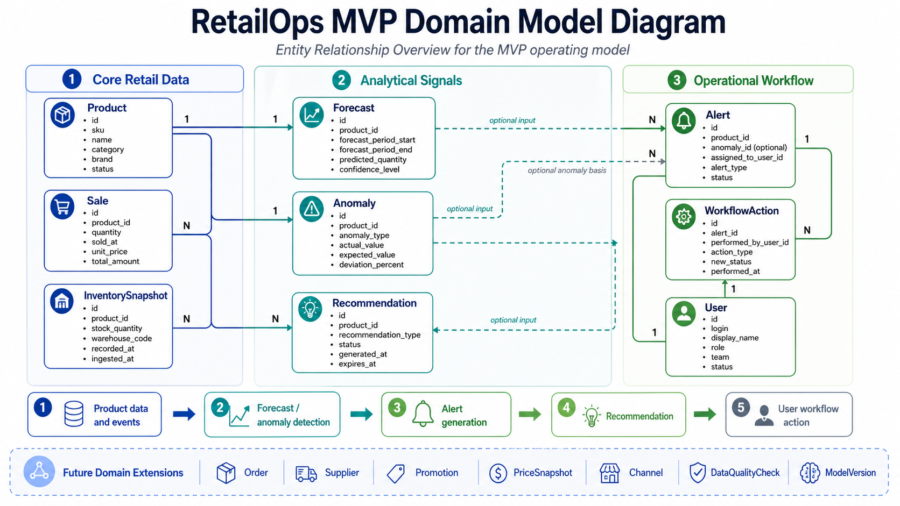

# RetailOps Domain Model

## 1. Purpose

This document defines the initial MVP domain model for the RetailOps Cloud-Native AI Platform.

The goal of the model is to describe the core business entities required to support the first operational RetailOps flow:

```text
Product data + sales + inventory signals
        -> forecast / anomaly
        -> alert
        -> recommendation
        -> workflow action
        -> user decision
```

This is not a complete enterprise retail data model. It is an intentionally limited MVP model that provides enough structure for the first API, database, seed data, tests, and dashboard scenarios.

---

## 2. MVP Domain Scope

The MVP domain model focuses on product-level operational decision support.

### Implemented MVP entities

The following entities are in scope for the first domain model:

- `Product`
- `Sale`
- `InventorySnapshot`
- `User`
- `Alert`
- `WorkflowAction`
- `Anomaly`
- `Forecast`
- `Recommendation`

### Future / context entities

The following entities are useful for the wider RetailOps platform, but they are not required for the first MVP implementation:

- `Order`
- `Promotion`
- `PriceSnapshot`
- `Supplier`
- `Channel`
- `DataQualityCheck`
- `ModelVersion`

These entities should be treated as future extensions unless a later task explicitly brings them into implementation scope.

<p align="center">
  
</p>

<p align="center">
  <em>Figure: RetailOps Domain Model Diagram — MVP Core Entities and Relationships</em>
</p>

---

## 3. Core Entity Responsibilities

| Entity | Responsibility |
|---|---|
| `Product` | Represents a product sold by the business, identified by a technical ID and a business SKU. |
| `Sale` | Represents a product-level sales record: quantity sold, price, sales date, and channel context. |
| `InventorySnapshot` | Represents the stock level of a product at a specific measurement time. |
| `User` | Represents a person or system actor using RetailOps and participating in alert/recommendation workflows. |
| `Alert` | Represents an operational item that requires attention, ownership, and status tracking. |
| `WorkflowAction` | Represents an auditable user action performed on an alert or workflow item. |
| `Anomaly` | Represents an unusual data signal, such as a sales spike, sales drop, stale inventory, or pricing issue. |
| `Forecast` | Represents a predicted demand or sales quantity for a product and forecast period. |
| `Recommendation` | Represents a suggested business action generated from a forecast, anomaly, alert, or simple business rule. |

---

## 4. MVP Entity Fields

The fields below describe the initial domain shape. They are not yet a final database schema.

### 4.1 Product

`Product` is the central business object of the MVP model.

Recommended fields:

| Field | Purpose |
|---|---|
| `id` | Technical identifier. |
| `sku` | Business product identifier. |
| `name` | Human-readable product name. |
| `category` | Product grouping for dashboard and analytics. |
| `brand` | Commercial context. |
| `status` | Product lifecycle status, for example `active`, `inactive`, `discontinued`. |
| `created_at` | Record creation timestamp. |
| `updated_at` | Record update timestamp. |

Design note:

`Product` should not store lists of related entity IDs such as `sale_ids` or `alert_ids`. Related records should reference the product through `product_id`.

<!-- Opcjonalnie: description, unit_cost, currency, supplier_id, category_id -->

---

### 4.2 Sale

`Sale` represents a product-level sales record. In the MVP, it can be treated as a single sales line for one product.

Recommended fields:

| Field | Purpose |
|---|---|
| `id` | Technical identifier. |
| `product_id` | Product that was sold. |
| `quantity` | Number of units sold. |
| `sold_at` | Date and time of sale. |
| `unit_price` | Unit price at the time of sale. |
| `total_amount` | Total sales value. Usually `quantity * unit_price`. |
| `currency` | Currency, for example `PLN`. |
| `channel` | Sales channel, for example `online`, `store`, `marketplace`. In the MVP, this can be a field rather than a separate entity. |
| `created_at` | Timestamp when the record was created in RetailOps. |

Basic data quality expectations:

- `quantity > 0`
- `unit_price >= 0`
- `total_amount >= 0`
- `currency` is one of the following: PLN, EUR, USD
- `product_id` must reference an existing product
- `sold_at` must not be empty

<!-- Opcjonalnie: order_id, promotion_id, store_id, customer_segment, discount_amount, tax_amount -->

---

### 4.3 InventorySnapshot

`InventorySnapshot` represents the stock level of a product at a specific point in time.

Recommended fields:

| Field | Purpose |
|---|---|
| `id` | Technical identifier. |
| `product_id` | Product whose stock was measured. |
| `stock_quantity` | Quantity available in stock. |
| `unit_of_measure` | Unit of measure, for example `pcs`, `kg`, `l`. |
| `warehouse_code` | Warehouse/location identifier. In the MVP, this can be a simple code rather than a separate `Warehouse` entity. |
| `recorded_at` | When the stock was measured in the source system. |
| `ingested_at` | When the record was ingested into RetailOps. |
| `created_at` | When the record was stored in RetailOps. |

Design note:

`recorded_at` and `ingested_at` are different. A user may open the dashboard now, but the inventory data may have been measured several hours earlier. This difference allows future freshness checks and stale inventory alerts.

Basic data quality expectations:

- `stock_quantity >= 0`
- `recorded_at <= ingested_at`
- `product_id` must reference an existing product

<!-- Opcjonalnie: reserved_quantity, available_quantity, damaged_quantity, reorder_point, source_system, quality_status -->

---

### 4.4 User

`User` represents a person or system actor that can own alerts and perform workflow actions.

Recommended fields:

| Field | Purpose |
|---|---|
| `id` | Technical identifier. |
| `login` or `email` | User login or business identifier. |
| `display_name` | Human-readable user name. |
| `role` | Business role, for example `inventory_planner`, `category_manager`, `analyst`, `admin`. |
| `team` | Optional team or department context. |
| `status` | User status, for example `active`, `inactive`. |
| `created_at` | Record creation timestamp. |
| `updated_at` | Record update timestamp. |

Security note:

The MVP domain model does not implement full authentication. If password-based authentication is introduced later, passwords must not be stored in plain text or encrypted form. They should be stored only as secure password hashes, for example using a dedicated authentication component.

<!-- W dalszej kolejności: RBAC / security design / relacje organizacyjne (manager_id) -->

---

### 4.5 Alert

`Alert` represents an operational warning or work item that requires action.

Recommended fields:

| Field | Purpose |
|---|---|
| `id` | Technical identifier. |
| `product_id` | Product affected by the alert. |
| `anomaly_id` | Optional anomaly that generated or influenced the alert. |
| `assigned_to_user_id` | User responsible for reviewing or resolving the alert. |
| `alert_type` | Type of alert, for example `stockout_risk`, `overstock_risk`, `sales_drop`, `stale_inventory`. |
| `severity` | Business severity, for example `low`, `medium`, `high`, `critical`. |
| `status` | Workflow status, for example `open`, `acknowledged`, `in_progress`, `resolved`, `dismissed`. |
| `title` | Short human-readable alert summary. |
| `recommended_action` | Suggested next step for the user. |
| `created_at` | When the alert was created. |
| `updated_at` | When the alert was last updated. |

Design note:

An alert is not the same as an anomaly. An anomaly is a detected signal in the data. An alert is an operational object that can be assigned, tracked, and resolved.

---

### 4.6 WorkflowAction

`WorkflowAction` represents an auditable action performed by a user on an alert.

Recommended fields:

| Field | Purpose |
|---|---|
| `id` | Technical identifier. |
| `alert_id` | Alert affected by the action. |
| `performed_by_user_id` | User who performed the action. |
| `action_type` | Type of action, for example `acknowledge`, `assign`, `escalate`, `dismiss`, `resolve`, `reopen`, `comment`. |
| `reason` or `comment` | Human-readable explanation or decision reason. |
| `previous_status` | Alert status before the action. |
| `new_status` | Alert status after the action. |
| `performed_at` | When the action was performed. |

Design note:

For the MVP, `WorkflowAction` is linked directly to `Alert`. A more flexible future model could use `target_type` and `target_id` to allow actions on alerts, recommendations, orders, or data quality issues.

---

### 4.7 Anomaly

`Anomaly` represents an unusual signal detected in business or operational data.

Recommended fields:

| Field | Purpose |
|---|---|
| `id` | Technical identifier. |
| `product_id` | Product affected by the anomaly. |
| `anomaly_type` | Type of anomaly, for example `sales_drop`, `sales_spike`, `stale_inventory`, `pricing_issue`. |
| `metric_name` | Metric where the anomaly was detected, for example `daily_sales_qty`. |
| `actual_value` | Observed value. |
| `expected_value` | Baseline or expected value. |
| `deviation_percent` | Difference between actual and expected value. |
| `impact_value` | Estimated business impact. |
| `impact_unit` | Impact unit, for example `PLN`, `units`, `percent`. |
| `severity` | Business severity. |
| `period_start` | Beginning of the affected period. |
| `period_end` | End of the affected period. |
| `detected_at` | When the anomaly was detected. |

Design note:

The anomaly should explain what was unusual. Workflow status belongs to `Alert`, not to `Anomaly`.

---

### 4.8 Forecast

`Forecast` represents a predicted sales or demand quantity for a product and forecast period.

Recommended fields:

| Field | Purpose |
|---|---|
| `id` | Technical identifier. |
| `product_id` | Product being forecasted. |
| `forecast_period_start` | Start of the forecast period. |
| `forecast_period_end` | End of the forecast period. |
| `predicted_quantity` | Forecasted demand or sales quantity. |
| `unit_of_measure` | Unit of measure, for example `pcs`. |
| `generated_at` | When the forecast was generated. |
| `method` | Forecasting method, for example `moving_average`, `naive_baseline`, `seeded_demo`. |
| `status` | Forecast status, for example `generated`, `evaluated`, `deprecated`. |
| `confidence_level` | Optional confidence value. |

Design note:

Forecast approval should not be mixed with forecast generation. Business approval or rejection belongs to `Recommendation` and `WorkflowAction`.

---

### 4.9 Recommendation

`Recommendation` represents a suggested business action generated from analytical or rule-based signals.

Recommended fields:

| Field | Purpose |
|---|---|
| `id` | Technical identifier. |
| `product_id` | Product affected by the recommendation. |
| `forecast_id` | Optional forecast that supports the recommendation. |
| `anomaly_id` | Optional anomaly that supports the recommendation. |
| `alert_id` | Optional alert connected to the recommendation. |
| `recommendation_type` | Type of recommendation, for example `replenish_stock`, `review_price`, `investigate_sales_drop`. |
| `recommended_action` | Concrete action suggested to the user. |
| `rationale` | Explanation of why the system recommends this action. |
| `status` | Recommendation status, for example `proposed`, `accepted`, `rejected`, `expired`, `implemented`. |
| `generated_at` | When the recommendation was generated. |
| `expires_at` | Optional expiration timestamp. |

Design note:

A recommendation does not need to reference both a forecast and an anomaly. It may be based on one signal, multiple signals, an alert, or a simple MVP rule.

---

## 5. MVP Entity Relationships

The MVP model uses the following core relationships:

```text
Product 1:N Sale
Product 1:N InventorySnapshot
Product 1:N Forecast
Product 1:N Anomaly
Product 1:N Alert
Product 1:N Recommendation

User 1:N Alert
User 1:N WorkflowAction

Alert 1:N WorkflowAction

Anomaly 0..1:1 Alert
Forecast 0..1:N Recommendation
Anomaly 0..1:N Recommendation
Alert 0..1:N Recommendation
```

### Relationship interpretation

- One product can have many sales records.
- One product can have many inventory snapshots over time.
- One product can have many forecasts.
- One product can have many anomalies.
- One product can have many alerts.
- One product can have many recommendations.
- One user can own many alerts.
- One user can perform many workflow actions.
- One alert can have many workflow actions.
- An anomaly may generate an alert, but not every anomaly must create an alert.
- A recommendation may be based on a forecast, anomaly, alert, or simple business rule.

---

## 6. MVP Business Scenarios Supported

The scenarios below are not intended to represent the full enterprise retail scope. They define the minimum business flows that the MVP domain model should support, while leaving room for future extensions such as pricing, promotions, suppliers, channels and MLOps governance.

### 6.1 Stockout risk

```text
Product + InventorySnapshot + Forecast
        -> Alert(stockout_risk)
        -> Recommendation(replenish_stock)
        -> WorkflowAction(resolve / dismiss / escalate)
```

This scenario supports inventory planning and operational risk review.

### 6.2 Overstock risk

```text
Product + InventorySnapshot + Sale
        -> Alert(overstock_risk)
        -> Recommendation(review_stock)
        -> WorkflowAction(resolve / dismiss / escalate)
```

This scenario supports inventory planning and operational risk review.

### 6.3 Sales drop anomaly

```text
Product + Sale
        -> Anomaly(sales_drop)
        -> Alert(sales_drop)
        -> WorkflowAction(acknowledge / investigate / resolve)
```

This scenario supports anomaly investigation and commercial review.

### 6.4 Stale inventory data

```text
InventorySnapshot.recorded_at is too old
        -> Alert(stale_inventory)
        -> Recommendation(refresh_inventory_data)
        -> WorkflowAction(resolve)
```

This scenario supports data freshness and trust in operational dashboards.

### 6.5 Rejected recommendation

```text
Recommendation(status = proposed)
        -> User reviews context
        -> WorkflowAction(action_type = reject, reason = "False positive")
        -> Recommendation(status = rejected)
```

This scenario supports human feedback and future tuning of rules or models.

<!-- W dalszej kolejności: Sales spike caused by promotion / Pricing anomaly / Missing forecast / Order / fulfillment exception -->

---

## 7. Future Domain Extensions

The following entities are intentionally out of scope for the first MVP model but should be considered in later maturity stages.

| Entity | Future purpose |
|---|---|
| `Order` | Represents customer or system orders, useful for fulfillment and order lifecycle modeling. |
| `Promotion` | Represents campaigns and discounts that explain demand changes or sales spikes. |
| `PriceSnapshot` | Represents price history and supports pricing anomaly analysis. |
| `Supplier` | Represents vendors and supports replenishment, lead time, and supply chain risk. |
| `Channel` | Represents sales channels as a separate managed dimension. In MVP, channel can remain a field on `Sale`. |
| `DataQualityCheck` | Represents freshness, completeness, validity, and consistency checks for data trust. |
| `ModelVersion` | Represents analytical or ML model versions used for forecasts, anomalies, and recommendations. |

---

## 8. Design Decisions

### 8.1 Domain model first

The model is designed from business concepts first, before creating database tables or migrations.

Rationale:

- avoids creating random tables without business meaning,
- keeps the MVP aligned with RetailOps workflows,
- makes future API and seed data easier to design,
- improves testability.

### 8.2 Technical ID plus business SKU

`Product` should use both:

- `id` as the technical identifier,
- `sku` as the business identifier.

Rationale:

- technical IDs are stable for internal references,
- SKU remains meaningful for users and business data,
- this allows future integration with external systems.

### 8.3 Inventory as snapshot

Inventory is modeled as `InventorySnapshot`, not only as current stock.

Rationale:

- supports historical stock visibility,
- enables stale data detection,
- makes inventory freshness explicit,
- prepares the model for time-based analytics.

### 8.4 Alert separate from anomaly

`Anomaly` and `Alert` are separate concepts.

Rationale:

- anomaly explains what is unusual in data,
- alert represents an operational work item,
- alert has owner, status, severity, and workflow history,
- not every anomaly must generate an alert.

### 8.5 Lightweight users, not full authentication

The MVP `User` entity represents workflow ownership and business role, not a full identity provider.

Rationale:

- avoids overengineering authentication too early,
- keeps the model focused on domain workflow,
- leaves room for future RBAC and security design.

---

## 9. Testing and Data Quality Considerations

The domain model should support future tests for:

- valid product references,
- positive sales quantities,
- non-negative prices and stock quantities,
- inventory freshness,
- forecast period validity,
- anomaly explanation fields,
- alert status transitions,
- workflow audit trail completeness,
- recommendation lifecycle transitions.

Example future tests:

```text
Sale.product_id must reference an existing Product
InventorySnapshot.recorded_at must not be after ingested_at
Alert.status must be one of the allowed statuses
WorkflowAction.new_status should be consistent with action_type
Forecast.forecast_period_start must be before forecast_period_end
Recommendation must contain a recommended_action and rationale
```

---

## 10. API and Database Readiness

This model prepares future API endpoints such as:

```text
GET /products
GET /products/{product_id}
GET /products/{product_id}/sales
GET /products/{product_id}/inventory-snapshots
GET /products/{product_id}/forecasts
GET /products/{product_id}/anomalies
GET /products/{product_id}/alerts
GET /alerts
GET /alerts/{alert_id}
POST /alerts/{alert_id}/actions
GET /recommendations
```

It also prepares future database work:

- PostgreSQL schema design,
- migrations,
- seed data,
- repository layer,
- service layer,
- API response models,
- integration tests.

---

## 11. Current Definition of Done for the Domain Model

This domain model is ready for the next implementation step when:

- MVP entities are clearly named,
- each entity has a clear responsibility,
- key fields are defined,
- relationships are documented,
- MVP business scenarios are supported,
- future entities are identified but not overimplemented,
- the model can be translated into Python domain models and later PostgreSQL tables.
