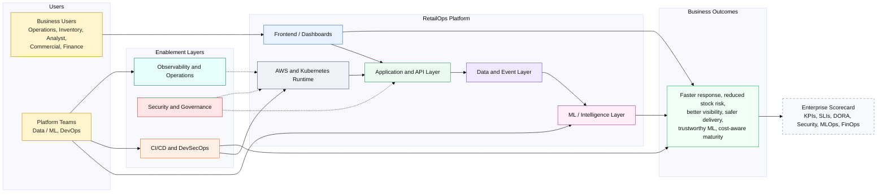

```mermaid
%%{init: {"theme": "base", "flowchart": {"curve": "basis", "nodeSpacing": 35, "rankSpacing": 45}}}%%
flowchart LR

%% Styles
classDef business fill:#fff4cc,stroke:#b58900,stroke-width:1px,color:#222;
classDef ui fill:#e8f3ff,stroke:#2b6cb0,stroke-width:1px,color:#111;
classDef app fill:#eafaf1,stroke:#2f855a,stroke-width:1px,color:#111;
classDef data fill:#f0e8ff,stroke:#6b46c1,stroke-width:1px,color:#111;
classDef ml fill:#ffeef8,stroke:#b83280,stroke-width:1px,color:#111;
classDef platform fill:#eef2f7,stroke:#4a5568,stroke-width:1px,color:#111;
classDef delivery fill:#fff0e6,stroke:#dd6b20,stroke-width:1px,color:#111;
classDef security fill:#ffe5e5,stroke:#c53030,stroke-width:1px,color:#111;
classDef obs fill:#e6fffb,stroke:#0f766e,stroke-width:1px,color:#111;
classDef gov fill:#f7fafc,stroke:#718096,stroke-dasharray: 5 5,color:#111;
classDef output fill:#f0fff4,stroke:#38a169,stroke-width:1px,color:#111;

subgraph USERS["Users"]
  direction TB
  BIZ["Business Users<br/>Operations, Inventory, Analyst,<br/>Commercial, Finance"]:::business
  TECH["Platform Teams<br/>Data / ML, DevOps"]:::business
end

subgraph PLATFORM["RetailOps Platform"]
  direction TB
  WEB["Frontend / Dashboards"]:::ui
  API["Application and API Layer"]:::app
  DATA["Data and Event Layer"]:::data
  ML["ML / Intelligence Layer"]:::ml
  RUNTIME["AWS and Kubernetes Runtime"]:::platform
end

subgraph ENABLEMENT["Enablement Layers"]
  direction TB
  DELIVERY["CI/CD and DevSecOps"]:::delivery
  SEC["Security and Governance"]:::security
  OBS["Observability and Operations"]:::obs
end

subgraph OUTCOMES["Business Outcomes"]
  direction TB
  OUT["Faster response, reduced stock risk,<br/>better visibility, safer delivery,<br/>trustworthy ML, cost-aware maturity"]:::output
end

SCORE["Enterprise Scorecard<br/>KPIs, SLIs, DORA, Security, MLOps, FinOps"]:::gov

%% Main flow
BIZ --> WEB
WEB --> API
API --> DATA
DATA --> ML
RUNTIME --> API

%% Platform teams
TECH --> ML
TECH --> DELIVERY
TECH --> OBS

%% Cross-cutting support
DELIVERY --> RUNTIME
SEC -.-> API
SEC -.-> RUNTIME
OBS -.-> RUNTIME

%% Outcomes and measurement
WEB --> OUT
ML --> OUT
DELIVERY --> OUT
OUT --> SCORE
```