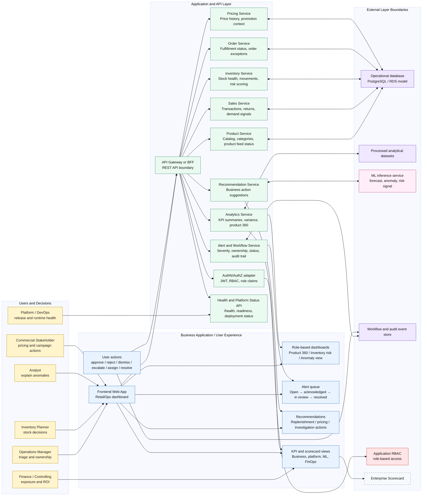

```mermaid
%%{init: {"theme": "base", "flowchart": {"curve": "basis", "nodeSpacing": 35, "rankSpacing": 45}}}%%
flowchart LR
%% =====================
%% STYLE DEFINITIONS
%% =====================
classDef business fill:#fff4cc,stroke:#b58900,stroke-width:1px,color:#222;
classDef ui fill:#e8f3ff,stroke:#2b6cb0,stroke-width:1px,color:#111;
classDef app fill:#eafaf1,stroke:#2f855a,stroke-width:1px,color:#111;
classDef data fill:#f0e8ff,stroke:#6b46c1,stroke-width:1px,color:#111;
classDef ml fill:#ffeef8,stroke:#b83280,stroke-width:1px,color:#111;
classDef platform fill:#eef2f7,stroke:#4a5568,stroke-width:1px,color:#111;
classDef delivery fill:#fff0e6,stroke:#dd6b20,stroke-width:1px,color:#111;
classDef security fill:#ffe5e5,stroke:#c53030,stroke-width:1px,color:#111;
classDef obs fill:#e6fffb,stroke:#0f766e,stroke-width:1px,color:#111;
classDef gov fill:#f7fafc,stroke:#718096,stroke-dasharray: 5 5,color:#111;
classDef output fill:#f0fff4,stroke:#38a169,stroke-width:1px,color:#111;

subgraph USERS["Users and Decisions"]
  direction TB
  OM["Operations Manager<br/>triage and ownership"]:::business
  INV["Inventory Planner<br/>stock decisions"]:::business
  ANA["Analyst<br/>explain anomalies"]:::business
  CAT["Commercial Stakeholder<br/>pricing and campaign actions"]:::business
  FIN["Finance / Controlling<br/>exposure and ROI"]:::business
  DEVOPS["Platform / DevOps<br/>release and runtime health"]:::business
end

subgraph UX["Business Application / User Experience"]
  direction TB
  WEB["Frontend Web App<br/>RetailOps dashboard"]:::ui
  DASH["Role-based dashboards<br/>Product 360 / Inventory risk / Anomaly view"]:::ui
  ALERT_UI["Alert queue<br/>Open → acknowledged → in review → resolved"]:::ui
  REC_UI["Recommendations<br/>Replenishment / pricing / investigation actions"]:::ui
  KPI_UI["KPI and scorecard views<br/>Business, platform, ML, FinOps"]:::ui
  ACTIONS["User actions<br/>approve / reject / dismiss / escalate / assign / resolve"]:::ui
end

subgraph APP["Application and API Layer"]
  direction TB
  API["API Gateway or BFF<br/>REST API boundary"]:::app
  AUTH["AuthN/AuthZ adapter<br/>JWT, RBAC, role claims"]:::app
  PRODUCT_SVC["Product Service<br/>Catalog, categories, product feed status"]:::app
  SALES_SVC["Sales Service<br/>Transactions, returns, demand signals"]:::app
  INVENTORY_SVC["Inventory Service<br/>Stock health, movements, risk scoring"]:::app
  ORDER_SVC["Order Service<br/>Fulfillment status, order exceptions"]:::app
  PRICING_SVC["Pricing Service<br/>Price history, promotion context"]:::app
  ALERT_SVC["Alert and Workflow Service<br/>Severity, ownership, status, audit trail"]:::app
  ANALYTICS_SVC["Analytics Service<br/>KPI summaries, variance, product 360"]:::app
  RECO_SVC["Recommendation Service<br/>Business action suggestions"]:::app
  HEALTH_SVC["Health and Platform Status API<br/>/health, readiness, deployment status"]:::app
end

subgraph BOUNDARIES["External Layer Boundaries"]
  ODS["Operational database<br/>PostgreSQL / RDS model"]:::data
  PROCESSED["Processed analytical datasets"]:::data
  INFERENCE["ML inference service<br/>forecast, anomaly, risk signal"]:::ml
  EVENTS_STORE["Workflow and audit event store"]:::data
  RBAC["Application RBAC<br/>role-based access"]:::security
  SCORE["Enterprise Scorecard"]:::gov
end

OM --> WEB
INV --> WEB
ANA --> WEB
CAT --> WEB
FIN --> KPI_UI
DEVOPS --> HEALTH_SVC

WEB --> DASH
WEB --> ALERT_UI
WEB --> REC_UI
WEB --> KPI_UI
WEB --> API
ACTIONS --> API

API --> AUTH
AUTH --> RBAC
API --> PRODUCT_SVC
API --> SALES_SVC
API --> INVENTORY_SVC
API --> ORDER_SVC
API --> PRICING_SVC
API --> ALERT_SVC
API --> ANALYTICS_SVC
API --> RECO_SVC
API --> HEALTH_SVC

PRODUCT_SVC <--> ODS
SALES_SVC <--> ODS
INVENTORY_SVC <--> ODS
ORDER_SVC <--> ODS
PRICING_SVC <--> ODS
ALERT_SVC <--> EVENTS_STORE
ANALYTICS_SVC <--> PROCESSED
RECO_SVC <--> INFERENCE

ALERT_SVC --> ALERT_UI
RECO_SVC --> REC_UI
ANALYTICS_SVC --> DASH
ANALYTICS_SVC --> KPI_UI
KPI_UI --> SCORE
ACTIONS --> EVENTS_STORE
```