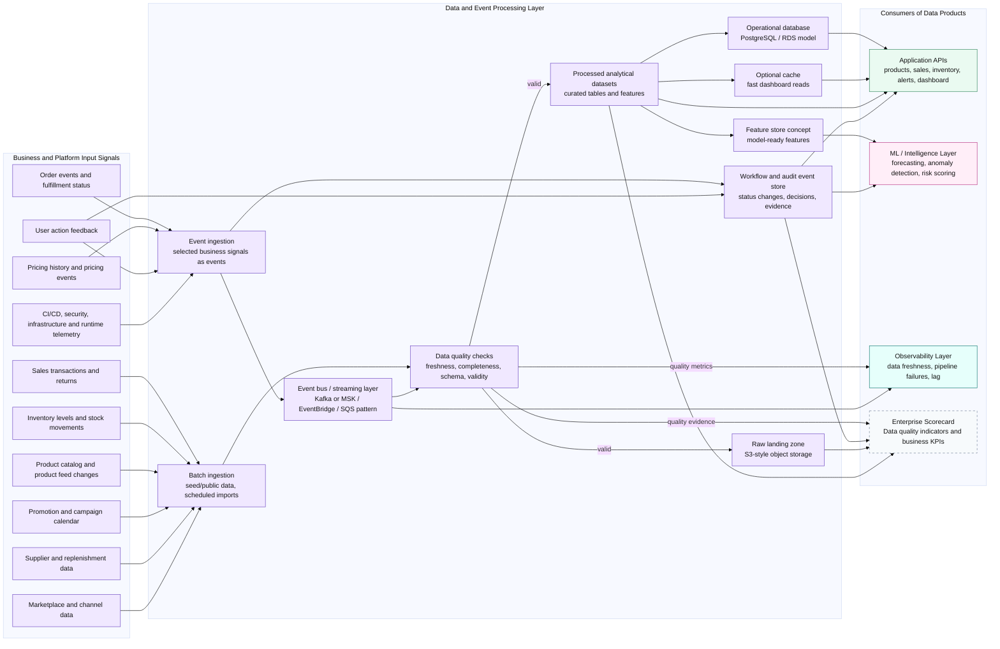

```mermaid
%%{init: {"theme": "base", "flowchart": {"curve": "basis", "nodeSpacing": 35, "rankSpacing": 45}}}%%
flowchart LR
%% =====================
%% STYLE DEFINITIONS
%% =====================
classDef business fill:#fff4cc,stroke:#b58900,stroke-width:1px,color:#222;
classDef ui fill:#e8f3ff,stroke:#2b6cb0,stroke-width:1px,color:#111;
classDef app fill:#eafaf1,stroke:#2f855a,stroke-width:1px,color:#111;
classDef data fill:#f0e8ff,stroke:#6b46c1,stroke-width:1px,color:#111;
classDef ml fill:#ffeef8,stroke:#b83280,stroke-width:1px,color:#111;
classDef platform fill:#eef2f7,stroke:#4a5568,stroke-width:1px,color:#111;
classDef delivery fill:#fff0e6,stroke:#dd6b20,stroke-width:1px,color:#111;
classDef security fill:#ffe5e5,stroke:#c53030,stroke-width:1px,color:#111;
classDef obs fill:#e6fffb,stroke:#0f766e,stroke-width:1px,color:#111;
classDef gov fill:#f7fafc,stroke:#718096,stroke-dasharray: 5 5,color:#111;
classDef output fill:#f0fff4,stroke:#38a169,stroke-width:1px,color:#111;

subgraph SOURCES["Business and Platform Input Signals"]
  direction TB
  DS_SALES["Sales transactions and returns"]:::data
  DS_INV["Inventory levels and stock movements"]:::data
  DS_ORDERS["Order events and fulfillment status"]:::data
  DS_PRODUCTS["Product catalog and product feed changes"]:::data
  DS_PRICING["Pricing history and pricing events"]:::data
  DS_PROMO["Promotion and campaign calendar"]:::data
  DS_SUPPLIER["Supplier and replenishment data"]:::data
  DS_MARKET["Marketplace and channel data"]:::data
  DS_ACTIONS["User action feedback"]:::data
  DS_TELEMETRY["CI/CD, security, infrastructure and runtime telemetry"]:::data
end

subgraph DATA_EVENT["Data and Event Processing Layer"]
  direction TB
  INGEST_BATCH["Batch ingestion<br/>seed/public data, scheduled imports"]:::data
  INGEST_EVENT["Event ingestion<br/>selected business signals as events"]:::data
  EVENT_BUS["Event bus / streaming layer<br/>Kafka or MSK / EventBridge / SQS pattern"]:::data
  DQ["Data quality checks<br/>freshness, completeness, schema, validity"]:::data
  RAW["Raw landing zone<br/>S3-style object storage"]:::data
  PROCESSED["Processed analytical datasets<br/>curated tables and features"]:::data
  ODS["Operational database<br/>PostgreSQL / RDS model"]:::data
  CACHE["Optional cache<br/>fast dashboard reads"]:::data
  FEATURE_STORE["Feature store concept<br/>model-ready features"]:::data
  EVENTS_STORE["Workflow and audit event store<br/>status changes, decisions, evidence"]:::data
end

subgraph CONSUMERS["Consumers of Data Products"]
  API["Application APIs<br/>products, sales, inventory, alerts, dashboard"]:::app
  ML["ML / Intelligence Layer<br/>forecasting, anomaly detection, risk scoring"]:::ml
  OBS["Observability Layer<br/>data freshness, pipeline failures, lag"]:::obs
  SCORE["Enterprise Scorecard<br/>Data quality indicators and business KPIs"]:::gov
end

DS_SALES --> INGEST_BATCH
DS_INV --> INGEST_BATCH
DS_PRODUCTS --> INGEST_BATCH
DS_PROMO --> INGEST_BATCH
DS_SUPPLIER --> INGEST_BATCH
DS_MARKET --> INGEST_BATCH

DS_ORDERS --> INGEST_EVENT
DS_PRICING --> INGEST_EVENT
DS_ACTIONS --> INGEST_EVENT
DS_TELEMETRY --> INGEST_EVENT

INGEST_BATCH --> DQ
INGEST_EVENT --> EVENT_BUS
EVENT_BUS --> DQ

DQ -- "valid" --> RAW
DQ -- "valid" --> PROCESSED
DQ -- "quality metrics" --> OBS
DQ -- "quality evidence" --> SCORE

PROCESSED --> ODS
PROCESSED --> CACHE
PROCESSED --> FEATURE_STORE
INGEST_EVENT --> EVENTS_STORE
DS_ACTIONS --> EVENTS_STORE

ODS --> API
CACHE --> API
PROCESSED --> API
FEATURE_STORE --> ML
EVENTS_STORE --> API
EVENTS_STORE --> ML
EVENTS_STORE --> SCORE

EVENT_BUS --> OBS
RAW --> SCORE
PROCESSED --> SCORE
```