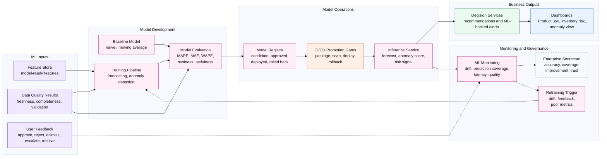

```mermaid
%%{init: {"theme": "base", "flowchart": {"curve": "linear", "nodeSpacing": 35, "rankSpacing": 45}}}%%
flowchart LR

classDef data fill:#f0e8ff,stroke:#6b46c1,stroke-width:1px,color:#111;
classDef ml fill:#ffeef8,stroke:#b83280,stroke-width:1px,color:#111;
classDef app fill:#eafaf1,stroke:#2f855a,stroke-width:1px,color:#111;
classDef ui fill:#e8f3ff,stroke:#2b6cb0,stroke-width:1px,color:#111;
classDef delivery fill:#fff0e6,stroke:#dd6b20,stroke-width:1px,color:#111;
classDef gov fill:#f7fafc,stroke:#718096,stroke-dasharray: 5 5,color:#111;

subgraph INPUTS["ML Inputs"]
  direction TB
  FEATURES["Feature Store<br/>model-ready features"]:::data
  DQ["Data Quality Results<br/>freshness, completeness, validation"]:::data
  FEEDBACK["User Feedback<br/>approve, reject, dismiss, escalate, resolve"]:::data
end

subgraph DEVELOPMENT["Model Development"]
  direction TB
  BASELINE["Baseline Model<br/>naive / moving average"]:::ml
  TRAINING["Training Pipeline<br/>forecasting, anomaly detection"]:::ml
  EVAL["Model Evaluation<br/>MAPE, MAE, WAPE,<br/>business usefulness"]:::ml
end

subgraph OPERATIONS["Model Operations"]
  direction TB
  REGISTRY["Model Registry<br/>candidate, approved,<br/>deployed, rolled back"]:::ml
  CICD["CI/CD Promotion Gates<br/>package, scan, deploy,<br/>rollback"]:::delivery
  INFERENCE["Inference Service<br/>forecast, anomaly score,<br/>risk signal"]:::ml
end

subgraph OUTPUTS["Business Outputs"]
  direction TB
  DECISIONS["Decision Services<br/>recommendations and ML-backed alerts"]:::app
  DASH["Dashboards<br/>Product 360, inventory risk,<br/>anomaly view"]:::ui
end

subgraph GOVERNANCE["Monitoring and Governance"]
  direction TB
  MONITORING["ML Monitoring<br/>drift, prediction coverage,<br/>latency, quality"]:::ml
  SCORE["Enterprise Scorecard<br/>accuracy, coverage,<br/>improvement, trust"]:::gov
  RETRAIN["Retraining Trigger<br/>drift, feedback,<br/>poor metrics"]:::ml
end

FEATURES --> TRAINING
DQ --> TRAINING
DQ --> EVAL

BASELINE --> EVAL
TRAINING --> EVAL
EVAL --> REGISTRY

REGISTRY --> CICD
CICD --> INFERENCE

INFERENCE --> DECISIONS
DECISIONS --> DASH

INFERENCE --> MONITORING
FEEDBACK -.-> MONITORING
MONITORING --> SCORE
MONITORING -.-> RETRAIN
RETRAIN -.-> TRAINING
```