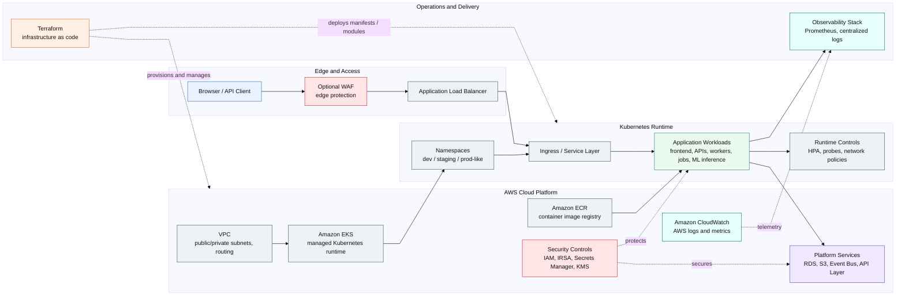

```mermaid
%%{init: {"theme": "base", "flowchart": {"curve": "linear", "nodeSpacing": 35, "rankSpacing": 45}}}%%
flowchart LR

classDef ui fill:#e8f3ff,stroke:#2b6cb0,stroke-width:1px,color:#111;
classDef app fill:#eafaf1,stroke:#2f855a,stroke-width:1px,color:#111;
classDef data fill:#f0e8ff,stroke:#6b46c1,stroke-width:1px,color:#111;
classDef platform fill:#eef2f7,stroke:#4a5568,stroke-width:1px,color:#111;
classDef delivery fill:#fff0e6,stroke:#dd6b20,stroke-width:1px,color:#111;
classDef security fill:#ffe5e5,stroke:#c53030,stroke-width:1px,color:#111;
classDef obs fill:#e6fffb,stroke:#0f766e,stroke-width:1px,color:#111;

subgraph EDGE["Edge and Access"]
  USER["Browser / API Client"]:::ui
  WAF["Optional WAF<br/>edge protection"]:::security
  ALB["Application Load Balancer"]:::platform
end

subgraph AWS["AWS Cloud Platform"]
  VPC["VPC<br/>public/private subnets, routing"]:::platform
  EKS["Amazon EKS<br/>managed Kubernetes runtime"]:::platform
  ECR["Amazon ECR<br/>container image registry"]:::platform
  PLATFORM_SERVICES["Platform Services<br/>RDS, S3, Event Bus, API Layer"]:::data
  SECURITY["Security Controls<br/>IAM, IRSA, Secrets Manager, KMS"]:::security
  CW["Amazon CloudWatch<br/>AWS logs and metrics"]:::obs
end

subgraph K8S["Kubernetes Runtime"]
  INGRESS["Ingress / Service Layer"]:::platform
  NAMESPACES["Namespaces<br/>dev / staging / prod-like"]:::platform
  WORKLOADS["Application Workloads<br/>frontend, APIs, workers, jobs, ML inference"]:::app
  CONTROLS["Runtime Controls<br/>HPA, probes, network policies"]:::platform
end

subgraph OPERATIONS["Operations and Delivery"]
  OBS_STACK["Observability Stack<br/>Prometheus, centralized logs"]:::obs
  TF["Terraform<br/>infrastructure as code"]:::delivery
end

USER --> WAF --> ALB
ALB --> INGRESS
VPC --> EKS
EKS --> NAMESPACES --> INGRESS --> WORKLOADS

ECR --> WORKLOADS
WORKLOADS --> PLATFORM_SERVICES
WORKLOADS --> OBS_STACK
WORKLOADS --> CONTROLS

SECURITY -. protects .-> WORKLOADS
SECURITY -. secures .-> PLATFORM_SERVICES
CW -. telemetry .-> OBS_STACK

TF -. provisions and manages .-> AWS
TF -. deploys manifests / modules .-> K8S
```