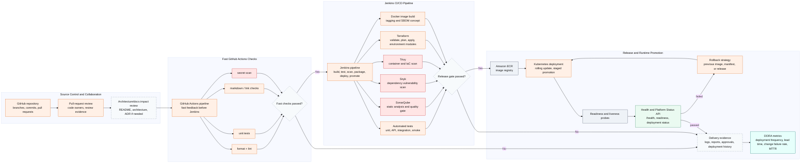

```mermaid
%%{init: {"theme": "base", "flowchart": {"curve": "basis", "nodeSpacing": 35, "rankSpacing": 45}}}%%
flowchart LR
%% =====================
%% STYLE DEFINITIONS
%% =====================
classDef business fill:#fff4cc,stroke:#b58900,stroke-width:1px,color:#222;
classDef ui fill:#e8f3ff,stroke:#2b6cb0,stroke-width:1px,color:#111;
classDef app fill:#eafaf1,stroke:#2f855a,stroke-width:1px,color:#111;
classDef data fill:#f0e8ff,stroke:#6b46c1,stroke-width:1px,color:#111;
classDef ml fill:#ffeef8,stroke:#b83280,stroke-width:1px,color:#111;
classDef platform fill:#eef2f7,stroke:#4a5568,stroke-width:1px,color:#111;
classDef delivery fill:#fff0e6,stroke:#dd6b20,stroke-width:1px,color:#111;
classDef security fill:#ffe5e5,stroke:#c53030,stroke-width:1px,color:#111;
classDef obs fill:#e6fffb,stroke:#0f766e,stroke-width:1px,color:#111;
classDef gov fill:#f7fafc,stroke:#718096,stroke-dasharray: 5 5,color:#111;
classDef output fill:#f0fff4,stroke:#38a169,stroke-width:1px,color:#111;

subgraph SOURCE["Source Control and Collaboration"]
  GH["GitHub repository<br/>branches, commits, pull requests"]:::delivery
  PR["Pull request review<br/>code owners, review evidence"]:::delivery
  ARCH_REVIEW["Architecture/docs impact review<br/>README, architecture, ADR if needed"]:::gov
end

subgraph FAST["Fast GitHub Actions Checks"]
  GHA["GitHub Actions pipeline<br/>fast feedback before Jenkins"]:::delivery
  LINT["format + lint"]:::delivery
  UNIT["unit tests"]:::delivery
  DOCS["markdown / link checks"]:::delivery
  SECRET["secret scan"]:::security
  FAST_GATE{"Fast checks passed?"}:::gov
end

subgraph JENKINS_PIPELINE["Jenkins CI/CD Pipeline"]
  JENKINS["Jenkins pipeline<br/>build, test, scan, package, deploy, promote"]:::delivery
  TESTS["Automated tests<br/>unit, API, integration, smoke"]:::delivery
  SONAR["SonarQube<br/>static analysis and quality gate"]:::security
  SNYK["Snyk<br/>dependency vulnerability scan"]:::security
  TRIVY["Trivy<br/>container and IaC scan"]:::security
  TF["Terraform<br/>validate, plan, apply, environment modules"]:::delivery
  DOCKER["Docker image build<br/>tagging and SBOM concept"]:::delivery
  GATE{"Release gate passed?"}:::gov
end

subgraph DEPLOYMENT["Release and Runtime Promotion"]
  ECR["Amazon ECR<br/>image registry"]:::platform
  DEPLOY["Kubernetes deployment<br/>rolling update, staged promotion"]:::delivery
  PROBES["Readiness and liveness probes"]:::platform
  HEALTH["Health and Platform Status API<br/>/health, readiness, deployment status"]:::app
  ROLLBACK["Rollback strategy<br/>previous image, manifest, or release"]:::delivery
  EVIDENCE["Delivery evidence<br/>logs, reports, approvals, deployment history"]:::gov
  DORA["DORA metrics<br/>deployment frequency, lead time, change failure rate, MTTR"]:::obs
end

GH --> PR
PR --> ARCH_REVIEW
ARCH_REVIEW --> GHA

GHA --> LINT
GHA --> UNIT
GHA --> DOCS
GHA --> SECRET

LINT --> FAST_GATE
UNIT --> FAST_GATE
DOCS --> FAST_GATE
SECRET --> FAST_GATE

FAST_GATE -- "No" --> EVIDENCE
FAST_GATE -- "Yes" --> JENKINS

JENKINS --> TESTS
JENKINS --> SONAR
JENKINS --> SNYK
JENKINS --> TRIVY
JENKINS --> TF
JENKINS --> DOCKER

TESTS --> GATE
SONAR --> GATE
SNYK --> GATE
TRIVY --> GATE
TF --> GATE
DOCKER --> GATE

GATE -- "No" --> EVIDENCE
GATE -- "Yes" --> ECR
ECR --> DEPLOY
DEPLOY --> PROBES
PROBES --> HEALTH
HEALTH -- "failed" --> ROLLBACK
ROLLBACK --> DEPLOY
HEALTH -- "passed" --> EVIDENCE
EVIDENCE --> DORA
```