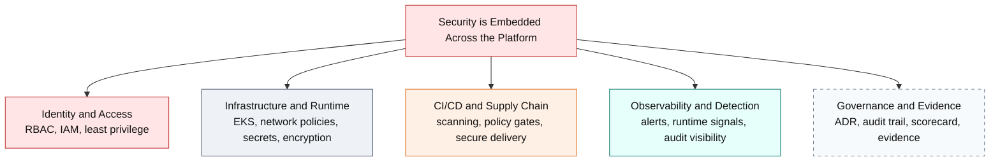

```mermaid
flowchart TB

classDef security fill:#ffe5e5,stroke:#c53030,stroke-width:1px,color:#111;
classDef platform fill:#eef2f7,stroke:#4a5568,stroke-width:1px,color:#111;
classDef delivery fill:#fff0e6,stroke:#dd6b20,stroke-width:1px,color:#111;
classDef obs fill:#e6fffb,stroke:#0f766e,stroke-width:1px,color:#111;
classDef gov fill:#f7fafc,stroke:#718096,stroke-dasharray: 5 5,color:#111;

SEC["Security is Embedded Across the Platform"]:::security

ACCESS["Identity and Access<br/>RBAC, IAM, least privilege"]:::security
INFRA["Infrastructure and Runtime<br/>EKS, network policies, secrets, encryption"]:::platform
CICD["CI/CD and Supply Chain<br/>scanning, policy gates, secure delivery"]:::delivery
OBS["Observability and Detection<br/>alerts, runtime signals, audit visibility"]:::obs
GOV["Governance and Evidence<br/>ADR, audit trail, scorecard, evidence"]:::gov

SEC --> ACCESS
SEC --> INFRA
SEC --> CICD
SEC --> OBS
SEC --> GOV
```