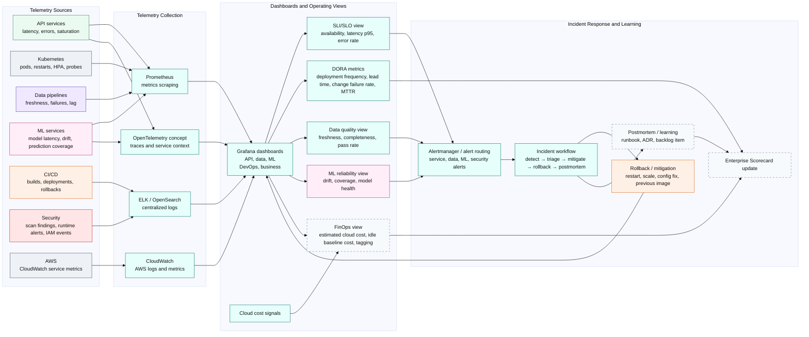

```mermaid
%%{init: {"theme": "base", "flowchart": {"curve": "basis", "nodeSpacing": 35, "rankSpacing": 45}}}%%
flowchart LR
%% =====================
%% STYLE DEFINITIONS
%% =====================
classDef business fill:#fff4cc,stroke:#b58900,stroke-width:1px,color:#222;
classDef ui fill:#e8f3ff,stroke:#2b6cb0,stroke-width:1px,color:#111;
classDef app fill:#eafaf1,stroke:#2f855a,stroke-width:1px,color:#111;
classDef data fill:#f0e8ff,stroke:#6b46c1,stroke-width:1px,color:#111;
classDef ml fill:#ffeef8,stroke:#b83280,stroke-width:1px,color:#111;
classDef platform fill:#eef2f7,stroke:#4a5568,stroke-width:1px,color:#111;
classDef delivery fill:#fff0e6,stroke:#dd6b20,stroke-width:1px,color:#111;
classDef security fill:#ffe5e5,stroke:#c53030,stroke-width:1px,color:#111;
classDef obs fill:#e6fffb,stroke:#0f766e,stroke-width:1px,color:#111;
classDef gov fill:#f7fafc,stroke:#718096,stroke-dasharray: 5 5,color:#111;
classDef output fill:#f0fff4,stroke:#38a169,stroke-width:1px,color:#111;

subgraph SIGNALS["Telemetry Sources"]
  API["API services<br/>latency, errors, saturation"]:::app
  K8S["Kubernetes<br/>pods, restarts, HPA, probes"]:::platform
  DATA["Data pipelines<br/>freshness, failures, lag"]:::data
  ML["ML services<br/>model latency, drift, prediction coverage"]:::ml
  CICD["CI/CD<br/>builds, deployments, rollbacks"]:::delivery
  SEC["Security<br/>scan findings, runtime alerts, IAM events"]:::security
  AWS["AWS<br/>CloudWatch service metrics"]:::platform
end

subgraph COLLECTION["Telemetry Collection"]
  PROM["Prometheus<br/>metrics scraping"]:::obs
  LOGS["ELK / OpenSearch<br/>centralized logs"]:::obs
  OTEL["OpenTelemetry concept<br/>traces and service context"]:::obs
  CW["CloudWatch<br/>AWS logs and metrics"]:::obs
end

subgraph VIEWS["Dashboards and Operating Views"]
  GRAFANA["Grafana dashboards<br/>API, data, ML</br>DevOps, business"]:::obs
  COST["Cloud cost signals"]:::obs
  SLO["SLI/SLO view<br/>availability, latency p95, error rate"]:::obs
  DORA["DORA metrics<br/>deployment frequency, lead time, change failure rate, MTTR"]:::obs
  DATA_QUALITY["Data quality view<br/>freshness, completeness, pass rate"]:::obs
  ML_VIEW["ML reliability view<br/>drift, coverage, model health"]:::ml
  FINOPS["FinOps view<br/>estimated cloud cost, idle baseline cost, tagging"]:::gov
end

subgraph INCIDENTS["Incident Response and Learning"]
  ALERTS["Alertmanager / alert routing<br/>service, data, ML, security alerts"]:::obs
  INCIDENT["Incident workflow<br/>detect → triage → mitigate → rollback → postmortem"]:::obs
  ROLLBACK["Rollback / mitigation<br/>restart, scale, config fix, previous image"]:::delivery
  POSTMORTEM["Postmortem / learning<br/>runbook, ADR, backlog item"]:::gov
  SCORE["Enterprise Scorecard update"]:::gov
end

API --> PROM
K8S --> PROM
DATA --> PROM
ML --> PROM
CICD --> LOGS
SEC --> LOGS
AWS --> CW
API --> OTEL
ML --> OTEL

PROM --> GRAFANA
LOGS --> GRAFANA
OTEL --> GRAFANA
CW --> GRAFANA

GRAFANA --> SLO
GRAFANA --> DORA
GRAFANA --> DATA_QUALITY
GRAFANA --> ML_VIEW
GRAFANA --> FINOPS
COST --> FINOPS

SLO --> ALERTS
DATA_QUALITY --> ALERTS
ML_VIEW --> ALERTS
ALERTS --> INCIDENT
INCIDENT --> ROLLBACK
ROLLBACK --> GRAFANA
INCIDENT --> POSTMORTEM
POSTMORTEM --> SCORE
DORA --> SCORE
FINOPS --> SCORE
```