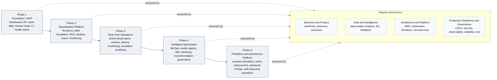

```mermaid
flowchart LR
  %% Platform Maturity Roadmap for RetailOps AI Platform

  P1["Phase 1<br/>Foundation / MVP<br/>Dashboard, API, seed data, Docker, basic CI, health check"] --> P2["Phase 2<br/>Standardized Platform<br/>Terraform, AWS foundation, EKS, Jenkins, scans, monitoring"]
  P2 --> P3["Phase 3<br/>Real-Time Operations<br/>Event-driven alerts, workers, latency monitoring, escalation workflows"]
  P3 --> P4["Phase 4<br/>Intelligent Optimization<br/>MLOps, model registry, drift, retraining, recommendation governance"]
  P4 --> P5["Phase 5<br/>Predictive and Autonomous Platform<br/>scenario simulation, policy enforcement, advanced FinOps, self-improving operations"]

  subgraph DIMENSIONS["Maturity Dimensions"]
    BP["Business and Product<br/>workflows, decisions, outcomes"]
    DI["Data and Intelligence<br/>data quality, analytics, ML, feedback"]
    AP["Architecture and Platform<br/>AWS, Kubernetes, Terraform, microservices"]
    PG["Production Readiness and Governance<br/>CI/CD, security, observability, reliability, cost"]
  end

  P1 -. assessed by .-> DIMENSIONS
  P2 -. assessed by .-> DIMENSIONS
  P3 -. assessed by .-> DIMENSIONS
  P4 -. assessed by .-> DIMENSIONS
  P5 -. assessed by .-> DIMENSIONS

  classDef phase fill:#eef2f7,stroke:#4a5568,color:#111;
  classDef dim fill:#f7fafc,stroke:#718096,stroke-dasharray: 5 5,color:#111;
  class P1,P2,P3,P4,P5 phase;
  class BP,DI,AP,PG dim;
```