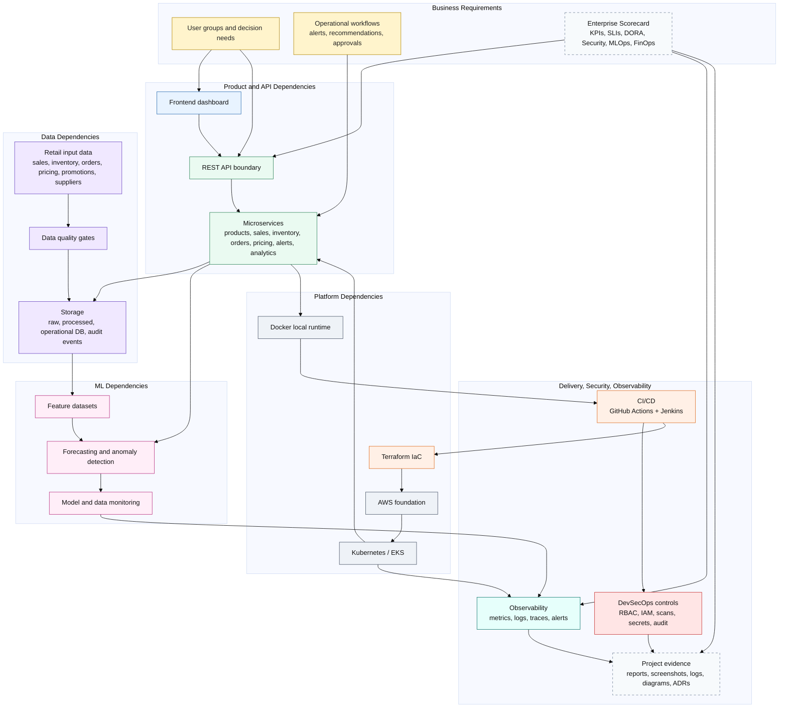

```mermaid
%%{init: {"theme": "base", "flowchart": {"curve": "basis", "nodeSpacing": 35, "rankSpacing": 45}}}%%
flowchart TB
%% =====================
%% STYLE DEFINITIONS
%% =====================
classDef business fill:#fff4cc,stroke:#b58900,stroke-width:1px,color:#222;
classDef ui fill:#e8f3ff,stroke:#2b6cb0,stroke-width:1px,color:#111;
classDef app fill:#eafaf1,stroke:#2f855a,stroke-width:1px,color:#111;
classDef data fill:#f0e8ff,stroke:#6b46c1,stroke-width:1px,color:#111;
classDef ml fill:#ffeef8,stroke:#b83280,stroke-width:1px,color:#111;
classDef platform fill:#eef2f7,stroke:#4a5568,stroke-width:1px,color:#111;
classDef delivery fill:#fff0e6,stroke:#dd6b20,stroke-width:1px,color:#111;
classDef security fill:#ffe5e5,stroke:#c53030,stroke-width:1px,color:#111;
classDef obs fill:#e6fffb,stroke:#0f766e,stroke-width:1px,color:#111;
classDef gov fill:#f7fafc,stroke:#718096,stroke-dasharray: 5 5,color:#111;
classDef output fill:#f0fff4,stroke:#38a169,stroke-width:1px,color:#111;

subgraph BUSINESS["Business Requirements"]
  USER_NEEDS["User groups and decision needs"]:::business
  WORKFLOWS["Operational workflows<br/>alerts, recommendations, approvals"]:::business
  KPIS["Enterprise Scorecard<br/>KPIs, SLIs, DORA, Security, MLOps, FinOps"]:::gov
end

subgraph PRODUCT["Product and API Dependencies"]
  UI["Frontend dashboard"]:::ui
  API["REST API boundary"]:::app
  SERVICES["Microservices<br/>products, sales, inventory, orders, pricing, alerts, analytics"]:::app
end

subgraph DATA["Data Dependencies"]
  SOURCES["Retail input data<br/>sales, inventory, orders, pricing, promotions, suppliers"]:::data
  DQ["Data quality gates"]:::data
  STORAGE["Storage<br/>raw, processed, operational DB, audit events"]:::data
end

subgraph ML["ML Dependencies"]
  FEATURES["Feature datasets"]:::ml
  MODELS["Forecasting and anomaly detection"]:::ml
  MONITORING["Model and data monitoring"]:::ml
end

subgraph PLATFORM["Platform Dependencies"]
  DOCKER["Docker local runtime"]:::platform
  AWS["AWS foundation"]:::platform
  K8S["Kubernetes / EKS"]:::platform
  TF["Terraform IaC"]:::delivery
end

subgraph GOVERNANCE["Delivery, Security, Observability"]
  CICD["CI/CD<br/>GitHub Actions + Jenkins"]:::delivery
  SECURITY["DevSecOps controls<br/>RBAC, IAM, scans, secrets, audit"]:::security
  OBS["Observability<br/>metrics, logs, traces, alerts"]:::obs
  EVIDENCE["Project evidence<br/>reports, screenshots, logs, diagrams, ADRs"]:::gov
end

USER_NEEDS --> UI
USER_NEEDS --> API
WORKFLOWS --> SERVICES
KPIS --> API
KPIS --> OBS
KPIS --> EVIDENCE

UI --> API
API --> SERVICES
SERVICES --> STORAGE
SERVICES --> MODELS

SOURCES --> DQ
DQ --> STORAGE
STORAGE --> FEATURES
FEATURES --> MODELS
MODELS --> MONITORING
MONITORING --> OBS

SERVICES --> DOCKER
DOCKER --> CICD
CICD --> SECURITY
SECURITY --> EVIDENCE
CICD --> TF
TF --> AWS
AWS --> K8S
K8S --> SERVICES
K8S --> OBS
OBS --> EVIDENCE
```