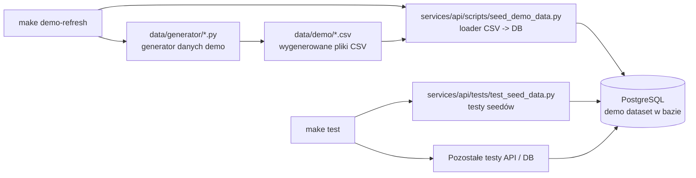

**Implementation Status:** Implemented locally. This diagram describes the working demo-data generation, seed loading, and database-backed test flow in the repository.
**Legend:** `Implemented` = working in this repository, `Partially implemented` = some code/config/evidence exists, `Target` = design direction only.

