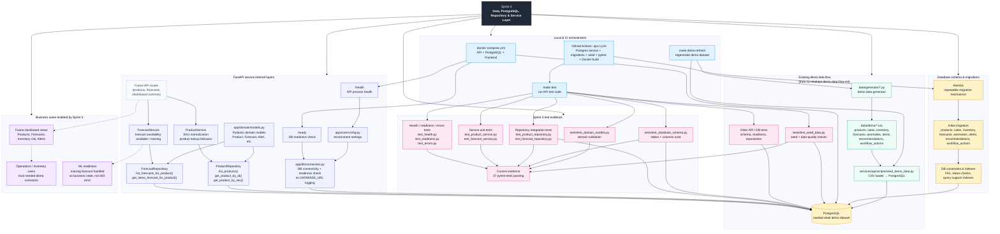

```mermaid
%%{init: {
  "theme": "base",
  "flowchart": {
    "curve": "basis",
    "nodeSpacing": 35,
    "rankSpacing": 55
  }
}}%%

flowchart TD

    %% =========================
    %% Sprint 3 Overview
    %% =========================

    S3["Sprint 3<br/><b>Data, PostgreSQL, Repository & Service Layer</b>"]

    %% =========================
    %% Local / CI orchestration
    %% =========================

    subgraph ORCH["Local & CI orchestration"]
        DC["docker-compose.yml<br/>API + PostgreSQL + Frontend"]
        MAKE_REFRESH["make demo-refresh<br/>regenerate demo dataset"]
        MAKE_TEST["make test<br/>run API test suite"]
        GHA["GitHub Actions: api-ci.yml<br/>Postgres service + migrations + seed + pytest + Docker build"]
    end

    %% =========================
    %% Existing Demo Data Flow
    %% =========================

    subgraph DATAFLOW["Existing demo data flow<br/>(from 11-retailops-demo-data-flow.md)"]
        GEN["data/generator/*.py<br/>demo data generator"]
        CSV["data/demo/*.csv<br/>products, sales, inventory,<br/>forecasts, anomalies, alerts,<br/>recommendations, workflow_actions"]
        SEED["services/api/scripts/seed_demo_data.py<br/>CSV loader → PostgreSQL"]
        DB[("PostgreSQL<br/>seeded retail demo dataset")]
        SEED_TESTS["tests/test_seed_data.py<br/>seed + data-quality checks"]
        OTHER_DB_TESTS["Other API / DB tests<br/>schema, readiness, repositories"]
    end

    %% =========================
    %% Database schema layer
    %% =========================

    subgraph SCHEMA["Database schema & migrations"]
        ALEMBIC["Alembic<br/>repeatable migration mechanism"]
        MIGRATION["Initial migration<br/>products, sales, inventory,<br/>forecasts, anomalies, alerts,<br/>recommendations, workflow_actions"]
        CONSTRAINTS["DB constraints & indexes<br/>FKs, status checks,<br/>query-support indexes"]
    end

    %% =========================
    %% API internal architecture
    %% =========================

    subgraph API["FastAPI service internal layers"]
        CONFIG["app/core/config.py<br/>environment settings"]
        CONNECTION["app/db/connection.py<br/>DB connectivity + readiness check<br/>no DATABASE_URL logging"]
        DOMAIN["app/domain/models.py<br/>Pydantic domain models<br/>Product, Forecast, Alert, etc."]

        PRODUCT_REPO["ProductRepository<br/>list_products()<br/>get_product_by_id()<br/>get_product_by_sku()"]
        FORECAST_REPO["ForecastRepository<br/>list_forecasts_for_product()<br/>get_latest_forecast_for_product()"]

        PRODUCT_SERVICE["ProductService<br/>SKU normalization<br/>product lookup behavior"]
        FORECAST_SERVICE["ForecastService<br/>forecast availability:<br/>available / missing"]

        HEALTH["/health<br/>API process health"]
        READY["/ready<br/>DB readiness check"]
        FUTURE_ROUTES["Future API routes<br/>/products, /forecasts,<br/>/dashboard-summary"]
    end

    %% =========================
    %% Tests and quality gates
    %% =========================

    subgraph TESTS["Sprint 3 test evidence"]
        DOMAIN_TESTS["tests/test_domain_models.py<br/>domain validation"]
        SCHEMA_TESTS["tests/test_database_schema.py<br/>tables + columns exist"]
        REPO_TESTS["Repository integration tests<br/>test_product_repository.py<br/>test_forecast_repository.py"]
        SERVICE_TESTS["Service unit tests<br/>test_product_service.py<br/>test_forecast_service.py"]
        HEALTH_TESTS["Health / readiness / errors tests<br/>test_health.py<br/>test_readiness.py<br/>test_errors.py"]
        RESULT["Current evidence<br/>37 pytest tests passing"]
    end

    %% =========================
    %% Business / product consumers
    %% =========================

    subgraph BUSINESS["Business value enabled by Sprint 3"]
        DASHBOARD["Future dashboard views<br/>Products, Forecasts,<br/>Inventory risk, Alerts"]
        OPS["Operations / Inventory users<br/>trust seeded demo scenarios"]
        ML_READY["ML readiness<br/>missing forecast handled<br/>as business state, not 500 error"]
    end

    %% =========================
    %% Main flows
    %% =========================

    S3 --> ORCH
    S3 --> DATAFLOW
    S3 --> SCHEMA
    S3 --> API
    S3 --> TESTS
    S3 --> BUSINESS

    %% Existing data flow preserved
    MAKE_REFRESH --> GEN
    GEN --> CSV
    MAKE_REFRESH --> SEED
    CSV --> SEED
    SEED --> DB

    %% Migration flow
    GHA --> ALEMBIC
    ALEMBIC --> MIGRATION
    MIGRATION --> CONSTRAINTS
    CONSTRAINTS --> DB

    %% Local and CI validation flow
    DC --> DB
    DC --> HEALTH
    DC --> READY

    GHA --> MAKE_TEST
    MAKE_TEST --> SEED_TESTS
    MAKE_TEST --> OTHER_DB_TESTS
    MAKE_TEST --> DOMAIN_TESTS
    MAKE_TEST --> SCHEMA_TESTS
    MAKE_TEST --> REPO_TESTS
    MAKE_TEST --> SERVICE_TESTS
    MAKE_TEST --> HEALTH_TESTS

    %% DB test connections
    SEED_TESTS --> DB
    OTHER_DB_TESTS --> DB
    SCHEMA_TESTS --> DB
    REPO_TESTS --> DB

    %% API internal dependencies
    CONFIG --> CONNECTION
    CONNECTION --> DB
    DOMAIN --> PRODUCT_REPO
    DOMAIN --> FORECAST_REPO

    PRODUCT_REPO --> DB
    FORECAST_REPO --> DB

    PRODUCT_SERVICE --> PRODUCT_REPO
    FORECAST_SERVICE --> FORECAST_REPO

    HEALTH --> CONFIG
    READY --> CONNECTION

    FUTURE_ROUTES --> PRODUCT_SERVICE
    FUTURE_ROUTES --> FORECAST_SERVICE

    %% Business consumption
    FUTURE_ROUTES -.-> DASHBOARD
    DASHBOARD -.-> OPS
    FORECAST_SERVICE -.-> ML_READY

    %% Evidence output
    DOMAIN_TESTS --> RESULT
    SCHEMA_TESTS --> RESULT
    SEED_TESTS --> RESULT
    REPO_TESTS --> RESULT
    SERVICE_TESTS --> RESULT
    HEALTH_TESTS --> RESULT

    %% =========================
    %% Styling
    %% =========================

    classDef sprint fill:#1f2937,stroke:#111827,color:#ffffff,stroke-width:2px;
    classDef orchestration fill:#e0f2fe,stroke:#0284c7,color:#0f172a;
    classDef data fill:#ecfdf5,stroke:#059669,color:#0f172a;
    classDef db fill:#fef3c7,stroke:#d97706,color:#0f172a;
    classDef api fill:#eef2ff,stroke:#4f46e5,color:#0f172a;
    classDef test fill:#fce7f3,stroke:#db2777,color:#0f172a;
    classDef business fill:#f3e8ff,stroke:#9333ea,color:#0f172a;
    classDef future fill:#f8fafc,stroke:#64748b,color:#334155,stroke-dasharray: 5 5;

    class S3 sprint;

    class DC,MAKE_REFRESH,MAKE_TEST,GHA orchestration;
    class GEN,CSV,SEED data;
    class DB db;
    class ALEMBIC,MIGRATION,CONSTRAINTS db;

    class CONFIG,CONNECTION,DOMAIN,PRODUCT_REPO,FORECAST_REPO,PRODUCT_SERVICE,FORECAST_SERVICE,HEALTH,READY api;
    class FUTURE_ROUTES future;

    class SEED_TESTS,OTHER_DB_TESTS,DOMAIN_TESTS,SCHEMA_TESTS,REPO_TESTS,SERVICE_TESTS,HEALTH_TESTS,RESULT test;
    class DASHBOARD,OPS,ML_READY business;
```