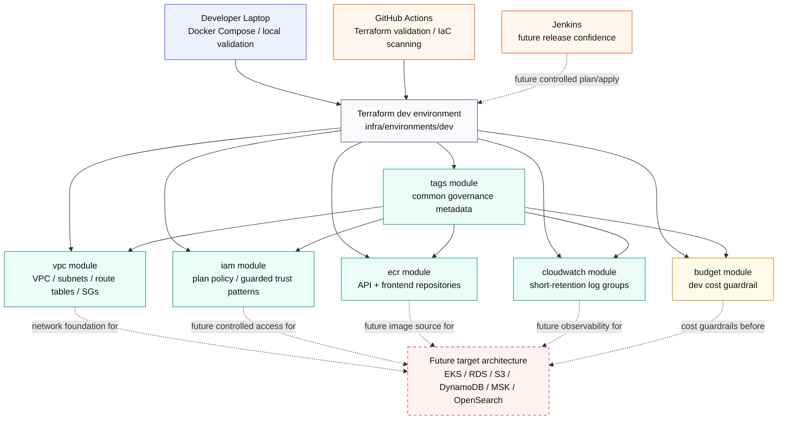

**Implementation Status:** Mixed. The Terraform AWS foundation is implemented and validated as code, but the downstream workload runtime shown as future architecture is still target scope.
**Legend:** `Implemented` = working in this repository, `Partially implemented` = some code/config/evidence exists, `Target` = design direction only.

