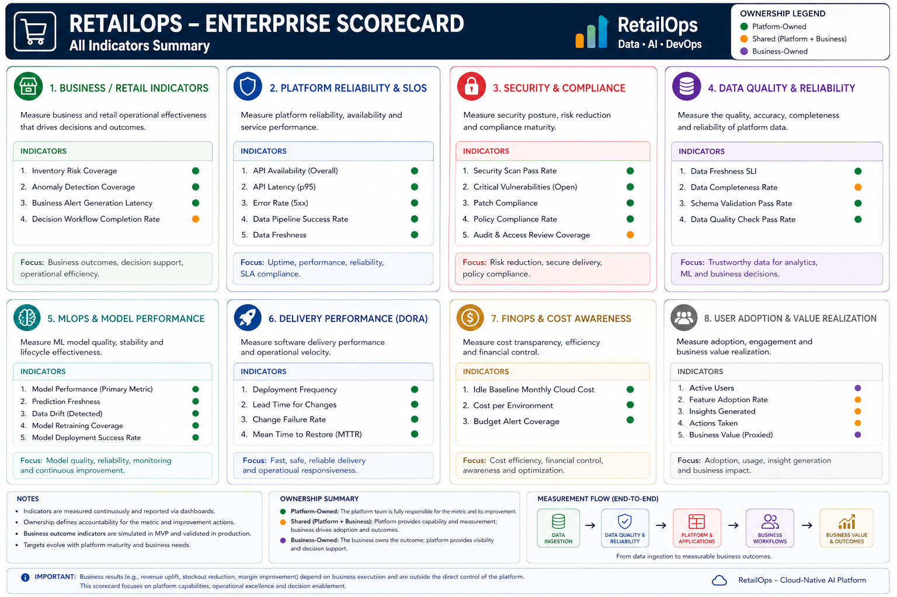

# RetailOps Enterprise Scorecard

**Project:** Cloud-Native RetailOps Platform  
**Workstream:** Business & Product / Platform Governance  
**Phase:** Phase 1 — Foundation / MVP  

---

## 1. Purpose

This document defines a compact **Enterprise Scorecard** for the RetailOps Platform.

The goal is to measure the platform from several perspectives - both KPIs (business) and SLIs (DevOps).

The scorecard is designed for a solo portfolio project. It does not assume access to a real retail company, production traffic, or business stakeholders. Instead, it uses evidence that can be produced from:

- sample or seed retail datasets,
- public datasets,
- local application runs,
- API responses,
- Docker / Docker Compose logs,
- GitHub Actions or Jenkins pipeline history,
- test reports,
- security scan reports,
- Prometheus / Grafana metrics,
- architecture and cost assumptions.

---

## 2. Measurement assumptions

Because this project is built independently, some indicators are measured directly and some are measured as controlled MVP simulations.

### 2.1. Measurement levels

| Level | Meaning | Example |
|---|---|---|
| **Measured** | Indicator can be measured from current repository, app, tests, pipeline, logs, scans, or sample data. | API latency, CI success rate, vulnerability count. |
| **Simulated** | Indicator can be calculated from seed/public data or controlled demo scenarios. | Stockout risk, overstock exposure, forecast accuracy. |
| **Target maturity** | Indicator belongs to the enterprise vision and is documented now, but requires real production usage later. | Error budget burn, cost per production workload, real business decision impact. |

### 2.2. Score status

Each indicator can be reported with a simple status:

| Status | Meaning |
|---|---|
| **Green** | Meets the current MVP target or expected threshold. |
| **Yellow** | Works, but needs improvement, more data, or stronger automation. |
| **Red** | Does not meet the target or has missing evidence. |
| **Not measured yet** | Indicator is defined, but evidence is not available yet. |

### 2.3. Target policy

Targets in this document are **portfolio assumptions**, not contractual enterprise SLAs.  
They should be treated as starting points and adjusted after a baseline is collected.

---

## 3. Scorecard overview

| Category | Number of indicators | Main purpose |
|---|---:|---|
| Business / Retail KPIs | 5 | Prove that the platform supports useful retail decisions. |
| Data Quality Indicators | 3 | Prove that dashboards, APIs, and ML outputs are based on trustworthy data. |
| API / Application SLI/SLO | 3 | Prove that user-facing services are available, fast, and stable. |
| Delivery / DORA Metrics | 4 | Prove that changes can be delivered quickly and safely. |
| Security / DevSecOps Indicators | 3 | Prove that security checks are integrated into delivery. |
| Observability / Reliability Indicators | 2 | Prove that the platform can be monitored and incidents can be detected. |
| ML / MLOps Indicators | 2 | Prove that model outputs are evaluated and operationally controlled. |
| FinOps / Cost Indicators | 2 | Prove that cloud maturity is connected with cost awareness. |
| **Total** | **24** | Balanced enterprise-style scorecard for a solo portfolio project. |


<p align="center">
  
</p>

<p align="center"><em>Figure: Enterprise Scorecard — Business and Platform Performance Indicators</em></p>


---

## 4. Business / Retail KPIs

### 4.1. Forecast Accuracy

- **Type:** Business KPI / ML KPI
- **Decision supported:** Can Inventory or Commercial users trust demand forecasts enough to support planning?
- **How to measure:** Compare predicted demand with actual historical sales from seed or public retail data.
- **Suggested metric:** WAPE or MAE.
- **MVP evidence:** Forecast evaluation report, notebook/script output, chart, or API response.
- **Suggested target:** Baseline first; later improve against naive moving average.
- **Measurement level:** Simulated / Measured on sample data.

---

### 4.2. Inventory Risk Coverage

- **Type:** Business / Retail KPI + Data Coverage KPI
- **Decision supported:** Determines whether all relevant SKUs have an assigned inventory risk status: `normal`, `stockout_risk`, `overstock_risk`, or `unknown`.
- **How to measure:** Calculate the percentage of products/SKUs for which the platform generated an inventory risk status.
- **Suggested metric:** `Inventory Risk Coverage = SKUs with risk_status / all eligible SKUs × 100%`
- **MVP evidence:** Seed dataset with products and inventory levels, `/inventory-risk` API endpoint, and a test proving that every eligible SKU receives a risk status.
- **Suggested target:** MVP: `>= 95%`; target maturity: `>= 99%`. SKUs with missing data should receive the `unknown` status instead of being excluded from the result.
- **Measurement level:** Platform-owned retail indicator, measured at SKU, product, and category level.

---

### 4.3. Anomaly Detection Coverage

- **Type:** Analytics / ML Readiness KPI
- **Decision supported:** Determines whether the platform monitors enough retail data to detect unusual sales drops, demand spikes, stock anomalies, or pricing anomalies.
- **How to measure:** Calculate the percentage of eligible data series or entities covered by an anomaly detection rule or model.
- **Suggested metric:** `Anomaly Detection Coverage = monitored entities / all eligible entities × 100%`
- **MVP evidence:** Script, notebook, or analytical report with anomaly detection results, sample `/anomalies` API endpoint, and a test dataset with labeled examples such as `sales_spike` or `sales_drop`.
- **Suggested target:** MVP: `>= 80%` for core sales time series; target maturity: `>= 95%` across sales, inventory, pricing, and campaign signals.
- **Measurement level:** Platform-owned analytics coverage indicator, measured at SKU, category, time-series, or event-type level.

---

### 4.4. Business Alert Generation Latency

- **Type:** SLI / SLO for operational decision support
- **Decision supported:** Determines whether the platform generates business alerts quickly enough for Operations, Inventory, or Commercial users to react.
- **How to measure:** Measure the time between the source event or data ingestion timestamp and the creation of the business alert.
- **Suggested metric:** `Alert Generation Latency = alert_created_at - source_event_timestamp`
- **MVP simplification:** `Alert Generation Latency = alert_created_at - data_ingested_at`
- **MVP evidence:** Pipeline or API logs, timestamps such as `data_ingested_at`, `source_event_timestamp`, and `alert_created_at`, plus a test proving that an alert is generated after stockout risk or anomaly detection.
- **Suggested target:** MVP batch mode: `p95 <= 5 min` after data ingestion; target maturity event-driven mode: `p95 <= 60 sec` for critical alerts.
- **Measurement level:** Platform-owned SLI, measured at alert, event, or pipeline-run level.

---

### 4.5. Decision Workflow Completion Rate

- **Type:** Business KPI / Workflow KPI
- **Decision supported:** Are alerts and recommendations actually closed, or do they remain open?
- **How to measure:** Count resolved or dismissed workflow items divided by all created workflow items.
- **Suggested formula:** `(resolved_alerts + dismissed_alerts) / all_alerts`.
- **MVP evidence:** Alert status dataset, workflow API response, dashboard screenshot.
- **Suggested target:** Baseline first; for demo data, most alerts should reach a final state.
- **Measurement level:** Simulated / Measured on sample data.

---

## 5. Data Quality Indicators

### 5.1. Data Freshness SLI

- **Type:** Data SLI
- **Decision supported:** Can users trust that dashboard and API results are based on recent data?
- **How to measure:** Difference between current time and `last_updated_at` / `last_refresh_timestamp`.
- **Suggested formula:** `now - last_successful_data_refresh`.
- **MVP evidence:** API response field, dashboard timestamp, data pipeline log.
- **Suggested SLO:** Key business data refreshed within the expected MVP interval.
- **Measurement level:** Measured / Simulated.

---

### 5.2. Data Completeness Rate

- **Type:** Data Quality KPI
- **Decision supported:** Are key retail records complete enough for risk scoring, dashboards, and forecasting?
- **How to measure:** Count records without missing mandatory fields divided by all records.
- **Mandatory fields example:** `sku`, `date`, `sales_qty`, `stock_qty`, `price`.
- **Suggested formula:** `complete_records / all_records`.
- **MVP evidence:** Data validation report, test output, notebook/script result.
- **Suggested target:** >= 95% for MVP sample datasets.
- **Measurement level:** Measured on sample data.

---

### 5.3. Data Quality Check Pass Rate

- **Type:** Data Quality KPI
- **Decision supported:** Did the dataset pass basic quality gates before being used by APIs or ML?
- **How to measure:** Count passed data quality checks divided by all defined checks.
- **Checks example:** no negative price, no negative stock, valid SKU, valid date, no duplicate primary keys.
- **Suggested formula:** `passed_data_quality_checks / all_data_quality_checks`.
- **MVP evidence:** Test report, validation script output, CI log.
- **Suggested target:** 100% checks passing before demo or release.
- **Measurement level:** Measured.

---

## 6. API / Application SLI/SLO

### 6.1. API Availability SLI

- **Type:** Application SLI / SLO
- **Decision supported:** Is the application available for users and automated checks?
- **How to measure:** Percentage of successful `/health` checks returning HTTP 200.
- **Suggested formula:** `successful_health_checks / all_health_checks`.
- **MVP evidence:** Smoke test logs, CI pipeline result, Prometheus metric, Docker Compose test.
- **Suggested SLO:** >= 99% in controlled local/demo environment.
- **Measurement level:** Measured.

---

### 6.2. API Latency p95

- **Type:** Application SLI / SLO
- **Decision supported:** Are API responses fast enough to support dashboard usage?
- **How to measure:** 95th percentile response time for key endpoints.
- **Key endpoints example:** `/health`, `/products`, `/inventory-risk`, `/alerts`, `/dashboard-summary`.
- **Suggested formula:** p95 of response duration.
- **MVP evidence:** Load/smoke test output, Prometheus metric, test report.
- **Suggested SLO:** p95 below an MVP threshold, for example 500 ms for simple local API endpoints.
- **Measurement level:** Measured.

---

### 6.3. API Error Rate

- **Type:** Application SLI / SLO
- **Decision supported:** Is the API stable enough to support business workflows?
- **How to measure:** Count HTTP 5xx responses divided by all API responses.
- **Suggested formula:** `5xx_responses / all_requests`.
- **MVP evidence:** API logs, test output, Prometheus metric, CI smoke test.
- **Suggested SLO:** Error rate below 1% in controlled MVP tests.
- **Measurement level:** Measured.

---

## 7. Delivery / DORA Metrics

### 7.1. Deployment Frequency

- **Type:** DORA Metric / Delivery KPI
- **DORA:** Yes
- **Decision supported:** How often can the project safely deliver changes?
- **How to measure:** Count successful deployments or successful pipeline release runs per week.
- **Suggested formula:** `successful_deployments / week`.
- **MVP evidence:** GitHub Actions history, Jenkins build history, release tags.
- **Suggested target:** Baseline first; for portfolio, consistent successful releases matter more than high frequency.
- **Measurement level:** Measured.

---

### 7.2. Lead Time for Changes

- **Type:** DORA Metric / Delivery KPI
- **DORA:** Yes
- **Decision supported:** How long does it take for a code change to become validated and releasable?
- **How to measure:** Time from commit or PR merge to successful build/test/scan/deploy pipeline.
- **Suggested formula:** `successful_pipeline_end_time - commit_or_merge_time`.
- **MVP evidence:** Git history, CI logs, Jenkins/GitHub Actions timestamps.
- **Suggested target:** Baseline first; trend should improve as pipeline becomes more automated.
- **Measurement level:** Measured.

---

### 7.3. Change Failure Rate

- **Type:** DORA Metric / Delivery KPI
- **DORA:** Yes
- **Decision supported:** How often do delivered changes fail validation or require rollback/fix?
- **How to measure:** Failed deployments or failed post-deployment validations divided by all deployments.
- **Suggested formula:** `failed_deployments_or_failed_validations / all_deployments`.
- **MVP evidence:** Pipeline history, failed smoke checks, rollback notes.
- **Suggested target:** Baseline first; should decrease as test and quality gates mature.
- **Measurement level:** Measured.

---

### 7.4. MTTR — Mean Time to Recovery

- **Type:** DORA Metric / Reliability KPI
- **DORA:** Yes
- **Decision supported:** How quickly can the platform recover after a failed release, broken service, or failed validation?
- **How to measure:** Time from detected failure to restored healthy state.
- **Suggested formula:** `recovery_time - incident_detection_time`.
- **MVP evidence:** Controlled failure scenario, broken pipeline fix, Docker service recovery, incident note.
- **Suggested target:** Baseline first; for demo incidents, recovery path should be documented and repeatable.
- **Measurement level:** Measured / Simulated.

---

## 8. Security / DevSecOps Indicators

### 8.1. Vulnerability Scan Coverage

- **Type:** Security KPI
- **Decision supported:** Are application dependencies and container images scanned before release?
- **How to measure:** Count scanned images/dependency sets divided by all release-relevant images/dependency sets.
- **Suggested formula:** `scanned_components / release_relevant_components`.
- **MVP evidence:** Trivy/Snyk reports, CI logs, security scan artifacts.
- **Suggested target:** 100% for release-relevant Docker images and dependency files.
- **Measurement level:** Measured.

---

### 8.2. Critical Vulnerability Count

- **Type:** Security KPI / Security Gate
- **Decision supported:** Should a build or release be blocked because of critical vulnerabilities?
- **How to measure:** Count critical vulnerabilities reported by Trivy, Snyk, or another scanner.
- **Suggested formula:** `count(critical_vulnerabilities)`.
- **MVP evidence:** Security scan report, pipeline quality gate output.
- **Suggested target:** 0 critical vulnerabilities for release candidate builds.
- **Measurement level:** Measured.

---

### 8.3. Security Gate Pass Rate

- **Type:** Security KPI / Delivery KPI
- **Decision supported:** Are security controls consistently passing in CI/CD?
- **How to measure:** Successful security gates divided by all security gate runs.
- **Security gates example:** dependency scan, image scan, secret scan, static analysis.
- **Suggested formula:** `passed_security_gates / all_security_gate_runs`.
- **MVP evidence:** CI logs, Jenkins stage results, GitHub Actions checks.
- **Suggested target:** 100% before release candidate promotion.
- **Measurement level:** Measured.

---

## 9. Observability / Reliability Indicators

### 9.1. Monitoring Coverage

- **Type:** Observability KPI
- **Decision supported:** Are key services observable enough to detect failures and performance problems?
- **How to measure:** Count services with health checks, logs, and basic metrics divided by all key services.
- **Suggested formula:** `observable_services / key_services`.
- **MVP evidence:** `/health` endpoints, logs, Prometheus scrape config, Grafana dashboard.
- **Suggested target:** 100% for MVP key services.
- **Measurement level:** Measured / Target maturity depending on implementation stage.

---

### 9.2. Alert Detection Validation Rate

- **Type:** Reliability KPI / Observability KPI
- **Decision supported:** Can the platform detect expected failures or unhealthy states?
- **How to measure:** Run controlled failure scenarios and count how many are detected by logs, tests, health checks, or alerts.
- **Suggested formula:** `detected_test_failures / injected_test_failures`.
- **MVP evidence:** Fault injection note, failed health check, alert log, smoke test report.
- **Suggested target:** Baseline first; critical demo failures should be detected.
- **Measurement level:** Simulated / Measured.

---

## 10. ML / MLOps Indicators

### 10.1. Model vs Baseline Improvement

- **Type:** ML KPI / Business KPI
- **Decision supported:** Does the forecasting model improve over a simple baseline?
- **How to measure:** Compare model error against a naive baseline, such as last period value or moving average.
- **Suggested formula:** `(baseline_error - model_error) / baseline_error`.
- **MVP evidence:** Model evaluation report, notebook/script output, experiment summary.
- **Suggested target:** Baseline first; model should justify itself by improving or being simpler and more explainable.
- **Measurement level:** Measured on sample data / Target maturity.

---

### 10.2. Prediction Coverage

- **Type:** ML KPI / Data KPI
- **Decision supported:** For how many products can the platform generate a forecast or risk signal?
- **How to measure:** Count products with valid predictions divided by all monitored products.
- **Suggested formula:** `products_with_valid_prediction / monitored_products`.
- **MVP evidence:** Prediction output file, API response, model report.
- **Suggested target:** High coverage for MVP sample products; missing predictions should be explained.
- **Measurement level:** Measured on sample data.

---

## 11. FinOps / Cost Indicators

### 11.1. Estimated Monthly Cloud Cost

- **Type:** FinOps KPI
- **Decision supported:** Is the target architecture financially reasonable for the current maturity stage?
- **How to measure:** Estimate monthly cost for planned AWS services and environments.
- **Suggested formula:** Sum of estimated monthly costs per service or component.
- **MVP evidence:** Cost estimate document, AWS Pricing Calculator export, architecture cost assumptions.
- **Suggested target:** MVP should remain cost-aware and avoid unnecessary always-on enterprise services.
- **Measurement level:** Target maturity / Estimated.

---

### 11.2. Idle Baseline Monthly Cloud Cost

- **Type:** FinOps KPI / Cost Risk Indicator
- **Decision supported:** What is the estimated monthly cloud cost of running RetailOps when there is no user traffic or business activity?
- **How to measure:** Estimate the cost of always-on cloud resources required to keep the platform available, even when nobody is using it.
- **Suggested formula:** `Idle Baseline Monthly Cloud Cost = sum of estimated monthly costs of always-on resources`
- **MVP evidence:** AWS Pricing Calculator estimate, Terraform resource list, architecture cost assumptions, and a short note explaining which components are always-on.
- **Suggested target:** MVP should minimize idle cost by using local-first development, small environments, scheduled shutdowns, serverless options where appropriate, and avoiding unnecessary always-on enterprise services.
- **Measurement level:** Mostly producer-owned / Estimated / MVP + Target maturity.

---

## 12. Executive summary score

The Enterprise Scorecard can be summarized into five high-level executive scores. These are not additional primary indicators. They are aggregated views based on the 24 indicators above.

| Executive score | Based on indicators | Interpretation |
|---|---|---|
| **Business Value Score** | Forecast Accuracy, Stockout Risk Coverage, Overstock Exposure, Operational Response Time, Workflow Completion Rate | Shows whether the platform supports meaningful retail decisions. |
| **Data & ML Trust Score** | Data Freshness, Data Completeness, Data Quality Pass Rate, Model Improvement, Prediction Coverage | Shows whether analytical and ML outputs are trustworthy. |
| **Platform Reliability Score** | API Availability, API Latency p95, API Error Rate, Monitoring Coverage, Alert Detection Validation | Shows whether the platform is stable and observable. |
| **Delivery Performance Score** | Deployment Frequency, Lead Time, Change Failure Rate, MTTR | Shows delivery maturity using DORA-oriented thinking. |
| **Security & Cost Governance Score** | Vulnerability Coverage, Critical Vulnerabilities, Security Gate Pass Rate, Estimated Cloud Cost, Cost Tagging Coverage | Shows whether the platform is secure and cost-aware. |

Suggested aggregation approach for portfolio purposes:

```text
Green  = indicator has evidence and meets MVP target
Yellow = indicator has partial evidence or needs tuning
Red    = indicator fails target or has known gap
Grey   = indicator is defined but not measured yet
```

A simple score can be calculated as:

```text
Executive Score = Green indicators / Measured indicators
```

This avoids pretending that target-maturity indicators are already production-proven.