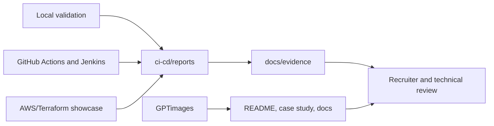

# RetailOps Evidence

This directory contains curated, human-readable evidence for reviewers, recruiters, and production-readiness audits.

It is intentionally separate from `ci-cd/reports/`, which stores raw or semi-raw tool output from CI/CD, Terraform, security scanners, Docker, Jenkins, and local validation commands.

## Structure

| Path | Purpose | Audience |
|---|---|---|
| `docs/evidence/index.md` | Main evidence inventory with proof, project area, audience, and validation notes. | Recruiter and technical reviewer |
| `docs/evidence/api/` | API startup and OpenAPI schema evidence. | Recruiter and technical reviewer |
| `docs/evidence/aws/` | Curated AWS/Terraform showcase screenshots and cleanup notes. | Recruiter and technical reviewer |
| `docs/evidence/docker/` | Docker build and Compose smoke evidence. | Recruiter and technical reviewer |
| `docs/evidence/jenkins/` | Jenkins UI screenshots and release-confidence evidence notes. | Recruiter and technical reviewer |
| `docs/evidence/gptimages-index.md` | Inventory of generated architecture images and their usage status. | Maintainer |
| `docs/evidence/gitignore-evidence-policy.md` | Rules for what evidence should be tracked or ignored. | Maintainer |
| `docs/evidence/evidence-folder-map.md` | Evidence folder map and Mermaid flow diagrams. | Maintainer and reviewer |
| `docs/evidence/evidence-cleanup-report.md` | Record of the evidence cleanup and remaining risks. | Maintainer |

## Evidence Flow

## Tracking Rules

- Commit curated screenshots, sanitized summaries, evidence indexes, and small reviewer-facing reports.
- Keep local logs, coverage XML, generated datasets, raw scanner JSON, Terraform state, binary plans, `.terraform/`, caches, virtualenvs, and `node_modules/` out of Git.
- Commit raw tool output only when it is deliberately sanitized, small, named as a snapshot, and linked from an evidence index.
- Do not claim a capability as implemented based only on diagrams or roadmap text. Link to source code, config, CI workflow, test, report, screenshot, or a validation command.

## Entry Points

- Main evidence inventory: `docs/evidence/index.md`
- Folder map: `docs/evidence/evidence-folder-map.md`
- Cleanup report: `docs/evidence/evidence-cleanup-report.md`
- Raw report policy: `ci-cd/reports/README.md`
