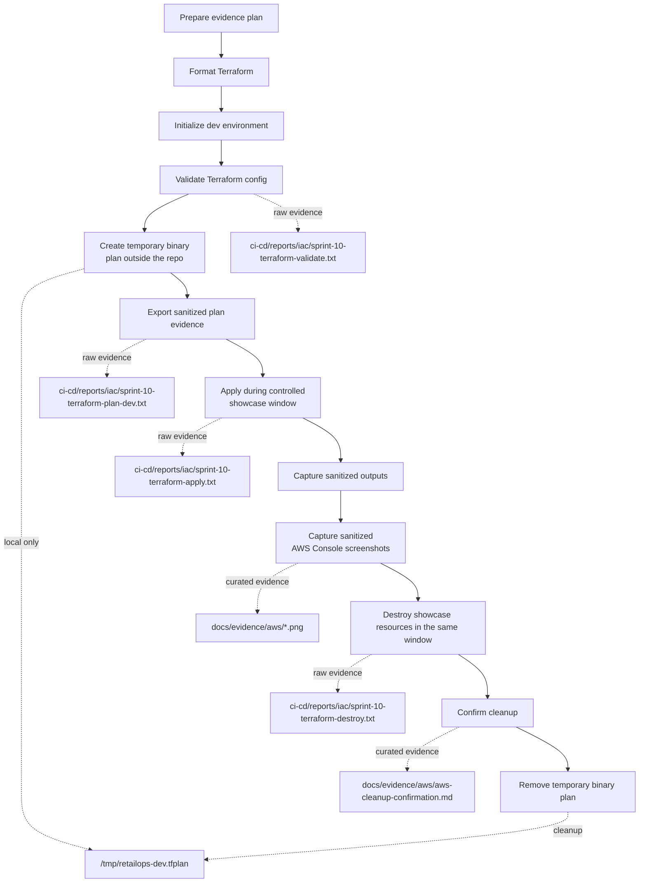

# AWS and Terraform Evidence

This folder stores curated, recruiter-facing evidence from a short, controlled AWS showcase window for the RetailOps Terraform and AWS foundation.

The showcase is intentionally temporary. It proves that the Terraform foundation can be planned, applied, inspected in AWS Console, and destroyed without leaving cost-generating resources behind.

## Evidence files

| File | Purpose | Required before final commit? |
|---|---|---:|
| `aws-cleanup-confirmation.md` | Manual cleanup checklist after destroy. | Yes |
| `aws-console-vpc.png` | AWS Console screenshot for VPC/networking resources. | Optional but recommended |
| `aws-console-ecr.png` | AWS Console screenshot for ECR repositories. | Optional but recommended |
| `aws-console-iam.png` | AWS Console screenshot for IAM delivery policy/role baseline. | Optional but recommended |
| `aws-console-budget.png` | AWS Console screenshot for budget/cost guardrail. | Optional but recommended |
| `aws-console-cloudwatch.png` | AWS Console screenshot for CloudWatch log groups. | Optional but recommended |

Raw or semi-raw Terraform command evidence is intentionally stored under `ci-cd/reports/iac/`:

| File | Purpose | Tracking policy |
|---|---|---|
| `ci-cd/reports/iac/sprint-10-terraform-validate.txt` | Local Terraform validation result. | Tracked curated snapshot |
| `ci-cd/reports/iac/sprint-10-terraform-plan-dev.txt` | Sanitized human-readable Terraform plan summary before apply. | Tracked curated snapshot |
| `ci-cd/reports/iac/sprint-10-terraform-apply.txt` | Sanitized apply evidence from the controlled showcase window. | Tracked curated snapshot |
| `ci-cd/reports/iac/sprint-10-terraform-destroy.txt` | Sanitized destroy evidence proving resources were removed. | Tracked curated snapshot |

## Safety rules

- Do not commit `.terraform/`, `terraform.tfstate`, `terraform.tfstate.backup`, binary plan files such as `tfplan`, crash logs, local override files, private `.tfvars` files, or real secrets.
- Redact AWS account IDs, real ARNs, email addresses, and console URLs if they expose private data.
- Run `terraform destroy` during the same showcase window unless there is a documented reason not to.
- Keep the showcase short and controlled. This is evidence, not a permanent environment.

## Suggested capture flow

