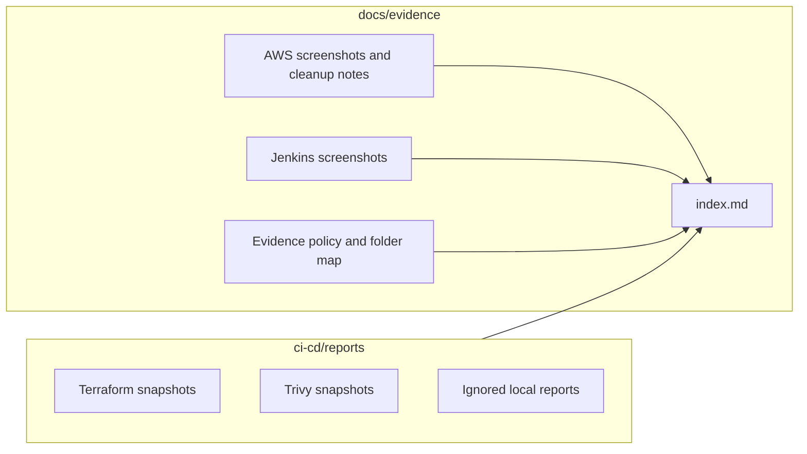
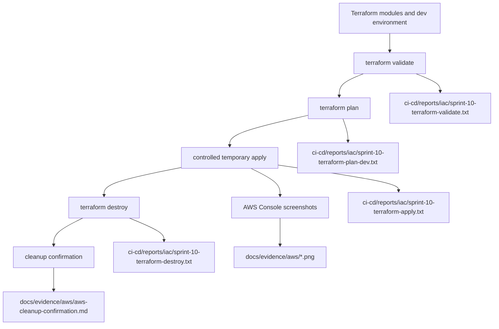
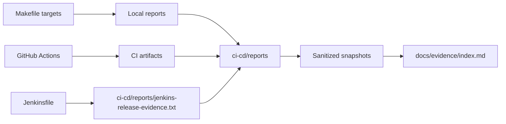
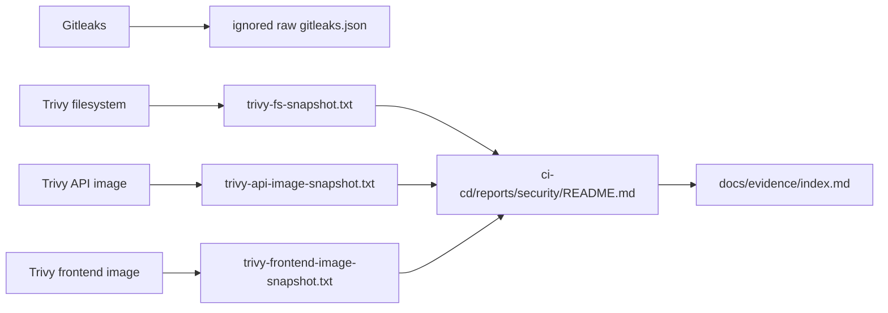
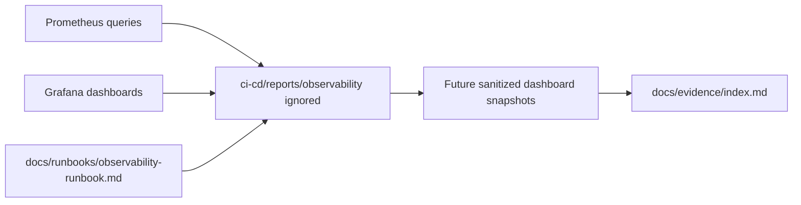
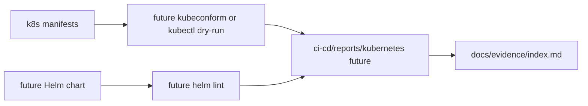
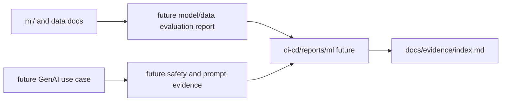

# Evidence Folder Map

Last reviewed: 2026-05-12

## Final Structure

```text
docs/evidence/
├── README.md
├── index.md
├── api/
│   ├── README.md
│   ├── startup-log.md
│   └── openapi-snapshot.json
├── aws/
│   ├── README.md
│   ├── aws-cleanup-confirmation.md
│   └── aws-console-*.png
├── docker/
│   ├── README.md
│   └── compose-ci-smoke.md
├── jenkins/
│   ├── README.md
│   ├── jenkins-stage-view.png
│   └── jenkins-status-and-artifacts.png
├── gptimages-index.md
├── gitignore-evidence-policy.md
├── evidence-folder-map.md
└── evidence-cleanup-report.md

ci-cd/reports/
├── README.md
├── iac/
│   ├── README.md
│   └── sprint-10-terraform-*.txt
└── security/
    ├── README.md
    └── trivy-*-snapshot.txt
```

## Folder Responsibilities

| Folder | Purpose | Commit | Do not commit |
|---|---|---|---|
| `docs/evidence/` | Curated reviewer-facing evidence, indexes, cleanup reports, diagrams, screenshots. | Sanitized screenshots, Markdown summaries, evidence maps. | Raw logs, secrets, local cache output, generated datasets. |
| `docs/evidence/api/` | API startup and OpenAPI schema evidence. | Startup notes and generated OpenAPI snapshots. | Raw server logs with sensitive values or local-only debug dumps. |
| `docs/evidence/aws/` | Human-readable AWS/Terraform showcase screenshots and cleanup notes. | Sanitized console screenshots and cleanup notes. | Full raw Terraform logs, account IDs, ARNs, console URLs. |
| `docs/evidence/docker/` | Docker build and Compose smoke evidence. | Sanitized build and smoke summaries. | Full raw Compose logs, large runtime dumps, local-only container state. |
| `docs/evidence/jenkins/` | Curated Jenkins UI screenshots and notes. | Screenshot evidence with no secrets or private URLs. | Raw Jenkins logs unless sanitized. |
| `ci-cd/reports/` | Raw or semi-raw generated reports from automation. | README files and explicit sanitized snapshots. | Volatile local logs, coverage XML, generated datasets, raw scanner dumps. |
| `ci-cd/reports/iac/` | Terraform, Checkov, TFLint, drift, and IaC report outputs. | Sanitized snapshots and report README. | Terraform state, binary plans, `.terraform/`, unsanitized plan/apply logs. |
| `ci-cd/reports/security/` | Trivy, Gitleaks, dependency audit outputs. | Sanitized snapshots and report README. | Unsanitized secret scan outputs and non-snapshot scanner files. |
| `GPTimages/` | Generated architecture visuals used by README, case study, and docs. | Stable images referenced by documentation. | New unindexed generated images. |

## Curated vs Raw Evidence



## AWS and Terraform Evidence Flow



## CI/CD Evidence Flow



## Security Evidence Flow



## Observability Evidence Flow



## Kubernetes and Helm Evidence Flow



## MLOps and GenAI Evidence Flow


