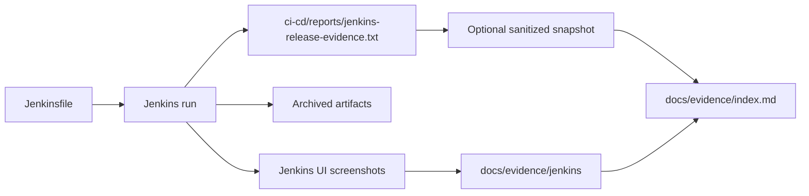

# Jenkins Evidence

This folder stores curated Jenkins screenshots that are useful for portfolio and technical review.

Raw Jenkins release summaries and archived artifacts should continue to be generated under `ci-cd/reports/` by the Jenkins pipeline. Those runtime outputs are ignored by default unless a sanitized snapshot is intentionally created and indexed.

## Files

| File | What it proves | Audience | Validation note |
|---|---|---|---|
| `jenkins-stage-view.png` | Jenkins stage view existed for the release-confidence pipeline. | Recruiter-facing | Static screenshot; refresh after the next representative Jenkins run. |
| `jenkins-status-and-artifacts.png` | Jenkins status and artifact archive view existed. | Recruiter-facing | Static screenshot; refresh after the next representative Jenkins run. |

## Evidence Flow

## Refresh Checklist

- Capture the full stage view for one successful release-confidence run.
- Capture the artifact archive view showing `ci-cd/reports/**`.
- Add a date, branch name, and commit SHA in this README when the screenshots are refreshed.
- Do not capture secrets, internal hostnames, credentials, tokens, or private Jenkins URLs.
