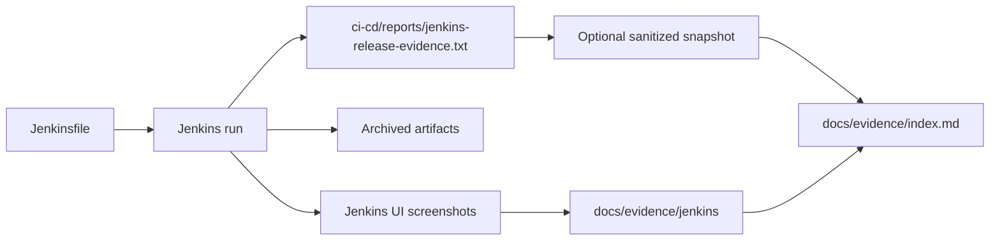

# Jenkins Evidence

This folder stores dated Jenkins execution evidence and historical screenshots.

The current `Jenkinsfile` performs checkout, dependency installation, data quality,
local CI and a mandatory isolated Compose build/runtime/alert drill. It has no
cloud deployment stages. Security, Terraform and Kubernetes checks remain in
protected GitHub Required CI; registry publishing uses its separate controlled workflow. Runtime cleanup is owned by
`scripts/ci/compose_isolated.py`; Jenkins never tears down the default project.

A trusted local agent needs Git, Make, Python 3.11, Node/npm and Docker Compose.
Run a Pipeline from SCM using this repository's `Jenkinsfile`, record the exact
checked-out SHA, and archive the curated report allowlist. Keep Jenkins access
private; these stages execute trusted repository code with Docker access.
Temporary controller startup follows the [Jenkins WAR instructions](https://www.jenkins.io/doc/book/installing/war-file/).

Raw Jenkins release summaries and archived artifacts should continue to be generated under `ci-cd/reports/` by the Jenkins pipeline. Those runtime outputs are ignored by default unless a sanitized snapshot is intentionally created and indexed.

## Current execution

[2026-09-26 successful execution](2026-09-26-validation.md) and its
[JSON snapshot](2026-09-26-validation.json) record actual stages, source identity,
artifact hashes and the incident drill. The PNG files below remain historical.

## Files

| File | What it proves | Audience | Validation note |
|---|---|---|---|
| `jenkins-stage-view.png` | Jenkins stage view existed for the release-confidence pipeline. | Recruiter-facing | Historical screenshot; not evidence of the current commit. |
| `jenkins-status-and-artifacts.png` | Jenkins status and artifact archive view existed. | Recruiter-facing | Historical screenshot; not evidence of the current commit. |

## Evidence Flow

```mermaid
flowchart LR
    JENKINS[Jenkinsfile] --> RUN[Jenkins run]
    RUN --> REPORTS[ci-cd/reports/jenkins-release-evidence.txt]
    RUN --> ARTIFACTS[Archived artifacts]
    RUN --> UI[Jenkins UI screenshots]
    UI --> CURATED[docs/evidence/jenkins]
    REPORTS --> SNAPSHOT[Optional sanitized snapshot]
    SNAPSHOT --> INDEX[docs/evidence/index.md]
    CURATED --> INDEX
```

## Refresh Checklist

- Capture the full stage view for one successful release-confidence run.
- Capture the artifact archive view showing `ci-cd/reports/**`.
- Add a date, branch name, and commit SHA in this README when the screenshots are refreshed.
- Do not capture secrets, internal hostnames, credentials, tokens, or private Jenkins URLs.
