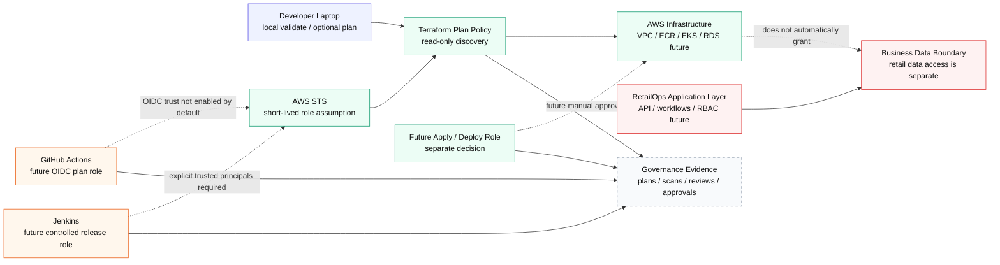

# IAM Baseline and Delivery Access Model

**Project:** RetailOps — Cloud-Native AI Platform
**Sprint:** Sprint 10 — Terraform and AWS Foundation
**Commit:** 7 — `docs(security): document IAM and delivery access model`
**Scope:** Documentation / decision / evidence

---

## 1. Purpose

This document defines the initial IAM and delivery access model for the RetailOps Terraform/AWS foundation.

The goal is to document how AWS access should be controlled before CI/CD, Terraform apply, Kubernetes workloads, or production-like environments are introduced.

This document connects the Terraform IAM baseline with security governance principles:

- least privilege,
- no long-lived access keys,
- no broad administrator access,
- clear separation between plan and apply permissions,
- explicit trust boundaries for GitHub Actions and Jenkins,
- separation between infrastructure administration and business data access.

### IAM diagram



---

## 2. Current IAM baseline

The current IAM module creates a controlled baseline for future Terraform plan validation.

Current baseline:

| Area | Current behavior |
|---|---|
| Terraform plan policy | Creates a read-only IAM policy for future Terraform plan/discovery usage. |
| IAM users | Not created. |
| Access keys | Not created. |
| Administrator access | Not attached. |
| GitHub Actions role | Prepared as an optional pattern, disabled by default. |
| Jenkins role | Prepared as an optional pattern, disabled by default. |
| Deployment/apply role | Not created yet. |
| EKS workload roles | Not created yet. |

The Terraform plan output should continue to expose safety signals such as:

```text
iam_access_keys_created           = false
iam_administrator_access_attached = false
```

These outputs are intentionally simple. They make it easy for a reviewer to verify that the baseline does not introduce risky IAM behavior.

---

## 3. Least privilege assumptions

The IAM baseline follows the principle of least privilege, but the project treats least privilege as a design direction rather than a one-time checkbox.

Current assumptions:

1. **Terraform plan is not Terraform apply.**
   Plan requires discovery/read-only permissions. Apply requires create/update/delete permissions and must be handled separately.

2. **Read-only discovery can require broad resource scope.**
   Some AWS `Describe`, `List`, and `Get` operations do not support practical resource-level scoping. For those actions, `Resource = "*"` can be acceptable when the policy contains only read-only actions.

3. **No long-lived IAM users or access keys.**
   Delivery systems should use role assumption patterns such as OIDC or controlled role chaining rather than committed or manually managed static credentials.

4. **No `AdministratorAccess` baseline.**
   Administrator permissions should not be used as a default delivery shortcut.

5. **Apply/deploy access requires a separate decision.**
   A future apply role should be reviewed separately because it has a higher blast radius than a plan-only role.

---

## 4. Delivery access model

The intended delivery model separates local development, CI validation, release orchestration, and future AWS deployment.

| Actor | Current access model | Future target |
|---|---|---|
| Developer laptop | Local Terraform validation and optional plan using local AWS credentials. | Short-lived credentials or controlled sandbox access. |
| GitHub Actions | No AWS role enabled by default. | OIDC-based plan role for validation. Later, separate deploy role if justified. |
| Jenkins | No AWS role enabled by default. | Controlled role assumption for release-stage validation/deployment. |
| Terraform plan role | Read-only discovery policy. | Used by CI to validate infrastructure intent without changing AWS. |
| Terraform apply role | Not created. | Separate role, manual approval, stricter permissions, and environment boundaries. |
| Workloads / EKS service accounts | Not created. | IAM Roles for Service Accounts or equivalent workload identity. |

---

## 5. GitHub Actions to AWS model

The future GitHub Actions model should use OIDC-based role assumption instead of access keys.

Target assumptions:

- GitHub receives short-lived credentials through AWS STS.
- Trust policy restricts access to the expected repository and branch or pull request context.
- Plan role is separated from apply/deploy role.
- Pull requests may run validation and plan, but should not automatically apply infrastructure.
- Apply requires a later decision, stronger permissions, and manual control.

Current status:

```text
GitHub Actions role pattern exists in the module, but it is disabled by default.
```

This is intentional because the real OIDC provider ARN and repository trust assumptions should not be guessed.

---

## 6. Jenkins to AWS model

Jenkins is treated as the future release-confidence orchestrator.

Target assumptions:

- Jenkins should assume an AWS role from a known and trusted AWS principal.
- Jenkins trust inputs must be explicit.
- Jenkins should not receive broad administrator access by default.
- Jenkins plan access and deployment/apply access should be separated.
- Release-stage apply should require approval and evidence.

Current status:

```text
Jenkins role pattern exists in the module, but it is disabled by default.
```

This prevents the project from creating trust relationships before the real Jenkins execution model is defined.

---

## 7. Infrastructure access versus business data access

DevOps access to infrastructure does not automatically mean access to business data.

In RetailOps, infrastructure permissions, application permissions, data permissions, and audit permissions should be separated.

Examples:

| Permission area | Should allow | Should not automatically allow |
|---|---|---|
| Terraform plan | Read AWS infrastructure metadata for validation. | Read business tables, customer data, or sensitive operational datasets. |
| Terraform apply | Create or update approved infrastructure. | Unrestricted access to application data. |
| Platform operations | Inspect runtime health, logs, and deployment state. | Bypass application RBAC or extract business data. |
| Application users | Perform role-specific business workflows. | Modify IAM, network, or cloud account settings. |

This distinction matters because RetailOps is both a DevOps platform and a business decision-support system. Operational control must not become uncontrolled business data access.

---

## 8. Trust boundaries

The IAM model has several trust boundaries:

1. **Source control boundary** — GitHub repository, pull requests, and branches.
2. **CI/CD boundary** — GitHub Actions and Jenkins runners.
3. **AWS account boundary** — IAM roles, policies, and STS role assumption.
4. **Infrastructure boundary** — VPC, networking, ECR, EKS, RDS, observability services.
5. **Application/data boundary** — RetailOps API, database, seed data, future production datasets.
6. **Governance boundary** — audit evidence, policy review, pipeline logs, plan reports.

The purpose of this model is to make every boundary explicit before higher-risk automation is added.

---

## 9. Current MVP versus future target

| Area | Current Sprint 10 scope | Future target |
|---|---|---|
| IAM policy | Read-only Terraform plan policy. | Separate plan, apply, ECR publish, EKS deploy, and workload policies. |
| GitHub Actions | Pattern prepared, disabled by default. | OIDC plan role and later controlled deploy role. |
| Jenkins | Pattern prepared, disabled by default. | Release role with explicit trust and approval gates. |
| Access keys | Not created. | Avoided wherever possible. |
| AdministratorAccess | Not attached. | Avoided as default; emergency/admin break-glass outside MVP scope. |
| Workload identity | Not created. | EKS service account roles for application workloads. |
| Business data access | Not granted by infrastructure IAM baseline. | Controlled through app/data-layer authorization. |

---

## 10. Validation checklist

Before accepting IAM-related changes, verify:

```bash
terraform -chdir=infra/environments/dev fmt -recursive
terraform -chdir=infra/environments/dev validate -no-color
terraform -chdir=infra/environments/dev plan -var-file=terraform.tfvars.example -no-color
```

Security grep:

```bash
grep -R --include="*.tf" --exclude-dir=".terraform" \
  -E 'AdministratorAccess|aws_iam_access_key|aws_iam_user|iam:PassRole|Action[[:space:]]*=[[:space:]]*"\\*"' \
  infra || true
```

Expected result for the current baseline:

- no `AdministratorAccess`,
- no `aws_iam_access_key`,
- no `aws_iam_user`,
- no `iam:PassRole`,
- no wildcard IAM action such as `Action = "*"`,
- only read/list/describe/get style actions for Terraform plan discovery.

---

## 11. Out of scope

The following are intentionally out of scope for this commit:

- full production IAM model,
- real AWS account IDs,
- real IAM principal ARNs,
- production OIDC provider ARN,
- Terraform apply/deploy role,
- permissions boundaries,
- SCPs / AWS Organizations,
- production data-access RBAC,
- EKS workload identity implementation,
- break-glass procedures.

---

## 12. DevOps note

IAM should evolve slower than application code. A small read-only baseline is safer than a fast but overly broad permission model.

For RetailOps, the right direction is:

```text
plan-only access first → explicit trust boundaries → separate apply role → workload identity → policy-as-code checks
```

This keeps Sprint 10 cost-aware, safe, and reviewable while preparing the foundation for future CI/CD and AWS delivery maturity.
