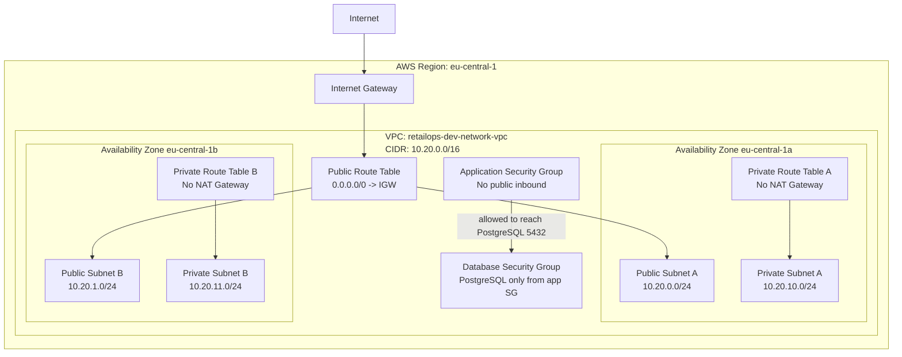

# AWS Networking Baseline

**Project:** Cloud-Native RetailOps Platform  
**Sprint:** Sprint 10 — Terraform and AWS Foundation  
**Commit scope:** `docs(infra): document AWS networking baseline`  
**Related Terraform module:** `infra/modules/vpc/`

---

## 1. Purpose

This document explains the AWS networking baseline introduced for the RetailOps Platform.

The goal is to make the VPC design understandable before any production-like AWS deployment is attempted. The Terraform module creates a small, low-cost, reviewable foundation for future AWS workloads such as ECR, EKS, RDS, observability, and security controls.

This is not a full production network yet. It is an MVP networking baseline designed for safe learning, Terraform review, and plan-only validation.

---

## 2. Current MVP networking scope

The current module defines:

- one VPC,
- one Internet Gateway,
- two public subnets,
- two private subnets,
- one public route table,
- one private route table per private subnet,
- public route table associations,
- private route table associations,
- baseline application security group,
- baseline database security group,
- explicit output confirming that NAT Gateway is disabled.

The current module intentionally does not create:

- NAT Gateway,
- Elastic IP for NAT,
- VPC endpoints,
- load balancers,
- EKS cluster,
- RDS database,
- bastion host,
- VPN or Direct Connect,
- production firewalling or network inspection.

This keeps the first AWS networking step cost-aware and easy to review.

---

## 3. VPC layout

The development VPC uses the following baseline CIDR:

```text
10.20.0.0/16
```

The VPC has DNS support and DNS hostnames enabled. This prepares the environment for future managed AWS services and Kubernetes workloads that depend on internal name resolution.

The current subnet layout is:

| Subnet type | Logical zone | Availability Zone | CIDR block | Purpose |
|---|---:|---|---|---|
| Public | `a` | `eu-central-1a` | `10.20.0.0/24` | Future internet-facing entry points such as load balancers. |
| Public | `b` | `eu-central-1b` | `10.20.1.0/24` | Future internet-facing entry points such as load balancers. |
| Private | `a` | `eu-central-1a` | `10.20.10.0/24` | Future private application, EKS, or service workloads. |
| Private | `b` | `eu-central-1b` | `10.20.11.0/24` | Future private application, EKS, or service workloads. |

The CIDR ranges leave space for future subnet groups such as database, observability, or dedicated Kubernetes node subnets if the project needs them later.

---

## 4. Public subnet assumptions

Public subnets are attached to a public route table with a default route:

```text
0.0.0.0/0 -> Internet Gateway
```

In the Terraform module, public subnets also have:

```text
map_public_ip_on_launch = true
```

This means resources launched directly into public subnets may receive public IP addresses by default.

In the target architecture, public subnets should be reserved mainly for controlled edge components, such as:

- public load balancers,
- ingress components,
- NAT Gateway if introduced later,
- other explicitly internet-facing infrastructure.

Application workloads, databases, internal services, and future ML workloads should not be placed in public subnets by default.

---

## 5. Private subnet assumptions

Private subnets are associated with private route tables.

At this stage, private route tables do not have a default route to the public internet. There is no NAT Gateway in the baseline.

This means private subnets are prepared for future private workloads, but they do not yet provide outbound internet access for package downloads, external APIs, or public registry access.

This is intentional for Sprint 10 because the project is still in a low-cost foundation phase.

Future private subnet use cases may include:

- EKS worker nodes,
- internal application services,
- private APIs,
- RDS subnet groups,
- internal observability agents,
- private ML or data services.

---

## 6. Route table behavior

The route table model is intentionally simple.

| Route table | Associated subnets | Internet route | Current purpose |
|---|---|---|---|
| Public route table | Public subnets `a` and `b` | Yes, through Internet Gateway | Future controlled public entry points. |
| Private route table `a` | Private subnet `a` | No | Future private workload isolation. |
| Private route table `b` | Private subnet `b` | No | Future private workload isolation. |

There is one private route table per private subnet. This gives the project flexibility to add different future routes per availability zone if needed.

---

## 7. Security group model

The baseline module defines two security groups.

### 7.1. Application security group

The application security group is named using the project naming convention:

```text
retailops-dev-network-app-sg
```

Current behavior:

- no public inbound access is defined,
- egress is limited to the VPC CIDR block,
- intended for future application or service workloads.

This is a conservative baseline. Future commits may add more specific rules when a concrete workload exists.

### 7.2. Database security group

The database security group is named:

```text
retailops-dev-network-db-sg
```

Current behavior:

- PostgreSQL inbound traffic on port `5432` is allowed only from the application security group,
- no public database access is defined,
- intended for a future RDS or database-related baseline.

This does not create RDS. It only prepares a security boundary for future database resources.

---

## 8. NAT Gateway decision

NAT Gateway is intentionally excluded from the current baseline.

The Terraform output explicitly confirms:

```text
nat_gateway_enabled = false
```

### Why NAT Gateway is not included yet

NAT Gateway is useful when private workloads need outbound internet access while remaining unreachable from the public internet. However, it introduces ongoing cloud cost even when the platform has little or no traffic.

For Sprint 10, the project does not yet run EKS worker nodes, private application workloads, or RDS in AWS. Creating NAT Gateway now would add cost before there is a clear technical need.

### Decision

Use a low-cost networking baseline now. Add NAT Gateway later only when a future commit has a clear workload requirement and cost justification.

---

## 9. MVP versus future target

| Area | Current MVP baseline | Future target direction |
|---|---|---|
| VPC | One dev VPC | Multi-environment VPC strategy if needed. |
| Public subnets | Prepared for public entry points | Load balancers, ingress, optional NAT Gateway. |
| Private subnets | Prepared, no outbound internet path | EKS nodes, private services, RDS subnet groups. |
| NAT Gateway | Not created | Add only when private workloads need outbound internet. |
| Security groups | App and database baseline groups | More workload-specific least-privilege rules. |
| Database | Not created | RDS or another managed database option. |
| Kubernetes | Not created | EKS with private node groups and controlled ingress. |
| Observability | Not created at network layer | CloudWatch, Prometheus/Grafana, OpenSearch or equivalent later. |

---

## 10. Mermaid diagram



---

## 11. Validation and evidence

Recommended validation commands:

```bash
terraform -chdir=infra/environments/dev fmt -recursive
terraform -chdir=infra/environments/dev init -backend=false
terraform -chdir=infra/environments/dev validate -no-color
terraform -chdir=infra/environments/dev plan -var-file=terraform.tfvars.example -no-color
```

Recommended safety check for cost-sensitive resources:

```bash
grep -R --include="*.tf" --exclude-dir=".terraform" 'aws_nat_gateway\|aws_eip' infra || true
```

Expected result for the NAT/EIP check:

```text
no output
```

Expected Terraform plan summary for the current baseline:

```text
Plan: 15 to add, 0 to change, 0 to destroy.
```

Expected output signal:

```text
nat_gateway_enabled = false
```

---

## 12. Senior DevOps review notes

The current networking baseline is intentionally modest.

It proves that the project can define an AWS network using Terraform, follow naming and tagging standards, separate public and private network boundaries, and document cost-aware architectural decisions.

The next senior-level review questions are:

1. Which future workload will justify introducing NAT Gateway?
2. Should private workloads use NAT Gateway, VPC endpoints, or both?
3. When should RDS subnet groups be added?
4. Should EKS worker nodes live only in private subnets?
5. Which security group rules are required by actual workloads rather than imagined future services?
6. How will Terraform plan evidence be stored and reviewed before apply is allowed?

The key principle remains:

```text
Build the network foundation first. Add paid and exposed components only when there is a clear workload need.
```
