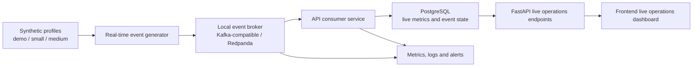

# RetailOps Real-Time Event Contracts

## 1. Purpose

This document defines the first real-time event contract model for the
RetailOps Cloud-Native Platform.

It is the documentation scope for Sprint 9 Commit 1. It does not require a
broker, consumer, database migration, API endpoint or frontend change yet. The
goal is to define the shape of the real-time layer before implementation starts.

This document complements:

- [Synthetic Data Profiles](synthetic-data-profiles.md)
- [Synthetic Data Operating Model](synthetic-data-operating-model.md)
- [API Standards](api.md)
- [Data and Event Processing Layer](diagrams/03-data-and-event-processing-layer.md)
- [Observability README](../observability/README.md)

## 2. Sprint 9 Real-Time Goal

Sprint 9 should add real-time analysis beside the existing batch synthetic data
flow.

The existing synthetic profiles remain the source of realistic retail behavior.
The real-time layer should replay or generate events from those profiles and
then expose operational freshness, live business metrics and stream processing
health.

Target business questions:

- What is happening in sales right now?
- Which products or locations are moving toward stockout now?
- Are promotions producing visible uplift in the current window?
- Are anomalies and alerts fresh enough to trust?
- Is the event pipeline healthy, delayed or dropping records?

## 3. Architecture Boundary

The first real-time implementation should be incremental.



Recommended local broker:

- Redpanda for local Docker Compose because it is Kafka-compatible and simpler
  to run in a single-node developer setup.
- Local setup details are documented in
  [RetailOps Local Event Broker](local-event-broker.md).

AWS mapping:

| Local concept | AWS target option | Notes |
| --- | --- | --- |
| Kafka-compatible broker | Amazon MSK | Closest local-to-cloud parity. |
| Event topics | MSK topics | Good for high-throughput ordered streams. |
| Operational event bus | EventBridge | Good for business events and integrations. |
| Queue/DLQ | SQS | Good for retries, isolation and dead-letter handling. |
| Stream processing metrics | CloudWatch / Managed Prometheus | Required for lag, failure and freshness evidence. |

Sprint 9 should start locally and document how it can later map to AWS.

## 4. Event Envelope

Every event must use a common envelope.

```json
{
  "event_id": "01HXZ7M8E5K9Q3Q76W7J7Y5YV2",
  "event_type": "sale_completed",
  "schema_version": "1.0",
  "source": "retailops.synthetic-generator",
  "correlation_id": "order_8f4f7f4b",
  "occurred_at": "2026-05-07T10:15:30Z",
  "ingested_at": "2026-05-07T10:15:31Z",
  "payload": {}
}
```

Envelope fields:

| Field | Required | Meaning |
| --- | --- | --- |
| `event_id` | Yes | Unique event identifier. Should be stable for deterministic replay. |
| `event_type` | Yes | Business event name, for example `sale_completed`. |
| `schema_version` | Yes | Contract version for this event type. |
| `source` | Yes | Producer identity, for example `retailops.synthetic-generator`. |
| `correlation_id` | Yes | Business process ID used to connect related events. |
| `occurred_at` | Yes | Time when the business event happened. |
| `ingested_at` | Yes | Time when RetailOps accepted the event. |
| `payload` | Yes | Event-type-specific business data. |

Timestamp rules:

- Use UTC ISO 8601 timestamps.
- `occurred_at <= ingested_at` for normal events.
- Event freshness is calculated from `ingested_at`.
- Business windows are calculated from `occurred_at`.

Identifier rules:

- Event IDs should be deterministic when replaying a generated profile.
- `correlation_id` should connect events from the same order, promotion,
  replenishment cycle, alert or workflow action.
- Payload IDs should match existing synthetic profile IDs when events are
  derived from generated CSV data.

## 5. Topic Naming

Topic names should be stable, lowercase and versioned.

Recommended local topics:

| Topic | Event types | Purpose |
| --- | --- | --- |
| `retailops.sales.v1` | `order_created`, `sale_completed`, `return_completed` | Revenue, baskets and returns. |
| `retailops.inventory.v1` | `stock_changed`, `inventory_snapshot_recorded`, `replenishment_completed` | Stock levels, stockout risk and replenishment. |
| `retailops.pricing.v1` | `price_changed`, `promotion_started`, `promotion_ended` | Price and promotion effects. |
| `retailops.intelligence.v1` | `forecast_generated`, `anomaly_detected` | ML and analytics signals. |
| `retailops.operations.v1` | `alert_created`, `workflow_action_performed` | Work items and operational decisions. |
| `retailops.dlq.v1` | Any failed event | Dead-letter records for invalid or failed processing. |

Versioning rules:

- Additive payload fields are allowed within the same major topic version.
- Breaking changes require a new topic version, for example
  `retailops.sales.v2`.
- Consumers should ignore unknown additive fields.
- Producers should keep required fields stable for the lifetime of a topic
  version.

## 6. Event Type Catalog

### 6.1 `order_created`

Topic: `retailops.sales.v1`

Business meaning: a customer order was created before item-level sales are
processed.

Required payload fields:

| Field | Type | Notes |
| --- | --- | --- |
| `order_id` | string | Matches synthetic `orders.csv`. |
| `store_id` | string | Store or sales location. |
| `channel` | string | `online`, `store`, `marketplace` or future channel. |
| `customer_segment` | string | Synthetic customer group if available. |
| `order_total` | number | Gross order value. |
| `currency` | string | Usually `PLN`. |
| `status` | string | Initial order status. |

### 6.2 `sale_completed`

Topic: `retailops.sales.v1`

Business meaning: one product line was sold and can update live revenue,
demand, stock and basket metrics.

Required payload fields:

| Field | Type | Notes |
| --- | --- | --- |
| `sale_id` | string | Matches synthetic `sales.csv` when replayed. |
| `order_id` | string | Connects basket lines. |
| `order_item_id` | string | Item-level correlation. |
| `product_id` | string | Sold product. |
| `sku` | string | Business product identifier when available. |
| `store_id` | string | Store or location. |
| `channel` | string | Sales channel. |
| `quantity` | number | Observed sold units. |
| `unit_price` | number | Price paid per unit. |
| `total_amount` | number | Line revenue. |
| `currency` | string | Usually `PLN`. |
| `promotion_applied` | boolean | True when promotion affected the sale. |
| `latent_demand` | number | Generated demand before stockout censoring. |
| `observed_sales` | number | Demand visible as fulfilled sales. |
| `stockout_flag` | boolean | True if demand was censored by stockout. |
| `data_quality_status` | string | Controlled quality status. |

### 6.3 `return_completed`

Topic: `retailops.sales.v1`

Business meaning: a return was accepted and should reduce net sales or expose
category/channel return pressure.

Required payload fields:

| Field | Type | Notes |
| --- | --- | --- |
| `return_id` | string | Matches synthetic `returns.csv`. |
| `order_id` | string | Original order. |
| `order_item_id` | string | Original item line. |
| `product_id` | string | Returned product. |
| `store_id` | string | Return location or original sale location. |
| `channel` | string | Sales or return channel. |
| `quantity` | number | Returned units. |
| `refund_amount` | number | Returned monetary value. |
| `reason` | string | Synthetic return reason. |

### 6.4 `stock_changed`

Topic: `retailops.inventory.v1`

Business meaning: inventory changed because of sale, replenishment, adjustment
or return.

Required payload fields:

| Field | Type | Notes |
| --- | --- | --- |
| `stock_movement_id` | string | Matches synthetic `stock_movements.csv`. |
| `product_id` | string | Product affected. |
| `warehouse_id` | string | Warehouse or fulfillment node. |
| `store_id` | string | Optional store location when relevant. |
| `movement_type` | string | `sale`, `replenishment`, `return`, `adjustment` or future type. |
| `quantity_delta` | number | Positive or negative stock movement. |
| `stock_after` | number | Stock after movement when available. |
| `reason_code` | string | Business reason for the movement. |

### 6.5 `inventory_snapshot_recorded`

Topic: `retailops.inventory.v1`

Business meaning: a measured stock position was recorded.

Required payload fields:

| Field | Type | Notes |
| --- | --- | --- |
| `inventory_snapshot_id` | string | Matches synthetic `inventory_snapshots.csv`. |
| `product_id` | string | Product measured. |
| `warehouse_id` | string | Warehouse or location. |
| `stock_quantity` | number | Current stock. |
| `unit_of_measure` | string | For example `pcs`. |
| `recorded_at` | string | Source measurement time. |

### 6.6 `replenishment_completed`

Topic: `retailops.inventory.v1`

Business meaning: a replenishment cycle increased stock.

Required payload fields:

| Field | Type | Notes |
| --- | --- | --- |
| `replenishment_id` | string | Generated operation ID. |
| `product_id` | string | Replenished product. |
| `warehouse_id` | string | Destination warehouse. |
| `quantity` | number | Replenished quantity. |
| `supplier_id` | string | Optional until suppliers are modeled. |
| `lead_time_days` | number | Synthetic or measured lead time. |

### 6.7 `price_changed`

Topic: `retailops.pricing.v1`

Business meaning: a product price changed and can influence demand.

Required payload fields:

| Field | Type | Notes |
| --- | --- | --- |
| `price_history_id` | string | Matches synthetic `price_history.csv`. |
| `product_id` | string | Product repriced. |
| `old_price` | number | Previous price when known. |
| `new_price` | number | New price. |
| `currency` | string | Usually `PLN`. |
| `effective_from` | string | Start of price validity. |
| `effective_to` | string | Optional end of price validity. |

### 6.8 `promotion_started`

Topic: `retailops.pricing.v1`

Business meaning: a promotion became active.

Required payload fields:

| Field | Type | Notes |
| --- | --- | --- |
| `promotion_id` | string | Matches synthetic `promotions.csv`. |
| `product_id` | string | Promoted product. |
| `promotion_type` | string | Discount or campaign type. |
| `discount_percent` | number | Promotion discount. |
| `starts_at` | string | Promotion start. |
| `ends_at` | string | Promotion end. |
| `expected_uplift` | number | Synthetic expected uplift when available. |

### 6.9 `promotion_ended`

Topic: `retailops.pricing.v1`

Business meaning: a promotion ended and post-promotion effects may appear.

Required payload fields:

| Field | Type | Notes |
| --- | --- | --- |
| `promotion_id` | string | Promotion that ended. |
| `product_id` | string | Product affected. |
| `ended_at` | string | End timestamp. |
| `post_promotion_effect` | number | Synthetic post-promotion effect when available. |

### 6.10 `forecast_generated`

Topic: `retailops.intelligence.v1`

Business meaning: a forecast was generated for a product/location/time window.

Required payload fields:

| Field | Type | Notes |
| --- | --- | --- |
| `forecast_id` | string | Matches synthetic `forecasts.csv`. |
| `product_id` | string | Forecasted product. |
| `store_id` | string | Forecasted location when available. |
| `forecast_date` | string | Target date. |
| `predicted_demand` | number | Predicted units. |
| `model_version` | string | Optional until MLOps model registry exists. |
| `confidence` | number | Forecast confidence if generated. |

### 6.11 `anomaly_detected`

Topic: `retailops.intelligence.v1`

Business meaning: a generated or detected unusual signal was found.

Required payload fields:

| Field | Type | Notes |
| --- | --- | --- |
| `anomaly_id` | string | Matches synthetic `anomalies.csv`. |
| `product_id` | string | Affected product. |
| `store_id` | string | Affected location when available. |
| `anomaly_type` | string | For example `sales_spike`, `sales_drop`, `stockout_risk`. |
| `severity` | string | `low`, `medium`, `high`, `critical`. |
| `score` | number | Detection score when available. |
| `description` | string | Human-readable explanation. |

### 6.12 `alert_created`

Topic: `retailops.operations.v1`

Business meaning: an operational work item was created from a signal.

Required payload fields:

| Field | Type | Notes |
| --- | --- | --- |
| `alert_id` | string | Matches synthetic `alerts.csv`. |
| `product_id` | string | Affected product. |
| `anomaly_id` | string | Optional linked anomaly. |
| `alert_type` | string | Business alert type. |
| `severity` | string | Business severity. |
| `status` | string | Usually `open` at creation. |
| `title` | string | Short alert title. |
| `recommended_action` | string | Suggested next action. |

### 6.13 `workflow_action_performed`

Topic: `retailops.operations.v1`

Business meaning: a user or system acted on a work item.

Required payload fields:

| Field | Type | Notes |
| --- | --- | --- |
| `workflow_action_id` | string | Matches synthetic `workflow_actions.csv`. |
| `alert_id` | string | Related alert or work item. |
| `user_id` | string | Actor. |
| `action_type` | string | For example `acknowledged`, `assigned`, `resolved`, `dismissed`. |
| `previous_status` | string | Previous workflow status when known. |
| `new_status` | string | New workflow status. |
| `comment` | string | Optional user or system note. |

## 7. Data Quality and Dead-Letter Rules

Events should be rejected or sent to DLQ when:

- the envelope is missing required fields,
- `event_type` is unknown,
- `schema_version` is unsupported,
- timestamps are invalid,
- required payload fields are missing,
- numeric fields violate basic domain rules,
- payload IDs cannot be parsed,
- processing fails after retryable attempts are exhausted.

The DLQ event should preserve the original event and add processing metadata.

```json
{
  "event_id": "01HXZ7M8E5K9Q3Q76W7J7Y5YV2",
  "event_type": "sale_completed",
  "schema_version": "1.0",
  "source": "retailops.synthetic-generator",
  "correlation_id": "order_8f4f7f4b",
  "occurred_at": "2026-05-07T10:15:30Z",
  "ingested_at": "2026-05-07T10:15:31Z",
  "payload": {},
  "processing_error": {
    "error_type": "missing_required_payload_field",
    "message": "payload.product_id is required",
    "failed_at": "2026-05-07T10:15:32Z",
    "consumer": "retailops-api-consumer"
  }
}
```

Controlled synthetic data quality statuses such as `late_event`,
`duplicate_candidate` and `missing_optional_context` should not always be DLQ
conditions. They are business realism signals and should be processed when the
contract is still valid.

## 8. Consumer Processing Expectations

The first API consumer should be idempotent.

Required consumer behavior:

- deduplicate by `event_id`,
- validate envelope before payload processing,
- route by `event_type`,
- record processing status,
- expose failed processing counts,
- keep enough timestamps to calculate event freshness and processing latency,
- avoid crashing the whole consumer on one bad event.

Suggested status values:

| Status | Meaning |
| --- | --- |
| `received` | Event was read from the broker. |
| `processed` | Event was validated and applied. |
| `ignored_duplicate` | Event ID was already processed. |
| `failed_retryable` | Temporary failure occurred. |
| `failed_dead_lettered` | Event was sent to DLQ. |

## 9. Live Metrics Contract

Sprint 9 live operations should start with a compact metrics contract.

Business metrics:

| Metric | Window | Source events |
| --- | --- | --- |
| `live_revenue` | 5, 15, 60 minutes | `sale_completed`, `return_completed` |
| `live_units_sold` | 5, 15, 60 minutes | `sale_completed` |
| `live_return_amount` | 5, 15, 60 minutes | `return_completed` |
| `live_stockout_events` | 5, 15, 60 minutes | `sale_completed`, `stock_changed` |
| `live_alerts_created` | 5, 15, 60 minutes | `alert_created` |
| `promotion_sales_share` | 5, 15, 60 minutes | `sale_completed` |

Technical metrics:

| Metric | Meaning |
| --- | --- |
| `events_produced_total` | Number of produced events by type and topic. |
| `events_consumed_total` | Number of consumed events by type and topic. |
| `events_failed_total` | Number of failed events by error type. |
| `dead_letter_events_total` | Number of DLQ records. |
| `event_processing_latency_seconds` | `processed_at - ingested_at`. |
| `event_freshness_seconds` | `now - ingested_at`. |
| `consumer_lag_records` | Broker lag by topic and partition when available. |

## 10. API Direction

Future API endpoints should follow the existing REST conventions in
`docs/api.md`.

Candidate endpoints:

```text
GET /live/operations/summary
GET /live/operations/sales?window_minutes=15
GET /live/operations/inventory-risk?window_minutes=15
GET /live/operations/events/recent?limit=50
GET /live/operations/pipeline-health
```

These endpoints should be read-only in the first implementation.

## 11. Generator Direction

The real-time event generator should reuse existing synthetic profiles.

Input options:

- generate from `data/demo` for fast local smoke tests,
- generate from local `data/synthetic/small` for realistic local replay,
- generate from `medium` only for manual platform validation.

Output options:

- publish directly to local broker,
- write replayable JSONL under an ignored path such as `data/replay/`,
- support bounded runs for CI smoke tests.

Required generator properties:

- deterministic seed support,
- configurable event rate,
- configurable profile,
- bounded duration or max event count,
- stable event IDs for replay,
- clear summary output with produced counts by event type.

## 12. Observability Direction

The real-time layer is not complete unless it can be observed.

Minimum observability evidence:

- event production rate,
- event consumption rate,
- failed event count,
- DLQ count,
- processing latency,
- event freshness,
- consumer lag,
- consumer health status.

Initial alert candidates:

| Alert | Trigger idea |
| --- | --- |
| Event stream stale | No consumed event for a configured time window. |
| Consumer lag high | Lag stays above threshold. |
| DLQ rate high | DLQ count increases too quickly. |
| Processing latency high | Latency p95 exceeds target. |
| Consumer down | Consumer health check fails. |

## 13. Acceptance Criteria for Sprint 9 Commit 1

This commit is complete when:

- the event envelope is documented,
- topic naming is documented,
- initial event types are documented,
- DLQ and validation rules are documented,
- live business and technical metrics are documented,
- the implementation direction is clear enough for the next commit,
- no production code or generated datasets are required.
