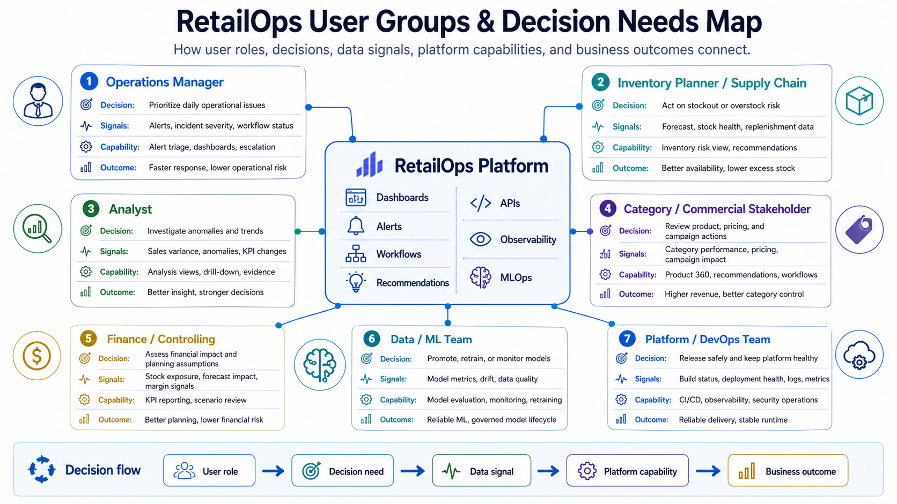

# User Groups and Decision Needs

**Project:** Cloud-Native RetailOps Platform  
**Workstream:** Business & Product  
**Phase:** Phase 1 — Foundation / MVP  
**Primary artifact:** `docs/user-groups.md`  
**Related artifact:** `docs/workflows.md`  

---

## 1. Purpose of this document

This document defines the key user groups of the RetailOps Platform and maps each group to the business decisions the platform should support.

The goal is to create a clear product and platform foundation showing **who uses the platform, what decisions they need to make, what data they need, and which platform capabilities support those decisions**.

This matters because RetailOps Platform is not positioned as a simple dashboard or a standalone ML proof of concept. It is a cloud-native operating platform that connects retail data, application workflows, automation, observability, security, and MLOps into one decision-support system.

---

## 2. Source context from the Case Study

The RetailOps Platform is designed to improve demand visibility, reduce stock risk, accelerate operational response, and embed analytics into day-to-day decision-making.

The business problems behind the platform include:

- inaccurate demand forecasting,
- stockouts and overstocks,
- delayed reaction to business events,
- fragmented visibility across teams,
- weak production-readiness for ML use cases,
- inconsistent environments and delivery risk,
- limited observability and operational control.

The platform integrates several business data sources:

- sales transactions and returns,
- inventory and stock movements,
- order events and fulfillment status,
- product catalog and product feed changes,
- pricing history and pricing events,
- promotion and campaign calendar,
- supplier and replenishment data,
- marketplace and channel data,
- user actions inside the platform, such as approvals, escalations, dismissals, and action feedback.

The main user groups identified in the Case Study are:

- Operations Manager,
- Inventory Planner / Supply Chain,
- Analyst,
- Category / Commercial Stakeholder,
- Finance / Controlling,
- Data / ML Team,
- Platform / DevOps Team.

This document expands those groups into decision needs, workflows, outputs, platform capabilities, and MVP boundaries.

---

## 3. User group classification

RetailOps Platform has two broad categories of users.

### 3.1. Business decision users

These users consume business insights, review operational signals, and take business actions.

| User group | Main business focus | Main decision type |
|---|---|---|
| Operations Manager | Daily operational control | Which operational risks require action now? |
| Inventory Planner / Supply Chain | Stock availability and replenishment | Where should inventory action be taken? |
| Analyst | Business investigation and explanation | Why did a metric change and what is the driver? |
| Category / Commercial Stakeholder | Product, pricing, campaigns, category performance | Which product or commercial action is needed? |
| Finance / Controlling | Financial impact, planning, working capital | What is the financial exposure and business impact? |

### 3.2. Technical and platform users

These users operate, improve, secure, monitor, and release the platform.

| User group | Main platform focus | Main decision type |
|---|---|---|
| Data / ML Team | Forecasting, anomaly detection, models, data quality | Is the model or data product reliable enough to use? |
| Platform / DevOps Team | Runtime reliability, releases, infrastructure, observability, security | Is the platform healthy, secure, and safe to deploy? |

<p align="center">
  
</p>
<p align="center"><em>Figure: RetailOps User Groups & Decision Needs Map</em></p>

---

## 4. Decision-first design principle

The platform should be designed around decisions, not around screens.

A weak requirement would be:

> The user needs a dashboard.

A stronger requirement is:

> The Inventory Planner needs to identify products with high stockout risk and decide whether replenishment, escalation, or monitoring is required.

The second version is better because it explains:

- who the user is,
- what business problem they face,
- what decision they need to make,
- what platform capability is needed,
- what outcome the platform should improve.

For this reason, every user group in this document is described using the following chain:

```text
User group → responsibility → decision need → input data/signal → platform capability → output/action → business outcome
```

---

# 5. User group profiles

---

## 5.1. Operations Manager

### Role summary

The Operations Manager monitors daily operational risk across sales, inventory, orders, pricing, product feeds, and business exceptions. This user is responsible for prioritizing issues, coordinating follow-up actions, and ensuring that high-impact operational problems are not missed.

### Main responsibilities

- Monitor the daily operational health of the retail business.
- Prioritize business exceptions and operational alerts.
- Coordinate action owners across inventory, commercial, analytics, and support teams.
- Track whether issues are open, acknowledged, escalated, resolved, or dismissed.
- Reduce delay between issue detection and business response.

### Key decision needs

| Decision need | Description |
|---|---|
| Daily risk triage | Which alerts or exceptions require action today? |
| Incident prioritization | Which issues have the highest business impact or urgency? |
| Escalation decision | Which issue should be assigned to Inventory, Commercial, Analyst, Finance, ML, or DevOps? |
| Resolution tracking | Which actions are still open and which have been completed? |
| Operational readiness | Is the platform giving reliable enough visibility for daily operations? |

### Input data and signals

- Sales drops or spikes.
- Inventory risk alerts.
- Delayed data ingestion.
- Product feed changes or failures.
- Pricing anomalies.
- Order and fulfillment exceptions.
- Forecast deviation signals.
- User actions: acknowledge, assign, escalate, dismiss, resolve.
- Platform health signals if they affect business visibility.

### Platform capabilities supporting this user

- Retail operations dashboard.
- Alert overview and alert prioritization.
- Business anomaly detection.
- Workflow status for alerts and recommendations.
- Operational KPI summary.
- Escalation and assignment history.
- Observability signal when platform/data delay affects business trust.

### Expected outputs

| Output type | Example |
|---|---|
| Dashboard | Daily operational risk dashboard with open alerts and severity. |
| Alert | “High stockout risk detected for top-selling SKU.” |
| Workflow item | Alert assigned to Inventory Planner, status: in review. |
| Evidence | Screenshot of operations dashboard; sample alert workflow; API response for dashboard summary. |

### Business outcome supported

- Faster operational response time.
- Better visibility into business exceptions.
- Reduced risk of missed stock, pricing, sales, or data issues.
- Improved decision cycle time.

### MVP scope

In MVP, the Operations Manager should have a basic dashboard showing:

- stock risk summary,
- sales anomaly placeholder or sample anomaly flag,
- open operational alerts,
- basic workflow status,
- latest data refresh indicator.

### Target maturity

In later phases, this role should benefit from:

- near-real-time event-driven alerts,
- alert severity scoring,
- escalation workflows,
- SLA tracking,
- automated incident routing,
- business and technical observability correlation.

---

## 5.2. Inventory Planner / Supply Chain

### Role summary

The Inventory Planner or Supply Chain user is responsible for stock availability, replenishment decisions, and reducing the business impact of stockouts and overstocks.

### Main responsibilities

- Monitor stock levels and stock movements.
- Review demand forecasts and stock risk indicators.
- Identify products at risk of stockout or overstock.
- Decide whether replenishment, escalation, transfer, or monitoring is required.
- Balance service level, inventory cost, working capital, and operational feasibility.

### Key decision needs

| Decision need | Description |
|---|---|
| Stockout prevention | Which products are likely to run out of stock? |
| Overstock reduction | Which products carry excessive inventory risk? |
| Replenishment action | Should replenishment be increased, delayed, reduced, or escalated? |
| Forecast trust | Is the forecast reliable enough to support action? |
| Supplier follow-up | Which supplier or replenishment issue needs attention? |

### Input data and signals

- Current stock level.
- Stock movements.
- Sales velocity.
- Demand forecast.
- Replenishment lead time.
- Supplier and replenishment data.
- Order fulfillment status.
- Returns.
- Campaign calendar.
- Product category and seasonality.
- Historical stockout or overstock patterns.

### Platform capabilities supporting this user

- Product 360 view.
- Inventory health dashboard.
- Stock risk scoring.
- Baseline demand forecasting.
- Replenishment recommendation placeholder.
- Anomaly detection for unusual stock or demand movement.
- Workflow for reviewing and approving inventory actions.

### Expected outputs

| Output type | Example |
|---|---|
| Dashboard | Inventory risk view grouped by product, category, severity, and expected impact. |
| Alert | “Stockout risk within 7 days for product X.” |
| Recommendation | “Review replenishment quantity for product X due to increasing demand.” |
| Workflow item | Inventory action marked as approved, rejected, escalated, or under review. |
| Evidence | Screenshot of stock risk dashboard; sample `/inventory-risk` API response; seed dataset with stock levels. |

### Business outcome supported

- Reduced stockout risk.
- Reduced overstock and working capital lock-in.
- Better inventory risk visibility.
- Faster inventory decision cycle.
- Improved service level and customer availability.

### MVP scope

In MVP, the Inventory Planner should see:

- product stock level,
- basic stock risk indicator,
- simple forecast placeholder,
- basic replenishment recommendation or decision flag,
- ability to review status of an inventory-related alert.

### Target maturity

In later phases, this role should benefit from:

- more advanced forecasting,
- supplier-aware replenishment logic,
- event-driven stock movement alerts,
- scenario simulation,
- forecast confidence and model quality indicators,
- optimization recommendations connected to financial impact.

---

## 5.3. Analyst

### Role summary

The Analyst investigates business trends, variance, anomalies, and performance drivers. This user translates raw operational data into explanations and decision support for Operations, Inventory, Commercial, Finance, and Management stakeholders.

### Main responsibilities

- Investigate sales, inventory, pricing, campaign, and order anomalies.
- Explain changes in KPIs and business metrics.
- Validate whether alerts are meaningful or false positives.
- Support root-cause analysis.
- Produce insight for business stakeholders.

### Key decision needs

| Decision need | Description |
|---|---|
| Variance explanation | Why did sales, stock, forecast, or margin-related metrics change? |
| Anomaly investigation | Is this signal a real business issue, data issue, seasonality effect, or false positive? |
| Trend analysis | What pattern is emerging across product, category, channel, or time? |
| Data trust assessment | Is the underlying data complete, timely, and reliable? |
| Insight prioritization | Which finding is important enough to escalate? |

### Input data and signals

- Sales transactions and returns.
- Inventory and stock movements.
- Pricing history and pricing events.
- Promotion and campaign calendar.
- Product catalog changes.
- Marketplace and channel data.
- Forecast outputs.
- Anomaly scores or flags.
- Data quality results.
- User action feedback from workflows.

### Platform capabilities supporting this user

- Analytical dashboard.
- Product and category drill-down.
- Historical trend views.
- Anomaly investigation view.
- Data quality checks.
- Exportable evidence or reports.
- Links between alert, underlying data, and user action history.

### Expected outputs

| Output type | Example |
|---|---|
| Dashboard | Trend and variance view for product/category performance. |
| Report | Short explanation of why product demand changed after campaign launch. |
| Alert support | Anomaly details showing whether the alert is business-driven or data-quality-driven. |
| Evidence | Sample analytical query, chart screenshot, anomaly explanation note, data quality report. |

### Business outcome supported

- Better explanation of business changes.
- More trusted decision-making.
- Reduced noise from false alerts.
- Improved feedback loop for operations and ML.

### MVP scope

In MVP, the Analyst should have:

- access to basic product, sales, inventory, and order data,
- simple trend summaries,
- example anomaly flags,
- data quality assumptions documented,
- ability to support Operations and Inventory decisions with evidence.

### Target maturity

In later phases, this role should benefit from:

- more advanced root-cause analysis,
- anomaly scoring explanations,
- event timeline views,
- campaign and pricing impact analysis,
- feedback into ML training and alert tuning.

---

## 5.4. Category / Commercial Stakeholder

### Role summary

The Category or Commercial Stakeholder owns product and category performance, pricing behavior, campaign impact, and commercial actions. This user needs the platform to connect product performance with stock, pricing, promotions, and demand signals.

### Main responsibilities

- Review product and category performance.
- Monitor pricing and campaign effects.
- Identify products requiring commercial action.
- Understand how stock risk affects sales opportunities.
- Coordinate with Inventory, Operations, Finance, and Analysts.

### Key decision needs

| Decision need | Description |
|---|---|
| Product prioritization | Which products or categories require commercial attention? |
| Pricing review | Is pricing behavior unusual, incorrect, or commercially risky? |
| Campaign impact review | Did a campaign increase demand, create stock pressure, or fail to perform? |
| Stock-commercial alignment | Are top-selling or campaign products exposed to stockout risk? |
| Recommendation review | Should a commercial recommendation be accepted, modified, or rejected? |

### Input data and signals

- Product catalog.
- Category hierarchy.
- Sales transactions.
- Pricing history and pricing events.
- Promotions and campaign calendar.
- Inventory levels.
- Stock risk scores.
- Demand forecast.
- Marketplace and channel data.
- User action history.

### Platform capabilities supporting this user

- Product 360 view.
- Category performance dashboard.
- Pricing anomaly detection.
- Campaign impact view.
- Stock and demand overlay for commercial decisions.
- Recommendation review workflow.

### Expected outputs

| Output type | Example |
|---|---|
| Dashboard | Category performance dashboard with sales, stock risk, pricing, and campaign signals. |
| Alert | “Promotion increased demand but stock coverage is below threshold.” |
| Recommendation | “Review price or replenishment plan for product X due to abnormal sales movement.” |
| Workflow item | Commercial action accepted, rejected, or assigned for further analysis. |
| Evidence | Product 360 screenshot; category KPI view; pricing anomaly example. |

### Business outcome supported

- Better commercial decision-making.
- Faster response to product, pricing, and campaign issues.
- Reduced revenue leakage from stockouts or pricing mistakes.
- Better coordination between commercial and inventory decisions.

### MVP scope

In MVP, the Commercial Stakeholder should see:

- product-level sales and stock information,
- basic category summary,
- simple pricing or campaign context,
- stock risk connected to product performance,
- basic workflow status for commercial follow-up.

### Target maturity

In later phases, this role should benefit from:

- campaign effectiveness analysis,
- pricing recommendations,
- promotion simulation,
- supplier and channel insights,
- A/B testing and experimentation support.

---

## 5.5. Finance / Controlling

### Role summary

Finance and Controlling users assess the financial impact of stock risk, demand assumptions, operational decisions, and platform outcomes. They are interested in working capital, lost sales risk, planning assumptions, and measurable business value.

### Main responsibilities

- Assess inventory exposure and working capital impact.
- Review financial impact of stockouts and overstocks.
- Use forecast-driven assumptions for planning support.
- Validate whether platform outcomes support business KPIs.
- Connect operational improvements with financial metrics.

### Key decision needs

| Decision need | Description |
|---|---|
| Inventory exposure assessment | Which products or categories create financial risk through overstock or stockout? |
| Planning assumption review | Are forecast assumptions reliable enough for planning discussions? |
| Business impact estimation | What is the estimated financial impact of operational risks? |
| Cost-benefit view | Is the platform reducing risk enough to justify further investment? |
| FinOps awareness | Are cloud and platform costs aligned with maturity and business value? |

### Input data and signals

- Inventory value.
- Stock level and stock movement.
- Sales transactions and returns.
- Forecast outputs.
- Stockout and overstock risk indicators.
- Category and product profitability assumptions.
- Campaign calendar.
- Operational action history.
- Cloud cost and environment usage indicators in later maturity.

### Platform capabilities supporting this user

- Finance-oriented KPI summary.
- Inventory exposure dashboard.
- Forecast and planning assumptions view.
- Business impact summary for alerts and recommendations.
- FinOps dashboard concept in later phases.
- Evidence of measurable outcomes and platform KPIs.

### Expected outputs

| Output type | Example |
|---|---|
| Dashboard | Inventory exposure and risk dashboard by product/category. |
| Report | Summary of estimated stockout/overstock exposure. |
| KPI view | Forecast accuracy, stockout reduction, operational response time, decision cycle time. |
| Evidence | KPI definition document; finance summary screenshot; FinOps concept document. |

### Business outcome supported

- Better working capital visibility.
- Stronger link between operational risk and financial impact.
- Better planning and budgeting support.
- Clearer business justification for platform maturity investments.

### MVP scope

In MVP, Finance should have:

- defined business KPIs,
- simple inventory risk visibility,
- basic financial impact assumptions,
- ability to understand how operational decisions connect to business value.

### Target maturity

In later phases, this role should benefit from:

- scenario analysis,
- cost-per-service and cost-per-environment visibility,
- advanced inventory optimization impact,
- financial simulation of replenishment and pricing actions,
- stronger audit trail of business decisions.

---

## 5.6. Data / ML Team

### Role summary

The Data / ML Team owns data science, forecasting, anomaly detection, model evaluation, model versioning, monitoring, retraining, and the feedback loop between business actions and model quality.

This group is not a traditional business dashboard user, but it is a critical platform user because RetailOps relies on trustworthy analytical and ML outputs.

### Main responsibilities

- Prepare and validate datasets for forecasting and anomaly detection.
- Develop baseline and future ML models.
- Evaluate model quality and business usefulness.
- Version models and track experiments.
- Monitor model performance, drift, and data quality.
- Define retraining and promotion logic.
- Collaborate with DevOps on deployment and runtime reliability.

### Key decision needs

| Decision need | Description |
|---|---|
| Data readiness | Is the input data complete, timely, and valid enough for model use? |
| Model quality | Is forecast or anomaly detection quality acceptable? |
| Model promotion | Should a model version be promoted to a higher environment or kept experimental? |
| Drift response | Is drift significant enough to trigger retraining or investigation? |
| Feedback loop usage | Are user actions improving future recommendations and model evaluation? |

### Input data and signals

- Historical sales.
- Inventory movements.
- Product and category features.
- Pricing history.
- Promotion calendar.
- Supplier and replenishment data.
- User action feedback: approve, reject, dismiss, escalate, resolve.
- Data quality results.
- Model metrics.
- Drift indicators.
- Runtime performance metrics for inference services.

### Platform capabilities supporting this user

- Data quality validation.
- Baseline forecasting pipeline.
- Anomaly detection concept.
- Model evaluation reports.
- Model versioning concept.
- Drift monitoring concept.
- Retraining workflow concept.
- ML deployment and rollback assumptions.
- Observability for ML services.

### Expected outputs

| Output type | Example |
|---|---|
| Report | Forecast evaluation report with error metrics and limitations. |
| Dashboard | Model monitoring or drift concept dashboard. |
| Workflow item | Model version marked as candidate, approved, rejected, or retraining required. |
| Evidence | `ml/reports/`, model evaluation notes, drift baseline concept, MLOps lifecycle documentation. |

### Business outcome supported

- More trustworthy forecasts and recommendations.
- Reduced risk of poor model-driven decisions.
- Better production-readiness for ML use cases.
- Clearer governance of analytical outputs.

### MVP scope

In MVP, the Data / ML Team should provide:

- baseline demand forecasting concept or simple model output,
- initial anomaly detection concept,
- documented model limitations,
- basic evaluation assumptions,
- data quality expectations.

### Target maturity

In later phases, this role should benefit from:

- experiment tracking,
- model registry,
- automated evaluation,
- model promotion gates,
- drift monitoring,
- automated retraining,
- model rollback,
- business feedback loops.

---

## 5.7. Platform / DevOps Team

### Role summary

The Platform / DevOps Team owns runtime reliability, release automation, infrastructure, environments, observability, security operations, and production-readiness controls.

This group ensures that the RetailOps Platform can be built, tested, scanned, deployed, monitored, recovered, and scaled in a controlled and repeatable way.

### Main responsibilities

- Maintain CI/CD pipelines.
- Manage containerization and runtime configuration.
- Provision infrastructure using Terraform.
- Support Kubernetes/EKS deployment model.
- Integrate security scanning and delivery gates.
- Monitor application, infrastructure, data, and ML workloads.
- Support incident response, rollback, and operational reliability.
- Maintain environment standards and deployment evidence.

### Key decision needs

| Decision need | Description |
|---|---|
| Release readiness | Is this change safe to merge, build, scan, package, and deploy? |
| Runtime health | Are services, pods, APIs, workers, and jobs healthy? |
| Infrastructure readiness | Is the target environment reproducible, secure, and correctly configured? |
| Security gate decision | Should the pipeline block deployment because of code, dependency, image, secret, or runtime risk? |
| Incident response | Is rollback, scaling, restart, or escalation required? |
| Cost and maturity decision | Is a cloud service justified now, or should local-first development remain sufficient for MVP? |

### Input data and signals

- Pull request status.
- Test results.
- Static analysis results.
- Dependency scan results.
- Container image scan results.
- Terraform plan and validation results.
- Kubernetes deployment status.
- Health check and readiness probe status.
- Metrics, logs, traces, and alerts.
- CloudWatch/AWS service metrics.
- Security events and runtime detection signals.
- Cost and usage indicators.

### Platform capabilities supporting this user

- GitHub-based collaboration workflow.
- Jenkins CI/CD pipeline.
- Docker and Docker Compose local runtime.
- Amazon ECR container image workflow.
- Terraform infrastructure as code.
- Kubernetes/EKS deployment model.
- Prometheus/Grafana metrics and dashboards.
- ELK/OpenSearch or CloudWatch logging.
- Security scanning with Trivy, Snyk, SonarQube, Falco.
- AWS IAM and Secrets Manager assumptions.
- Post-deployment validation and rollback procedure.

### Expected outputs

| Output type | Example |
|---|---|
| Pipeline evidence | Successful build, test, scan, package, and deploy logs. |
| Dashboard | Platform health dashboard with API latency, error rate, pod health, and deployment status. |
| Alert | “Deployment failed readiness checks” or “critical image vulnerability detected.” |
| Infrastructure evidence | Terraform plan/apply output, environment documentation, Kubernetes manifest. |
| Security evidence | Dependency scan, image scan, static analysis, runtime alert concept. |

### Business outcome supported

- Faster and safer releases.
- Lower deployment risk.
- Better system reliability.
- Stronger security posture.
- Improved auditability and operational control.
- Scalable foundation for future platform maturity.

### MVP scope

In MVP, the DevOps Team should provide:

- local Dockerized runtime,
- basic CI checks,
- `/health` endpoint validation,
- initial security scan assumptions,
- repository and documentation structure,
- repeatable evidence for build/test/run.

### Target maturity

In later phases, this role should benefit from:

- full CI/CD pipeline with Jenkins,
- ECR workflow,
- Kubernetes deployment and probes,
- Terraform-managed AWS infrastructure,
- observability stack,
- alerting and incident response,
- runtime threat detection,
- policy-as-code,
- FinOps controls,
- multi-environment promotion model.

---

# 6. Decision needs matrix

| Decision need ID | Primary user group | Decision question | Input signal | Platform output | MVP or target |
|---|---|---|---|---|---|
| DN-001 | Operations Manager | Which operational risks need action today? | Alerts, anomalies, stock risk, data freshness | Operations dashboard, alert queue | MVP |
| DN-002 | Inventory Planner / Supply Chain | Which products require replenishment or stock action? | Stock level, sales velocity, forecast, lead time | Stock risk dashboard, replenishment recommendation | MVP + target |
| DN-003 | Analyst | Why did a metric change? | Sales, returns, pricing, campaigns, product changes | Trend/variance analysis, anomaly explanation | MVP + target |
| DN-004 | Category / Commercial Stakeholder | Which product, pricing, or campaign action is needed? | Product performance, pricing history, campaign calendar, stock risk | Product 360, category dashboard, commercial recommendation | MVP + target |
| DN-005 | Finance / Controlling | What is the financial impact of stock and demand risk? | Inventory value, stock risk, forecast, sales impact | Financial impact summary, KPI view | MVP + target |
| DN-006 | Data / ML Team | Is the model/data output reliable enough to use? | Data quality, model metrics, drift, feedback | Evaluation report, drift baseline, model lifecycle evidence | Target, with MVP placeholder |
| DN-007 | Platform / DevOps Team | Is the platform safe, healthy, secure, and ready to release? | CI/CD, scans, metrics, logs, health checks, Terraform/K8s status | Pipeline evidence, observability dashboard, deployment status | MVP + target |

---

# 7. Platform capability mapping

| Platform capability | Operations | Inventory | Analyst | Commercial | Finance | ML | DevOps |
|---|---:|---:|---:|---:|---:|---:|---:|
| Retail operations dashboard | Primary | Supporting | Supporting | Supporting | Supporting | - | Supporting |
| Product 360 view | Supporting | Primary | Primary | Primary | Supporting | Supporting | - |
| Stock risk scoring | Supporting | Primary | Supporting | Supporting | Primary | Supporting | - |
| Demand forecasting | Supporting | Primary | Supporting | Supporting | Primary | Primary | Supporting |
| Anomaly detection | Primary | Supporting | Primary | Primary | Supporting | Primary | Supporting |
| Alert workflow | Primary | Primary | Supporting | Supporting | Supporting | Supporting | Supporting |
| User action feedback | Primary | Primary | Primary | Primary | Supporting | Primary | - |
| Data quality checks | Supporting | Supporting | Primary | Supporting | Supporting | Primary | Supporting |
| Model monitoring | Supporting | Supporting | Supporting | - | Supporting | Primary | Supporting |
| CI/CD and release automation | - | - | - | - | - | Supporting | Primary |
| Observability and incident response | Supporting | - | - | - | - | Supporting | Primary |
| Security and governance | Supporting | Supporting | Supporting | Supporting | Supporting | Supporting | Primary |
| FinOps / cost visibility | - | - | - | - | Primary | - | Primary |

Legend:

- **Primary** — this group is a main consumer or owner of the capability.
- **Supporting** — this group benefits from the capability or contributes to it.
- **-** — not a direct concern in the current scope.

---

# 8. Data needs by user group

| Data source / signal | Main users | Decision supported |
|---|---|---|
| Sales transactions and returns | Operations, Analyst, Commercial, Finance, ML | Sales trends, anomaly detection, demand modeling, business impact |
| Inventory / stock levels and movements | Inventory, Operations, Finance, Analyst, ML | Stockout/overstock risk, replenishment, working capital exposure |
| Order events and fulfillment status | Operations, Inventory, Analyst | Operational exceptions, fulfillment risk, service issues |
| Product catalog and product feed changes | Commercial, Analyst, Operations, ML | Product visibility, feed errors, category analysis, model features |
| Pricing history and pricing events | Commercial, Analyst, Finance, ML | Pricing anomalies, campaign analysis, margin and demand assumptions |
| Promotion / campaign calendar | Commercial, Analyst, Inventory, Finance, ML | Demand spikes, campaign impact, forecast context |
| Supplier and replenishment data | Inventory, Finance, Operations, ML | Lead time, replenishment risk, supplier follow-up |
| Marketplace and channel data | Commercial, Analyst, Operations | Channel performance, sales anomalies, product prioritization |
| User actions inside the platform | Operations, Inventory, Commercial, Analyst, ML, Finance | Workflow status, audit trail, model feedback, decision traceability |
| Platform metrics, logs, traces, and alerts | DevOps, ML, Operations | Runtime health, incident response, release confidence |

---

# 9. Architecture implications

User Groups affects multiple architecture layers.

## 9.1. Business & User Layer

The user groups justify the need for:

- operations dashboard,
- inventory risk view,
- product/category views,
- analytical drill-down,
- finance summary,
- workflow status,
- alert review and escalation,
- technical platform health views.

## 9.2. Application & API Layer

The decision needs imply backend capabilities such as:

- products API,
- inventory API,
- orders API,
- sales API,
- stock risk API,
- dashboard summary API,
- alert workflow API,
- user action API,
- model output API in later maturity.

## 9.3. Data & Event Processing Layer

The decision needs justify processing of:

- sales events,
- stock movements,
- price changes,
- order status changes,
- product feed updates,
- campaign events,
- user action events,
- data quality signals.

In MVP, this may be batch-oriented and sample-data-driven. In target maturity, selected signals should become event-driven.

## 9.4. ML / Intelligence Layer

The user groups justify ML and analytical outputs such as:

- baseline demand forecast,
- stock risk scoring,
- anomaly detection,
- recommendation logic,
- model evaluation,
- drift monitoring,
- retraining workflow.

The important design principle is that ML output should not be treated as a final answer. It should be visible, explainable enough for business users, monitored by the ML team, and connected to workflow feedback.

## 9.5. Platform & Infrastructure Layer

DevOps decision needs justify:

- Dockerized local development,
- CI/CD automation,
- container registry workflow,
- Terraform infrastructure as code,
- Kubernetes deployment model,
- environment separation,
- post-deployment validation,
- rollback procedures.

## 9.6. Security, Observability & Governance Layer

The user groups justify controls such as:

- least-privilege access,
- future RBAC by role and business area,
- secrets management,
- security scans,
- auditability of user actions,
- deployment history,
- model lifecycle traceability,
- metrics, logs, dashboards, and alerts,
- incident response and operational evidence.

---

# 10. MVP versus target maturity

| Area | MVP scope | Target / future maturity |
|---|---|---|
| User groups | Documented user groups and decision needs | Role-specific workflows and refined personas |
| Dashboard | Basic operations and inventory visibility | Role-specific dashboards and drill-downs |
| Alerts | Simple operational and stock-risk alerts | Event-driven alerts with severity, routing, and SLA tracking |
| Workflows | Basic status for alerts and recommendations | Full workflow ownership, escalation, audit trail, and feedback loops |
| Data | Sample datasets and initial schemas | Reliable pipelines, data quality gates, event processing |
| Forecasting | Baseline forecast concept or placeholder | Advanced models, evaluation, monitoring, drift, retraining |
| Anomaly detection | Sample anomaly flags or documented concept | Real-time/event-driven anomaly detection and investigation support |
| DevOps | Local runtime and basic CI evidence | Full CI/CD, EKS deployment, Terraform, observability, security gates |
| Security | Secure-by-default assumptions | Strong RBAC, IAM, policy-as-code, runtime detection, audit controls |
| Finance / FinOps | Business KPI and inventory exposure assumptions | Cost dashboards, cost-per-service, cost-per-environment, scenario analysis |

---

# 11. RBAC and access assumptions

Full RBAC design is outside the scope of user-groups file, but this file should prepare the ground for it.

Initial access assumptions:

| Role | Likely access need | Notes |
|---|---|---|
| Operations Manager | Read dashboards, update alert workflow status, assign/escalate issues | Needs broad operational visibility. |
| Inventory Planner | Read product/stock/forecast data, update inventory action status | May need category or region-limited access in enterprise scope. |
| Analyst | Read broad analytical data, create investigation notes | Should not necessarily approve operational actions. |
| Commercial Stakeholder | Read product/category/pricing/campaign views, update commercial actions | Access may be limited by category. |
| Finance / Controlling | Read financial summaries, inventory exposure, KPI views | May need aggregated data rather than operational detail. |
| Data / ML Team | Read training/evaluation data, model outputs, data quality, feedback | Needs controlled access to datasets and model artifacts. |
| Platform / DevOps Team | Read operational telemetry, deployment status, infrastructure evidence | Should not automatically have unrestricted business data access. |

Security note: DevOps ownership of infrastructure does not mean unrestricted access to all business data. Production-grade design should separate infrastructure permissions, application permissions, data access, and auditability.

---

# 12. Observability needs by user group

Observability is not only for engineers. Some observability signals directly affect business trust.

| User group | Observability need | Example signal |
|---|---|---|
| Operations Manager | Know whether business dashboard data is fresh and reliable | Last successful data refresh, failed ingestion alert |
| Inventory Planner | Trust stock risk and forecast signals | Forecast timestamp, stock update delay, missing inventory data |
| Analyst | Investigate whether anomaly is real or caused by data issue | Data quality check, schema validation, delayed events |
| Commercial Stakeholder | Understand whether product/pricing signals are complete | Product feed health, pricing event ingestion status |
| Finance / Controlling | Trust KPI and exposure calculations | KPI calculation timestamp, data completeness status |
| Data / ML Team | Monitor model and data quality | Drift, model error, data distribution shift |
| Platform / DevOps Team | Maintain runtime reliability | API latency, error rate, pod health, deployment status, scan results |

---

# 13. CI/CD and delivery implications

The user groups influence the CI/CD strategy because different parts of the platform create different release risks.

Examples:

- A dashboard change affects Operations, Inventory, Commercial, and Finance users.
- A stock-risk calculation change affects Inventory decisions and Finance exposure assumptions.
- A model change affects forecasts, recommendations, and anomaly alerts.
- A workflow change affects auditability and decision traceability.
- A Kubernetes or infrastructure change affects platform availability.
- A security scan failure may block deployment even if business features are ready.

Therefore, CI/CD should eventually include:

- pull request review,
- formatting and linting,
- unit tests,
- API tests,
- data validation checks,
- model evaluation checks,
- static code analysis,
- dependency scanning,
- container image scanning,
- Terraform validation,
- Kubernetes manifest validation,
- post-deployment smoke checks,
- rollback verification.

This connects User Groups definition to later testing, CI/CD, security, and production-readiness.

---

# 14. Testing implications

User groups should influence test strategy. Tests should not only check technical correctness, but also protect key user decisions.

| Decision area | Example validation |
|---|---|
| Operations dashboard | Dashboard endpoint returns open alerts, risk summary, and last refresh timestamp. |
| Inventory risk | Stock risk calculation handles low stock, zero sales, missing forecast, and high demand cases. |
| Analyst investigation | Anomaly output links to source data and does not hide missing data issues. |
| Commercial view | Product/category summary includes sales, stock, pricing, and campaign context. |
| Finance summary | KPI definitions are documented and calculations are reproducible. |
| ML outputs | Model evaluation metrics and limitations are documented before promotion. |
| DevOps release | Health check, smoke test, logs, metrics, and scan results are available after deployment. |

---

# 15. Out of scope for user-groups definition file

The following items are intentionally not fully solved in this file:

- final UI design,
- final screen layout,
- full RBAC matrix,
- full API specification,
- complete data model,
- production ML model implementation,
- detailed event schema,
- final alert severity model,
- complete workflow engine,
- detailed AWS architecture,
- full CI/CD implementation.

---

# 16. Open questions for later refinement

These questions should be revisited when the platform moves from documentation to implementation:

1. Should Operations Manager see all categories, or only selected operational areas?
2. Should Inventory Planner access be limited by category, region, supplier, or business unit?
3. Which financial metrics can be safely shown in the MVP without overcomplicating the data model?
4. What is the minimum viable stock-risk logic for the first API version?
5. Which alerts should exist in MVP: stock risk, sales anomaly, data freshness, pricing anomaly, or deployment health?
6. How should user actions be stored: simple status field, event log, or full workflow table?
7. Which model metrics are meaningful for a baseline forecast in this case study?
8. Which platform alerts should be visible to business users versus only DevOps?
9. Which decisions require approval, and which are only recommendations?
10. Which user actions should feed future ML retraining or recommendation tuning?