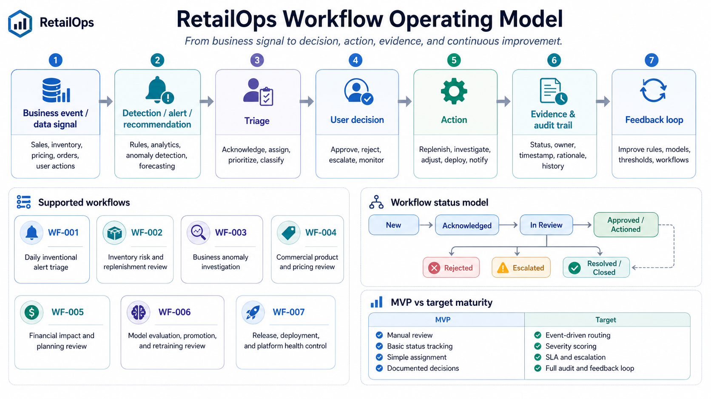

# RetailOps Workflows

**Project:** Cloud-Native RetailOps Platform  
**Workstream:** Business & Product  
**Phase:** Phase 1 — Foundation / MVP  
**Related source artifact:** `docs/user-groups.md`

---

## 1. Purpose of this document

This document describes the main workflows supported by the RetailOps Platform. It translates user groups and decision needs into practical operating flows: how alerts are reviewed, how inventory risks are handled, how anomalies are investigated, how commercial and financial decisions are supported, how ML outputs are governed, and how DevOps controls releases and runtime health.

The goal is not to design a full workflow engine, final UI, final RBAC model, or complete API specification. The goal is to define the expected flow of work clearly enough to facilitate later implementation.

This document should be read together with:

- `docs/case-study.md`,
- `docs/user-groups.md`,
- `docs/kpi-definition.md`,
- `docs/data-model.md`,
- `docs/api.md`,
- `docs/security.md`,
- `docs/observability.md`,
- `docs/cicd.md`.

---

## 2. Source context

The RetailOps Platform is positioned as a cloud-native, event-driven, production-oriented retail operations platform. It is not just a dashboard and not only an ML proof of concept.

The platform supports decisions around:

- demand visibility,
- stockout and overstock risk,
- sales and pricing anomalies,
- product and category performance,
- financial exposure and working capital,
- model quality and ML lifecycle governance,
- deployment safety and platform health.

The main user groups are:

- Operations Manager,
- Inventory Planner / Supply Chain,
- Analyst,
- Category / Commercial Stakeholder,
- Finance / Controlling,
- Data / ML Team,
- Platform / DevOps Team.

The main input signals include:

- sales transactions and returns,
- inventory levels and stock movements,
- order events and fulfillment status,
- product catalog and product feed changes,
- pricing history and pricing events,
- promotion and campaign calendar,
- supplier and replenishment data,
- marketplace and channel data,
- user actions inside the platform,
- data quality signals,
- CI/CD, security, infrastructure, and runtime telemetry.

---

## 3. Workflow design principles

### 3.1. Decision-first workflow design

Each workflow should support a decision, not just display data.

A weak workflow definition would be:

> User opens a dashboard.

A stronger workflow definition is:

> Operations Manager reviews high-severity alerts, checks data freshness, assigns the issue to the correct owner, and tracks whether the issue is resolved or escalated.

The second version is better because it defines:

- the actor,
- the trigger,
- the decision,
- the action,
- the platform evidence,
- the business value.

### 3.2. MVP before workflow automation

In the MVP, workflows can be represented with simple status fields, basic action history, sample alerts, and documented evidence. A full workflow engine is not required at this stage.

MVP workflow support may include:

- open / acknowledged / in review / resolved status,
- basic assignment owner,
- simple action timestamp,
- dashboard or API response showing current state,
- documented example of the decision flow.

Target maturity may include:

- event-driven triggers,
- severity scoring,
- SLA tracking,
- routing rules,
- approval chains,
- audit logs,
- feedback loops into ML and recommendation quality,
- automated notifications,
- integration with incident management tools.

### 3.3. Separate business workflows from platform workflows

Business workflows answer questions such as:

- Which stock risk should be reviewed today?
- Which product category requires commercial action?
- What is the financial impact of a demand or inventory issue?

Platform workflows answer questions such as:

- Is the deployment safe?
- Are scans passing?
- Is the API healthy?
- Are Kubernetes workloads stable?
- Is the ML model monitored and deployable?

Both categories are important, but they should not be mixed without clear labels.

### 3.4. Every workflow should leave evidence

A production-grade platform needs traceability. Every important workflow should produce evidence that can later support review, troubleshooting, governance, or portfolio demonstration.

Examples:

- dashboard screenshot,
- API response example,
- workflow status history,
- pipeline logs,
- security scan result,
- model evaluation report,
- data quality report,
- post-deployment validation note,
- incident or alert resolution note.

---

## 4. Workflow actors

| Actor | Workflow responsibility |
|---|---|
| Operations Manager | Reviews operational alerts, prioritizes issues, assigns owners, tracks resolution. |
| Inventory Planner / Supply Chain | Reviews stock risk, replenishment needs, stockout and overstock exposure. |
| Analyst | Investigates anomalies, explains variance, validates whether signals are real or data-related. |
| Category / Commercial Stakeholder | Reviews product, pricing, promotion, and category-level actions. |
| Finance / Controlling | Reviews financial impact, planning assumptions, inventory exposure, and platform value. |
| Data / ML Team | Evaluates model quality, data quality, drift, retraining needs, and model promotion readiness. |
| Platform / DevOps Team | Owns CI/CD, runtime health, security gates, deployment validation, observability, and rollback. |
| Security / Governance | Supports access control, scan gates, auditability, and policy compliance. |
| Product Owner / Project Owner | Prioritizes workflow scope and accepts whether workflow evidence satisfies business goals. |

---

## 5. Workflow status model

The platform should start with a simple and understandable status model. The exact database design is out of scope for this document, but the conceptual statuses should be consistent across workflows.

### 5.1. Generic business workflow statuses

| Status | Meaning | MVP relevance |
|---|---|---|
| `new` | Signal, alert, recommendation, or issue was created. | Yes |
| `open` | Item is visible and waiting for review. | Yes |
| `acknowledged` | Responsible user confirmed they saw the item. | Yes |
| `in_review` | User is actively investigating or evaluating it. | Yes |
| `assigned` | Item has a named owner or team. | Yes |
| `escalated` | Item requires another team, higher priority, or management attention. | Yes |
| `approved` | Recommendation or action was accepted. | Yes, for selected flows |
| `rejected` | Recommendation or action was not accepted. | Yes, for selected flows |
| `dismissed` | Item was reviewed and considered not actionable. | Yes |
| `resolved` | Required action was completed. | Yes |
| `closed` | Item is finalized and no longer active. | Optional in MVP |
| `reopened` | Item returned to active state after new information. | Target |

### 5.2. ML workflow statuses

| Status | Meaning |
|---|---|
| `experimental` | Model or logic is being explored and is not production-ready. |
| `candidate` | Model is being evaluated for potential promotion. |
| `approved` | Model passed required checks and can be promoted. |
| `rejected` | Model failed business, data, or technical criteria. |
| `deployed` | Model is currently used by platform services. |
| `monitoring` | Model is deployed and actively monitored. |
| `drift_detected` | Data or prediction quality changed enough to require review. |
| `retraining_required` | Model should be retrained or replaced. |
| `rollback_required` | Current model should be rolled back to a previous stable version. |

### 5.3. DevOps workflow statuses

| Status | Meaning |
|---|---|
| `pull_request_opened` | Change entered review workflow. |
| `ci_running` | Automated build/test/scan workflow is running. |
| `ci_failed` | One or more checks failed. |
| `ci_passed` | Required checks passed. |
| `security_blocked` | Security gate blocked the release. |
| `ready_for_deployment` | Artifact is approved and deployable. |
| `deploying` | Deployment is in progress. |
| `deployment_failed` | Deployment failed or post-deployment validation failed. |
| `deployed` | Deployment completed. |
| `rollback_started` | Rollback was triggered. |
| `rollback_completed` | Rollback completed and validation passed. |
| `post_deployment_validated` | Smoke checks and health checks passed. |

---

## 6. Workflow data model assumptions

The exact data model belongs in `docs/data-model.md`, but workflows imply a minimum set of conceptual entities.

| Entity | Purpose |
|---|---|
| `Alert` | Represents operational, business, data, model, or platform signal requiring review. |
| `Recommendation` | Represents suggested business action, such as replenishment, price review, or investigation. |
| `WorkflowAction` | Stores user actions such as acknowledge, assign, approve, reject, dismiss, escalate, or resolve. |
| `WorkflowStatus` | Stores current lifecycle state of an alert, recommendation, model, or deployment item. |
| `UserActionFeedback` | Stores feedback that can improve alert tuning, recommendation logic, or ML evaluation. |
| `InvestigationNote` | Stores analyst explanation, root-cause notes, data quality findings, and business context. |
| `EvidenceArtifact` | Stores links or references to screenshots, API responses, reports, logs, dashboards, or pipeline outputs. |
| `ModelVersion` | Tracks model lifecycle state, evaluation results, deployment status, and rollback needs. |
| `DeploymentRecord` | Tracks build, scan, deploy, rollback, and post-deployment validation evidence. |

MVP implementation can simplify this into a few tables or JSON structures. The important part is to keep the conceptual traceability:

```text
Signal → workflow item → user decision → action status → evidence → business/platform outcome
```

---

# 7. Supported workflows

<p align="center">
  
</p>
<p align="center"><em>Figure: RetailOps Workflow Operating Model — From Signal to Decision Evidence</em></p>

---

## WF-001 — Daily operational alert triage

**Primary actor:** Operations Manager  
**Supporting actors:** Inventory Planner, Analyst, Commercial Stakeholder, DevOps Team  
**Decision need:** Which operational risks require action today?  
**Maturity:** MVP, later enhanced by event-driven architecture  
**Related user group:** Operations Manager  
**Related decision need:** DN-001

### 7.1.1. Business purpose

This workflow helps Operations quickly identify and prioritize business issues such as stock risk, sales anomalies, pricing anomalies, product feed problems, delayed data, and platform issues that affect business visibility.

The goal is to reduce the delay between issue detection and response.

### 7.1.2. Trigger

The workflow starts when one or more of the following signals appears:

- stockout risk alert,
- overstock risk alert,
- sales drop or sales spike,
- pricing anomaly,
- product feed issue,
- delayed data refresh,
- failed ingestion,
- order or fulfillment exception,
- platform health issue affecting dashboard trust.

### 7.1.3. Inputs

- alert type,
- severity,
- affected product, category, supplier, channel, or region,
- last data refresh timestamp,
- business impact estimate,
- related workflow owner,
- current status,
- previous user actions,
- linked dashboard or evidence item.

### 7.1.4. Main workflow

1. Platform receives, calculates, or displays business signals.
2. Operations dashboard shows open alerts and key operational risks.
3. Operations Manager reviews severity, business area, affected products, and data freshness.
4. Operations Manager decides whether the alert is actionable.
5. Alert is acknowledged, assigned, escalated, dismissed, or marked as resolved.
6. If the issue belongs to another domain, it is assigned to Inventory, Commercial, Analyst, ML, or DevOps.
7. User action is stored as workflow feedback.
8. Alert status is visible in the operations dashboard and workflow view.
9. Evidence is stored through screenshot, API response, action log, or workflow record.

### 7.1.5. Alternative paths

| Scenario | Expected handling |
|---|---|
| Alert is caused by stale data | Escalate to data or platform owner; mark business decision as blocked by data freshness. |
| Alert is false positive | Dismiss alert and store reason for future tuning. |
| Alert is high-severity stock risk | Assign to Inventory Planner and notify Operations view. |
| Alert is pricing-related | Assign to Commercial Stakeholder or Analyst. |
| Alert is platform-related | Assign to DevOps and link to observability evidence. |
| Alert cannot be explained | Assign to Analyst for investigation. |

### 7.1.6. Outputs

- operations dashboard,
- alert queue,
- alert detail view,
- workflow status,
- action history,
- severity summary,
- data freshness indicator,
- operational evidence item.

### 7.1.7. MVP scope

In MVP, this workflow can be represented by:

- sample alerts,
- basic alert statuses,
- simple severity levels,
- manual assignment field,
- dashboard summary,
- API response example,
- documented workflow example.

### 7.1.8. Target maturity

In target maturity, this workflow can include:

- event-driven alert creation,
- dynamic severity scoring,
- automated routing,
- SLA tracking,
- escalation rules,
- alert deduplication,
- correlation between business alerts and platform telemetry,
- feedback loop into anomaly detection and recommendation rules.

### 7.1.9. Evidence

- screenshot of operations dashboard,
- sample alert queue response,
- sample workflow action record,
- alert lifecycle example,
- data freshness indicator example,
- observability link if platform issue affects business visibility.

### 7.1.10. Testing notes

Validate that:

- open alerts are returned by the API,
- severity and status are visible,
- an alert can move from `new` to `acknowledged` to `assigned` or `resolved`,
- dismissed alerts require a reason,
- stale data can be represented as a blocking condition,
- dashboard includes last refresh timestamp.

---

## WF-002 — Inventory risk and replenishment review

**Primary actor:** Inventory Planner / Supply Chain  
**Supporting actors:** Operations Manager, Commercial Stakeholder, Finance, Data / ML Team  
**Decision need:** Which products require replenishment, escalation, monitoring, or dismissal?  
**Maturity:** MVP, later enhanced by forecasting and optimization  
**Related user group:** Inventory Planner / Supply Chain  
**Related decision need:** DN-002

### 7.2.1. Business purpose

This workflow helps the business reduce stockout and overstock risk by turning stock, sales, forecast, and replenishment signals into clear review actions.

The goal is not only to display stock levels, but to support inventory decisions.

### 7.2.2. Trigger

The workflow starts when:

- product stock falls below a risk threshold,
- forecasted demand is higher than available stock,
- stock coverage is too high,
- sales velocity changes sharply,
- supplier lead time creates replenishment risk,
- campaign or promotion may increase demand,
- user or system flags a product for review.

### 7.2.3. Inputs

- SKU or product ID,
- current stock,
- stock movement,
- sales velocity,
- forecasted demand,
- lead time,
- safety stock assumption,
- promotion or campaign context,
- supplier or replenishment constraints,
- category priority,
- estimated lost sales or excess stock value.

### 7.2.4. Main workflow

1. Platform combines stock levels, sales velocity, forecast assumptions, and replenishment context.
2. Product is flagged as stockout risk, overstock risk, or normal.
3. Inventory Planner opens the stock risk dashboard or Product 360 view.
4. Planner reviews risk level, forecast assumptions, stock coverage, and business priority.
5. Planner chooses one of the actions: replenish, escalate, monitor, dismiss, or request analysis.
6. If business impact is high, Finance or Commercial can be added to the review.
7. If forecast quality is questionable, Data / ML Team can be asked for evaluation.
8. Decision is stored as workflow feedback.
9. Status is visible for Operations and other supporting users.

### 7.2.5. Alternative paths

| Scenario | Expected handling |
|---|---|
| Forecast is missing | Mark decision as limited by missing forecast; use baseline stock rule. |
| Stock data is stale | Escalate to data quality or platform owner. |
| Campaign is active | Add Commercial context before replenishment decision. |
| High financial exposure | Add Finance review. |
| Recommendation is rejected | Store rejection reason for future rule or model tuning. |
| Inventory action cannot be completed | Mark as blocked and assign responsible owner. |

### 7.2.6. Outputs

- stock risk dashboard,
- Product 360 view,
- replenishment recommendation,
- inventory action status,
- business impact summary,
- feedback record for recommendation quality.

### 7.2.7. MVP scope

In MVP, this workflow can include:

- simple stock risk rules,
- sample forecast value or baseline forecast placeholder,
- basic status field,
- mock or seeded dataset,
- dashboard/API example for high-risk products,
- manual decision capture.

### 7.2.8. Target maturity

In target maturity, this workflow can include:

- ML-based demand forecasting,
- dynamic safety stock logic,
- supplier and lead time optimization,
- recommendation scoring,
- scenario simulation,
- automated notification,
- model feedback loop based on accepted and rejected recommendations.

### 7.2.9. Evidence

- stock risk dashboard screenshot,
- sample `/inventory-risk` API response,
- sample stock risk calculation note,
- workflow action record,
- sample replenishment recommendation,
- seed dataset with stock and sales values.

### 7.2.10. Testing notes

Validate that:

- low stock and high demand products are flagged,
- overstock examples are handled,
- missing forecast does not break the workflow,
- stale stock data is visible,
- action status can be updated,
- Finance or Commercial review can be represented in the workflow status.

---

## WF-003 — Business anomaly investigation

**Primary actor:** Analyst  
**Supporting actors:** Operations Manager, Commercial Stakeholder, Inventory Planner, Data / ML Team  
**Decision need:** Why did a metric change, and does it require action?  
**Maturity:** MVP with sample anomalies, later enhanced by event-driven anomaly detection  
**Related user group:** Analyst  
**Related decision need:** DN-003

### 7.3.1. Business purpose

This workflow helps determine whether unusual sales, stock, pricing, order, or product behavior represents a real business issue, a data quality problem, a seasonal pattern, a campaign effect, or a false positive.

The goal is to improve trust in platform insights and reduce noisy alerts.

### 7.3.2. Trigger

The workflow starts when:

- sales drop or spike is detected,
- return rate changes unusually,
- product performance deviates from trend,
- pricing change correlates with demand change,
- inventory signal conflicts with sales behavior,
- campaign performance is unusual,
- Operations or Commercial requests explanation,
- ML or rules-based anomaly detection produces a signal.

### 7.3.3. Inputs

- sales history,
- returns,
- pricing changes,
- campaign calendar,
- product catalog changes,
- stock levels,
- channel or marketplace data,
- data quality checks,
- forecast deviation,
- previous alerts and actions,
- relevant business notes.

### 7.3.4. Main workflow

1. Platform detects or displays an unusual business signal.
2. Analyst opens anomaly detail view or related dashboard.
3. Analyst reviews trend, baseline, historical context, product/category, pricing, campaign, and data quality.
4. Analyst classifies the anomaly as real business event, data issue, seasonal pattern, expected campaign effect, or false positive.
5. Analyst documents the finding.
6. If action is needed, the issue is escalated to Operations, Inventory, Commercial, Finance, ML, or DevOps.
7. Feedback is stored to improve future alert tuning, model evaluation, or data quality checks.
8. Evidence is attached as investigation note, chart, query result, or dashboard screenshot.

### 7.3.5. Alternative paths

| Scenario | Expected handling |
|---|---|
| Anomaly caused by missing data | Mark as data quality issue and escalate. |
| Anomaly caused by campaign | Document as expected business behavior. |
| Anomaly caused by pricing mistake | Escalate to Commercial. |
| Anomaly caused by stockout | Escalate to Inventory and Operations. |
| Anomaly is false positive | Dismiss and store reason. |
| Model output is unreliable | Escalate to Data / ML Team. |

### 7.3.6. Outputs

- anomaly detail view,
- trend and variance analysis,
- investigation note,
- data quality note,
- classification label,
- escalation record,
- feedback for alert tuning.

### 7.3.7. MVP scope

In MVP, this workflow can include:

- sample anomaly records,
- basic anomaly category,
- simple explanation note,
- link to source data,
- dashboard or API example,
- manual classification.

### 7.3.8. Target maturity

In target maturity, this workflow can include:

- event-driven anomaly detection,
- automated root-cause suggestions,
- richer data quality validation,
- model-driven anomaly scoring,
- alert suppression rules,
- feedback loop into anomaly model retraining.

### 7.3.9. Evidence

- anomaly detail screenshot,
- sample anomaly API response,
- investigation note,
- data quality report,
- chart or query result,
- false positive example and dismissal reason.

### 7.3.10. Testing notes

Validate that:

- anomaly record can be displayed,
- anomaly can be classified,
- data quality issues are not hidden,
- false positive can be dismissed with reason,
- escalation can be assigned to another workflow owner,
- investigation evidence can be linked or documented.

---

## WF-004 — Commercial product and pricing review

**Primary actor:** Category / Commercial Stakeholder  
**Supporting actors:** Analyst, Inventory Planner, Finance, Operations Manager  
**Decision need:** Which product, pricing, campaign, or category action is needed?  
**Maturity:** MVP with basic product/category visibility, later enhanced by pricing and campaign optimization  
**Related user group:** Category / Commercial Stakeholder  
**Related decision need:** DN-004

### 7.4.1. Business purpose

This workflow helps commercial users review product and category performance in context of sales, stock, pricing, promotions, and operational risks.

The goal is to support better category decisions and faster reaction to product, price, or campaign issues.

### 7.4.2. Trigger

The workflow starts when:

- product or category performance deviates from expected behavior,
- pricing anomaly is detected,
- campaign impact is unusual,
- inventory risk affects commercial availability,
- product feed change affects product visibility,
- Commercial user initiates a periodic category review,
- Analyst or Operations escalates a product issue.

### 7.4.3. Inputs

- product and category data,
- sales and returns,
- pricing history,
- campaign calendar,
- stock risk,
- product feed status,
- marketplace or channel data,
- forecasted demand,
- margin or financial impact assumptions where available,
- analyst investigation notes.

### 7.4.4. Main workflow

1. Platform shows product or category performance in Product 360 or category dashboard.
2. Commercial user reviews sales, pricing, stock, campaign, and product feed context.
3. User decides whether pricing, promotion, category action, inventory coordination, or further analysis is required.
4. Recommendation or alert is accepted, rejected, escalated, or assigned for analysis.
5. If inventory availability is the main constraint, workflow is linked to Inventory review.
6. If financial impact is material, workflow is linked to Finance review.
7. If explanation is unclear, workflow is linked to Analyst investigation.
8. Decision feedback is stored for future learning and traceability.

### 7.4.5. Alternative paths

| Scenario | Expected handling |
|---|---|
| Price anomaly is confirmed | Escalate to Commercial owner and track resolution. |
| Product feed issue affects visibility | Escalate to Operations or platform/data owner. |
| Campaign explains demand spike | Document expected impact and close or monitor. |
| Stockout prevents commercial action | Link to Inventory workflow. |
| Financial exposure is high | Link to Finance workflow. |
| Recommendation is not trusted | Request Analyst or ML review. |

### 7.4.6. Outputs

- Product 360 view,
- category dashboard,
- pricing or campaign anomaly alert,
- commercial recommendation,
- action status,
- decision feedback.

### 7.4.7. MVP scope

In MVP, this workflow can include:

- product/category performance summary,
- basic pricing history or sample pricing signal,
- campaign context placeholder,
- stock risk link,
- manual commercial action status,
- screenshot or API response as evidence.

### 7.4.8. Target maturity

In target maturity, this workflow can include:

- campaign optimization,
- pricing recommendation logic,
- advanced product performance segmentation,
- promotion effectiveness analysis,
- scenario simulation,
- integration with recommendation feedback loops.

### 7.4.9. Evidence

- Product 360 screenshot,
- category KPI view,
- pricing anomaly example,
- campaign context example,
- commercial action status record,
- accepted or rejected recommendation example.

### 7.4.10. Testing notes

Validate that:

- product/category view includes sales, stock, pricing, and campaign context,
- commercial action can be accepted, rejected, escalated, or assigned,
- stockout or data issue can block commercial decision,
- product feed issue can be represented,
- recommendation feedback is captured.

---

## WF-005 — Financial impact and planning review

**Primary actor:** Finance / Controlling  
**Supporting actors:** Operations Manager, Inventory Planner, Commercial Stakeholder, Management  
**Decision need:** What is the financial impact of stock, demand, operational, and platform maturity risks?  
**Maturity:** MVP with KPI and risk visibility, later enhanced by scenario simulation and FinOps  
**Related user group:** Finance / Controlling  
**Related decision need:** DN-005

### 7.5.1. Business purpose

This workflow helps Finance understand the business impact of inventory risk, forecast assumptions, operational issues, and future platform investment.

The goal is to connect operational decisions with financial outcomes such as working capital, lost sales risk, excess stock exposure, planning assumptions, and platform value.

### 7.5.2. Trigger

The workflow starts when:

- inventory exposure needs review,
- stockout or overstock risk is material,
- forecast assumptions affect planning,
- management asks for business impact summary,
- platform KPI review is needed,
- investment in maturity stage requires justification,
- cloud/platform cost review is introduced in later phases.

### 7.5.3. Inputs

- inventory value,
- stockout risk,
- overstock risk,
- forecast assumptions,
- sales impact,
- product/category performance,
- operational response time,
- KPI definitions,
- platform delivery metrics,
- cloud cost data in later maturity.

### 7.5.4. Main workflow

1. Platform summarizes inventory risk, forecast assumptions, and operational outcomes.
2. Finance reviews exposure by product, category, business area, or time period.
3. Finance assesses working capital impact, lost sales risk, excess stock risk, or planning implications.
4. Finance reviews whether platform KPIs support the business case.
5. If the issue is operational, Finance links the review to Operations, Inventory, or Commercial workflows.
6. In later phases, Finance reviews FinOps metrics such as cost per environment, service, or workload.
7. Findings are documented as KPI summary, planning note, business case evidence, or financial impact summary.

### 7.5.5. Alternative paths

| Scenario | Expected handling |
|---|---|
| Inventory value is incomplete | Mark financial view as limited by data quality. |
| Forecast assumptions are weak | Request Analyst or ML review. |
| Exposure is high | Escalate to Operations, Inventory, or Management. |
| Platform cost is rising | Trigger FinOps review in later phases. |
| KPI is unclear | Update KPI definition document before using it for decision-making. |

### 7.5.6. Outputs

- financial impact summary,
- inventory exposure view,
- KPI dashboard,
- planning assumption note,
- business value evidence,
- FinOps concept dashboard in later phases.

### 7.5.7. MVP scope

In MVP, this workflow can include:

- basic KPI definitions,
- inventory exposure assumptions,
- sample financial impact view,
- connection between stock risk and business value,
- documented platform outcome metrics.

### 7.5.8. Target maturity

In target maturity, this workflow can include:

- scenario simulation,
- forecast-driven planning,
- cost-per-service and cost-per-environment visibility,
- FinOps dashboards,
- investment justification based on platform maturity,
- executive reporting.

### 7.5.9. Evidence

- KPI definition document,
- financial summary screenshot,
- inventory exposure example,
- planning assumption note,
- platform business value summary,
- FinOps concept evidence in later phases.

### 7.5.10. Testing notes

Validate that:

- KPI definitions are documented,
- financial summaries link to source assumptions,
- inventory exposure calculations are reproducible,
- missing data is visible,
- Finance view does not depend on hidden manual assumptions,
- platform value metrics can be connected to CS-001 outcomes.

---

## WF-006 — Model evaluation, promotion, and retraining review

**Primary actor:** Data / ML Team  
**Supporting actors:** DevOps Team, Analyst, Operations Manager, Inventory Planner, Product Owner  
**Decision need:** Is the model or analytical output reliable enough to use, deploy, monitor, or retrain?  
**Maturity:** Target maturity, with MVP placeholders  
**Related user group:** Data / ML Team  
**Related decision need:** DN-006

### 7.6.1. Business purpose

This workflow ensures that forecasts, anomaly detection outputs, and recommendations are not treated as one-time experiments. They should be evaluated, versioned, monitored, and improved through feedback.

The goal is to reduce the risk of untrusted or degrading ML outputs influencing business decisions.

### 7.6.2. Trigger

The workflow starts when:

- new model version is trained,
- baseline forecast is created,
- model metrics are available,
- data quality changes,
- drift is detected,
- business feedback suggests poor recommendation quality,
- model deployment is requested,
- rollback or retraining may be required.

### 7.6.3. Inputs

- training dataset version,
- evaluation dataset,
- data quality report,
- model metrics,
- error analysis,
- drift signal,
- feature distribution changes,
- business feedback from accepted/rejected recommendations,
- deployment status,
- runtime performance metrics.

### 7.6.4. Main workflow

1. Data / ML Team prepares a baseline model, forecasting output, anomaly logic, or new model version.
2. Data quality and evaluation metrics are reviewed.
3. Model is marked as `experimental`, `candidate`, `approved`, `rejected`, or `retraining_required`.
4. If approved, DevOps supports packaging, deployment, rollback plan, and runtime monitoring.
5. If rejected, reason is documented and improvement actions are defined.
6. Business feedback from user workflows is connected to model evaluation.
7. In later maturity, drift monitoring triggers investigation or retraining.
8. Model lifecycle evidence is stored for governance and review.

### 7.6.5. Alternative paths

| Scenario | Expected handling |
|---|---|
| Data quality is poor | Block promotion and create data quality issue. |
| Model improves metrics but is hard to explain | Require Analyst or Product Owner review before promotion. |
| Model worsens business outcomes | Roll back or reject model. |
| Drift is detected | Trigger investigation and possible retraining. |
| Business users reject recommendations frequently | Review feature logic, thresholds, or training data. |
| Deployment fails | Use DevOps rollback workflow. |

### 7.6.6. Outputs

- model evaluation report,
- model version status,
- model approval or rejection note,
- drift monitoring concept,
- retraining workflow concept,
- model deployment evidence,
- ML observability dashboard in later phases.

### 7.6.7. MVP scope

In MVP, this workflow can include:

- baseline forecasting concept,
- documented model lifecycle assumptions,
- sample evaluation report,
- placeholder model version status,
- description of future drift monitoring,
- connection between user feedback and future model improvement.

### 7.6.8. Target maturity

In target maturity, this workflow can include:

- experiment tracking,
- model registry,
- automated evaluation gates,
- model promotion workflow,
- inference deployment,
- drift monitoring,
- retraining pipeline,
- rollback strategy,
- business feedback loop.

### 7.6.9. Evidence

- `ml/reports/` evaluation report,
- model lifecycle documentation,
- model version status example,
- drift baseline concept,
- retraining workflow note,
- business feedback example,
- deployment evidence for inference service in later phases.

### 7.6.10. Testing notes

Validate that:

- model status can be represented,
- model evaluation report exists,
- promotion requires documented criteria,
- data quality failure can block promotion,
- model output can be linked to business workflow feedback,
- rollback/retraining assumptions are documented.

---

## WF-007 — Release, deployment, and platform health control

**Primary actor:** Platform / DevOps Team  
**Supporting actors:** Data / ML Team, Security, Product Owner, Developers  
**Decision need:** Is the platform safe, healthy, secure, and ready to release?  
**Maturity:** MVP foundation, stronger in Phase 2 and beyond  
**Related user group:** Platform / DevOps Team  
**Related decision need:** DN-007

### 7.7.1. Business purpose

This workflow ensures that application, infrastructure, and ML-related changes are delivered safely and repeatedly. It connects DevOps practices with business outcomes: faster releases, lower change failure rate, better auditability, stronger security, and improved runtime reliability.

The goal is to reduce manual deployment risk and create evidence that the platform can be operated in a production-oriented way.

### 7.7.2. Trigger

The workflow starts when:

- developer opens a pull request,
- application code changes,
- Docker image is built,
- infrastructure code changes,
- Kubernetes manifests change,
- security scan is required,
- release is promoted,
- post-deployment validation is needed,
- runtime health alert is triggered.

### 7.7.3. Inputs

- pull request,
- commit history,
- test results,
- linting and formatting results,
- static analysis results,
- dependency scan,
- container image scan,
- Terraform validation,
- Kubernetes manifest validation,
- deployment status,
- health check response,
- logs, metrics, traces, and alerts.

### 7.7.4. Main workflow

1. Developer opens a pull request.
2. Pipeline runs formatting, linting, unit tests, API tests, static analysis, dependency scans, image build, and image scan.
3. Failed checks block the release until fixed or explicitly accepted according to project policy.
4. Approved artifact is packaged and prepared for deployment.
5. Terraform and Kubernetes changes are validated when infrastructure or runtime scope exists.
6. Deployment is executed using controlled rollout assumptions.
7. Health checks, smoke tests, logs, metrics, and alerts are reviewed after deployment.
8. Failed deployment triggers rollback or remediation.
9. Pipeline logs, deployment status, scan outputs, and post-deployment validation become evidence artifacts.

### 7.7.5. Alternative paths

| Scenario | Expected handling |
|---|---|
| Unit tests fail | Block merge/deployment until fixed. |
| Security scan finds critical vulnerability | Block release or require documented exception. |
| Docker build fails | Stop pipeline and notify owner. |
| Terraform validation fails | Block infrastructure deployment. |
| Kubernetes validation fails | Block runtime deployment. |
| Health check fails after deployment | Trigger rollback or remediation. |
| Metrics degrade after deployment | Investigate and potentially roll back. |
| ML model deployment fails | Coordinate with ML workflow and rollback plan. |

### 7.7.6. Outputs

- CI/CD pipeline evidence,
- build/test/scan logs,
- container image artifact,
- deployment status,
- health check result,
- runtime dashboard,
- security gate result,
- rollback validation note.

### 7.7.7. MVP scope

In MVP, this workflow can include:

- GitHub pull request workflow,
- basic CI pipeline,
- unit tests,
- Docker build,
- simple security or image scan,
- `/health` endpoint,
- pipeline logs as evidence,
- local or containerized smoke test.

### 7.7.8. Target maturity

In target maturity, this workflow can include:

- full CI/CD pipeline,
- Jenkins-based release automation,
- GitHub Actions for lightweight checks,
- ECR image lifecycle,
- EKS deployment,
- Terraform plan/apply controls,
- Kubernetes rollout checks,
- staged environments,
- rollback automation,
- observability dashboards,
- policy-as-code,
- runtime threat detection.

### 7.7.9. Evidence

- CI/CD run screenshot,
- build log,
- test report,
- security scan result,
- Docker image build evidence,
- health check response,
- deployment record,
- rollback note,
- Grafana/CloudWatch/OpenSearch dashboard screenshot in later phases.

### 7.7.10. Testing notes

Validate that:

- `/health` endpoint responds correctly,
- pipeline fails when tests fail,
- Docker image can be built,
- security scan output is stored or referenced,
- deployment evidence exists,
- smoke test validates runtime behavior,
- rollback assumptions are documented.

---

# 8. Cross-workflow dependencies

Workflows should not be treated as isolated documents. Many platform decisions move from one workflow to another.

| Source workflow | Target workflow | Dependency |
|---|---|---|
| WF-001 Operations triage | WF-002 Inventory review | Operations assigns stock risk to Inventory. |
| WF-001 Operations triage | WF-003 Anomaly investigation | Operations requests root-cause analysis. |
| WF-001 Operations triage | WF-007 DevOps health control | Operations detects that business dashboard is affected by platform/data freshness issue. |
| WF-002 Inventory review | WF-004 Commercial review | Inventory risk affects product availability, pricing, or campaign execution. |
| WF-002 Inventory review | WF-005 Finance review | Stock risk has financial exposure. |
| WF-003 Anomaly investigation | WF-006 ML review | Analyst finds model or data quality issue. |
| WF-004 Commercial review | WF-003 Anomaly investigation | Commercial user needs explanation of product or pricing behavior. |
| WF-005 Finance review | WF-002 Inventory review | Finance challenges stock assumptions or exposure calculation. |
| WF-006 ML review | WF-007 DevOps health control | Approved model requires packaging, deployment, monitoring, and rollback readiness. |
| WF-007 DevOps health control | WF-001 Operations triage | Platform incident affects operational visibility. |

---

# 9. Workflow maturity model

| Area | MVP workflow support | Target workflow maturity |
|---|---|---|
| Alert handling | Basic alert queue, manual status update, severity labels | Event-driven alerts, routing, escalation, SLA, deduplication |
| Inventory decisions | Simple stock risk logic, manual action status | Forecast-driven recommendations, optimization, supplier context |
| Anomaly investigation | Sample anomaly flags, manual classification | Event-driven anomaly detection, root-cause suggestions, false-positive learning |
| Commercial review | Product/category dashboard, basic pricing/campaign context | Pricing optimization, campaign effectiveness analysis, recommendation feedback |
| Finance review | KPI definitions, inventory exposure assumptions | Scenario simulation, planning integration, FinOps visibility |
| ML governance | Model lifecycle concept, evaluation placeholder | Experiment tracking, model registry, drift monitoring, retraining, rollback |
| DevOps release | Basic CI, Docker build, health check | Full CI/CD, Terraform validation, EKS deployment, security gates, runtime observability |
| Evidence | Screenshots, API examples, logs | Audit trail, structured workflow events, dashboards, automated reports |

---

# 10. Architecture implications

The workflows imply several architectural needs.

## 10.1. Application and API layer

The platform should eventually expose capabilities such as:

- alert listing,
- alert detail,
- workflow action update,
- inventory risk summary,
- product 360 view,
- anomaly detail,
- KPI summary,
- model status,
- deployment status,
- health check.

## 10.2. Data and event layer

Workflows require reliable data from:

- sales,
- inventory,
- orders,
- pricing,
- product catalog,
- promotions,
- suppliers,
- marketplace/channel data,
- user actions,
- data quality checks,
- platform telemetry.

In MVP, these can be represented by seed datasets and simple schemas. In target maturity, selected business signals can become events.

## 10.3. ML and intelligence layer

The ML layer should not only generate predictions. It should support:

- model evaluation,
- recommendation quality feedback,
- drift monitoring,
- retraining decisions,
- rollback decisions,
- traceability between prediction and business action.

## 10.4. Platform and infrastructure layer

The DevOps workflow implies:

- repeatable CI/CD,
- container image lifecycle,
- Kubernetes deployment assumptions,
- Terraform validation,
- environment separation,
- runtime observability,
- rollback readiness,
- infrastructure evidence.

## 10.5. Security and governance layer

Workflow actions imply governance needs:

- who changed status,
- when the action happened,
- why action was taken,
- what evidence supported the decision,
- whether sensitive data was exposed,
- whether deployment/security gates passed.

---

# 11. Security and RBAC assumptions

Full RBAC design is out of scope for this document, but workflows imply access boundaries.

| Workflow | Access assumption |
|---|---|
| WF-001 Operations triage | Operations can read broad alerts and update workflow status. |
| WF-002 Inventory review | Inventory can read stock/forecast/product data and update inventory actions. |
| WF-003 Anomaly investigation | Analyst can read broad analytical context and write investigation notes. |
| WF-004 Commercial review | Commercial can review product/category/pricing/campaign context and update commercial actions. |
| WF-005 Finance review | Finance can read aggregated financial exposure and KPI data. |
| WF-006 ML review | ML can access model, data quality, evaluation, and feedback artifacts. |
| WF-007 DevOps release | DevOps can access CI/CD, infrastructure, logs, metrics, deployment and security evidence. |

Security note: DevOps ownership of infrastructure does not automatically imply unrestricted access to all business data. Production-grade design should separate infrastructure permissions, application permissions, data permissions, and audit logs.

---

# 12. Observability implications

Workflows require both technical and business observability.

## 12.1. Business observability

Business users need signals such as:

- last data refresh,
- open alerts,
- alert severity,
- affected products/categories,
- workflow status,
- stock risk level,
- forecast timestamp,
- anomaly classification,
- KPI calculation timestamp.

## 12.2. Technical observability

DevOps and ML users need signals such as:

- API latency,
- API error rate,
- pod health,
- deployment status,
- pipeline status,
- container scan result,
- data ingestion failures,
- model inference health,
- drift indicators,
- log correlation for incidents.

## 12.3. Observability principle

A business alert should show whether the underlying data and platform are trustworthy.

Example:

```text
Stockout risk alert → current stock + forecast + last inventory update + data freshness status
```

Without freshness and quality context, a dashboard can create false confidence.

---

# 13. CI/CD and delivery implications

The workflows influence CI/CD because different changes affect different user decisions.

| Change type | Workflow risk | Required validation |
|---|---|---|
| Dashboard change | Business user may see misleading status | UI/API smoke test, data contract check |
| Inventory logic change | Replenishment decisions may be wrong | Unit tests, edge cases, sample dataset validation |
| Anomaly logic change | False positives or missed issues may increase | Test scenarios, threshold validation, feedback review |
| KPI calculation change | Finance summary may be inconsistent | Calculation test, documented formula, review evidence |
| Model change | Forecasts/recommendations may degrade | Model evaluation gate, comparison to baseline, rollback plan |
| Infrastructure change | Platform availability may be affected | Terraform validation, Kubernetes validation, deployment check |
| Security change | Vulnerabilities or access issues may be introduced | SAST, dependency scan, container scan, IAM review |

CI/CD should eventually produce workflow-relevant evidence:

- build log,
- test report,
- scan result,
- image build record,
- Terraform validation output,
- Kubernetes rollout status,
- health check result,
- rollback validation note.

---

# 14. Testing strategy by workflow

| Workflow | Example tests |
|---|---|
| WF-001 Operations triage | Alert queue returns open alerts; status update works; stale data is visible; dismissed alert requires reason. |
| WF-002 Inventory review | Low stock and high demand trigger risk; missing forecast handled safely; action status can be updated. |
| WF-003 Anomaly investigation | Anomaly can be classified; data issue can be recorded; false positive reason can be stored. |
| WF-004 Commercial review | Product/category view includes sales, stock, pricing, and campaign context; action feedback is captured. |
| WF-005 Finance review | KPI definitions are reproducible; financial impact uses documented assumptions; missing data is visible. |
| WF-006 ML review | Model status can be updated; evaluation report exists; poor data quality blocks promotion. |
| WF-007 DevOps release | Pipeline fails on broken tests; image build succeeds; health check validates deployment; rollback note exists. |

Minimum MVP test evidence should include:

- health check test,
- API response examples,
- sample workflow status transitions,
- seed data edge cases,
- basic CI run,
- security scan or placeholder evidence,
- documentation of assumptions not yet implemented.

---

# 15. Evidence artifacts

| Evidence artifact | Related workflow | Purpose |
|---|---|---|
| `docs/workflows.md` | All | Main workflow artifact. |
| `docs/user-groups.md` | All | Source of actors and decision needs. |
| Dashboard screenshots | WF-001, WF-002, WF-004, WF-005 | Show user-facing workflow visibility. |
| API response examples | WF-001, WF-002, WF-003, WF-007 | Prove backend support for workflow data. |
| Workflow status examples | All | Prove action tracking and lifecycle state. |
| Seed datasets | WF-002, WF-003, WF-004, WF-005 | Support reproducible examples. |
| Data quality report | WF-001, WF-003, WF-006 | Show trustworthiness of data signals. |
| Model evaluation report | WF-006 | Support ML promotion/rejection decisions. |
| CI/CD logs | WF-007 | Prove automated build/test/scan workflow. |
| Security scan outputs | WF-007 | Support DevSecOps controls. |
| Observability dashboards | WF-001, WF-006, WF-007 | Show runtime, data, and model health. |
| Post-deployment validation note | WF-007 | Prove release safety. |
| KPI definition document | WF-005 | Connect workflow outcomes to business value. |

---

# 16. Out of scope

The following items are intentionally not fully solved in this document:

- final UI screens,
- final API contracts,
- final database schema,
- full workflow engine,
- complete RBAC matrix,
- notification system implementation,
- production event schema,
- complete MLOps platform,
- complete incident management integration,
- complete AWS architecture,
- full CI/CD implementation,
- detailed Terraform and Kubernetes configuration.

This document defines workflow intent and design direction. Implementation details belong to later tasks.

---

# 17. Open workflow design questions

These questions should be revisited during implementation:

1. Should workflow actions be stored as a simple status field, event log, or full workflow history table?
2. Which alerts belong to MVP: stock risk, sales anomaly, pricing anomaly, data freshness, or platform health?
3. Which decisions require approval and which only require acknowledgement?
4. Which users can dismiss alerts?
5. Which dismissals require a reason?
6. Which actions should feed future ML retraining or recommendation tuning?
7. Which platform alerts should be visible to business users and which only to DevOps?
8. Should workflow ownership be assigned to user, team, role, category, supplier, or region?
9. What is the minimum useful severity model for MVP?
10. How should SLA or time-to-resolution be represented in later maturity?
11. Should Finance see detailed SKU-level data or only aggregated exposure?
12. How should model promotion approval be represented before a full model registry exists?
13. How should failed deployments be linked to business-impacting alerts?
14. Which workflow evidence should be committed to documentation and which should remain runtime-generated?
