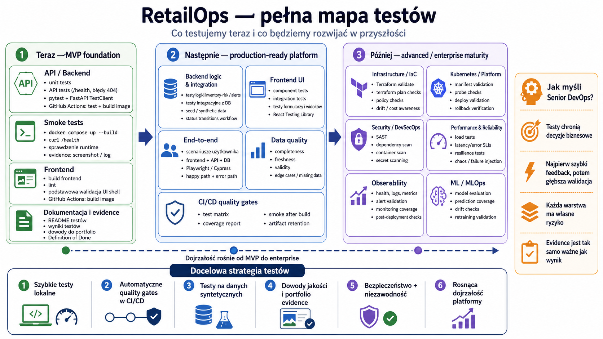

# RetailOps Testing and Smoke Checks

This document describes the current MVP testing approach for the RetailOps Cloud-Native AI Platform.

The goal of this stage is not to build a complete enterprise-grade test suite yet. The goal is to create a reliable first quality gate that proves the MVP services can be tested locally and validated in CI before further development.

---

## 1. Current testing scope

The current MVP testing scope covers three basic validation layers:

1. **API tests** — verify the FastAPI contract using `pytest` and `TestClient`.
2. **CI validation** — run tests and Docker image builds in GitHub Actions.
3. **Runtime smoke test** — verify that the application responds correctly after being started with Docker Compose.

At this stage, the main backend contract is the health endpoint:

```text
GET /health
```

The endpoint is used for:

- local verification,
- API test automation,
- Docker Compose smoke checks,
- CI/CD quality gates,
- future Kubernetes readiness/liveness probes,
- future observability and availability checks.

---

## 2. API tests

Run API tests from the repository root:

```bash
pytest
```

To show explicit skip reasons, including local skips for database-backed
integration tests when PostgreSQL is not configured, run:

```bash
pytest -rs
```

The current API test suite verifies:

- `GET /health` returns `200 OK`,
- `GET /health` returns a stable JSON response,
- unknown routes return a controlled standard error response.

Expected `/health` response:

```json
{
  "status": "ok",
  "service": "retailops-api",
  "environment": "local"
}
```

Current example tests:

```text
services/api/tests/test_health.py
services/api/tests/test_errors.py
```

---

## 3. Local runtime smoke test

A smoke test checks whether the application works after it is started as a real local runtime, not only inside a unit/API test process.

Run the full local stack from the repository root:

```bash
docker compose up --build
```

In a second terminal, verify the API health endpoint:

```bash
curl -i http://localhost:8000/health
```

Expected HTTP result:

```text
HTTP/1.1 200 OK
```

Expected JSON body:

```json
{
  "status": "ok",
  "service": "retailops-api",
  "environment": "local"
}
```

This confirms that:

- Docker Compose starts the MVP stack,
- the API container starts successfully,
- the API is reachable through the exposed local port,
- the `/health` endpoint returns the expected contract.

---

## 4. GitHub Actions validation

The project currently uses separate GitHub Actions workflows for backend and frontend validation.

### API CI

The API CI workflow should validate at least:

- repository checkout,
- Python setup,
- backend dependency installation,
- API tests with `pytest`,
- backend Docker image build.

Current expected flow:

```text
pip install -r requirements.txt
pytest
docker build -t retailops-api:ci .
```

### Frontend CI

The Frontend CI workflow should validate at least:

- repository checkout,
- Node.js setup,
- frontend dependency installation,
- frontend lint step if configured,
- frontend production build,
- frontend Docker image build.

Current expected flow:

```text
npm ci
npm run lint --if-present
npm run build
docker build -t retailops-frontend:ci .
```

## RetailOps Testing Roadmap — MVP to Future Quality Gates

<p align="center">
  
</p>

<p align="center">
  <em>Figure: RetailOps testing map showing the MVP foundation and future expansion across API, smoke, integration, infrastructure, security, observability, data, and ML test layers.</em>
</p>
